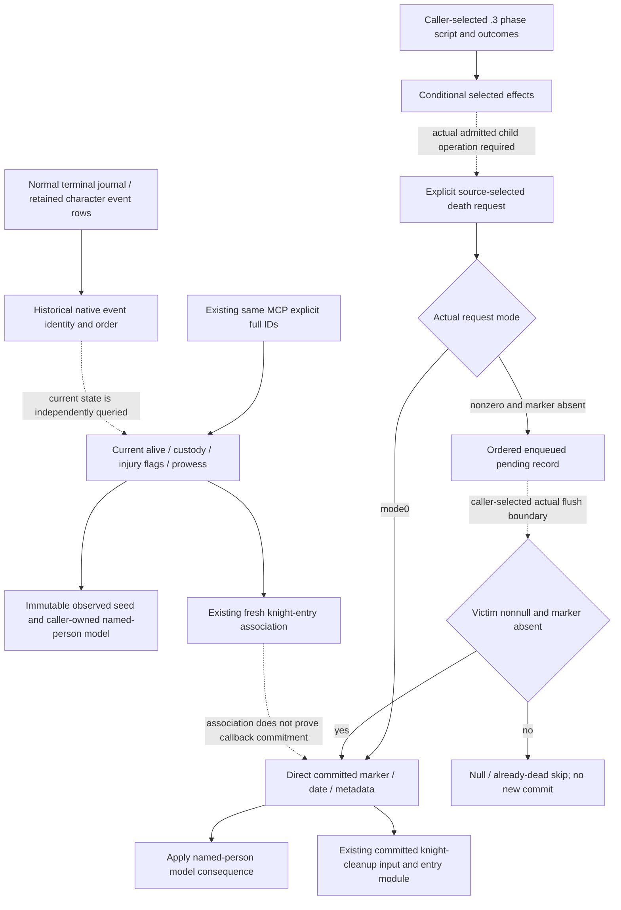

# Named-person battle casualties and current observations (.3, 2026-10-04)

Exact build: CK3 1.20.0.3 / Steam25652598 / EXE SHA
`94B55397ABB687A3DCD436805A5D885E6BE90FA6C693FEB44A9E3BBEEADE02A6`.
Interface inventory uses read-only g63, Root-reported source `df6e`; no full
commit is inferred. This new topic joins already adopted current-person
observation, selected phase-effect projection and committed knight cleanup.
It does not repeat their implementations or tests.

## Existing named-person query

The existing registered `ck3_query_battle_terminal_transition_v1` takes
`prior_combat_id`, `subject_public_cunit_id`, `expected_revision`, optional
`after_terminal_sequence` and optional `character_ids`. To request current
persons alone, pass both battle IDs as null, the fresh public revision, no
journal cursor, and the explicit nonnegative signed-int32 full Character IDs. This is a query
recipe, not a query executed by this research lane.

`character_observations` is independent of prior Combat resolution, retained
Result existence, terminal journal initialization and `battle_terminal_transition_ready`.
The request is a bounded list, not a complete knight roster. Per-ID strict
resolution checks the full stored Character identity at +18. Removed or stale
generation identities remain unresolved; they are not reported as dead.

| Field | Existing meaning and source | Unavailable meaning |
| --- | --- | --- |
| `character_id` | Requested nonnegative full Character ID, not low24 slot alone | Missing roster entry supplies no death evidence |
| `alive` | Strictly resolved Character: eight-byte death-data pointer +1D0 is null => true, nonnull => false | Null means identity unresolved; it does not mean dead |
| `status`, `actual_jailer_character_id` | Custody only: observed positive strict jailer ID; native no relation/-1 => none/-1 | Unavailable/null may coexist with a known alive or dead value |
| `current_person_state.effective_prowess` | Current signed int32 effective points at Character+EC; zero is a value | Unbound reader or unresolved person: unavailable/null with reason |
| `current_person_state.injury_traits.flags` | Eight independently nullable HasTrait results; observed false is real absence | Failed definition/presence read remains null; another flag or prowess need not be lost |
| `injury_traits.wounded_rank` | All three wounded flags known: none => 0, unique true => 1/2/3 | Unknown flag or multiple true => null with explicit reason |

The eight trait keys are `wounded_1`, `wounded_2`, `wounded_3`, `maimed`,
`one_legged`, `one_eyed`, `disfigured`, `incapable`. The existing exact getter
proof uses TraitDatabase RVA89E5B0 and HasTrait RVA28BB1F0. Injury status is
available for eight known flags, partial for some known flags, unavailable for
none. Prowess and alive/custody availability are independent of that status.
Older bodies may omit the additive `current_person_state` sibling; absence is
not a synthetic all-false trait vector.

The query publishes alive/dead state from a death-record pointer, not the
death record's reason, date, killer or battle-causal provenance. Current injury
flags and prowess do not identify which historical event produced them.

## Current observations, selected effects and committed callbacks

`battle_phase_events_12003.execute_selected_phase_event_12003` accepts an
explicit event key and caller-selected script outcomes. It returns conditional
`after_state`, `transition_log`, and `feedback_pending`. Its native selector,
candidate source equivalence, full script feedback, planner and forecast flags
remain false. A selected kill, wound or maim in that model is not evidence that
native admission or character death commitment occurred.

`battle_current_knight_entry_refresh.associate_current_knight_entries` already
joins a fresh authoritative condition with explicit current-person rows. It
preserves native entry order, full occupant IDs and sample-coordinate
diagnostics without changing condition state or inferring casualty cause.
Observed association changes or missing entries alone do not commit death.

`battle_current_entry_events_12003.CommittedKnightCleanup12003` and
`apply_closed_entry_events_12003` already model the selected committed cleanup
branch with explicit death/cleanup/CourtLink/mapping premises. This separate
cleanup is not triggered merely by an alive flag or selected script feedback.
The new named-person adapter must reuse that cleanup input/entry function,
rather than implement a second regiment removal or charge another casualty.

The source-closed native selector is `0x3298EE0`; scheduled knight rows retain
a RegimentID, not an immutable future victim. Fire `0x264E680` strictly resolves
that Regiment and its Army, checks Army+0x128 against the actual full CombatID,
and then reads the CURRENT Regiment+0x148 full CharacterID. Knight executor
calls are `0x264E891` to `0x3765780` with return `0x264E896`; the commander
call is `0x264E976` with return `0x264E97B`. The effect member is Event+0x160.
Fire does not clear
the scheduled rows, and returning from that outer executor does not identify
which conditional/random child effect actually committed.

The independent `.3` selected-effect implementation already supports seven
keys: commander none/wounded/maimed/killed and knight none/wounded/maimed.
The complete `knight_killed` AST is unavailable in that current selected
primitive. Consuming an explicitly committed named death remains useful
without rewriting that interpreter or pretending the missing AST is complete.

## Exact death request, queue and commitment

The loaded death effect executes at `0x2D426D0`. It resolves the actual typed
Character and skips an already nonzero death marker before requesting death.
Request `0x28FAA40` reads the execution-mode byte at global+0xC1: mode0 directly
calls `0x28FAAF0`; nonzero mode with an absent marker appends a 0x30-byte record
through `0x2903860` to manager+0x4E08/count+0x4E14. Selected, requested and
enqueued records do not by themselves change alive state or commit cleanup.

Actual flush `0x28FB020` snapshots the queue end, then traverses stored order.
Only a nonnull row victim whose death marker is still zero reaches the direct
commit call at `0x28FB085`. Null victims and already marked victims are skipped;
a later duplicate naturally sees the marker written by the first accepted row.
After traversal the native record destructors run and queue count becomes zero.
This is source ordering, not a forecast of which calendar boundary calls flush.

Commit writer `0x28FAAF0` installs or reuses death data, writes its complete raw
64-bit date tuple at deathdata+0x04, then calls `0x28B47D0` to write reason pointer
at +0x10 and signed full killer/artifact IDs at +0x18/+0x1C. Native -1 IDs remain
real absence. The marker precedes metadata and cleanup `0x289F310`. The direct
writer skips its primary writes only for the exact already-purged state:
Character+0x1C8/+0x1C0/+0x1B8/+0x1B0 are all null and +0x1D0 is nonnull.
This is not a universal already-dead guard. The literal marker-null branch also
skips date and metadata writes. A commit call therefore requires an explicit
primary-write witness; the loaded effect and queue flush supply their distinct
guards. Do not insert the queue guard at every stage or infer an observed reason
name from a pointer.

The raw date tuple is not the signed int32 global current date and is not Q100000.
Its upper-bit calendar representation is outside this closure; preserve the
actual supplied tuple. Existing current queries publish no death-record
reason/date/killer/artifact or pending queue sibling. If cause verification is
needed, the concrete next same-MCP observation is deathdata+0x04/+0x18/+0x1C
under the same strictly resolved requested fullID. A reason key additionally
needs the existing native database-key reader or a bounded getter; it cannot
be manufactured from an event label. No new query is implemented in this topic.

## Implemented pure adapter boundary

Parent-owned new module `battle_current_named_person_outcomes_12003.py` exports
`apply_committed_named_person_outcomes_12003(current_person_observation,
ordered_outcomes, *, source_context=None)` and `NamedPersonOutcome12003`.
This is a pure model contract on existing observations, not a new MCP schema
or additional native flags:

- Seed immutable current observations by complete CharacterID. Preserve each
  independently nullable alive/custody/trait/prowess leaf and the observed frame.
- Consume explicit primary writebacks in supplied order: affected fullID,
  operation `injury_traits`, `effective_prowess` or `death`, the actual whole-leaf
  writeback and optional source identity. Do not rerun the script or child RNG.
- Preserve the stages `selected_effect`, `admitted_effect`, `request_direct`,
  `enqueued_pending`, `flush` and `committed_primary`. Selected, admitted and
  pending records leave modeled person state unchanged.
- Direct and committed-primary updates require `commit_writes_selected=True`.
  False leaves state unchanged; null reports a concrete missing write witness.
  Injury and prowess also require explicit committed primary writeback.
- A caller-selected flush requires literal victim-pointer-present and
  death-data-pointer-null witnesses. A later duplicate victim naturally skips
  after the first modeled marker write. The flush guard does not become a
  universal direct-writer guard. No future flush date or admission is guessed.
- Accepted death sets modeled alive false and explicit death metadata. Preserve
  the complete unsigned 64-bit date bit container, nullable reason key and
  signed full killer/artifact IDs, including native -1. It does not invent
  trait/prowess/custody changes or a slain-list entry.
- Return modeled person state, ordered ledger, affected IDs, pending outcomes
  and detailed missing inputs while retaining the observed seed separately.
  Forward only an independently supplied cleanup reference; this module does
  not construct or execute cleanup, erase Regiments or charge casualties.

This unlocks conditional named-person primary consequences without waiting for
full `knight_killed` AST, child RNG parity or a complete event/calendar loop.
Normal terminal still needs its actual normal branch and winner. Terminal
`combat_event.1001` and `.1002` alive guards see the marker at their own actual
boundary: committed dead excludes live-person outcomes, deferred pending remains
alive. Capture candidates and retained event rows do not become actual jailer
observations. This topic does not replay finalization or capture probabilities.

## Reused evidence and readiness

Reused current-person receipt:
`Z:/ck3_mod_rewrite_process_assets/g2-resume-20261003/battle-casualty-outcomes/player-combat-1291845646-actual-terminal/numeric-person/native-injury-knight-readonly-research/ROOT-DELIVERY.json`.
Its existing proof includes two native production-path source scenarios and a
registered optimized MCP consumer of nine current-person fixture rows. The
native and Python harness RED attempts remain in that receipt. Its emitted
current-person fixture wire SHA is
`18ddc052b6ba0fa7a4a03d0430625f8ba66c7d20f70e13854eadba49e60750e4`.
These tests are reused, not rerun. Historical battle credit is not upgraded by
this new topic, and the fixture is not a new actual observation.

Final stock source API SHA:
`cb379f38e8c482229c8c78e0b8c933433db1686ab5bf8904ed8f7ad766e39334`.
Final death request/flush/identity API SHA:
`2bd321f299bda380527ff41fac83b5b8de88a63fa05d6200d473672b12f8ed45`.
Both live under the external `battle-named-person-casualty-v61` package;
`stock-native-dispatch` and `death-commit-identity` preserve their native trees
and source pins before parent pure implementation.

Parent's first focused run is GREEN: two new cases under Python `-B -O`, zero
failures/errors/skips, 0.150446 seconds. Result:
`Z:/ck3_mod_rewrite_process_assets/g2-resume-20261004/battle-named-person-casualty-v61/parent-focused-run-01/RESULT.json`.
The exercised production-module SHA is
`c8f1f0d659a25b3b1eacbd86f400546d94af3fe4f996f4557c311511cf5f2d81`.
This validates bounded caller-conditioned person consequences as static-ready;
it does not establish native callback admission or a new paused observation.

The query/topic lane has sealed interface coverage and reuses that actual
focused result. It makes no new production-live loop, full-roster, universal
injury-severity, battle-causal death/capture or Monte Carlo claim. This lane's
SDK/pipe/game/window/shared/Git/test/full-DLL operations and actual days are all
zero; the parent ran exactly the two new pure cases and owns adoption/reports.
