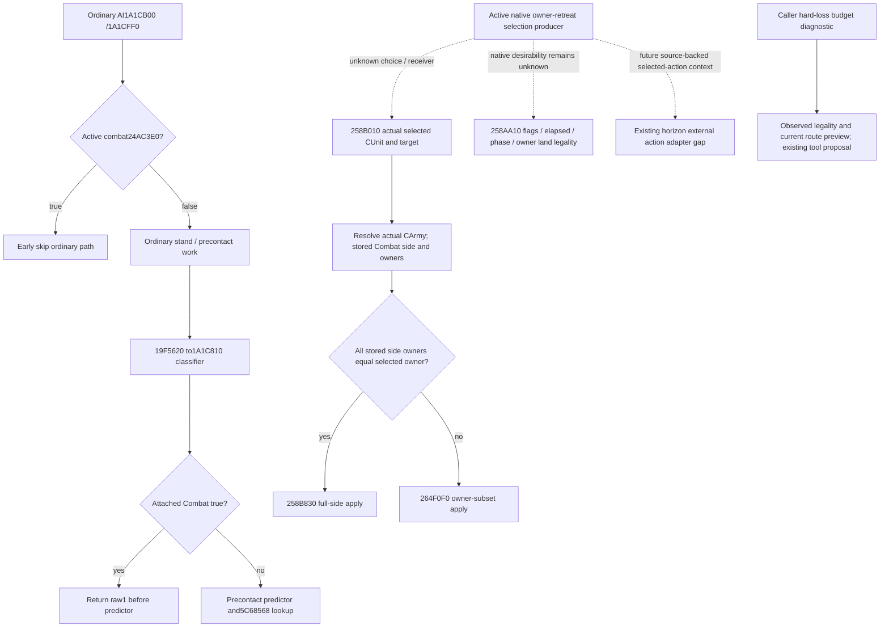

# Native AI owner retreat selection boundary (1.20.0.3)

Exact build: CK3 1.20.0.3 / Steam25652598 / EXE SHA `94B55397ABB687A3DCD436805A5D885E6BE90FA6C693FEB44A9E3BBEEADE02A6`. Readiness: **research**. This source-only increment closes dispatch, legality and actual owner scope boundaries; the native producer that chooses an active owner retreat remains unclosed. It adds no implementation, fixture, SDK, game day or live credit.

The ordinary `.3` AI path at `1A1CB00/1A1CFF0` checks active combat via `24AC3E0`; true takes its early skip. The current precontact classifier `19F5620 → 1A1C810` also returns raw1 before its predictor when attached Combat is true. Stock `.45` belongs to that stand/precontact tree; its current-build runtime lookup is `5C68568`, whose loaded value is not observed in this source packet. These branches establish precontact scope and leave the active owner-retreat threshold unclosed. Native legality `258AA10` consumes flags, elapsed time, phase and actual owner land/rule permission; its predicate does not compare current losses, strength or advantage. True native action selection remains a concrete source gap.

`258B010(Combat*, selected public CUnit full-ID, target Province*)` resolves the selected CUnit's `+178` CArmy and locates its side in the stored Combat rosters. It compares selected CUnit `+174` owner with each stored CArmy → `+124` public CUnit → `+174` owner. All owners equal dispatches full-side `258B830`; mixed owners dispatches owner-subset `264F0F0`. These apply/scope branches do not read Army `+120` commander. Commander identity remains separate from owner/action receiver; the unresolved selection producer may have further inputs.

Existing queries already distinguish main-entry hard residual from non-main residual, owner hard attribution, native Entry/Side strength, and actual advantage identities. That closes the available operands' identity map; it does not prove which of them the natural AI choice reads. The missing producer receipt is a specific observation increment through existing native command history/queue and battle DTOs.

Existing `run_conditional_horizon` consumes `ConditionalHorizonDay.ai_context` at continuing-main and pursuit stages. `action_selected is False` is an explicit caller timeline declaration; missing context or another value retains the existing selected-action adapter gap. Entry events precede admission, and the main forced/zero exit check precedes the continuing-main context check. A future source-backed owner action context plugs into those existing stages and preserves actual owner-subset identity. Unclosed native selection must not be filled with false.

Existing `assess_current_battle_retreat` is `own_selected_owner_single_frozen_main_tick_budget`, with `budget_source=explicit_caller_own_policy`. It compares the selected owner's modeled hard-loss delta against the caller's Q100000 budget, checks observed eligibility and route preview, then proposes an existing tool. It never executes the tool. This useful diagnostic does not predict native AI intent; win probability and retreat loss remain null. It remains separate from the still-unclosed native owner-retreat selection producer.

The next bounded source entry is the actual active-owner producer calling `1A188B0`, constructing `CMoveUnitCommand` vtables `476B168/476B138`, and reaching the payload/queue/`2969660` execution chain. Its active, target-different branch at `29697D7` reaches `258B010`. The known `1A1CF88 → 1A188B0` kind7 submission is already dominated by the representative `1A1CB59/60` active-combat exit. It does not close the true active producer. The current member/coordinator/owner association, actual combat, dispatch trigger, requested target and producer role must be read at the real selection callsite. Native target enumeration/rank/tie order remains another branch of that producer. A bounded direct-caller count or zero direct AI-region hits does not establish absence.

The narrow observation entry stays in existing native command history/queue and existing battle DTOs: correlate natural `1A188B0` producer caller return RVA and command identity/sequence with actual active apply, retaining full public CUnit/CArmy/owner/Combat IDs, phase, enqueue/apply raw dates, target, route, native mode and applied scope/result. Existing reinforcement-assignment observation supplies coordinator/subunit associations; control and transition observations supply current and prior Combat identity. After a real active receipt identifies its producer, trace that caller's decision operands rather than broadening a caller census. This observer is not implemented by the source packet.

The closed source branches and existing consumer interface are ready as a research handoff. True selection remains a typed native source gap; this packet adds no gameplay restriction and leaves Root's actual campaign independent. No selected-action adapter or stock threshold is inserted, and no complete Monte Carlo, battle win odds or native retreat intent is claimed.

Evidence: [native dispatch and owner application](Z:/ck3_mod_rewrite_process_assets/g2-resume-20261004/battle-native-owner-retreat-v61/native-dispatch/ROOT-DELIVERY.json), [native decision/legality source boundary](Z:/ck3_mod_rewrite_process_assets/g2-resume-20261004/battle-native-owner-retreat-v61/native-criteria/ROOT-DELIVERY.json), and [exclusive g38 consumer boundary](Z:/ck3_mod_rewrite_process_assets/g2-resume-20261004/battle-native-owner-retreat-v61/topic-report/G38-CONSUMER-BOUNDARY-MAP.json). The source-only daily/week fields are [Oct4/W40](Z:/ck3_mod_rewrite_process_assets/g2-resume-20261004/battle-native-owner-retreat-v61/topic-report/OCT4-W40-FIELDS.json). Native instruction/span pins remain owned by the two source lanes; this topic consumes their sealed summaries and does not recapture those caches.
