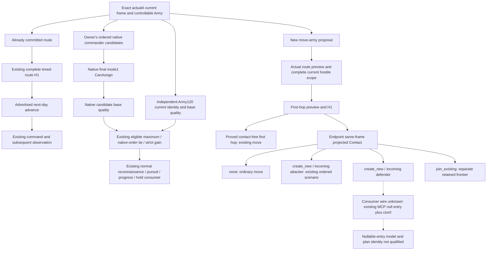
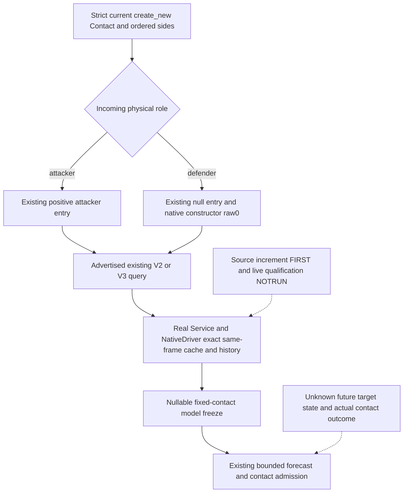

# R77 normal battle inputs: current source seams

The current committed-route continuation has no missing native observation in
the frozen hot6ee source. The ordinary commander quality policy also has its
required candidate, eligibility and independent current-role inputs. This
source audit adds no observer or counter-policy. It identifies one later
endpoint consumer seam for an incoming defender; that seam does not block the
R77 march already committed from2618 to2615.

## Freeze and evidence

The source is `6ee7dea1b4d2fa4ecb05223f12c66b7afe72ac2d`, the Root-frozen
`Z:/gbs-runtime32-sdk-r77-hot6ee`. This document was written in the independent
detached tree `Z:/gbs-normal-battle-r77-inputs` at that same base. The reused
exact game identity is CK3 **1.20.0.4**, Steam build **25734779**, EXE SHA-256
`98702F88A547CDE2EAF29A85F93B85F68EE4CF8148336A4F7AFAEB75319DD518`.
No EXE, hash, native body or new game observation was acquired here.

Root's R77 context is war100663329, `claim_cb`, duration26days, score0 and
Army218104048's committed2618→2615 route. Root has consumed strength004,
route-horizon006 and release008. The child audit read the small003 war reply
once; the other tool results are owner-reported context. The actual turn01
batch wrapper is85,311,362bytes, so its body was left unread. The160MB whole
snapshot was also left unread. No R77 current/best commander score is claimed
by this audit.

Readiness is **research / source audit complete**. Existing qualification and
live facts remain attached to their original artifacts. This work performs
zero build, import, test, SDK, game or FIRST execution and adds no gameplay,
win-rate or full OODA credit.

## Native and current consumer tree



The solid edges describe the native inputs and current source consumption.
The dotted endpoint edges are unimplemented consumer work. They are neither
a new native observer requirement nor an admission rule for current travel.
The source tree preserves the existing bounded forecast's quality limits;
these inputs do not establish a winner probability.

## Current commander: no required new trait/state getter

The held [native candidate tree](commander-candidates-and-assignment-12003.md),
[effective combat input tree](commander-effective-combat-inputs-12003.md) and
[actual4 normal quality policy](commander-native-quality-counter-policy-12004.md)
provide the semantic inputs. The actual4 addresses come from the adopted
actual4 profile, not from a shift of historical `.3` addresses.

| Native input | Actual4 entry | Current source seam |
| --- | --- | --- |
| Owner's manual player candidate pool | `0x2C11BF0`, flags `false,true` | `ck3_12004_army_support.cpp:207` → `ck3_12003_commander.cpp:166` |
| Final candidate/Army state eligibility | `0x29714F0`, mode1 | Same reader publishes the actual CanAssign Boolean |
| Candidate and independent current base quality | `0x2C0B250` | Signed native quality; current role is read independently |
| Actual assigned full CharacterID | `CArmy+0x120`, corroborating `0x24E9EB0` | Current commander may be outside the candidate pool |
| Effective generic modifier | `0xC6DED0` | Existing effective value, separate from native base quality |
| Current total martial | `0x28B1690` | Existing current-role leaf; not the ranking score alone |

The existing owning query is `ck3_12003_commander_mailbox.cpp:144`; actual4
wire metadata is in `ck3_12004_commander_mailbox.cpp:24`. Strict publication
is `bridge/army_commander_candidates.py:90`. The normal path is
`bridge/service.py:1458` → `commander_quality_formal_consumer_v1.py:20` →
`bridge/service.py:4925` → `commander_quality_formal_proposal_v1.py:16`.
Assignment readback already uses a fresh query at `bridge/service.py:5067`.
All source paths in these tables are under `ck3_autonomous_player/`;
native files are in `native_bridge/src/`, Python files in `src/xar_autoplayer/`.

The proposal already separates absence from unavailable current quality,
retains legal zero, chooses native incoming order on equal scores and compares
against the independent actual current role. Candidate trait names or trait
counts are not needed to reconstruct that native quality. Optional target
roll and siege modifier values already exist in the same query; the current
generic policy does not consume the target-roll branch. Physical Side+0x74
commander attribution and its phase trigger/chance leaves remain a distinct
current-combat context. Full native allocation and contextual utility remain
quality differences recorded in the linked native trees.

## Current hostile/contact and committed route: no required new getter

`ck3_12004_contact.cpp::BindContactImage12004` binds the actual4 route/Army
roots, game-mode slot `0x5CB87F8`, Hostile `0x2C09620`, empty `0x24E83A0`
and in-combat `0x24E8340`. `ck3_12004_army_support.cpp::BindRouteImage12004`
supplies the route profile, including actual duration `0x24AAD80`.
`ck3_12004_battle.cpp:44` supplies the same adopted arrival dependency subset.
The [arrival migration topic](battle-reinforcement-arrival-bindings-migration-12004.md)
records these bindings and the original provider recovery.

The already closed Hostile receipt is
`PAR7/battle-pursuit/migration-steam25734779/arrival-readonly-migration/HOSTILE-SOURCE-RECEIPT.json`,
where PAR7 is `Z:/ck3_mod_rewrite_process_assets/g2-parallel-20261007`.
It covers actual `0x2C09620..0x2C096DF`,191bytes, paired against old
`0x2C09640..0x2C096FF`: complete decode, concrete non-address operands,
ordered relative/RIP edges and local control flow were preserved. This audit
reuses the receipt without rereading the body.

The software signature is `RouteBindings::Hostile = bool(*)(void*,void*,bool)`.
The proved native third argument is an optional War pointer/null in R8.
The six adopted route calls in `ck3_12002_routes.cpp:1454,1456,1490,1492,1550,1604`
pass literal `false`, preserving the native null argument. The adopted
arrival reader does the same. This source assessment does not generalize a
software `true` argument into native Boolean semantics. Receiver full IDs,
the ordered relationship's War lookup/fallback and current ended-state
handling belong to the reused receipt; no callee expansion is needed here.

The actual committed-route policy at `strategy.py:11548` selects the next-day
advance under `native_war_route_contact_horizon_progress`. The general
forecast ingress at `strategy.py:16402` handles new `move-army` proposals;
its `16417..16419` check leaves this existing advance unchanged. A new move's
first-hop source path is `strategy.py:16502..16619`, using actual preview,
complete non-retreating hostile scope and timed routes. Its proved
contact-free first hop precedes endpoint model inputs.

`normal_army_projected_contact_v1.py:11..58` and
`bridge/projected_contact_contract.py:139..166` retain actual frame/request,
episode/generation, ordered sides and complete role. They already publish
`none`, `create_new` and `join_existing`. Current-state hostility and contact
do not predict a future change in War, province or Combat membership.

## One later consumer seam: incoming defender with ctor0

For a new final-hop endpoint move, the complete `create_new` projection may
say the incoming subject is the **defender**. `strategy.py:16655..16660`
currently returns `native_war_general_battle_opposing_entry_unavailable`
because its scenario path expects a selected attacker entry. The held
[projected Contact native tree](projected-contact-scope-v1-12003.md) already
records that the defender constructor branch skips attacker incoming
adjacency and uses raw constructor kind0. The
[actual4 migration topic](existing-contact-phase-migration-12004.md) is the
version authority for the reused profile; historical `.3` RVAs are not new
`.4` evidence.

No new MCP or schema is needed. The existing readonly request can express:

```python
ck3_query_combat_simulation_inputs(
    target_province_id=current_projection_target,
    attacker_entry_province_id=None,
    attacker_army_ids=current_projection_ordered_attackers,
    defender_army_ids=current_projection_ordered_defenders,
    constructor_adjacency_kind_raw=0,
    expected_revision=current_paused_public_revision,
)
```

`ck3_12002_combat.cpp:1945..2054` handles explicit ctor0 and internal entry−1
without resolving an entry province. `bridge/combat_contract.py:217..293`
validates `None` plus raw0 and retains canonical `ctor0` request identity.
Registered V2 is `bridge/mcp_server.py:3872..3888`; V3 parity is at3901..3918 and
requires the actually advertised V3 capability. The existing paused Service
query is `bridge/service.py:14277..14398`.

The bounded future change is the endpoint consumer at
`strategy.py:16661..16735`: builder/parser, cache identity, returned-query
matching and forecast/plan scenario identity must agree on null entry and
ctor0. The projection's incoming edge remains Contact geometry, not an
attacker constructor entry. Nullable-entry end-to-end model consumption at
`simulation/general_battle_forecast.py:157..239` has not been qualified.
This document does not implement that work or invent a fixture. No new RVA,
native-body capture, commander simulation or troop simulation is requested.

## Delivery and cost

The machine-readable source ledger is
`native_bridge/research/battle_normal_current_input_frontier_r77_12004.json`
under `ck3_autonomous_player/`. External child evidence is held at
`Z:/ck3_mod_rewrite_process_assets/g2-parallel-20261008/battle-normal-r77-value36/`:
`commander/SOURCE-MANIFEST.json`, `commander/NATIVE-TREE.md`,
`one-hop/SOURCE-MANIFEST.json`, `one-hop/tree.mmd` and the preserved
`one-hop/bounded-reply-attempt.json`. Root owns shared Oct8/W41 reporting
and any later integration/qualification.

Known full source-text reads in the one-hop lane total906,991bytes
(strategy897,176 plus projected-contact contract9,815). Other selected
source/doc/ledger reads, including the commander audit, were not physically
metered and are not reported as zero. The small003 reply cost50,166bytes;
an earlier002 bounded prefix was unmetered. Turn01's85MB wrapper was statted
only. This audit has **0 EXE reads,0 hash calls,0 cached native-body audits,
0 decoder runs,0 new captures,0 build/import/test/SDK/game/FIRST runs**.
The no-behavior-change source delivery needs only one diff check and English
commit; Root requested no push.

## 2026-10-08: incoming-defender consumer source increment

The later endpoint seam above now has an isolated **SOURCE_NOTRUN** increment
based on `f75a3dfd` in `Z:/gbs-incoming-defender-consumer37`. The original hot6ee
audit and its dashed pre-implementation tree remain historical. The current
R77 committed-route H1 still needs no endpoint forecast or new native input.
This package adds no observer, schema, native address, privilege or admission
rule. Root owns the sole FIRST, integration, deployment and actual campaign.

The consumer keeps `entry` for the current route and incoming Contact query.
For the already strict-normalized `create_new` incoming defender branch, its
separate combat entry is null and its effective constructor kind is raw0.
The existing V2 or actually advertised V3 builder encodes `ctor0`; parser,
same-frame history, snapshot cache and forecast all use the same nullable
identity and preserve the native ordered sides. The returned plan discloses
the existing ctor0 scenario fields; the positive incoming route edge stays
in the projected Contact object. A nonzero incoming adjacency does not change
the defender constructor kind, and raw0 does not mean advantage0.



The existing model freeze rejected a valid normalized null entry through
`_positive(None)`. `FixedContactEncounterInput` now retains null for exactly
the existing `native_defender_constructor_zero`, typed raw0 and two
`fixed_at_target_hypothetical` policies. Its canonical payload identity already
includes those scenario fields. Positive-entry behavior uses the existing
positive validator. No new frozen schema field or fallback estimate is added.
The final-contact inbound comparison uses the selected attacker/defender
union so physical role inversion does not relabel selected enemies as absent.

The sole proposed connected compound is
`tests/unit/test_incoming_defender_service_compound_12004.py::test_registered_incoming_defender_whole_query_cache_model_and_role_change`
under `ck3_autonomous_player/`. Synthetic game/native envelopes and one
synthetic proposed move connect actual registered MCP, Service, NativeDriver
query/cache/history, strict contracts, real forecast and unchanged admission.
It covers missing input selecting ctor0, whole V2 and V3 base consumption,
optional V3 phase absence, preserved non-sorted opponents and same-frame
attacker/defender identity changes. It does not mock a favorable forecast or
admission. Test, import, build, hash, EXE, SDK and game execution are NOTRUN.
The sole Root command and Oct8/W41 fields are in
`Z:/ck3_mod_rewrite_process_assets/g2-parallel-20261008/incoming-defender-consumer37/`.

The quality boundary remains the existing bounded model: loaded phase-event
transitions, future daily refresh, reinforcement, voluntary retreat and
unmodeled character death are not completed by nullable geometry. Existing
`join_existing` still requires its separate active-combat-resume inputs.
Contact-free first-hop and already committed-route advances retain their
original paths. No gameplay day, arrival, battle, victory or G2 milestone is
credited to this source increment.
