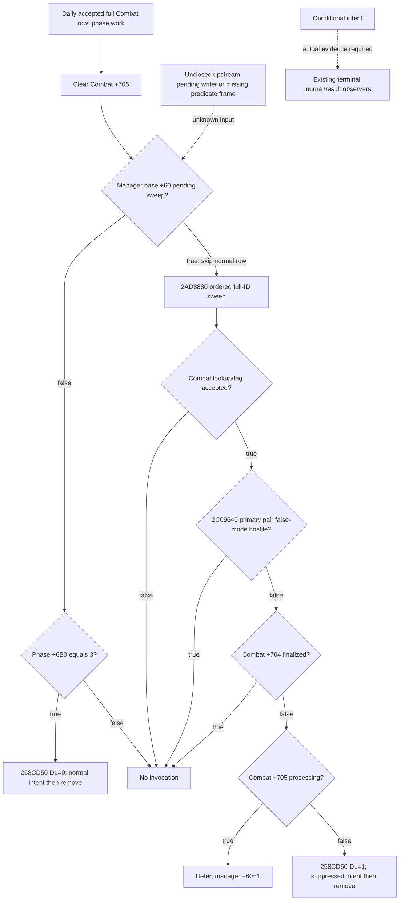
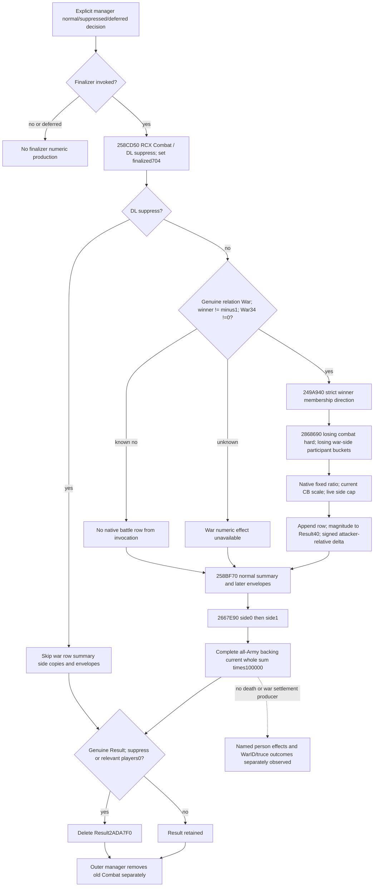

# Normal combat finalizer: exact .3 dispatch and numeric subset

CK3 1.20.0.3 / Steam 25652598 / EXE SHA-256 `94B55397ABB687A3DCD436805A5D885E6BE90FA6C693FEB44A9E3BBEEADE02A6`. Both source ledgers below were sealed before the new pure adapter was implemented. These are native dispatch conditions and conditional numeric effects, not user authorization gates. This package changes no runtime observer, query, schema or native binding.

## Manager caller and suppression source

CK3 **1.20.0.3 / Steam 25652598**, EXE SHA-256 `94B55397ABB687A3DCD436805A5D885E6BE90FA6C693FEB44A9E3BBEEADE02A6`. This is source-first, offline research. The archived current-build bytes are reused; no EXE extraction, runtime, tests, SDK, game days, window or Git operations are added.

### Receiver identity and ordered traversal

Daily phase-manager entry `2AD8000` receives **CombatManager +8** in RCX. Its `+20` pointer / `+2C` count therefore alias manager-base `+28/+34`. It freezes the traversal end from that count and visits native 32-bit FullCombatIDs in order. Lookup masks the low 24-bit index, checks storage count and non-null slot, and compares the complete ID against Combat `+8`; lookup failure uses the canonical fallback. The subsequent Comb tag `+C == 0x436F6D62` and `+8 != -1` checks determine whether a row is processed. These are source semantics, not a caller-created subset or a phase3-derived membership claim.

Each accepted row sets Combat `+705=1`, refreshes both commanders, increments `+6B4` and performs the existing phase dispatch. At `2AD8148` it clears `+705=0`. Only then does finalizer admission occur:

| Ordered branch | Exact instructions | Meaning |
|---|---|---|
| Pending suppression sweep | `2AD814F/54`: receiver `+58 != 0`; `2AD8156/5A` passes receiver−8 to `2AD8880`; `2AD815F` jumps past this row's normal check | Sweep has precedence. The daily row does not resume its phase3 normal branch after the sweep returns. |
| No sweep, phase not done | `2AD8161/68`: Combat `+6B0 != 3` | No normal finalizer call for this row. |
| No sweep, done phase | `2AD816A/6C/6F`: EDX=0, RCX=Combat, call `258CD50`; `2AD8174/77/7B`: remove its full CombatID via `2ADA6D0` | A normal-finalizer invocation intent, followed by manager removal. Neither finalized nor Result-present is a guard at this callsite. |

At end of traversal the wrapper sets receiver `+59=1`, repeats a pending sweep if receiver `+58` is still set, then invokes `2AD85A0` and the observed list-maintenance calls. Receiver `+58` is the **same byte** as sweep manager-base `+60`; it is not a second authorization bit. Its arbitrary upstream writers were not re-researched, so a forecast must carry its actual or conditional value rather than guess it from war status, phase or deaths.

### Non-hostility sweep

`2AD8880` takes the manager **base** in RCX. It clears manager `+60`, traverses `+28/+34`, and repeats the FullCombatID/tag checks. It resolves primary CharacterIDs from Combat `+90/+3D8` against Character `+18`, using the canonical Character fallback if storage or generation lookup fails. There is no separate strict-primary-success rejection before the predicate.

`2AD898C/8F/92` calls `2C09640(RCX=primary0, RDX=primary1, R8D=0)`. The predicates are evaluated in this exact order:

1. Hostile output AL is true: skip this Combat; finalized and processing are not consulted.
2. Hostile is false, Combat `+704 != 0`: skip it.
3. Hostile is false, unfinalized, Combat `+705 != 0`: set manager `+60=1` and defer it.
4. Hostile is false, unfinalized, not processing: `2AD89B1/3/6` invokes `258CD50(RCX=Combat, DL=1)`; `2AD89BB/BE/C2` removes the complete CombatID.

Phase3, winner, current strength and Result presence are not sweep admission conditions. For the selected daily row at its postwork check, processing is known false because `2AD8148` just cleared it. A separately entered sweep needs its actual per-Combat processing input. Other rows can be processing during a nested sweep and remain deferred.

### Finalizer ABI is not a legality checker

At `258CD50`, RCX is Combat and DL is the **combat-wide suppression argument**, not a per-side permission. `258CD7F` unconditionally writes Combat `+704=1`. The early body resolves Combat ResultID `+708` against Result `+8`, with canonical Result fallback if lookup fails. It does not reject a previously finalized Combat, a non-phase3 Combat, or an absent/unresolved Result before doing this work. At `258CE26/29`, DL=true skips the normal-result block to `258D671`; DL=false enters it. Effects and Result cleanup belong to the sibling effects ledger. `result_present=false` must not be translated to finalizer-illegal, and `result_present=null` must not cancel an otherwise closed caller intent.

A pure projection can publish **conditional normal intent**, **conditional suppressed intent**, **deferred**, or **no invocation**. It cannot publish an actual removed Combat, victory, normal result, war score, character injury/death or persistence from these inputs alone. Existing terminal journal and result observers retain ownership of actual postconditions.

### Minimal data boundary

Existing battle-control already publishes phase, finalized, ResultID and primary identities. It does **not** publish the manager pending byte or the sweep's actual `2C09640` output. Processing `+705` is also absent as a native-frame field. Offline callers must explicitly supply these branch operands, with null representing an unresolved operand only when that operand is reached. If later gameplay actually needs this branch, the smallest same-MCP readonly observation is manager identity + pending byte and the current primary-pair false-mode hostility predicate, bound to the same full CombatID/revision; standalone sweep support additionally needs processing. No new runtime query, schema or production gate is implemented in this lane.

## Normal numerical and war-effects source

CK3 **1.20.0.3 / Steam25652598**; EXE SHA-256 `94B55397ABB687A3DCD436805A5D885E6BE90FA6C693FEB44A9E3BBEEADE02A6`. This ledger reuses archived source bodies and current sealed count contracts; it reads no EXE or live process. `API.json` is written before sibling model implementation. Manager admission, named persons, subset retreat and phase events retain separate owners.

`258CD50` unconditionally writes `Combat+704=1` at `258CD7F`; it has no extra phase/already-finalized admission check. Result FullID `+708` is strict resolved with canonical fallback, without a presence guard. `258CE29` sends suppress to `258D671`, bypassing the normal producer region. A real manager permission is therefore supplied by the permissions lane. Neither phase3 nor result presence selects it.

Both side hard accounts use `2652B50`: `max(B-C-SL-SM,0)` in original signed Q100000 units. These are views of current after-carry operands. Normal finalization does not reapply P1/P2 damage or add residual hard into owner hard rows. The row constructor separately truncates each raw baseline/hard to whole troops. Missing inputs remain missing; whole-row rounded counts do not replace captured fractional raw quantities.

`2667E90` enumerates ordered complete side Armies and every backing RegimentID and sums current whole troops. The accumulation at `2667F35..F94` is **signed32**, then sign-extended and scaled by100000. It is independent of fighting cache, soft/hard pools, wipe and named characters. Phase3 recomputation is composed only for selected genuine rows whose current component state is supplied; untouched backing remains as observed. Existing backing reaggregation does not debit current loss again.

Winner0/1 selects the combat side, while winner−1 retains no winner and no losing-only projection. Normal false finalizer still executes its two-side numerical path for−1; summary fallback side0/side1 is an implementation context, not defender victory. The score writer explicitly skips−1. A declared normal result, winner projection and complete numerical projection can therefore have different completeness.

The normal War is obtained from `28BC270(primaryA,primaryD)` relation `+20`, then generation/tag checked. The writer requires nonzero native `CWar+34`, gets both membership bools from `2494B60(CWar+20,CharacterID)`, appends a58-byte row to `War+298`, and copies row magnitude `+40` to Result `+40`. Combat side0 need not be war attacker; even Robert's combat win can publish negative attacker-relative delta. Magnitude is nonnegative; only actual `winner_is_war_attacker` selects its sign.

`2868690` denominator is the **losing war-side** current participant pointer array. Each actual mode2 eight-bucket result is summed with signed32 wrapping in order `C0,0,20,40,60,80,A0,E0`; participant subtotals are signed32 added, clamped to at least1, then converted to Q100000. Do not rename it combat baseline. Ratio caps above1, then native fixed multiplication uses current CB `+1598/+15A0` and live cap. Exact instruction evaluation gives `5C69B60` for winner war-attacker and `5C69B58` otherwise: `2868A34` RIP target is `5C69B58`, `2868A3E` conditional-nonzero target is `5C69B60`. The flag is source-proved War-attacker membership: `249A991 ->2494B60(War+20,winnerSide+70)` AL->BPL->R9B into `28681C0`, then R8B into `2868690` and R13B at `28686B6`. Combat side0 has its separate membership bool; winner_raw=0 does not set the War-attacker flag. Archived prose only listed both caps without side mapping, so this is a clarification, not a proven correction to current canonical docs.

Current terminal query already supplies actual row values, denominator inputs and selected CB scale through its sealed g61 parser. A future pure forecast still needs those operands bound to its actual invocation, source-aligned War relation/guard/memberships, and the currently missing loaded side cap. Do not rebuild already published denominator/scale capability or pretend past values are future values. The minimum optional readonly increment is missing live cap plus current invocation binding, only if that numerical decision needs it. This source ledger and sibling finalizer composition need no new runtime gate. Pending forecast fields stay typed unavailable; current ordinary combat play can use actual terminal rows.

The existing pure terminal helper uses Python's arbitrary-precision `sum(regiment.current_soldiers ...)`, whereas the native projector has signed32 per-Army and global adds. The new composition adapter uses source-correct signed32 aggregation in its own module. It leaves the old helper and its test matrix unchanged; this package neither expands extreme-value tests nor treats the difference as a game failure.

`Result+C4==0` legitimately removes a normal result; suppress removes it too. Genuine Result identity/tag qualifies deletion. Missing relevant-player count prevents a retention forecast, without preventing admitted finalization. Current entry/side postcall journal capture preserves the numerical values before deletion. Outer manager Combat removal is a separate source effect. Neither one-row battle score nor Combat removal implies whole-war victory, truce, peace, title transfer or WarID absence. The normal-finalizer calls contain no supported explicit war-settlement postcondition; separate war/interaction queries establish those results.

The generic normal summary `258BF70` and winner/loser envelopes remain independent numerical/script effect branches: this lane retains their source order, without claiming a complete financial/prestige/piety model or unknown on-action effects. Other pods own named-person death/custody and retreat. Full backing survivors alone cannot close those branches.

Readiness: **research, exact source/accounting contract closed**. Sibling pure adapter and its sole two cases can qualify static-ready; no production-live credit is added by this package. Source-only activity:0 new EXE reads, SDK, pipe, game, window, tests, builds, shared source/Git writes and normal days.

## New pure adapter and focused evidence

The new [battle_current_normal_finalizer.py](../../ck3_autonomous_player/src/xar_autoplayer/simulation/battle_current_normal_finalizer.py) composes only the closed manager-dispatch and conditional normal numeric subset. Pending suppression takes precedence over the daily phase3 normal branch. Only reached unknown operands make that branch partial; later unconsulted fields do not introduce a new condition. Suppressed, deferred, skipped or unknown dispatch does not fabricate normal numeric output. A normal branch uses independent current baseline/fighting/soft signed64 accounts, native signed32 per-Army and global whole backing sums, output Q conversion and whole-row integer truncation. It preserves carried P1/P2 component values and the owner hard ledger; no second debit or credit occurs. The existing terminal helper and its old tests remain unchanged.

The sole focused run passed two production adapter cases in 0.0763494 seconds. A normal daily case admits finalization without consulting missing finalized, hostility, processing or Result-presence fields; it gives source-correct whole survivors104 where an unbounded sum would give4294967400, raw hard2300021 and whole row30/23, preserving prior owner hard1700019. A suppressed daily case follows pending→nonhostile→unfinalized, derives selected postwork processing=false, retains native winner−1, and keeps missing normal numeric results null. The reusable [test_battle_current_normal_finalizer.py](../../ck3_autonomous_player/tests/unit/test_battle_current_normal_finalizer.py) covers these two cases. No old suites or repeated focused run were executed and no RED occurred.

The adapter SHA-256 is `a27f4f6870a65d05f3e9f1eb6469d3e89fc768b2c68ee2b0b5838aab83ba2134`. All source receipts, archived-byte pins, the final effects cap clarification, module contract, test inputs and sole execution receipt are frozen under `Z:/ck3_mod_rewrite_process_assets/g2-resume-20261004/battle-normal-finalizer-v61/{permissions,effects,model,fixture}/`. The executed dependency head is `54f290f0e0467f5e73cf5b55de18effe84dcaa14`.

## Readiness and smallest observation inputs

The supported new subset is **static-ready**. Actual normal finalizer invocation, Result persistence/deletion, manager Combat removal and war score must still be established by native journal/Result/war observations. Full finalizer capability remains **partial**. The adapter does not predict named-person death/custody, subset retreat, phase-event execution, full financial/script effects, war victory, peace/truce/title transfers, complete Monte Carlo or win odds. Phase3 alone does not prove any of those outcomes.

The concrete future readonly seam is the existing battle-control query's same-frame manager identity/pending byte and primary-pair `2C09640(...,false)` hostility predicate; standalone sweep additionally needs Combat+705 processing. Daily selected postwork processing is already source-known false. These operands are needed only by their actually reached branches. The currently published terminal parser already supplies denominator inputs and selected CB scale; a future score forecast would additionally require loaded live cap and current-invocation binding. No new query or observer is implemented here. Source index maintenance remains the root coordinator's separate task.

New normal days, saved-day credit and live samples:0. SDK, pipe, game, window, shared-source and Git mutations, new EXE reads and native builds:0. The task produced only offline source closure, one pure module, one reusable two-case test and this topic.
