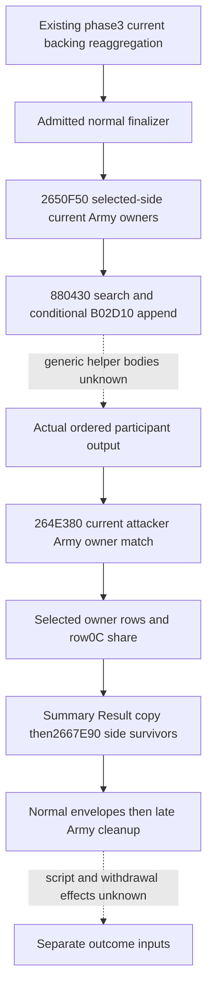

# Exact .3 participant scaling and immediate resource writeback

CK3 1.20.0.3 / Steam25652598 / supplied EXE SHA `94B55397ABB687A3DCD436805A5D885E6BE90FA6C693FEB44A9E3BBEEADE02A6`. Frozen implementation base `Z:/g68`, HEAD `60a11f657c6e49db165cb79ad23be97343d7a86c`. Reuse the v64 sealed summary/arithmetic and archived `258BF70`. The only two new frozen-EXE function spans are `310DB40..310E208` (1736 bytes) and `285EE60..285EEE3` (131 bytes); no further extraction is permitted in this package.

```mermaid
flowchart TD
  N[Existing admitted normal finalizer] --> S[258BF70 existing ten-slot summary]
  S --> V[258C1C8 calls2650F50 into ordered participant FullID vector]
  V -. complete list body unclosed; supply actual returned vector .-> VI[Explicit conditional ordered participant IDs]
  VI --> P[258C240 current participant FullID; copy original80-byte summary]
  P --> B[258C282: 264E380 membership chooses Combat+78 attacker or +3C0 defender rows]
  B -. membership implementation unclosed; explicit result input .-> BI[Selected side owner rows]
  BI --> R{First row+8 matches FullID and rows nonempty?}
  R -->|no| Z[Share raw0]
  R -->|yes| T[258C2E0 wrap signed32 sum of every row+0C]
  T --> POS{Wrapped signed32 total greater than0?}
  POS -->|no| Z
  POS -->|yes| Q[258C2F4 signed32 IDIV owner weight / total; truncate toward0]
  Q --> QS[258C2F9 signextend integer quotient and multiply100000]
  QS --> SC[258C330..3C4 scale each of10 slots with v64 native fixed multiplication]
  Z --> SC
  SC --> RES[258C403..425 generation-aware Character lookup checks actual+18 FullID]
  RES -->|real match| C[310DB40 vector, actual Character, mode, false]
  RES -->|fallback sentinel| U[Unclosed receiver; no claimed participant balance]
  C --> ZERO{310DBF6 slot0 raw delta is zero?}
  ZERO -->|yes| SK[Skip slot0 dispatch; no slot0 store]
  ZERO -->|no| JT[Jump table slot0 bytes18dc1003 ->310DC18]
  JT --> EXT{310DC18 Character+1B0 extension present?}
  EXT -->|no| SK
  EXT -->|yes| W[310DC28 RCX=extension+F8;310DC35 calls285EE60]
  W --> PRE[285EE82 preceding native query2BCA620]
  PRE --> STORE[285EE87: extension+100 = signed64 wrap of before + delta]
  STORE -. unclosed later queries/hooks .-> POST[Return-time balance and complete effects remain partial]
  C -. nonzero slots1..9 separate writers unclosed .-> OTHER[Other resource channels remain partial]
```

The share is **integer division before fixed scaling**, not a proportional fraction: if owner weight250 and total1000, the quotient and share are0. With weight1000/total1000 the quotient is1 and share raw100000, so the original summary is retained. `258C2E0` sums native dwords with signed32 wrap; a wrapped total<=0 takes the known zero branch. The matching owner row is the first row with the identical dword FullID. No sign clamp, floating division, deduplication or inferred weights are introduced.

`258C330..3C4` is the same signed64 fixed multiplication contract sealed in v64: unsigned guards centered at `0xB504F333` with range `0x16A09E666`; safe low-qword product divided toward zero by100000; otherwise split the signed maximum and retain low-qword wrap. Apply it independently to each of the ten copied slots. The original normal summary remains unchanged between participants.

`258C3CA/3E4` compares the participant FullID to War+288/+28C and sets mode1 on a match, otherwise0. Slot0 dispatch does not consult this mode or `R9=false`, so missing war-primary membership is not a required input for the supported slot0 store. Other slot writers are unclosed.

The beneficiary of the closed store is the **actual generation-matched Character at the participant FullID**, not the commander, player, combat winner label or War primary by inference. The resolver masks low24bits for lookup, checks bounds/pointer, then checks Character+18 against the full ID. A failed lookup selects the native fallback sentinel; its resource semantics are not closed and cannot be credited to the participant.

The slot0 table's first dword is `0x0310DC18` (bytes `18 dc 10 03`, captured within the first function span). At `310DC18`, a missing Character+1B0 extension skips this channel. Otherwise `310DC28` supplies extension+F8 to `285EE60`, whose `285EE87` adds the signed64 delta to `[RCX+8]`, exactly extension+100. Existing exact .3 knowledge `war-cash-current-resources-12003.md` independently names Character+1B0 / extension+100 as personal gold; the actual writer and numeric offset are proved here. The model may expose that sourced alias but must retain the precise immediate-store scope.

For example an actual participant FullID29829 with first selected row weight1000 and total1000, summary slot0 raw70000600 and extension+100 before raw12345, receives an **immediate native store raw70012945**. This is a conditional pure example, not a game observation or committed account result. A second participant weight250/total1000 receives scaled raw0 and reaches no slot0 store. If a nonzero delta is known but the real receiver, extension presence or before value is absent, the corresponding identity/presence/post-store value stays unknown; it must not become zero or a guessed balance.

`2650F50`'s existing cache only covers its entry and points at an unclosed remaining body. Actual participant enumeration, `264E380` membership, native query `2BCA620`, post-store hooks, slots1..9 writers and complete receiver effects remain explicit partial branches. The supported increment is exact participant-scaled values and the real receiver's immediate slot0 writeback, composed from explicit conditional inputs. It claims no bridge observation, live balance commit, Stats38 closure or complete terminal.


## Public conditional values and focused qualification

The existing normal producer now accepts optional participant resource inputs after its once-produced summary. The public conditional horizon forwards that context and exposes the ordered per-participant scaled values and genuine receiver's immediate gold field store. It reuses the existing signed64 fixed multiplication and normal hard/count/summary producers; it introduces no parallel numerical model or new readiness gate.

The [new focused horizon test](../../ck3_autonomous_player/tests/unit/test_battle_normal_participant_gold_writeback_horizon_12003.py) passed on its first and only execution: one unique case, one public horizon call and one production normal adapter call. Participant34333 has owner weight250/total1000, hence integer quotient0, ten scaled zero slots and no slot0 store. Its unconsulted extension/before inputs remain absent. Actual matched receiver29829 has share raw100000; before gold raw12345 plus scaled slot0 delta70000600 projects the immediate285EE87 field value **70012945**. The original normal numeric/summary values and owner loss ledger are preserved. No old summary case, branch-label assertion or old suite was rerun, and no failed attempt occurred.

The supported subset is **static-ready**, conditional on explicit source operands. The projection distinguishes the intended participant ID from the generation-matched beneficiary and preserves native zero skips. It computes the value at the field ADD instruction; return-time `final_gold` remains unknown, and actual live balance commit, later hooks, other resource channels, Stats38 and complete terminal effects remain partial.

Source/API/Mermaid were sealed before code. Artifact root: `Z:/ck3_mod_rewrite_process_assets/g2-resume-20261005/battle-normal-participant-resource-writeback-v65/`. Final focused receipt SHA-256: `579dbd70146a50a52e4cd626ebfe69aa60cc36a0ef9cb19b4bf1c35873ecf0ce`. Frozen implementation base is g68 `60a11f657c6e49db165cb79ad23be97343d7a86c`. New native extraction was limited to two bounded spans,1867 bytes total. Whole EXE scan/hash, SDK/RPM/pipe/game/window calls, shared-source/Git edits, native full builds, actual game days and live credit:0.

Current control DTOs did not yet publish native owner row+0C weight when this package was qualified. That exact same-query readonly input is the highest-priority separate observer increment; current backing or hard loss is not a substitute. Actual ordered2650F50 output and264E380 membership remain explicit source inputs. This conditional package does not claim those observations complete and does not wait for the separate observer or unclosed post-store hooks.

## Current Army owner membership and terminal order (2026-10-05)

Exact 1.20.0.3 / Steam25652598 / EXE SHA `94B55397ABB687A3DCD436805A5D885E6BE90FA6C693FEB44A9E3BBEEADE02A6`; v73 reused the closed phase3 count contract and read only462 new frozen code bytes across two logical bodies.
Complete `264E380` scans current Side+10/+1C Army FullIDs, resolves Army+124 Unit FullID, and compares Unit+174 owner FullID with its requested dword; first match returns true, exhaustion false.
It reads no Entry, soldier count, owner weight table, kind3 or knight gate; failed generation lookup uses the actual canonical Army/Unit fallback, so an unobserved reached fallback remains unknown rather than false.
Complete `2650F50` walks the supplied Side's current Army owners in stored order; `258BF70` supplies only the selected winner-side roster, with the already documented winner−1 summary fallback preserved.
Its `880430(begin,end,&ownerID)` search and conditional `B02D10(vector,&ownerID)` append call are closed at the caller; their generic helper bodies remain unknown, so stable uniqueness needs actual output or an explicit helper witness.
Participant membership selects Combat+78 attacker or+3C0 defender rows before the existing row+0C integer share calculation; current whole counts and retained weight rows do not substitute for each other.
The participant loop precedes Result+48..97 summary copy, both `2667E90` survivor copies, normal envelopes and late Army cleanup; intervening scripted effects and withdrawal leaf semantics remain separate inputs.
Source/API/pins and report fields: `Z:/ck3_mod_rewrite_process_assets/g2-resume-20261005/battle-phase3-reaggregate-v73/tree+bindings/ROOT-DELIVERY.json`; readiness **research**, new tests/live days/SDK/RPM/window operations0, with no repeated P1/P2 debit or owner hard credit.


