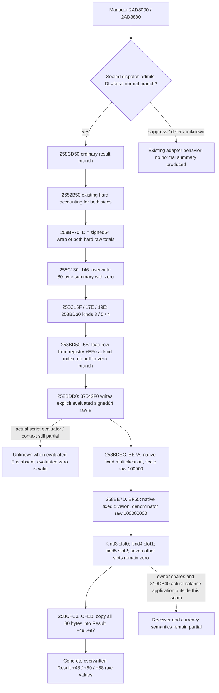

# Normal summary Result writeback: exact .3 conditional values

The frozen g67 public horizon already composes manager dispatch and normal survivor/hard accounting. Its missing numerical output was the ordinary summary written to Result. The existing normal finalizer now accepts optional, explicit evaluated coefficients and projects the actual 80-byte summary overwrite into its public horizon terminal result. Existing numeric models, manager admission and requiredness remain unchanged.

Authority: CK3 1.20.0.3, Steam build 25652598, supplied EXE SHA-256 `94B55397ABB687A3DCD436805A5D885E6BE90FA6C693FEB44A9E3BBEEADE02A6`. The one new bounded span is RVA `0258BD30..0258BF6E` (574 bytes) from the explicitly frozen migration EXE. Existing manager, count/accounting, summary caller and result-copy archives are reused. No game or window operation is involved.

The denominator is **literal raw `0x05F5E100 = 100000000`**, not 100000000 multiplied by the scale. The multiplication/division scale is literal `0x186A0 = 100000`. Source `258BF0C` materializes the denominator; signed reciprocal `0x55E63B88C230E77F` with shift 25 implements division by that literal. The other reciprocal, `0x29F16B11C6D1E109` with shift 14, implements signed division by 100000. Each uses the native sign correction to truncate toward zero.

Let `w64` reduce a low qword to signed64, `u64` reduce to unsigned64, and `tdiv` divide signed integers toward zero. Every native low-qword multiply/add/subtract below uses `w64`; signed high-half `IMUL` uses the full signed128 product.

1. `D = w64(H0 + H1)`. Existing current hard accounting supplies `H0,H1` once; this seam adds no fresh census or damage model.
2. For each explicit evaluated coefficient `E`, fixed multiplication takes the fast branch when both `u64(value + 0xB504F333) <= 0x16A09E666`. It returns `tdiv(w64(D*E),100000)`. Otherwise let `hi=max_signed(D,E)`, `lo=min_signed(D,E)`, `q=tdiv(hi,100000)`, `r=w64(hi-w64(q*100000))`; return `X=w64(w64(lo*q)+tdiv(w64(r*lo),100000))`. **The source splits the signed maximum**, confirmed by `258BE25..39` compare and conditional moves.
3. Fixed division takes the fast branch when `u64(X+0x53E2D6238DA3) <= 0xA7C5AC471B46`. It returns `tdiv(w64(X*100000),100000000)`. Otherwise let `q=tdiv(X,100000)`, `A=w64(q*100000)`, `r=w64(X-A)`, `B=w64(r*100000)`, `qa=tdiv(A,100000000)`, `ra=w64(A-w64(qa*100000000))`, `qb=tdiv(B,100000000)`, `c=tdiv(w64(ra*100000),100000000)`; return `w64(w64(qa*100000)+qb+c)`.

These are two native integer stages. Combining them into one division changes results. Example `D=700006,E=10000000000` enters the first split branch, produces `X=70000600000`, then the second fast branch produces **70000600 raw**. The example supplies a conditional evaluator result and makes no live observation claim.

The exact raw slot mapping is `kind3 -> summary+0 -> Result+48`, `kind4 -> summary+8 -> Result+50`, `kind5 -> summary+10 -> Result+58`. The full copy overwrites prior result values; prior values are unnecessary inputs. Names such as gold/prestige/piety are not established by this contract. Missing row/evaluated coefficient is unknown: `258BD30` dereferences the loaded row without an absent-row branch, and the generic evaluator's default semantics are unclosed.

This is a real supported summary/writeback value increment. The complete terminal remains partial: actual script evaluation, receiver application, Stats38, named-person effects, phase callbacks, retreat and war settlement are not supplied by these three result slots. Winner -1 retains the existing summary-context fallback while declared winner stays unknown; no battle-to-war inference is introduced.

## Public composition

`CurrentNormalSummaryInputs(evaluated_raw_by_kind, source_context)` records explicit conditional evaluator raw outputs for kinds3/4/5. Pass it through `ConditionalTerminalInputs.normal_summary_inputs` or directly to `project_current_normal_finalizer(normal_summary_inputs=...)`. The existing admitted normal branch computes hard accounting once and adds `normal_summary_projection`; suppressed/deferred/unknown manager branches produce no ordinary summary. Omitting this optional input retains the existing numerical behavior.

`normal_summary_projection` exposes ten `summary_raw_slots`, `result_raw_by_offset` for Result+48..+97, the two operation intermediates, precise local missing-input gaps and an overwrite description. A missing evaluated coefficient leaves only its dynamic slot unknown; evaluated zero remains zero. The three dynamic slots use the original native call order3/5/4. Currency names and actual participant balance writes are not established by these raw slots.

The private arithmetic remains in the existing normal-finalizer module. It implements the source's guarded fast and signed-maximum split multiplication, guarded/split division, signed64 writes, signed division toward zero and literal denominator raw100000000. It reuses existing truncation and signed-width utilities and adds no parallel battle numeric model. The horizon change only forwards the optional summary inputs through its already adopted manager branch.

## Unique focused evidence

The reusable [new horizon test](../../ck3_autonomous_player/tests/unit/test_battle_normal_summary_result_writeback_horizon_12003.py) invokes public horizon -> production normal finalizer -> new summary projection. Its explicit hard raw values300005/400001 sum to700006. Conditional evaluated coefficients for kinds3/4/5 are10000000000/20000000000/35000000000. Result+48/+50/+58 project to **70000600 /140001200 /245002100 raw**, replacing distinct declared prior values111/222/333. The seven other copied qwords are native zero. Existing signed32 survivor values11/13, raw survivors1100000/1300000, side hard values and owner hard ledger3700019 remain unchanged; no prior loss is charged again.

There is one unique NEW case and two execution attempts, with two total public horizon calls. Attempt1 passed concrete numerical checks and then failed a fixture branch-label assertion (`split` versus `signed_max_split`). Its original test bytes, RED receipt and log are preserved. Only the expected label changed; production projection bytes remained unchanged. Attempt2 passed in0.10219110001344234 seconds. No old suite or extra case was executed. Reuse the sealed successful receipt and failure record when adopting this package.

## Readiness and artifacts

The supported conditional summary/Result overwrite subset is **static-ready**. Complete terminal/finalizer capability remains **partial**: actual37542F0 evaluation, participant310DB40 resource application, currency balances, scripts, Stats38, named-person outcomes, phase callbacks, retreat and war settlement are not predicted or executed. These Result values establish no battle/war victory, peace, truce, title transfer or live state. Complete Monte Carlo and win probability readiness remain false.

Frozen source, code, sole-case receipts and report fields are under `Z:/ck3_mod_rewrite_process_assets/g2-resume-20261005/battle-horizon-normal-finalizer-composition-v64/`. Source API SHA-256 is `d8590d8f2dca06ef8e3a3c696db787f7f2bba4f3b317f8eb1dd3b62b3eb80757`; the final focused receipt SHA-256 is `554f98a7652b7a4f00c80170e53f14de6cdcffb8b9d04075658676475ef2e09d`. Frozen dependency head is `091bb268aae3e533daeb853c1f8f34aa736ca62a`.

The source-first tree/API preceded pure code. New native extraction: one574-byte bounded function span. Whole EXE read/hash/scan, game/SDK/RPM/pipe/window calls, native builds, shared-source/Git mutations, actual game days and live credit:0. An abandoned maximum-diagnostic metadata proposal and post-GREEN coordinator read-command errors are retained externally; neither executed an additional test body or altered the production result.

Next concrete input seam is the actual loaded kind-row evaluator output bound to the same winner context. The conditional adapter accepts those values explicitly without claiming their observation. Actual receiver/balance application remains a separate native source and observation task.
