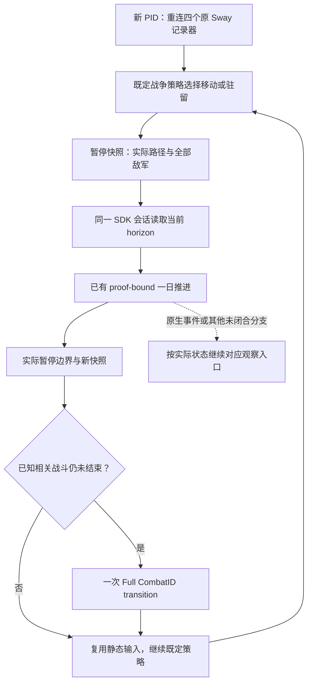

# CK3 1.20.0.3：后台战争观察节奏与一日推进

本节只安排已有查询与推进接口的调用时机，军队目标、开战及战争结算偏好由 Root 的既定策略决定。测试入口仍是 Robert 29829 的原普通战役；所有实际动作由 Root 串行持有，研究和结果消费可以并行。

冻结输入为 CK3 1.20.0.3、Steam build 25652598，EXE SHA-256 `94B55397ABB687A3DCD436805A5D885E6BE90FA6C693FEB44A9E3BBEEADE02A6`。本文读取的生产源树为 `Z:/g34`，源 HEAD `5b2030b09041dbfcea11104e15d155a3b9aac1d6`。

DateRaw 53236608 的两个实际候选路径已经读取：玩家 CUnit 83886367 从 2614 到 2640 的末端到达为 53238744，即 89 天；到 2610 为 53236776，即 7 天。两份 `route_contact_horizon` 都只证明 `[53236608, 53236632]` 的一日范围，`one_day_contact_free=true`。候选路径尚未提交，不能直接作为行军中的推进证明。

已实际读取的 CombatID 1577058305 位于 2640，maneuver/day 0，攻击方为叛军 `[251658381,473,474]`，防御方为其他战争的敌军 `[50331920,83886484]`；Robert 的军队不在这场战斗内。`winner_side=none`、`forced_winner_side=none`、`finalized=false`。同一日期无需再读这份基线。此处只证明原生战斗生命周期查询可用，尚未发生我方参战或战斗完成闭环。

当前最少调用节奏如下：

1. 每个新 PID 的首次推进前，Root 按已冻结 `COLD-REATTACH-CALLS.json` 重新连接 Sway completion/execution/termination/invalidation 四个记录器，仍用原 SchemeID 134217986、目标 34333、cursor 0。无需重发 Start，也无需每个战争观察日重做连接。
2. Root 完成当前策略选择的移动或驻留，并从真实暂停快照确认实际省份、完整路径、目标及全体敌军 FullID。实际移动后需生成当前帧的 horizon；已经归档的候选 horizon 用于解释路线，不能替代提交后的证明。
3. 在一个持续保留的 SDK/driver 会话内，依次执行当前实际目标的 `query-route-contact-horizon-v1-…` 和 `advance-route-contact-horizon-v1-…`。后者复用已有一日 composite：上限原生 24 小时，遇到原生自动暂停则先处理该实际边界。步骤依赖失败后停止这条序列，保持暂停。保留现有策略、能力判定和一日边界，不另加 gate。
4. 一日后的暂停快照是下一轮的输入。当前 2640 战斗会改变随后应对叛军的实际局面，因此在它仍相关且尚未结束时，每个实际推进日最多读取一次 ID-only `ck3_query_battle_transition_v1`；这份日后读取也直接充当下一日的战斗基线。没有日期或实际战斗物质变化时跳过重复读取。
5. 原 CombatID 观察到 finalized 或 combat_not_found 后，归档一次并停止轮询该 ID；combat_not_found 本身不证明哪一方获胜。依据同一暂停快照更新仍存活敌军与位置，再继续现有军事策略。只有新接触、实际参战者/指挥官/地形或部队组成改变并影响决策时，才重新读取较大的 v2 combat inputs；不能把 v2 的 `monte_carlo_ready=false` 写成胜率完成。

所有行动前的 revision 取真实快照。现有 driver 对 horizon 证明同时核对 snapshot ID、公有/native revision、connection generation、episode、全体敌军列表和实际已提交路径；断开客户端、保存或其他操作产生新帧后，应按实际帧重新取得证明。不能把候选 horizon、旧日期或旧连接的结果跨日复用成动作授权。驻留时的目标必须是军队当前所在省份，而非此前仅预览过的另一个目标。

减少成本的落点是复用静态与同帧材料：版本/EXE/DLL、原生树、静态测试、已核验 schema 和只读宗教查询不进入每日军事循环；不要每天重新启动 SDK、全量工具列表、全量历史或截图。每轮只保留实际需要的新快照、当前 horizon、一个一日推进及相关战斗状态。正常 checkpoint 放在本次可交付行动批次或退出会话前；单个只读叶子查询无需独立再存一次。旧 GREEN/RED 直接引用，不重复跑验收。

现有 managed controller 使用 `--start-minimized` 并每 0.5 秒检查最小化状态；它负责无需激活的最小化。上述流程均用 native/MCP，不增加桌面输入、截图、窗口恢复或焦点操作。并行代理继续读取冻结输入、逆向原生决策树、消费新 artifact；Root 独占游戏和依赖动作顺序。

`root_sdk_capture_continue.py` 的当前形式会在独立调用失败后继续，且固定 `--expected-date` 会拒绝推进后的日期。它可继续用于独立只读查询；推进序列应由 Root 以依赖顺序执行和记录，正常观察日期进展，不能原样套用该捕获器来串联动作。

准备好的逐项参数见外部 `battle-observation-schedule/DEPENDENT-ONE-DAY-RECIPES.json`，日后战斗只读参数见 `POST-DAY-BATTLE-CALLS.json`。两者是未执行配方，未选择移动目的地，未推进日期，也不构成完整战争 loop。实机证据与源文件 SHA 列于 `SOURCE-EVIDENCE.json`；Root 采纳时应与当天/当周报告同步记录实际执行结果。

研究状态：现有路线/战斗叶子查询为 `production-live primitive`；本调用节奏和配方为 `research / prepared-only`，待 Root 执行首个一日批次。当前配方未修改生产代码或增加运行 flags，未宣称我方战斗或整局闭环完成。

## 2026-10-03: later Root movement result

The earlier candidate/recommendation frame above is retained. Root subsequently completed the paused order to2610 and independent target/route readback; see the [dated actual synthesis](robert-post-refusal-military-actual-2026-10-03.md) and [movement postconditions](war-movement-1.20.0.3-readiness-2026-10-03.md). Current province remains2614, with target2610/route`[2610]`, moving; no day or arrival is credited. The first actual one-day slice remains pending. This dated result supersedes earlier pending Root-order wording while preserving each author's zero-action fact.
