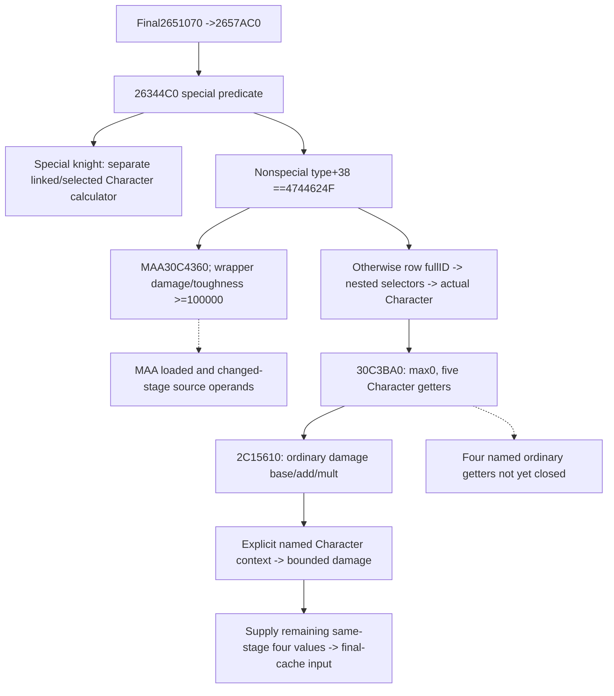

# Ordinary and MAA changed-stage Entry stats, exact 1.20.0.3

Frozen CK3 1.20.0.3, Steam build 25652598, EXE SHA256
94B55397ABB687A3DCD436805A5D885E6BE90FA6C693FEB44A9E3BBEEADE02A6.
This package separates the Regiment getter's selected Character and MAA paths
from person preparation and the six-field final-cache setter. Its first bounded
primitive evaluates ordinary damage at an explicitly named supplied context.
The other four ordinary values and complete MAA stage inputs remain work in
progress; current observed tuples are not changed-stage predictions.

The source-first plan, Mermaid and query plan were sealed before new source
reads at the external packet
`Z:/ck3_mod_rewrite_process_assets/g2-background-round5-20261006/ordinary-maa-stat-inputs/`.
`PLAN.json`, `SOURCE-TREE.md`, `DAMAGE-PLAN.json` and `DAMAGE-SOURCE-TREE.md`
reuse cached final-side and setter source. Three exact `.pdata` bodies close
`[26344C0,263471B)` 603 bytes, `[30C3BA0,30C3C42)` 162 bytes and
`[2C15610,2C158BC)` 684 bytes. The prior v56 damage capture was only a 512-byte
prefix ending at 2C15810, before the final product and return. No game,
process, SDK, pipe or desktop operation was used. No full EXE scan or rehash.

## Selection and consumption

26344C0 first uses the existing 2634880 special predicate. The special knight
path remains owned by the [final-refresh module](battle-first-contact-final-stat-refresh-12003.md).
For a nonspecial Regiment, type DWORD+38 equal to 4744624F selects the MAA
30C4360 branch. Its returned damage and toughness are signed-clamped to at
least Q=100000; other fields are copied. This is the final wrapper, not closure
of 30C4360's source arithmetic.

The nonmatching type branch selects the first Regiment+20 row ID when its
count+2C is nonzero, else full ID -1. It resolves through table5D1EB68 and
actual fallback5D1EB58 with object full-ID+10 equality. If object+130 is -1,
object+12C becomes the Character ID. If +130 is present and +12C is also
present, Character ID is -1. If +130 is present while +12C is -1, it resolves
that ID through table5D1DAF8/fallback5D1DAE0 and takes object+128. The result
is resolved as full Character+18 through table5C67568/fallback5C67570, then
passed to 30C3BA0. These offsets are identities and selection operands; their
business names are not inferred. Army owner, commander, primary participant
and a selected Character are distinct inputs.

30C3BA0 starts all six fields at zero, then reads damage2C15610,
toughness2C158C0, siege2C15B70, pursuit2C15E20 and screen2C160D0 using this
selected Character. Ordinary max_size is real zero. It does not consume the
Province argument.

## Closed ordinary damage

2C15610 calls Character context getter28C3AE0. It reads aggregate U16 keys at
context+68, signed count+74 and signed Q64 values+ D0. The sparse lookup is
the same lower-bound family as the existing typed person context reader.
It consumes only the aggregate; weighted rows and prowess are not inputs.
The loaded base is signed Q64 QWORD[5C69BC0]. It adds aggregate propertyB0,
then multiplies by wrap64(Q+aggregate property1B3), dividing by Q toward zero.
Both property/Q identity steps and additions preserve signed64. The product
uses the native fast path within the 3037000499 range, otherwise decomposes
the signed maximum operand, preserves low64 products and truncates toward
zero. This matches the already source-closed dedicated knight-effectiveness
fixed multiplication helper, which is reused. Zero and negative outputs are
kept; there is no MAA floor in this branch.

`battle_ordinary_regiment_stats_12003.py` exposes the typed named-stage
calculator, an adapter for existing normalized person raw_numeric_inputs
as frozen current, an adapter for PersonStatStage12003, and a final-cache
input assembler preserving side/bucket occurrence, full Army/Regiment IDs,
Combat Province and final-side call site. Missing base/context/remaining four
values produce a partial input. A supplied complete tuple stays explicitly
conditional; this package does not claim to have executed person preparation.

Minimal same-MCP collector dependency: publish signed Q64 loaded base from
5C69BC0 as `ordinary_stat_loaded_bases_v1.damage_raw`, with independently
observed availability, and publish the selected Character full ID from the
actual Regiment selector. Reuse its existing raw_numeric_inputs.context;
do not substitute the side primary, owner or selected commander context.
The subsequent four exact named getters determine the remaining loaded-base
fields and property IDs before expanding this observer. This follows the
ordinary source rather than introducing another person preparation model.

Readiness: ordinary damage primitive and caller-supplied final-cache input
are static-ready after their single focused case. Full ordinary source-derived
six tuple, MAA changed-stage calculation, complete first-contact Entry and
live qualification remain partial. Next work closes the four named getters
and 30C4360 before their required same-MCP source observer.

The one new focused Python case passed 1/1 GREEN once on 2026-10-06 in
0.003 seconds. It covers distinct supplied current/changed aggregate contexts,
native negative truncation, legitimate zero versus missing base, large-product
decomposition and usable complete/partial final-cache inputs. The production
consumer was loaded from the Root integrated source tree. Receipt:
`ordinary-maa-stat-inputs/focused-damage-once/RESULT.json`. No old case, native
build or game operation was performed by this package.

## Source-closed remaining ordinary getters and observer plan

The four remaining `.pdata` bodies each contain 684 bytes. Comparing their
complete instruction shape with the manually reviewed damage body shows only
the loaded-base RIP displacement and the two U16 property keys differ. The
native body uses exactly these parameters, including the nonsequential siege
multiplier and the swapped pursuit/screen base addresses:

| Stat | Getter | Signed Q64 loaded base | Add key | Mult key |
|---|---|---|---|---|
| damage | 2C15610 | 5C69BC0 | B0 | 1B3 |
| toughness | 2C158C0 | 5C69BC8 | B1 | 1B4 |
| siege | 2C15B70 | 5C69BD0 | B2 | 1B2 |
| pursuit | 2C15E20 | 5C69BE0 | B3 | 1B5 |
| screen | 2C160D0 | 5C69BD8 | B4 | 1B6 |

`ORDINARY-FIVE-GETTER-SOURCE.json` binds the full bodies and exact parameters.
`ORDINARY-COLLECTOR-PLAN.json`, its rendered Mermaid and
`ORDINARY-QUERY-PLAN-CLOSED.json` were sealed before expanding the model and
observer. No person preparation process is duplicated. The minimal source leaf
is optional `Regiment.ordinary_stat_inputs_v1`: actual selected Character full
ID/resolution, aggregate property keys/count/Q64 values, the five loaded bases,
scale and independent status/reason. It is present for the actual ordinary
nonspecial/nonGDbo branch only. Its base source does not depend on a target
Province; a conditional changed context must be explicitly supplied.

The MAA30C4360 `.pdata` extent is `[30C4360,30C50AD)`,3405 bytes. Its metadata
was read without sampling code because it exceeds the first narrow body limit.
The known exact body and its actual next operands are the separate next source
package. The ordinary branch now has all five arithmetic sources closed; MAA
source arithmetic remains partial.

The full ordinary six-stat calculator is implemented with the exact parameter
table above. `ordinary_six_stats_from_combat_regiment_12003` consumes the new
normalized same-query source leaf as frozen current;
`ordinary_six_stats_from_person_stage_12003` consumes an explicitly named
prepared or intermediate PersonStatStage with the observed loaded bases.
`ordinary_six_stats_to_final_stat_input_12003` connects all six source-derived
values to the existing occurrence-bound final setter. It never constructs
person context from trait flags or guesses a prior stage. Ordinary max_size
is the source-established zero; the other five outputs preserve negatives.

The native observer uses the existing Regiment loop and actual selector chain,
calls the already-bound readonly28C3AE0 getter for the selected Character,
copies only its aggregate and the five loaded globals, and leaves target query
readiness independent. Full generation resolution and actual native fallback
are separate `character_resolution` values; a selected fallback's actual full
ID -1 is retained. Only the exact `.3` adapter installs its bindings, while
the unchanged `.2` binder omits this leaf. No new whole-person observer or
preparation process was introduced.

One new focused Python case passed 1/1 GREEN once in 0.136 seconds on Oct6.
It uses the production strict normalizer, evaluates all five exact getter
parameters, supplies a distinct changed context and final side1 input, and
preserves available zero/empty versus independent missing base. Receipt:
`ordinary-maa-stat-inputs/focused-six-stat-once/RESULT.json`. The earlier
damage case was not rerun. The new native target is
`xar_ck3_12003_ordinary_stat_inputs_test`; its seven fresh production-wire
cases cover direct/nested selection, actual Character fallback, native empty
first row, unavailable context/base, zero/empty and MAA/special omission.
Root owns its first build/CTest and wire consumption. This owner has not
compiled native code. The pure source-derived ordinary six tuple is
static-ready; native source observer qualification, MAA and complete Entry
remain pending. Game operations and added game days are zero.

## Ordinary six-stat production qualification (2026-10-06T01:22:10+08:00)

Exact `3fb869c751d9050caffa790716a332ca71238c1a` fullDLL/new ordinary target builds GREEN; first ordinary CTest GREEN0.09s. All7 new real serializer wires pass production strict normalizer → source-derived six-stat adapter → typed FinalEntryStatInput. SERIALIZER-PROJECTION.json and literal production_regiment_serializer.cpp are metadata, excluded from wire count. The first consumer attempt used request index2 as a ProvinceID; the strict production normalizer rejected the actual generation-qualified ID mismatch. That harness RED is preserved. Only the failed direct case was reread after using source_target_province_id/current initialization ProvinceID; the six unexecuted wires were consumed once. No native rebuild, model change, old initial3/damage/six synthetic repeat. NEW-ORDINARY-WIRE-CONSUMER-OCT6.json pins7wire and4production-file hashes. Ordinary current/explicit-person-stage projection is static-ready; MAA source/pure arithmetic and full Entry are separate remaining increments.
