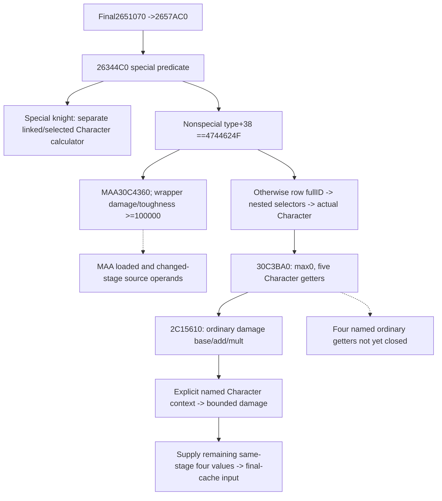
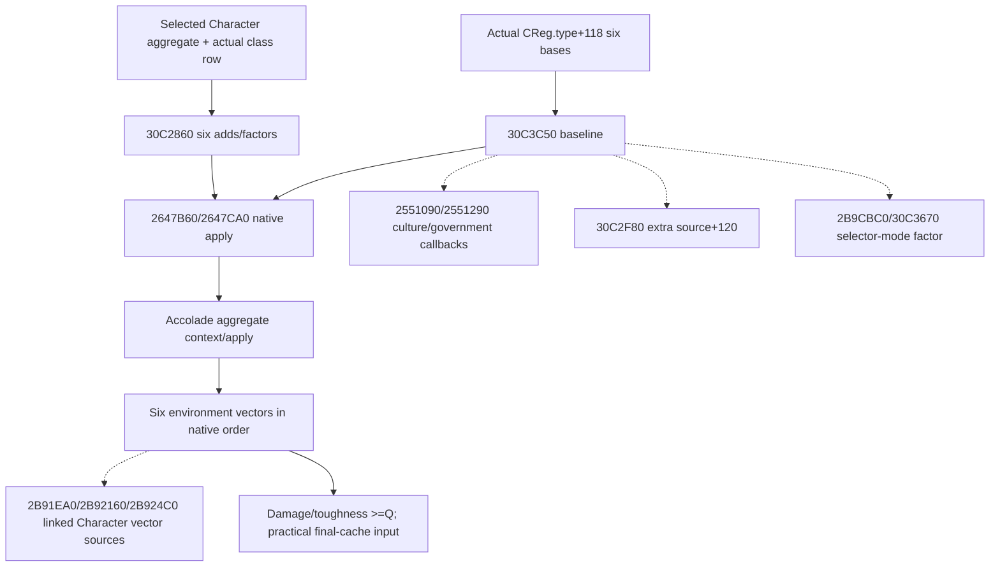
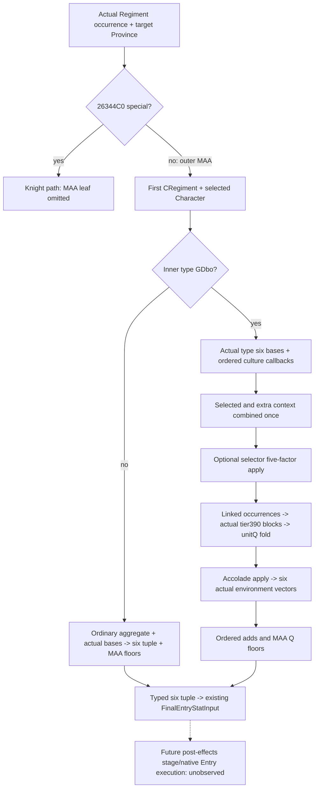

# Ordinary and MAA changed-stage Entry stats, exact 1.20.0.3

Frozen CK3 1.20.0.3, Steam build 25652598, EXE SHA256
94B55397ABB687A3DCD436805A5D885E6BE90FA6C693FEB44A9E3BBEEADE02A6.
This package separates the Regiment getter's selected Character and MAA paths
from person preparation and the six-field final-cache setter. All five ordinary
getter formulas are closed and usable at an explicitly named supplied context.
The MAA baseline construction and linked Character additions remain work in
progress; current observed tuples are not changed-stage predictions.

The source-first plan, Mermaid and query plan were sealed before new source
reads at the external packet
`Z:/ck3_mod_rewrite_process_assets/g2-background-round5-20261006/ordinary-maa-stat-inputs/`.
`PLAN.json`, `SOURCE-TREE.md`, `DAMAGE-PLAN.json` and `DAMAGE-SOURCE-TREE.md`
reuse cached final-side and setter source. Three exact `.pdata` bodies close
`[26344C0,263471B)` 603 bytes, `[30C3BA0,30C3C42)` 162 bytes and
`[2C15610,2C158BC)` 684 bytes. The prior v56 damage capture was only a 512-byte
prefix ending at 2C15810, before the final product and return. No game,
process, SDK, pipe or desktop operation was used. No full EXE scan or rehash.

## Selection and consumption

26344C0 first uses the existing 2634880 special predicate. The special knight
path remains owned by the [final-refresh module](battle-first-contact-final-stat-refresh-12003.md).
For a nonspecial Regiment, type DWORD+38 equal to 4744624F selects the MAA
30C4360 branch. Its returned damage and toughness are signed-clamped to at
least Q=100000; other fields are copied. This is the final wrapper, not closure
of 30C4360's source arithmetic.

The nonmatching type branch selects the first Regiment+20 row ID when its
count+2C is nonzero, else full ID -1. It resolves through table5D1EB68 and
actual fallback5D1EB58 with object full-ID+10 equality. If object+130 is -1,
object+12C becomes the Character ID. If +130 is present and +12C is also
present, Character ID is -1. If +130 is present while +12C is -1, it resolves
that ID through table5D1DAF8/fallback5D1DAE0 and takes object+128. The result
is resolved as full Character+18 through table5C67568/fallback5C67570, then
passed to 30C3BA0. These offsets are identities and selection operands; their
business names are not inferred. Army owner, commander, primary participant
and a selected Character are distinct inputs.

30C3BA0 starts all six fields at zero, then reads damage2C15610,
toughness2C158C0, siege2C15B70, pursuit2C15E20 and screen2C160D0 using this
selected Character. Ordinary max_size is real zero. It does not consume the
Province argument.

## Closed ordinary damage

2C15610 calls Character context getter28C3AE0. It reads aggregate U16 keys at
context+68, signed count+74 and signed Q64 values+ D0. The sparse lookup is
the same lower-bound family as the existing typed person context reader.
It consumes only the aggregate; weighted rows and prowess are not inputs.
The loaded base is signed Q64 QWORD[5C69BC0]. It adds aggregate propertyB0,
then multiplies by wrap64(Q+aggregate property1B3), dividing by Q toward zero.
Both property/Q identity steps and additions preserve signed64. The product
uses the native fast path within the 3037000499 range, otherwise decomposes
the signed maximum operand, preserves low64 products and truncates toward
zero. This matches the already source-closed dedicated knight-effectiveness
fixed multiplication helper, which is reused. Zero and negative outputs are
kept; there is no MAA floor in this branch.

`battle_ordinary_regiment_stats_12003.py` exposes the typed named-stage
calculator, an adapter for existing normalized person raw_numeric_inputs
as frozen current, an adapter for PersonStatStage12003, and a final-cache
input assembler preserving side/bucket occurrence, full Army/Regiment IDs,
Combat Province and final-side call site. Missing base/context/remaining four
values produce a partial input. A supplied complete tuple stays explicitly
conditional; this package does not claim to have executed person preparation.

Minimal same-MCP collector dependency: publish signed Q64 loaded base from
5C69BC0 as `ordinary_stat_loaded_bases_v1.damage_raw`, with independently
observed availability, and publish the selected Character full ID from the
actual Regiment selector. Reuse its existing raw_numeric_inputs.context;
do not substitute the side primary, owner or selected commander context.
The subsequent four exact named getters determine the remaining loaded-base
fields and property IDs before expanding this observer. This follows the
ordinary source rather than introducing another person preparation model.

Readiness: ordinary damage primitive and caller-supplied final-cache input
are static-ready after their single focused case. Full ordinary source-derived
six tuple, MAA changed-stage calculation, complete first-contact Entry and
live qualification remain partial. Next work closes the four named getters
and 30C4360 before their required same-MCP source observer.

The one new focused Python case passed 1/1 GREEN once on 2026-10-06 in
0.003 seconds. It covers distinct supplied current/changed aggregate contexts,
native negative truncation, legitimate zero versus missing base, large-product
decomposition and usable complete/partial final-cache inputs. The production
consumer was loaded from the Root integrated source tree. Receipt:
`ordinary-maa-stat-inputs/focused-damage-once/RESULT.json`. No old case, native
build or game operation was performed by this package.

## Source-closed remaining ordinary getters and observer plan

The four remaining `.pdata` bodies each contain 684 bytes. Comparing their
complete instruction shape with the manually reviewed damage body shows only
the loaded-base RIP displacement and the two U16 property keys differ. The
native body uses exactly these parameters, including the nonsequential siege
multiplier and the swapped pursuit/screen base addresses:

| Stat | Getter | Signed Q64 loaded base | Add key | Mult key |
|---|---|---|---|---|
| damage | 2C15610 | 5C69BC0 | B0 | 1B3 |
| toughness | 2C158C0 | 5C69BC8 | B1 | 1B4 |
| siege | 2C15B70 | 5C69BD0 | B2 | 1B2 |
| pursuit | 2C15E20 | 5C69BE0 | B3 | 1B5 |
| screen | 2C160D0 | 5C69BD8 | B4 | 1B6 |

`ORDINARY-FIVE-GETTER-SOURCE.json` binds the full bodies and exact parameters.
`ORDINARY-COLLECTOR-PLAN.json`, its rendered Mermaid and
`ORDINARY-QUERY-PLAN-CLOSED.json` were sealed before expanding the model and
observer. No person preparation process is duplicated. The minimal source leaf
is optional `Regiment.ordinary_stat_inputs_v1`: actual selected Character full
ID/resolution, aggregate property keys/count/Q64 values, the five loaded bases,
scale and independent status/reason. It is present for the actual ordinary
nonspecial/nonGDbo branch only. Its base source does not depend on a target
Province; a conditional changed context must be explicitly supplied.

The MAA30C4360 `.pdata` extent is `[30C4360,30C50AD)`,3405 bytes. Its metadata
was read without sampling code because it exceeds the first narrow body limit.
The known exact body and its actual next operands are the separate next source
package. The ordinary branch now has all five arithmetic sources closed; MAA
source arithmetic remains partial.

The full ordinary six-stat calculator is implemented with the exact parameter
table above. `ordinary_six_stats_from_combat_regiment_12003` consumes the new
normalized same-query source leaf as frozen current;
`ordinary_six_stats_from_person_stage_12003` consumes an explicitly named
prepared or intermediate PersonStatStage with the observed loaded bases.
`ordinary_six_stats_to_final_stat_input_12003` connects all six source-derived
values to the existing occurrence-bound final setter. It never constructs
person context from trait flags or guesses a prior stage. Ordinary max_size
is the source-established zero; the other five outputs preserve negatives.

The native observer uses the existing Regiment loop and actual selector chain,
calls the already-bound readonly28C3AE0 getter for the selected Character,
copies only its aggregate and the five loaded globals, and leaves target query
readiness independent. Full generation resolution and actual native fallback
are separate `character_resolution` values; a selected fallback's actual full
ID -1 is retained. Only the exact `.3` adapter installs its bindings, while
the unchanged `.2` binder omits this leaf. No new whole-person observer or
preparation process was introduced.

One new focused Python case passed 1/1 GREEN once in 0.136 seconds on Oct6.
It uses the production strict normalizer, evaluates all five exact getter
parameters, supplies a distinct changed context and final side1 input, and
preserves available zero/empty versus independent missing base. Receipt:
`ordinary-maa-stat-inputs/focused-six-stat-once/RESULT.json`. The earlier
damage case was not rerun. The new native target is
`xar_ck3_12003_ordinary_stat_inputs_test`; its seven fresh production-wire
cases cover direct/nested selection, actual Character fallback, native empty
first row, unavailable context/base, zero/empty and MAA/special omission.
Root owns its first build/CTest and wire consumption. This owner has not
compiled native code. The pure source-derived ordinary six tuple is
static-ready; native source observer qualification, MAA and complete Entry
remain pending. Game operations and added game days are zero.

## Ordinary six-stat production qualification (2026-10-06T01:22:10+08:00)

Exact `3fb869c751d9050caffa790716a332ca71238c1a` fullDLL/new ordinary target builds GREEN; first ordinary CTest GREEN0.09s. All7 new real serializer wires pass production strict normalizer → source-derived six-stat adapter → typed FinalEntryStatInput. SERIALIZER-PROJECTION.json and literal production_regiment_serializer.cpp are metadata, excluded from wire count. The first consumer attempt used request index2 as a ProvinceID; the strict production normalizer rejected the actual generation-qualified ID mismatch. That harness RED is preserved. Only the failed direct case was reread after using source_target_province_id/current initialization ProvinceID; the six unexecuted wires were consumed once. No native rebuild, model change, old initial3/damage/six synthetic repeat. NEW-ORDINARY-WIRE-CONSUMER-OCT6.json pins7wire and4production-file hashes. Ordinary current/explicit-person-stage projection is static-ready; MAA source/pure arithmetic and full Entry are separate remaining increments.

## MAA closed arithmetic and actual remaining operands

The complete body `[30C4360,30C50AD)` uses actual CRegiment.type+118,
selected Character from +12C/+130, extra source+120 and supplied Province.
30C3C50 starts from the type's max_size DWORD+270 and Q64 siege+278,
damage+280, toughness+288, pursuit+290 and screen+298. It adds culture and
government callbacks, applies Character aggregate/class modifiers and +120
modifiers, then conditionally applies the selector-mode factor. A frozen final
getter tuple cannot be used as this baseline because these steps would repeat.

30C2860 selects a class row of stride58 from MaaRules+EF0/count+EFC using
type.class+260. Its six additive U16 keys are row+28..32 and multiplier keys
row+34..3E. Actual absent class row skips these keys. FFFF is real sentinel zero.
Generic keys, in the native stat order, are:

| Stat | Generic add | Generic multipliers |
|---|---|---|
| max_size | none | none |
| siege | 1BF | 1C0, 1B2 |
| damage | 1B7 | 1B8, 1B3 |
| toughness | 1B9 | 1BA, 1B4 |
| pursuit | 1BB | 1BC, 1B5 |
| screen | 1BD | 1BE, 1B6 |

The caller initializes six adds to zero and six factors to Q. Class and generic
aggregate values are added with signed64 wrap. 2647B60/leaf2647CA0 then apply
these scratch operands to the six-field cache. max_size first multiplies its
signed32 value by Q, adds its Q64 scratch add, performs the source-established
maximum-operand fixed multiplication, divides by Q again toward zero and
stores low32. The other five fields use one fixed multiplication after their
add. There is no floor at this application step.

30C4360 applies the accolade aggregate with the same context/apply pair, then
adds actual six-field vectors in this order: type terrain30BDC80, guarded
definition620 map30BDD20, Province class30BDDC0, linked Character terrain
2B91EA0, guarded linked definition2B92160, linked Province2B924C0. max_size
additions wrap32, the other five wrap64. The definition+620 validGDbo guard
selects both definition terms together. Final damage and toughness alone are
signed-floored to Q; max_size, siege, pursuit and screen retain zero/negatives.
An actual absent guarded definition term differs from an unread required term.

Source bodies, the no-pdata leaf windows and jump-table bytes are frozen in the
external packet. `MAA-PRIMITIVE-PLAN.json` and its Mermaid were sealed before
the bounded arithmetic model; `MAA-MINIMAL-QUERY-PLAN.json` lists the exact same
MCP input fields and remaining callees. Closed arithmetic may consume explicitly
supplied named-stage operands. It cannot claim complete getter construction or
first-contact readiness until the dashed dependencies and their observation
sources are supplied. No person preparation process is duplicated.

`battle_maa_regiment_stats_12003.py` exposes typed scratch/apply/end-stage
results and `maa_six_stats_to_final_stat_input_12003`, preserving the existing
men_at_arms bucket, occurrence identity and final-side call site. Missing
required vectors stay partial; genuine empty aggregate and absent class row
produce zero adds and Q factors. The one new focused Python case passed 1/1
GREEN once in 0.005 seconds on Oct6, using the integrated final-cache consumer.
It covers loaded class keys/FFFF, native max_size double division, signed
negative truncation, large fixed multiplication, low32 max wrap, ordered adds,
the paired definition guard, final damage/toughness floor and complete/partial
consumer inputs. Receipt: `focused-maa-arithmetic-once/RESULT.json`. No earlier
case, native compilation or game operation was repeated. This bounded arithmetic
is static-ready; complete MAA source construction and first-contact readiness
remain partial, with the dashed actual dependencies continuing next.

## Ordinary source observer qualification, Oct6

Root source `3fb869c751d9050caffa790716a332ca71238c1a` passed the central
native build in 8.016 seconds, then the three new targets passed their first
CTest 3/3 in 0.39 seconds. Only the seven newly emitted ordinary wires were
consumed through Root's production strict normalizer, all five exact source
getters plus max0, and the practical final-cache input. Qualification is GREEN
7/7 at Oct6 01:17 Shanghai, preserving direct/nested/fallback identity,
unavailable context/base, actual empty zero and independent target readiness.
`SERIALIZER-PROJECTION.json` and the generated literal serializer source are
build metadata and were excluded. Receipt:
`ordinary-maa-stat-inputs/NEW-ORDINARY-WIRE-CONSUMER-OCT6.json` binds all seven
wire hashes and the actual production consumer file hashes.

The first consumer attempt incorrectly supplied request Province index2 to
the normalizer instead of the actual serialized target ProvinceID; it stopped
on the first direct wire. This harness RED is retained in
`NEW-ORDINARY-CONSUMER-ATTEMPT-01-RED.json`. Root authorized the necessary
correction. The direct wire was read twice across those attempts, the other
six once; no earlier passed case or wire was repeated and no native rebuild
was needed. This is synthetic production path qualification and static-ready
ordinary observation/calculation, with no live or complete Entry credit.

## Source-shaped MAA baseline construction inputs

The next actual source package closes 2551090/2551290, the split unwind
fragments of 30C2F80 and 2B91EA0/2B92160/2B924C0, 30C3460,
30C3670, 2B9CBC0, 2B8FCF0 and the 262D050 leaf. Source-first plan and
same-MCP fields are in `MAA-BASELINE-MODEL-PLAN.json`, its Mermaid and
`MAA-BASELINE-OBSERVER-QUERY-PLAN.json`. The short first unwind rows of
several helpers do not contain their return; all reached fragments are used.
No entry prefix is reread to close these continuations.

Culture government callbacks iterate definition+7C8/count+7D4 rows of
stride48; global callbacks use definition+FE0/count+FEC with the same shape.
A row is added when its definition+40 has a nonGDbo tag or its pointer equals
the selected MAA type, and row signed class+38 is -1 or equals type.class+260.
All matching rows contribute, preserving pointer-array order and row order,
with max_size wrap32 and the five Q64 fields wrap64. Debug branches are skipped.

The actual extra+120 object provides context+30 and Title fullID+738. Its
native resolved holder2C42950 supplies piety rank28BE0D0, whose existing
source contract is reused. Actual class absence returns before consuming this
object. With a class row, max_size has no generic or class extra keys; five
stats use these exact source fields:

| Stat | Extra generic add/mult | Class add/mult offsets | Rank multiplier |
|---|---|---|---|
| siege | 1C9 / 1CA | 40 / 4A | none |
| damage | 1C1 / 1C2 | 42 / 4C | 1CB times piety rank |
| toughness | 1C3 / 1C4 | 44 / 4E | 1CC times piety rank |
| pursuit | 1C5 / 1C6 | 46 / 50 | none |
| screen | 1C7 / 1C8 | 48 / 52 | none |

The cached raw mapper/jump tables in `EXTRA-MAPPER-TABLES.json` establish
index0's skip. Selected Character and extra scratch values are combined into
the same six adds/factors before one2647B60 apply. They are not two successive
multiplications. When selector_mode is true, 2B9CBC0 returns Q for government
byte+4D6 other than5; otherwise it evaluates real scriptvalue ID4E in the
selected Character scope and floors the result at zero. 30C3670 replaces
only the five nonmax factors with that result, leaving max_size factorQ, then
the caller performs a second native apply. A script evaluator result supplied
for another context must carry an explicit named-stage provenance.

262D050 resolves CRegiment+28 to actual ArRg, then ArRg+140 to actual CArmy.
The Army+38/count+44 Regiment occurrence order supplies +148 linked Characters.
Each actual accolade row+58/count+64 has level+8 and definition+10 of stride18;
2B8FCF0 selects `(level-1)*5F8` from definition+3C0, or its real initialized
fallback. Terrain/definition/Province tier class maps are at+570/+598/+5C0.
All matching rows contribute; linked occurrences are not deduplicated. The
actual class maps and initialized fallback values must be observed, not
replaced with presumed zero. Accolade tier+390 aggregate modifiers apply after
the completed baseline, before the six ordered environment components.

These are baseline and getter input construction steps. They reuse supplied
named person stages and actual source fields, without reconstructing person
preparation or equating the final current tuple to its own baseline.

`battle_maa_source_stages_12003.py` now builds the culture contribution stage,
combines selected Character and actual extra source modifiers before one
application, applies the optional selector factor to five fields, and applies
the ordered accolade aggregate after the baseline. These typed results feed
the existing ordered environment/end-stage calculator and final-cache input.
The actual source tuples and script evaluator result remain explicitly supplied
named-stage inputs; no historical or executed native construction is claimed.

The single new baseline case reached an import-time syntax RED caused by an
extra patch character. Its receipt remains `focused-maa-baseline-once/RESULT.json`.
After the local correction, the same failed new case passed1/1 GREEN in
0.009 seconds at `focused-maa-baseline-fixed-once/RESULT.json`. It covers both
native callback filters, skipped unread row operands, context/extra combination
before multiplication, piety terms, the five-field selector factor with legal
zero versus missing, absent class skip, accolade application and the existing
final-cache input. Earlier passed cases and wires were not rerun. This is
static-ready conditional baseline construction. The same-MCP raw source observer
listed in the sealed query plan is the next implementation dependency.

## Actual MAA same-query source leaf (2026-10-06)

The existing combat-input Regiment loop now publishes optional
`maa_stat_inputs_v1` for the native non-special MAA dispatch. It retains
target ProvinceID, actual first CRegiment full ID, selected Character full ID
and generation/fallback resolution. Its status is independent of
`effective_stats` and existing query readiness. Special/knight rows omit
this leaf, matching26344C0 dispatch before30C4360.

The leaf contains actual inner type+118, class+260, six bases+270/+278..298,
selected aggregate properties, six class word pairs, ordered culture callback
rows with source pointer/class admission, extra+120 context+30/title+738,
resolved holder/piety rank, five extra class word pairs, government byte+4D6,
actual2B9CBC0 current selector factor, ordered linked Character occurrences,
eligible actual tier+390 property blocks, and six type/linked environment
vectors. It calls readonly getters, never the30C3C50/30C4360 writers or person
preparation.

The30C3C50 government-index gate admits **both** culture callbacks only when
the signed government index is within Culture+694. Outside that range, both
arrays are real empty even if the global source array is nonempty. Rejected
callback rows keep native filter metadata; their stat tuple is absent because
the source branch does not read it. An absent class row skips the complete
extra-source read. Actual zero/empty/branch skips remain valid; failed necessary
reads have independent unavailable status.

Readonly30BDC80/30BDD20/30BDDC0 and2B91EA0/2B92160/2B924C0 copy actual returned
environment vectors, retaining initialized native fallback values and actual
loaded Province-class thresholds. The Province+620 GDbo guard skips both
definition vectors. Linked census uses the source Char+1C magic and initialized
full-ID predicate, preserving duplicate occurrences. Accolade aggregate
construction skips the complete group if any definition fails the source GDbo
precheck, then copies eligible tier property blocks in occurrence/row order.
The inner-type non-GDbo branch instead supplies ordinary bases and selected
properties; its pure ordinary six tuple receives the outer MAA Q floors.

`battle_maa_observed_inputs_12003.py` exposes
`maa_six_stats_from_combat_regiment_12003`. It joins closed baseline,
the existing logical unit-Q property fold for fresh11E1350 accolade scratch,
the accolade apply and six ordered environment adds/floors. It connects to
`maa_six_stats_to_final_stat_input_12003` and existing Entry refresh input.
A ready result sets `full_getter_construction_ready=true`;
`full_entry_ready` remains false. This is a frozen current source-derived
getter, not a future post-effect or historical initializer cache. Changed-stage
person/extra/script/culture/environment operands remain explicit in the lower
typed APIs; current source values are not silently substituted.

The source/model tree and minimum query plan were sealed before implementation
in external `MAA-BASELINE-MODEL-PLAN.json`,
`MAA-BASELINE-MODEL-TREE.md` and
`MAA-BASELINE-OBSERVER-QUERY-PLAN.json`. This implementation adds no EXE
read. It reuses exact .3 cached closures and the existing property-fold source.

One new focused offline Python case passed **1/1 once, 0.207 s**:
strict normalized actual groups -> duplicate accolade contributions -> six
stats -> existing final-input adapter. It also covers inner ordinary fallback,
real empty arrays and independent unavailable status. Receipt:
`Z:/ck3_mod_rewrite_process_assets/g2-background-round5-20261006/ordinary-maa-stat-inputs/focused-maa-observed-once/RESULT.json`.
No old passed case or wire was rerun. New native target
`xar_ck3_12003_maa_stat_inputs_test` prepares five literal production
serializer wires under `ck3_12003_maa_stat_inputs_wire`; the child did not
compile it. Central build, first new CTest and new-wire production consumption
remain pending. Pure consumer is static-ready; no live or game-day claim.

### First new native/production-wire qualification (2026-10-06 02:17)

Root adopted the baseline as3678bd12 and observer asb1a2e118. Central exact
source `47ecd200e6ef72d46c4d58e1ed7378a76aebae21` passed the full DLL
and five new targets in195.8294221 seconds. The new MAA CTest first passed
in0.10 seconds; the five distinct new targets passed5/5 in2.75 seconds at
2026-10-05T18:16:47UTC. The child performed no native build or rerun.

After explicit Root authorization, only the five newly emitted MAA files
were read once each: `full_sources.json`, `class_absent.json`,
`inner_ordinary_fallback.json`, `unavailable_selected_context.json`
and `native_government_definition_skips.json`. Serializer metadata and
literal C++ were excluded. All five passed the actual Root production Regiment
normalizer -> source-derived six-stat adapter -> existing FinalEntryStatInput
consumer, **5/5 GREEN in0.05907099997 seconds**, completed
2026-10-06T02:17:40.293892+08:00. Native and consumer source commits both
equal47ecd200e6ef72d46c4d58e1ed7378a76aebae21.

The full-source cache is (104,50000,167019,150000,200000,250000). Actual class
absence skips extra inputs; inner ordinary fallback preserves pursuit-1 while
applying the two Q floors; invalid government and definition guards preserve
valid empty/omitted source branches. The unavailable selected context produces
no modeled tuple while retaining the original available target query. All
four complete source cases set full_getter_construction_ready, without
promoting them to executed Entry or future post-effect observations.

Receipt `NEW-MAA-WIRE-CONSUMER-OCT6.json` in the external round5
ordinary-maa-stat-inputs packet binds all five file SHA256/read counts and
seven actual production consumer module SHA256 values. Old wire reads,
old passed case reruns, game operations and child native builds are all0.
Current MAA getter sources and their pure production consumption are now
static-ready, including actual accolade/environment operand groups.

The Entry owner confirmed there is no separate current accolade/environment
field gap after this same-Province six tuple is available. The remaining
frontier is outer post247AB1F stage assembly feeding247AB32/41: actual complete
person stage, changed selected/extra/selector inputs where a modeled operation
changes them, and correct Combat+6B8 Province provenance. Changed tier, linked
census or environment data require explicit named-stage replacements only
when actually changed.2650A80 Side+110 aggregate is distinct from30C4360's
fresh11E1350 scratch; no source consumer edge permits substituting one for the
other. Existing source/qualification is reused; no current source is reopened.
