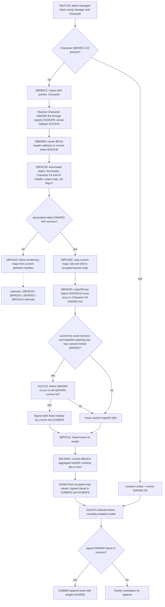

# Person absent-1C8 recipient scalar, exact 1.20.0.3

This source-first packet closes a useful current-value branch of the earlier
`291F0A0` managed family. It does not supply a stage-start baseline, reconstruct
the complete person suffix, update a Character, or establish actual Entry
effectiveness. No game operation was performed.

The frozen executable is Steam build `25652598`, version `1.20.0.3`, recorded
SHA-256 `94B55397ABB687A3DCD436805A5D885E6BE90FA6C693FEB44A9E3BBEEADE02A6`.
Only bounded function bodies and missing 12-byte `.pdata` rows were read; the
existing freeze was reused without scanning or hashing the full executable.
The packet and receipts are under
`Z:/ck3_mod_rewrite_process_assets/g2-background-round4-20261005/person-absent-recipient/`.

## Native tree and receiver order

`291F195` passes the Character as RDX and output-Q64 storage as RCX to
`2BFB4C0`; it does not pass a title count or a substitute modifier context.
The `B4` association is retained as its physical field name: its business type
has not been proved here. The resolver masks the index to 24 bits, requires an
in-range registry row and equality of the entire object DWORD `+8` to the
requested full ID, and otherwise uses the actual fallback pointer slot.

`28BD090` returns an **address** of a list header: `carrier+88` when `1C8`
exists, otherwise the inline header at RVA `5D67E40`. The getter contains TLS
lazy initialization of the inline fallback. A readonly collector observes the
current inline header and never invokes that getter or its initializer. For
this absent branch the fallback header, including a legitimate count of zero,
is the actual source. A failed current read is a distinct unknown value.

`2BFAC30` initializes temporary maps and calls `2BFA1B0(associated,
map430Destination, map458Destination, nullptr)`, then `2BFAD50(listHeader,
traitHeader, map430Destination, outputMap, flag=0, map458Destination)`.
Allocation and cleanup are native implementation details, not observer work.

## Current cached-map inputs

When associated DWORD `+440 != 0`, `2BFA1B0` copies maps `+430` and `+458`.
The unused third destination corresponds to `+480`; caller `2BFAC30` supplies
nullptr, so neither that map nor its entries is an input to this branch.

Both relevant maps have QWORD bucket pointer `+8`, signed DWORD occupied count
`+10`, signed DWORD mask `+14`, U8 maximum probe distance `+18`, and floating
load factor `+1C`. Each bucket is 24 bytes: DWORD hash at `+0`, U8 probe marker
at `+4`, QWORD key-object address at `+8`, and QWORD value at `+10`. Marker zero
is empty. Marker `FF` belongs to the end sentinel and must not be reported as a
normal data entry. For a positive cached count, the source copies that many
occupied entries in physical bucket order; for a nonpositive count it copies
none. Preserve raw indexes, full QWORD keys, and marker/hash metadata.

`2BFAD50` admits a map430 entry only when DWORD `[keyObject+10]` occurs in the
current `Character+F8` DWORD list (`data+0`, signed count `+C`). Compare all
32 bits; do not mask to a registry index, sort, deduplicate, or synthesize an
ID from a trait flag. The fixed caller flag is zero, so unconditional trait
admission is not applicable.

For each admitted key, list count zero skips map458 lookup and multiplier
work. Otherwise `BE56C0` looks up the entire 64-bit key address using FNV-1a
over its eight little-endian bytes and Robin Hood probe distances; missing
returns the map's `FF` end sentinel. The map458 QWORD value is a linked QWORD
membership value, not a Q64 contribution. Zero skips membership and multiply.
`A11CC0` checks full-QWORD equality against the current list, without narrowing
IDs. Its CPU-dispatch and TLS initialization do not change that equality
contract and must not be called by a readonly observer.

Only a nonzero linked value that occurs in the list demands actual global Q64
slot `5C696F8`. The signed Q100000 fixed multiply uses the same fast/decomposed
arithmetic already exposed by `native_fixed_mul_q_12003`: bound `3037000499`,
wrapped products, truncation toward zero, signed ordering for decomposition.
The multiplier must not be replaced by a fabricated default or an EXE static
value in place of the current native global.

`2BFFE10` is **insert-or-assign**. At `2BFFEC2` an existing equal key receives
the supplied Q64 with a MOV to bucket `+10`; the routine does not add it to the
old value. Retain keyed last-assignment semantics before summation. The output
map is local and initially empty. Its physical bucket order need not be
invented: wrapped ADD64 of final assigned values is order-independent, while
the source map430 input order and overwrite trace remain recorded.

After collection, `2BFB575` obtains the current effective context through
`28C3AE0`. The wrapper performs the actual lower-bound search for U16 key
`25D` using context `+68` keys, signed count `+74`, and Q64 values at `+D0`.
A legitimate empty container or absent key gives zero. Do not replace this
current source context with a stage-start or current-final context carrying a
different causal role. The wrapper adds final map values with signed64 wrap,
then loads lower slot `5C68E00` and upper slot `5C68DF8`. Its exact clamp is
`lower if sum < lower else min(sum, upper)`; do not reorder the bounds.

## Minimal readonly leaf and pure interface

The unified current-person observer owns collector, native DTO and serializer.
Its new `absent_recipient_inputs` leaf can carry the following fields. Every
count/list preserves current native values and order; zero is a value, null is
a failed or undemanded observation. No source mutation is required.

| Leaf field | Physical source / demand |
|---|---|
| `carrier_present` | Current Character QWORD `1C8` presence; absent wrapper applies only when false |
| `associated_full_id`, `associated_resolved_full_id`, `associated_used_fallback` | Character B4 resolver above; diagnostic actual receiver association |
| `associated_cache_440` | Actual resolved associated object's DWORD `440`; nonzero releases cached branch |
| `cached_map_430.count`, `.mask`, `.max_probe_u8`, `.entries` | Current associated `430`; positive count requires occupied entries in bucket order |
| Each map430 row `bucket_index`, `hash_u32`, `probe_u8`, `key_object`, `trait_id_u32`, `value_q64` | Current bucket fields; key object's actual DWORD10; full key can serialize as unsigned integer or hex string |
| `trait_ids.count`, `.values_u32` | Current Character F8 header; demanded when map430 contributes entries |
| `membership_ids.count`, `.values_u64` | Current 28BD090-selected header; count is demanded after trait admission, elements only for a nonzero matching linked ID |
| `cached_map_458.count`, `.mask`, `.max_probe_u8`, `.entries` | Current associated458; demanded only for an admitted entry and nonempty membership list |
| Each map458 row `bucket_index`, `hash_u32`, `probe_u8`, `key_object`, `value_u64` | Current linked membership value; retain full QWORD equality and actual raw order |
| `aggregate_properties.count`, `.keys_u16`, `.values_q64` | Current effective context aggregate source of key25D; use actual native lower-bound order |
| `member_multiplier_q64` | Current slot5C696F8; demanded only on an actual linked-ID membership match |
| `clamp_lower_q64`, `clamp_upper_q64` | Current slots5C68E00 and5C68DF8; both native loads occur |

Pure module ownership is
`ck3_autonomous_player/src/xar_autoplayer/simulation/battle_person_absent_recipient_12003.py`.
It consumes this leaf, preserves independent missing-input paths and raw
associations, computes the conditional scalar, and exposes an ordered ledger.
It does not append managed blocks: the existing `3181370` range selection is
the next stage-fold integration point and needs the managed family's actual
range metadata. A scalar alone is not a complete earlier managed family.

No new validation is run in this source lane. The unified owner will include
this pure leaf in its one new compound Python case and Root will build the
new native fake-memory target centrally. No prior auxiliary, nine-byte,
census, or previous suffix case is repeated. `open_kaishek` prevalidation is
not applicable: this packet concerns native C++ memory fields and arithmetic,
not CK3 script parsing or finite script runtime semantics.

## Cache-zero continuation and explicit next seam

`440 == 0` tail-calls `2BFA420`; the captured body itself does not set `440`
or populate the associated object's cached maps. It builds temporary output
from current definition families. Reading stale `430/458` in this branch is
not an implementation of that path.

The complete outer builder closes these concrete inputs and order:

1. Associated DWORD `4B8` resolves through registry `5D1E300`, full object ID
   at `+8`, actual fallback slot `5D1E2E0`; that object DWORD `8C` resolves
   through registry `5D1DE88`, fallback slot `5D1DE00`.
2. From the second resolved object, QWORD `+20` points to a definition whose
   address `+648` is passed to `2BF9C00` to seed a local record family.
3. Associated QWORD list data `+770`, signed count `+77C` are traversed in
   order; each QWORD calls `2BF9D20` with associated address `+788` and the
   same local record family.
4. Associated QWORD list data `+7A0`, signed count `+7AC` are then traversed
   in order; each QWORD calls `2BF9FE0` with the local family.
5. `2BFDAC0` materializes a temporary 32-byte-bucket map. Its entries carry
   key QWORD `+8`, kind DWORD `+10`, Q64 `+18`; kind `2` negates the value
   with signed64 wrap before the same keyed assign routine. Two local
   association maps select linked objects through actual object magic DWORD
   `+38 == 0x4744624F`, fallback pointers, and a local record flag. Outputs
   are assigned to requested destination maps; the third destination is null
   for our caller.

The smallest next source work is the four concrete helpers above, using the
already captured `2BFA420` caller to recover their record schemas and demand
order. The actual registries, list/count fields and object magic are closed;
the helper transformations, definition record semantics and associated object
business type remain `unknown`. This is an additional implementable source
frontier, not a claim that offline tasks are exhausted.

## Evidence

Existing cached sources reused: complete `291F0A0`, `2BFB4C0`, `28BD090`,
`A11CC0`, and the already published effective-context selection/arithmetic.
New complete normal control-flow bodies are joined across `.pdata` splits:
`2BFAC30` (280 B), `2BFA1B0` + `2BFA210` + `2BFA2AC` (623 B),
`2BFAD50` + `2BFADAD` + `2BFB0C7` (899 B), `2BFA420` (1991 B),
`2BFFE10` (664 B), and `BE56C0` (212 B). Physical read totals and all source
hashes are sealed in the packet's `SOURCE-SEAL.json`; no unwind or full-EXE
reads are needed for the closed normal path. Readiness remains research until
the actual observer and the new fixture package qualify it as static-ready;
there is no production-live evidence for this new leaf.
