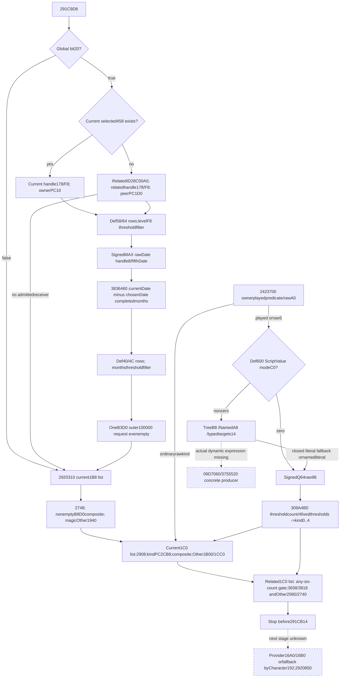

# Person preparation after the gated temporary tail — CK3 1.20.0.3

This source-only packet closes the caller interval `291C9D8..291CB14`: one two-row-set composition from `326A8E0`, followed by three ordered CourtPosition list families from `2920310`. The useful next observation can publish those raw inputs and derive unit-weight requests without running native evaluation callbacks. Dynamic ScriptValue evaluation remains a specific missing input when its actual branch is demanded.

Status is **research / source-ready**. No bridge leaf, released DTO, fixture qualification, live artifact or game progress is claimed here. The accepted [preceding gated-tail source](battle-current-person-gated-temporary-tail-12003.md) and [stage baseline](battle-person-stage-baseline-12003.md) remain separate evidence. Proposed next frontier is `post326A8E0_and2920310_pre291CB14`.

The source tree, Mermaid graph, query proposal and exact-byte ledger were sealed before implementation. External packet: `Z:/ck3_mod_rewrite_process_assets/g2-background-round4-20261005/person-tail/gated-tail-next-326a8e0-2920310/`. Its `SOURCE-PINS.json` pins all newly captured spans, capture receipts, reused sources and this document. `READ-COST.json` records **6062 fresh frozen-EXE bytes: 5426 code + 636 pdata**, with the 730 calendar-table bytes reused from cache. No EXE header/full scan/hash, runtime query, test or build was performed.

## Sealed exact-build source tree

Status **research / source-ready**, source-only before any implementation. Frozen CK3 1.20.0.3 / Steam25652598, image base140000000, recorded EXE SHA256 `94B55397ABB687A3DCD436805A5D885E6BE90FA6C693FEB44A9E3BBEEADE02A6`. No EXE hash/full scan/header, game launch/attach/query/SDK/pipe/UI/Steam/process inspection/runtime, tests/build or candidate-code change. This packet independently follows the accepted gated literal source package; the current gated implementation does not depend on these future sources.

Caller `[291C9D8,291CB14)` is reused from `Z:/ck3_mod_rewrite_process_assets/g2-resume-20261005/battle-trait-native-input-primitive-v79/context-source/region-0291C0D0.asm`. R13=model, R14=currentCharacter, RSI=inline destination model+10. The bounded frontier is `post326A8E0_and2920310_pre291CB14`. The next provider/Character192 source atCB14..CB60 and2920850 atCB6B are explicit following-stage unknowns, not included in this packet.

## Caller admission, argument source and order

| Seam | Source |
|---|---|
| C9D8/C9DF | Bit20 of BYTE[QWORD[global5CB87F8]+2B0] gates only326A8E0/CAFA. False proceeds directly toCB09, not past2920310. |
| C9EC..CA02 | CurrentCharacter1C0/+458 present selects current receiver458+178, owner-modeR8B=1, levelR9D=DWORD458+F8. |
| CA42..CAA7 | Otherwise28C00A0 returns related fullID. RawFFFFFFFF skips326family. Full-generation Character registry5C67568/fallback5C67570 resolution thenrelated1C0/+458 presence selects related receiver458+178, owner-mode0 and related458+F8. This caller does not add the C8AE Character magic/fullID!=FFFFFFFF gate before related1C0. |
| CA0F/CA1B andCAB4/CAC0 | Fifth arg is currentCharacter1B8+E8 **8BDate**, regardless current/related receiver. Absent1B8 uses static8BDate at4763CB8. |
| CA04/CAA9 | Sixth arg is QWORD[global5C68C50]+8 current8BDate. |
| CAD7/CADE/CAEF |326A8E0 receives RCX=&selected178 handle,RDX=outPC,R8B=owner-mode,R9D=level,Date fifth/sixth pointers. |
| CAFA |B3D0(model,outPC) is unconditionally invoked for every admitted326 call, even emptyPC; outer100000 request. Local cleanup follows. |
| CB0F |2920310(model,currentCharacter) is **unconditional**, independent of bit20 and326-family admission. |
| CB14 |Stop before the next provider/Character192 family. |

## 326A8E0 two ordered row sets

The receiver handle is QWORD[handle+0]=Definition and Date64 at handle+8. First rows use QWORD[Definition+58] / signed32 count64. Second rows use QWORD[Definition+40] / signed32 count4C. Both stride3D0, signed32 thresholdrow+8, PC atrow+10 when owner-mode!=0, atrow+1D0 when owner-mode==0. Each admitted row is merged at inner100000 into one initialized empty temporary. Every stored row whose level>=threshold is admitted; failure skips that row and continues, not a prefix break. Native occurrence order and duplicates remain.

First-set selector is supplied level=selected458+F8. After first-set fold, helper reloads Definition fromhandle0; second-set selector is completed-calendar-month difference from currentDate to a chosen Date. At326AAA6 RDX=&handle8;AAAB RCX=fifthDate;AAB3 EAX=DWORD[handle8];AAB5 compares DWORD[fifthDate] againstEAX;AAB7CMOVG replacesRDX withfifthDate when its signed rawDWORD is larger. Thus it selects **signed MAX rawDWORD**, keeping the entire chosen8BDate pointer. Equal rawDWORD retains handleDate, so different cached upper fields can remain significant.

`3836460(currentDate,chosenDate)` returns wrapped completed months. EachDate is raw signed32 at0, signed cachedday byte4, cachedmonth byte5, cachedyear i16 at6. A nonnegative cached field is used directly. Each negative cached field independently decodes rawH=wrap_i32(raw-43800000): year=trunc0(H/8760); D=trunc0(H/24); dayIndex=normalized signedDmod365; month/day from exact365B tables444C4B0/444C340. No leap day is present. Then `months=wrap_i32(12*wrap_i32(yearA-yearB)+monthA-monthB)` and subtract1 withwrap32 when dayA<dayB. The original magic signed multiply/divide paths are captured and these exact tables are reused from the frozen army-calendar packet, without rereading730B. This is calendar arithmetic, not threshold ranking or arbitrary30-day division.

The entire composed output is returned; caller creates one outer100000 request throughB3D0. It does not emit an outer request for each internal threshold row. Known empty output still retains this caller occurrence. Date/name/formatting helpers do not create extra numeric contributions; format text and generic initializers are not executed by a raw observer.

## 2920310 complete chained source and shared resolution

Physical source is three contiguous.pdata fragments: `[2920310,292032A)`26B prolog,`[292032A,292059F)`629B body,`[292059F,2920842)`675B normal return plus cold default-vector initializer; total1330B. A first26B capture alone is not a whole-function proof. No unwind bytes were read.

2920310 processes three ID lists in order: currentCharacter1B8+D0/DC, currentCharacter1C0+3B8/3C4, then relatedCharacter1C0+3B8/3C4. All are DWORD fullIDs, native order including repeats. First two families skip when owner pointer absent or native signed count==0, then use begin/end traversal. The related list usesbegin/end traversal. Negative counts are not silently converted to0. CourtPosition resolution uses global5D1DD10 registry, low24 index/cap2C/table20/stride10 pointer8 and **fullID atCourtPosition+8**; fallback5D1DD08 for missing registry/out-of-capacity/null/mismatch. No position magic check is added. `Definition=QWORD[CourtPosition+110]`; `OtherDefinition=QWORD[CourtPosition+118]`. Every direct request has outer100000 and may carry a known emptyPC;2438850's empty-source skip affects resulting weighted rows.

| Family/occurrence | Ordered requests for each resolved position |
|---|---|
| 1: current1B8+D0/DC |Def+2748 directPC; then291B8D0 composed Def+2AC8/B/A conditionalPC if nonempty; then OtherDef+1940 only when OtherDef38==4744624F. |
| 2: current1C0+3B8/3C4 |Def+2908 directPC; Def+2CB8+1C0*kind; nonempty291B8D0 composite; then magic-admitted OtherDef+1B00 andOtherDef+1CC0+1C0*kind. The native kind getter is called twice when OtherDef is admitted. |
| 3a: related1C0 list |Def pair is admitted if basePC3658count3664!=0 **or any** of the five3818+i*1C0 PCs hascount+C!=0. Admitted pair requests Def3658 thenDef3818+1C0*kind, preserving both requests even if chosenPC is empty. All-six-counts0 skips both and the numeric kind demand. |
| 3b: same related occurrence |OtherDef38 must haveObDG magic. Its pair similarly admits if base2580count258C!=0 or any of five2740+i*1C0 count+C!=0; requests base2580 then2740+1C0*kind. All-empty skips both/kind demand. No291B8D0 composite occurs in the related family. |

The related character is selected by reused28C00A0, then caller Character registry/fallback resolution. This stage applies magic43686172/fullID18!=-1. If valid relatedCharacter1C0 is absent, it uses inline default DWORD-vector header54E7220 (data0,countC), with native cold initializer directly zeroing its data/cap/count and allocator54E58E0. A raw observer does not invokeTLS/lazy initialization. It can publish the actual default header or a separately explicit modeled empty initializer result; must not invent a nonempty list or label initializer execution as observed.

## 291B8D0 composite is conditional on nonempty output

Arguments are model,currentCharacter,Definition. It initializes a temporary, merges Def+2AC8 base atunit100000, then stored conditionalB rows Def2C88/count2C94 (stride1C8; signedkey0,PC8) admitted by actual2549810 on resolved CharacterB0 selector. Then conditionalA rows Def2CA0/count2CAC, same stride/key/PC, admitted by signed lower-bound membership in resolved CharacterB4 selector's7B8/7C4 array. These exact selector registries and predicates are already closed by D460: B uses5D1E2F0/fallback5D1E2E8/fullID10; A uses5D1E2F8/fallback5C67670/fullID8. No growth overlay occurs here.

The source checks composed count at291BB75. Zero skips allocation and **skips the outer2438850 request**. Nonzero retains a copy and appends it to inline model+10 atunit100000 at291BD22. This is distinct from B3D0's unconditional empty caller occurrence. Name/localization/intern/shared-object bookkeeping does not affect numeric source admission. Existing pure PropertyContainer fold can be reused without executing those lifecycle/formatting helpers.

## Actual kind getter2423700 and fixed quantizer309A4B0

2423700 is three.pdata fragments `[2423700,242376C)`108B,`[242376C,2423795)`41B,`[2423795,242379B)`6B, total155B. It resolves CourtPosition120 as a fullCharacterID through5C67568/fallback5C67570, reads the selected CharacterID18 and checks2BAA710 actual played-character FullID membership. That cached exact helper reads QWORD[global5C68C50]+A0, vector22358/count22364, and uses a wholeDWORD first-match finder; full generation bits are retained. Cached source/finder are reused without execution. It does not add a Character magic gate here.

If membership is false and rawu8CourtPositionA0!=5, it returns rawA0 without evaluating Def600. Otherwise it constructs a source scope from rawCourtPosition124 through09F9E20, calls309A690(Def110,&outQ64,CourtPosition124,0), then passes the resulting signedQ64 to309A4B0(Def110,Q64). Dynamic scope semantics are not needed for the source-closed literal branches below; this packet does not construct or execute them.

309A4B0 has no.pdata entry. Actual call entry is bracketed by cached predecessorend309A4A3 and nextbegin309A510. Disjoint64B+32B captures cover all normal branches throughRET309A50C plus3BINT3. It first tests signedcount Def40E4: **count<4 returns kind4** without threshold orQ64 demand. Otherwise QWORD[Def40D8] holds the first four signed32 thresholds. Each is promoted to signed64 and multiplied100000, compared in stored order with evaluatedQ64. It returns0 before first threshold,1 before second,2 before third,3 before fourth, otherwise4. It does not sort thresholds and does not clamp a missing evaluated result to0.

## ScriptValueDef600 literal precedence, separate from named getter

309A690 builds a diagnostic descriptor/scope and calls09D6E70 on **Def+600**.09D6E70 constructs supports and forwards to09D7060 with actualRNG=null.09D7060 tests signedDWORD ScriptValue+C0 **before** any expression-tree read:

- modeC0==0: read signedQ64+98 and copy it unchanged to output, return output pointer. No tree/named/target/scope/diagnostic field is a numeric demand in this fast literal branch.
- mode!=0: nonnulltree+B8 takes the dynamic virtual-tree branch, specific missing actual result.
- nulltree and NamedValue+A8 nonnull: evaluate that named source. Its independently closed37542F0 predicate is tree70 first, then nulltree/flag7B/nonzero raw68 or knownzero. Literal/knownzero nested named values can be read purely; nested dynamic expression remains missing.
- nulltree, NamedValue+A8 null and targetcount+14==0: use signedraw+98 fallback. ActualRNG=null bypasses the random-range mode2 branch, so+A0/+B0 are not numeric demands here.
- nonzero targetcount+14 invokes3755520 on ScriptValue+8 and may use374EBB0. Those actual typed-expression outputs are a **specific unresolved producer**, not a reason to invent98 or expand a generic expression catalog.

This getter's **modeC0-before-tree** fast path must not be replaced with the previous NamedValue getter's **tree70-before-flag7B** precedence. Raw scalar0/negativeQ64 are legal. Thresholdcount<4 can prove numericalkind4 without needing a rule result, while native309A690 evaluation still precedes the quantizer; numerical observation does not claim equivalent native evaluation activity.

## Evidence and corrections

Final source cost **6062B=5426B code+636B pdata**, no data/unwind/header reads or duplicate.pdata reads. Cached calendar730B,2BAA710,28C00A0/B3D0,2549810 and wholeDWORD optimized finder source reused. Per-capture receipts include no-extent309A4B0 metadata and its explicitly bounded gap reads; the96B gap source is not a guessed.pdata extent. SOURCE-PINS.json andREAD-COST.json seal actual spans/hashes/cost, and QUERY-PLAN.md is the smallest useful observer proposal. No implementation/module/DTO/fixture is delivered.

Early unsealed statements are corrected explicitly:3836460 is calendar-month difference, not rank; date-pointer selection is signedMAX, notMIN; fifthDate literal is4763CB8, not the early4769CB8 transcription. These source corrections precede all implementation. Full Entry, allocation/copy/lifecycle execution, genuinely dynamic Def600 results and the nextCB14/2920850 stage remain concrete boundaries.

## CourtPosition naming provenance

The shared registry5D1DD10/fallback5D1DD08, full position ID+8 and type definition+110 are already identified as CourtPosition by `Z:/gbs1/docs/ck3-native-ai/ck3-1.20.0.2-phase-misc.md:35` and `Z:/gbs1/ck3_autonomous_player/native_bridge/research/ck3_1_20_0_2_phase_misc.json` (`kPhaseMiscCourtPositionStoreSlot`). The newly captured exact1.20.0.3 caller independently uses those addresses and offsets. The early unsealed provisional Title naming is corrected here. Position+120/+124 retain raw offset names; holder/employer semantics and a named aptitude interpretation are not asserted.

## Minimum observer proposal

Source-only proposal before implementation. Extend the same fullCharacter current-context-source query with optional `after_gated_tail_326a8e0_2920310`. Proposed collector `AfterGatedTail326a8e0And2920310`; proposed stable pure emitter `emit_after_gated_tail_requests_from_current_source_inputs_12003(section)`. They do not exist yet. Do not alter the accepted current gated leaf or its qualification bundle.

Suggested dedicated files, requiring Root's implementation decision and ownership assignment:

- `include/xar_bridge/battle_person_after_gated_tail_v1.inc.hpp`
- `include/xar_bridge/battle_person_after_gated_tail_serializer.inc.hpp`
- `include/xar_bridge/ck3_12003_after_gated_tail_sources.inc.hpp`
- `src/ck3_12003_person_after_gated_tail.inc.hpp`
- `src/xar_autoplayer/bridge/battle_person_after_gated_tail_contract.py`
- optional new fixture `tests/person_after_gated_tail_fixture.cpp`, centrally qualified, not run here.

## Useful minimum and demand

1. Independent326 section binds bit20/current-vs-related458 receiver, handle178 Def/date, modeowner, currentselectedF8, first58/64 and second40/4C rowsets. For positive consumed rows retain everythreshold comparison, occurrence ordinal and chosen10/1D0 pairedPC. Inner unitfold yields one outer100000 request, evenempty. All rowsetcounts0 can prove empty numeric temporary without dates/level values that cannot affect it; native helper still reads/calls those inputs, so do not claim native execution equivalence. Bitfalse or unadmittedreceiver yields no326request and does not skip292section.
2. For demanded monthrows, publish raw8BDate values including upper caches: currentDate fromglobal5C68C50+8; handleDate selected178+8; currentCharacter1B8+E8 or exactstatic4763CB8. Choose signedMAX rawDWORD with handleDate tie retention; source-pure cached/uncached calendar decoding uses already sealed365B tables. Do not introduce a generic calendar subsystem or30day approximation.
3. Independent292 groups bind current1B8+D0/DC, current1C0+3B8/3C4, related1C0+3B8/3C4 or actualdefaultheader54E7220. Preserve sourceordinals/duplicateIDs and fullgeneration registry resolutions via5D1DD10/5D1DD08. Missing one group does not hide independently readable others. Actual pointerabsence/count0 yields legal knownempty group; native negative count is not an inventedempty.
4. Each currentposition occurrence exposes actual Def110/OtherDef118 PCs and B8D0 base/conditionalrow inputs, with actualcurrentB0/B4 predicate inputs only when needed for numeric conditionalfold. Reuse D460's already-closed membership/composition source. B8D0 emits onlynonemptycomposite; directPC requests remain evenempty. Keep per-position requestorder rather than collecting all bases/tierblocks/composites separately.
5. Kind may be sourced entirely from actual rawA0 when ownerFullID is absent from playedFullIDvector andA0!=5. Otherwise Def40E4count<4 yields numericalkind4 without ruledemand. Positivecount>=4 needs first4 actualsignedDWORDthresholds and actualsignedQ64Def600 result. Small raw literal modes are modeC0==0 raw98; or nonzero mode, nullB8tree, nullA8named, zero14targets fallbackraw98; nestedA8NamedValue literal/knownzero can reuse exact tree70/flag7B/raw68 semantics. Required missing reads remain missing; undemanded fields may be null, not schema blockers.
6. DynamicB8tree, dynamicnestedA8NamedValue or nonzero typedtargetcount14 remain specific missing `definition_600_dynamic_fixed_result` with exact09D7060 /3755520 receiver/provenance. No native evaluation/scope/intern/initializer callback, generic AST interpreter or invented kind/weight. Later actualvalueproducer implementation can replace this precise input.
7. RelatedDef andOtherDef paired-family admission demands six sourcecounts in its own order (base thenfive levels) until an actualnonzero is found. All-six0 skips both requests/kindinput. Any-nonzero produces both base/selectedtier source occurrences even when a selectedPC is empty; resulting weightedrows are separate. MagicOtherDef false skips its full family without counts/tier demand.
8. Source-request counts differ by family: admitted326 exactlyone outerunitrequestevenempty; B8D0 zero orone basedoncomposedcount; ordinarydirectPC one evenempty; admittedrelatedpair exactlytwo evenempty; gated/knownall-emptypair zero. MissingrequestedPC/tier remains an explicit missing occurrence at its ordinal. All outerweights are literal100000; do not convert occurrencecount to a multipliedweight.

## Proposed grouping, not a released schema

`status/ready/character_id`, `composition_326a8e0{global_bit20,receiver_selection,owner_mode,level_raw,dates,level_rows,month_rows}`, `lists_2920310{current_1b8_rows,current_1c0_rows,related_rows,related_resolution}`, and per-position `resolved_inputs,base_pcs,composite_sources,tier_sources,related_pair_counts,other_magic,other_pcs`. Preserve availability independently for326 and three292 groups, actualsourceordinals, knownempty outcomes and exact missing reasons. Neither currentfinal nativecontext nor any producedPC is relabeled historicalpreC9D8.

Reuse typed pairedPC DTO/readers and existing localnumericfold; no initializer,copy,owned-storage or contextwriter is executed. Proposed bounded resultfrontier `post326A8E0_and2920310_pre291CB14` joins a separately explicit priorstage baseline. Currentliteral-gated bundle needs no changes or dependency on this futureleaf.

Specific follow-up actualsource gap is typed dynamicDef600 evaluation (09D7060 treeB8 /3755520 targets) only when a realrow needs it; nextcallersource after this bounded frontier isCB14 Character192/provider16A0/16B0 followedby2920850. No genericexpression catalog is planned.

The registry object is CourtPosition, not a provisional title object. The proposed list field names are raw `current_1b8_rows`, `current_1c0_rows` and `related_rows`; +120/+124 remain raw source IDs. No holder/employer role or aptitude meaning is inferred from those offsets.

## Default related-list initialization input

The selected default CourtPosition header54E7220 has raw signed DWORD initialization guard **5D679E0**. Existing captured source29205F2..292060C reads TLS slot0's epochDWORD+10 and compares the guard against it: signed `JG` enters the cold path, while `guard <= thread_epoch` uses the existing header. At29207EE the cold path passes the guard address to4223AA4. At29207F3 it tests the resulting guard against-1: not equal uses the existing header; equal enters the initializer. The initializer zeros dataQWORD54E7220 and capacity/countQWORD54E7228, sets allocator54E7230 to54E58E0, then calls4223A44 with the same guard address before traversal.

The minimum raw observer must retain5D679E0 whenever the absent-related1C0 default is selected. Following the existing project pattern, raw guard0 or-1 keeps an explicit uninitialized state and does not release stale default-header bytes as a current valid list. A pure fold can explicitly model the source initializer's empty numeric header: data0/capacity0/count0, yielding no related-list requests. That modeled result is distinct from an actually read valid header; it does not claim native initialization or TLS execution. Other guard states release the actual selected header under the existing pattern. An unreadable demanded guard remains missing. A present related1C0 selects its actual3B8/3C4 header without demanding the default guard.

Cached-only evidence and current document pins are in external `DEFAULT-LIST-INIT-GUARD.md` and `DEFAULT-LIST-INIT-RECEIPT.json` in the same packet. This addendum reads **0 new EXE bytes** and leaves base cost6062B. It supersedes the base receipt's historical document hash only for this appended clarification; the original source tree and its other pins remain sealed.

## Released raw contract and first pure qualification, 2026-10-06

The earlier grouping above remains the historical source-only proposal. The released optional same-query leaf is `after_gated_tail_326a8e0_2920310`, with four independently available families in native order: `composition_326a8e0`, `current_1b8_court_positions`, `current_1c0_court_positions`, and `related_court_positions`. `FINAL-RAW-SCHEMA.json` and the subsequent `FINAL-ZERO-COUNT-CLARIFICATION.json` were sealed before implementation. Exact zero row count releases an empty numeric temporary; negative begin/end counts remain partial.

Production modules are `battle_person_after_gated_tail_contract.py` and `battle_person_after_gated_tail_12003.py`. Public emitters are `emit_after_gated_tail_requests_from_current_source_inputs_12003(section)` and `emit_after_gated_tail_family_requests_from_current_source_inputs_12003(section, family)`. The genuine current-source normalizer calls `normalize_after_gated_tail_326a8e0_2920310` and retains its actor join. Missing dynamic Def600 values stop only their demanded family; independently complete families remain usable.

The single new production-normalizer compound case passed **1/1 in 0.43 seconds**, first execution at **2026-10-06 03:34:58 Asia/Shanghai** (wrapper1.0092611s). It covers ordered duplicate CourtPosition occurrences, direct paired PCs, admitted empty326 and related-pair outer occurrences, signedMAX Date tie retention, pinned365-byte calendars, mode0 and nested-Named precedence, modeled empty default guard0/-1, ordinary raw kind250, partial dynamic values, and actor mismatch. Its reusable `after_gated_source()` builder is in `tests/unit/test_battle_person_after_gated_tail_12003.py`.

Receipts are in `Z:/ck3_mod_rewrite_process_assets/g2-background-round4-20261005/person-tail/gated-tail-next-326a8e0-2920310/FOCUSED-PRODUCTION-CASE.json` and `PURE-CONTRACT-DELIVERY.json` (4917B, SHA256 `8f53668ae550c28f82e2ff7d930a79fd5dc01334fb8637b2b0f03724ee7560f7`). New implementation EXE I/O0, native builds0, old cases0, game operations0. The source lane's6062B remains the sole source cost. Native compiled-wire and separate contiguous stage-chain qualification are pending; this is static-ready numeric behavior, without live, historical-baseline, complete-person or Entry claims.

The native optional DTO, bindings, collector and serializer now join the same current-person query. New target and CTest name are both `xar_ck3_12003_person_after_gated_tail_test`; its independent wire directory is `ck3_12003_person_after_gated_tail_wire`. Six fixed-frame producer scenes retain whole-query double-sample equality: full ordered duplicates, mode0/nested literal precedence, bit20false and all-six-zero pairs, dynamic partial with independent families, initialized default list, and modeled default with admitted empty326. The hook is `RunAfterGatedTailFixture(path)`. These are new fixture sources awaiting Root's sole central build/first CTest, not native execution evidence. Existing archived gated/opposite producers and their qualified wires remain unchanged.

## First compiled-wire qualification, 2026-10-06 03:58:55 Asia/Shanghai

The dated pending candidate above is retained as history. Root exact source **b6eeb0e933f91dbe90b96762c41dd4f01fb8ab61** is now qualified for the intended complete DLL and this new target. Initial attempt01 built only the dedicated fixture in9.6435902s; its first and only new CTest passed1/1, test0.11s/total0.79s/wrapper0.8202599s. Root noticed the DLL scope omission, preserved `ROOT-SCOPE-CORRECTION.json`, and completed full intended DLL+target build02 GREEN in **183.8449508s** at the same source before allowing the first consumer. The new CTest was not repeated. The initial partial archive is not a complete DLL qualification.

Complete archive is `Z:/ck3_mod_rewrite_process_assets/g2-background-round4-20261005/sourceb6eeb0e9-after-gated-four-families-full-native-artifacts/`. Its `HASHES-AND-NATIVE-QUALIFICATION.json` is8891B, SHA256 `9042277695bee6b696745aa6bb2c2c8fcd668c96252c7c5c10eac9e1c355771b`. Root's existing pins were reused: DLL10525184B SHA256 `ff8df63eadaaa15130959f83110f5268a4b12cfc6950c71015d8f03fc02cdd80`; new fixture EXE844800B SHA256 `b2b53c6457b7eddb9483195295f809a6961a9a619ee79e0cd8c9471da756c33a`.

The six archived new wires were consumed **once**, through genuine production main normalizer and family/whole emitters from `Z:/gb0/ck3_autonomous_player/src`: **GREEN6/104 checks**, internalelapsed0.0161108s. `after-gated-wire-integration-attempt01.json` in the source packet records each actual wire and production file hash. It verifies21 ordered duplicate requests,23 literal/named requests, zero all-pairs-empty requests,11 independent requests across the dynamic gap,4 initialized-default requests, and1 admitted empty326 request with modeled-empty default. Actual direct paired-PC references, native family ordinals, stored threshold continuation, Date tie caches, literal/knownzero demand, and explicit partial dynamic values are preserved. No old cases/wires, build, game action or runtime staging was repeated by this consumer.

Readiness is **static-ready compiled fixed-memory raw observer and source-pure numeric contribution behavior**. The separate pure stage-chain owner qualified its bounded four-family composition once1/1 .028s using an explicit fixture baseline; that is distinct from these six actual compiled wires. No real paused snapshot, fresh evolving model association, full-person/Entry or live capability is established by this package. Next functional interval is the source-closed Character192/provider16A0/16B0 and2920850 lists before the existing carrierweighted630 seam; a dedicated new source/implementation plan is in `battle-person-provider192-and2920850-12003.md`.
