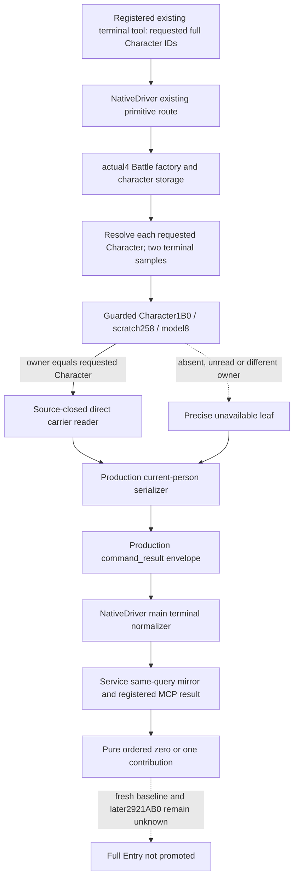

# Actual4 direct carrier in the existing character query

Source sealed before integration on 2026-10-09, Asia/Shanghai. Exact build is
1.20.0.4 / Steam 25734779 / EXE
`98702F88A547CDE2EAF29A85F93B85F68EE4CF8148336A4F7AFAEB75319DD518`.
This package reuses the [direct carrier source](battle-person-next-direct-carrier-12004.md)
and its 328 unique bytes; it reads no additional executable bytes.

The existing registered tool `ck3_query_battle_terminal_transition_v1` accepts
`prior_combat_id=null`, `subject_public_cunit_id=null`, `character_ids=[full ID]`,
and `expected_revision`. The encoder produces
`query-battle-terminal-transition-v1-none:characters:<ID>`.
`NativeBridgeDriver._execute_battle_terminal_transition_v1_query` sends this
existing private query, normalizes its frame, and adds same-frame mirrors.
`GameplayBridgeService.query_battle_terminal_transition_v1` consumes those
mirrors without changing the requested actors.

The production native route is `ExecuteTypedQuery12002<battle_terminal>` ->
`BindBattleForQuery12004` -> actual4 `BindBattleImage` ->
`ReadBattleTerminalTransitionV1`. Its two `TerminalSample` passes resolve each
requested Character through the actual4 character storage and check the full ID.
`CharacterObservationSample` currently emits current-person leaves only when the
exact .3 factory flag is enabled. That factory correctly excludes actual4.
The new exact4 carrier-only binding is independent of that flag and the older
numeric, trait, prior-context, and pending-death readers.

## Native association and contribution

The already cached actual4 getter `28C3AC0..28C3B9C` proves this owned branch:
Character `+1B0` -> scratch `+258` -> model; model `+8` must equal the requested
Character; only then does the getter select model `+10`. Its other branch selects
an inline default context and may initialize it. The observer copies only the
proved owned branch through guarded reads; it binds the exact getter identity
for provenance and never calls that getter or initializer. Missing scratch/model,
failed copy, and owner mismatch remain a precise unavailable direct leaf.

The independent direct reader then consumes the actual model receiver, and
publishes `current_person_state.carrier_1c8_b70_direct`. It preserves carrier
absence and wrong magic as zero occurrences, actual mapped/fallback PC bytes,
signed Q64 values, raw array order, and lazy-default partial state. Model `+10`
is destination identity only. The held model is not a fresh stage-start baseline.

## Integration and FIRST boundary

The actual4 Battle factory installs only `PersonCarrierDirect12004Bindings`.
The common reader admits the new optional state through that binding, without
enabling old .3 fields. The existing private serializer gains one optional leaf;
the strict main normalizer joins its copied full Character ID to the observation
row. NativeDriver and Service keep their existing same-frame path and registered
tool. The shared command-result formatter is used by both production dispatch
and the new fixture, so the registered consumer receives the original full packet.

The one new native target will publish eight complete command_result packets
through the real query reader and serializer. A single registered MCP compound
will consume those packets through the production NativeDriver and Service,
including the requested enemy actor independently of the player. Native and
Python FIRST are NOTRUN; Root owns their execution. No game, SDK, runtime pipe,
build, test, historical GREEN replay, or further function research occurs here.

The candidate target is `xar_ck3_12004_person_carrier_direct_mcp_test`, with CTest
`xar_ck3_12004_person_carrier_direct_mcp_first`. Its sole fixture source is
`tests/person_carrier_direct12004_mcp_fixture.cpp`; it reuses the entire production
Bridge object closure and Runtime archive with no replacements or scheduler
stubs. The sole registered case is
`test_person_carrier_direct12004_registered_mcp.py::test_person_carrier_direct12004_registered_mcp_eight_whole_packets`.
The existing `mcp==2.0.0` server and Client APIs are used unchanged.

The current Service and NativeDriver mirrors already retain normalized current
person leaves. They need no new dispatch policy; the main terminal normalizer
adds the exact4 leaf and Character join. The tool's existing accepted ID range
and same-paused-frame checks remain in force. Native fixture player29829 and
requested full enemy ID67108867 are deliberately different.

The shared header change has a concrete compilation cost. The retained Native39
dependency/owner metadata names 423 existing production owners (149 Bridge,
274 Runtime); the new direct reader adds one Runtime owner. Four existing CPP
bodies change: `bridge.cpp`, `battle_terminal_transition_v1_mailbox.cpp`,
`ck3_12002_battle.cpp`, and `ck3_12004_battle.cpp`. Root joins Native40's two
replacement Bridge objects as the actual next parent. This is a source/include
dependency list, not a new build result or a replay of historical qualification.
