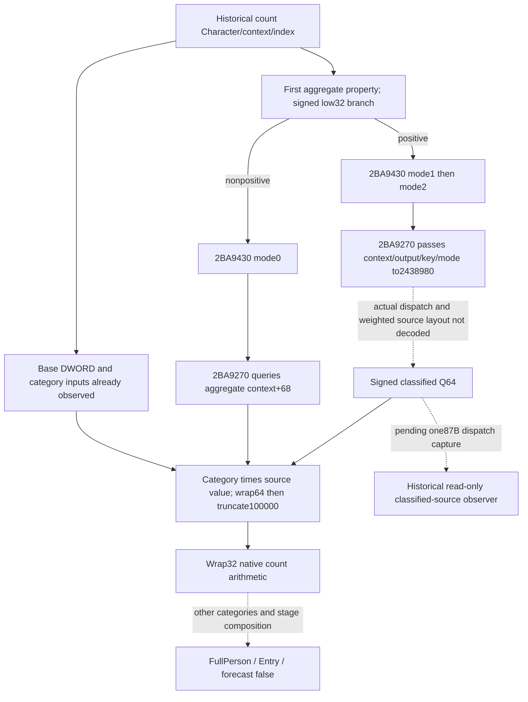
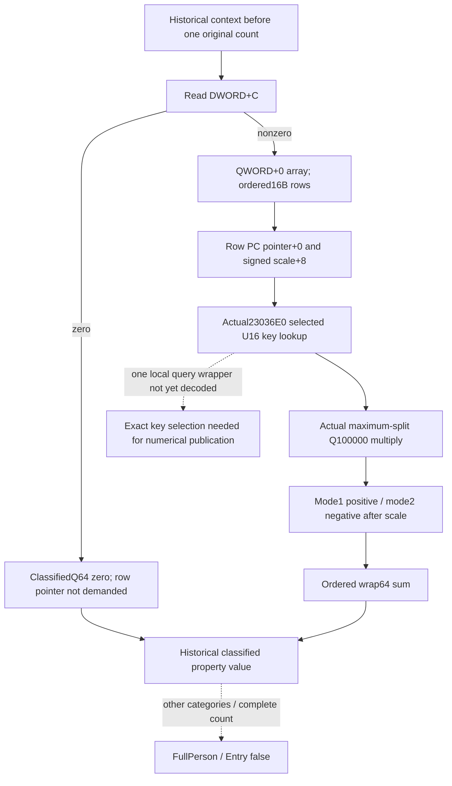
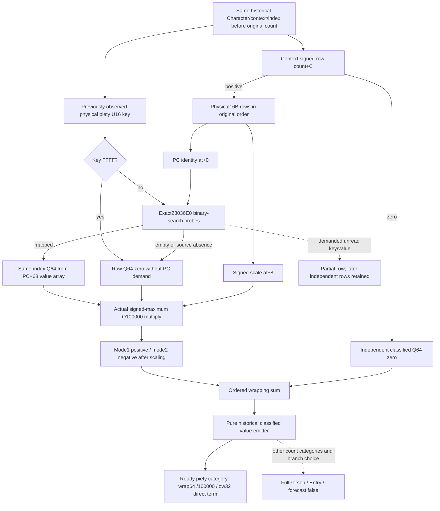

# Person classified weighted inputs on actual 1.20.0.4

Recorded on 2026-10-10 (Asia/Shanghai). Status: **bounded native source
closed; same-MCP historical operand observation and one new qualification
package authored, NOTRUN**. Root supplied664 unique source bytes in
four fixed reads. This package selects one necessary numerical input of the
already observed six-stage count; it does not replay Native69 or qualify
FullPerson, Entry or a battle forecast. The chronological research seals
below preserve what was still unknown at each earlier capture.

Exact identity is CK3 **1.20.0.4**, Steam **25734779**, with reused frozen EXE
SHA-256 `98702F88A547CDE2EAF29A85F93B85F68EE4CF8148336A4F7AFAEB75319DD518`.
No native image is opened by this source author.

## Why this is the next necessary operand

The qualified historical base inputs and per-stage piety category explain
real inputs of count `2BA95C0`. They do not supply the classified property
value that the category multiplies. The original count already publishes its
signed result; this increment targets its missing numerical source, rather
than treating a piety rank as an attribute contribution or imposing complete
Person reconstruction before consuming an existing battle value.

The held complete count at `[2BA95C0,2BA97CD)` truncates its first aggregate
property by100000 and tests the signed low32 result. If this is nonpositive,
it calls `2BA9430` with mode0. If positive, it calls that helper with mode1
and mode2, then combines the positive result with the negative part of the
mode2 result plus the aggregate operand, using wrapping32-bit arithmetic.
Thus the positive and negative classified values are actual caller inputs.

The held `2BA9430` body selects piety's physical U16 key from
`image+4807608+8*index` and passes that key and the integer category to
`2BA9270`. Other category/getter inputs are outside this packet. The count
caller's fifth argument is0, so `2BA9270` bypasses its formatting/allocation
branch. Its mode0 branch queries the inline aggregate PC at `context+68`.
Its nonzero mode branch is the following literal actual4 call:

| Instruction | Meaning proved by held actual bytes |
| --- | --- |
| `2BA93B4 MOVZX R8D,SI` | The original physical U16 property key |
| `2BA93CF MOV R9D,EBX` | The saved actual mode DWORD |
| `2BA93D2 LEA RDX,[RBP-21]` | Caller-owned scalar output storage |
| `2BA93D6 MOV RCX,R14` | The original count's context receiver |
| `2BA93D9 CALL2438980` | Actual classified property reader |
| `2BA93E1 IMUL RCX,QWORD[RAX]` | Returned Q64 value times signed category, wrap64 |

The subsequent signed high multiply, SAR14 and sign correction truncate
that wrapped product by100000; the caller consumes low32. This proves a
necessary result role and direct ABI inputs. It does **not** prove the
callee's weighted-row layout, mode filtering, scale order or lifetime.

## Existing evidence and bounded cache result

Reuse the complete525B count ledger at
`BG10/native66-six-stage-abi-held/ABI-CLOSURE-RESULT.json`; its bodies are
`missing01/count-tail-first.asm`, `missing02/count-return-fragment.asm` and
the retained original32B entry. Reuse the393B helper and441B evaluator from
`D:/p6class01/actual-classification01/classification-02BA9430.asm` and
`D:/p6class01/actual-evaluator02/evaluator-02BA9270.asm`. Their Root capture
receipts and category source are indexed by
[the classification topic](battle-person-six-stage-classification-source-12004.md).
All those bytes predate this package and are not read from the EXE again.

The old3 `24389A0` explanation is a locator for classified weighted rows,
not an actual4 layout or address proof. No old header/member offsets are
copied into production. A finite filename lookup in the held actual4
direct-decoder packet found no matching body; this is a scoped cache miss,
not a global claim about every external archive. Cache-only owner requests
are preserved in the external handoff.

One selection from the already cached actual4 runtime table places the
literal target in zero-based row126853:
`[0x2438980,0x24389D7)`, **87B**, unwind`0x5249AA8`. The row begins at the
actual call target. The short extent may dispatch into another physical
fragment; its semantics and any continuation remain unproved. Selecting
the row opens no EXE, PE, pdata or unwind section.

External selection receipt:
`BG10/person-classified-weight-inputs/HELD-RUNTIME-EXTENT.json`.
Table: `BG7/upstream-build-migration/function-match-core/NEW-RUNTIME-FUNCTIONS.json`.
Here BG7/BG10 abbreviate the existing `g2-background-20261007` and
`g2-background-20261010` directories under
`Z:/ck3_mod_rewrite_process_assets`.

## One actionable source step

Root can run the new
[fixed-range capture helper](../../ck3_autonomous_player/native_bridge/research/fixtures/capture_person_classified_weight_dispatch_12004_root.py)
once against its existing frozen EXE. It reads **only**
`[0x2438980,0x24389D7)`, using the held text mapping RVA1000/raw400,
file offset`0x2437D80`. It captures and decodes the87B, records literal
call/jump targets and full decode separately, and never expands a callee or
fragment automatically. It does not rehash, copy the EXE or read metadata.

The immediate implementation decision is concrete: if this fragment closes
the nonzero reader, expose its source-defined historical weighted inputs
in the existing same-query six-stage capture before the original count.
If it dispatches, only the actual demanded target/fragment becomes the next
source request. A current-final context, derived zero or subtraction from
the final count cannot replace this missing source. No new action, second
query factory, protocol or policy gate is proposed.

The future consumer must retain native row order, signed scales and the
actual mode1/mode2 filter, with independent readiness for a readable source
family. Its field names and layout will be released only after those actual
bytes close; this research package deliberately publishes no guessed DTO.

## Qualification and work boundary

Root reported Native69 base+piety native FIRST GREEN and the necessary
partial-null Python fix71b consumer GREEN. Those are reused facts; this
package executes neither again and adds no qualification or live credit.
The recipe is **AUTHORED_NOTRUN**, new EXE bytes0, source worker build/test/
product-import/Game/SDK/process/hash counts0. Only one staged diff check is
planned before the English documentation/source-tool commit. The existing
Entry cached-six-stat to forecast consumption belongs to the Entry owner
and is not duplicated here. FullPerson, Entry and complete forecast remain
false.

## Root's actual dispatch capture and one exact continuation

Root executed the unique87B recipe on2026-10-10,
`03:59:05.317601..03:59:05.603597Z` outer time. Its source receipt records
one87B read in0.0005862999241799116s and full28-instruction decode.
Original body and receipt remain at
`BG10/person-classified-weight-inputs/actual-dispatch01/`; the separate
Root receipt is
`D:/codex-ck3-background-spill/person-classified-weight-ROOT-ACTUAL-DISPATCH01.json`.
Only that returned assembly/receipt were consumed by this author.

The actual fragment saves the incoming context/output, keyU16 and modeDWORD.
Mode0 calls23036E0 with context+68 and returns the caller's output pointer.
For nonzero mode it tests **DWORD[context+C] ==0**. Zero writes Q64 output0
then jumps2438B5E; any nonzero raw count jumps24389D7. No positive-count
interpretation or weighted-layout inference is made from this test.

Those two literal edges select already cached rows126854 and126855:
`[24389D7,2438B5E)`391B and `[2438B5E,2438B75)`23B. They are physically
adjacent. The only next requested read is their continuous union
**`[24389D7,2438B75)`,414B**, file offset`2437DD7`; it contains the actual
nonempty path and the common return path. This is not a guessed old-build
extent. Root's helper gains an explicit `--part continuation` selection;
the original default dispatch selection and its87B receipt remain intact.

`HELD-ACTUAL-CONTINUATIONS.json` and `ROOT-CONTINUATION-CAPTURE-ARGV.json`
in the external packet bind the exact edges, cached row identities and
single-read recipe. The414B recipe is authored NOTRUN at this source seal.
No production DTO, native callback invocation, old87B reread or automatic
callee expansion follows. Actual weighted source order/sign/scale remain
the concrete missing source until that fragment is returned.

## Actual nonzero weighted reader closed; keyed query remains local

Root returned the unique414B continuation on2026-10-10,
`04:01:49.635251..04:01:49.784888Z` outer time. Its source receipt records
one414B read in0.00012450001668184996s and a complete111-instruction decode
through RET2438B74. No source bytes overlap the87B capture. Together they
close the501B reader; the exact reused SHA remains unchanged.

The source uses context QWORD+0 as the row array and sign-extends DWORD+C
as its count. Rows are16B: PC pointer at+0, signedQ64 scale at+8. The
nonzero-count path acquires/releases the native reader counter at+228;
the proposed observer only copies source memory on the existing application
thread and does not write that counter or call a native evaluator.

For each physical row in order, CALL2438A6E asks23036E0 for the selectedU16
key in that row's PC. The row scale and returnedQ64 are multiplied using
the same instruction-derived arithmetic already qualified in
`native_fixed_mul_q_12004`: the small path wraps the product then truncates
by100000; the large path decomposes the **signed maximum**, with wrapped
quotient/remainder products. Mode1 includes only strictly positive scaled
terms; mode2 includes only strictly negative terms. Filtering happens after
scaling. The included terms are added in source order with signed64
wrapping. The common tail stores that scalar in the supplied output and
returns the same pointer.

Actual key lookup is the single remaining local source dependency for a
numerical publication. Actual PC layout and the separately closed key
**insertion** algorithm do not automatically qualify that getter. The
literal weighted-row CALL2438A6E selects cached row120551,
`[23036E0,2303705)`,**37B**. The next fixed `--part row-lookup` recipe reads
only those37B. It neither explores the already closed mode0 branch nor
opens an insertion/array library. Any returned tail edge is handled as a
new explicit source need, rather than automatic decoder expansion.

Implementation will be on a new private tree based on the qualified69
Python-null fix71b; the retained research tree and current69/70 candidates
remain untouched. The minimal same-MCP plan is a per-stage historical
`classified_piety_inputs` leaf alongside the already owned piety key/category.
It will retain actual row order, PC/scale/keyed values and independent
readiness, and produce mode1/mode2 classifiedQ64 plus the category's direct
wrapped/truncateds32 term. It will not label candidate mode values as
observed native mode calls, reconstruct absent categories or change old
capture readiness. Exact DTO release waits for this local keyed-query
closure; production implementation and FIRST are still NOTRUN here.

Root's unique37B lookup capture returned GREEN at
`04:06:47.902031..04:06:48.064533Z` on2026-10-10, receipt
`BG10/person-classified-weight-inputs/actual-row-lookup03/SOURCE-CAPTURE.json`.
It performs a native U16 FFFF sentinel check **before reading the PC count**;
FFFF returns Q64 zero immediately. Other keys fall through2303705 after
loading signed DWORD[PC+C]. This newly observed demand order will be
preserved, rather than querying or validating a PC for the sentinel key.

The held table splits the contiguous remainder into rows120552..120555,
8+63+40+15B, ending2303783. The next row begins2303790 after a13B alignment
gap and is not selected. To avoid reading four tiny fragments in separate
rounds, the only proposed remaining range is the continuous
`[2303705,2303783)`,**126B**, offset2302B05. Its justification is the actual
fallthrough and the first cached metadata gap, not an old RVA shift.
The decoded result must establish its own return/branch semantics; row
continuity alone does not grant semantic closure. The fixed helper selection
is `--part row-lookup-remainder`; prior37/501B are not read again.

## Query closure and implementation contract, sealed before code

Root returned the final126B once at2026-10-10
`04:09:30.112332..04:09:30.277151Z`; source receipt
`BG10/person-classified-weight-inputs/actual-row-remainder04/SOURCE-CAPTURE.json`
records one126B read in0.00009709992446005344s and full41-instruction decode.
The whole getter is now163B, returns2303700/2303773/2303782. Together with
the weighted reader, this package consumes **664 fresh bytes in4 Root reads**;
the worker reads no EXE. Sum of native read durations is0.0011122998548671603s.

After the FFFF early zero,23036E0 reads signed countPC+C, keys pointerPC+0,
and uses the exact unsignedU16 binary-search iteration. It advances the
candidate by `remaining-half` only when the probed key is less than the
requested key, then repeats with `half`. End-of-keys, requested key below
the candidate, or a negative low32 candidate index returns Q64 zero.
Otherwise it loads the signedQ64 at the same index from QWORD[PC+68].
The observer mirrors these actual conditions, including the residual native
less-than check; it does not replace them with a linear scan, sort/dedup
or assume the insertion helper's proof also proved this query.

The following native input is source-closed and released for implementation
on the private71b-based tree. It is copied **before each original count**,
after the existing physical piety-key copy, into that same historical record.

* Optional `classified_piety_inputs` retains fixed source stage, context
  rows/count offsets0/C, row stride16 and PC/scale offsets0/8, plus the
  actual reader and lookup RVAs.
* Its six physical `stages` retain index, observed/ready/reason,
  `property_key_u16`, `row_count_i32`, `row_array_identity`, and ordered
  `rows`. Count0 is independently ready with no row pointer or key demand.
* Each row retains `native_index`, ready/reason, `pc_identity`,
  `pc_count_i32`, `lookup_selection` (sentinel/empty/absent/mapped/unavailable),
  `selected_index_u32`, `raw_value_q64` and `scale_q64`. The exact query copies
  only demanded binary-search keys and, for a mapped value, its QWORD.
  FFFF returns zero without a PC dereference. Missing memory stays partial;
  all later independently copied rows/stages remain available.
* SignedQ64 fields serialize as decimal strings and accept normalized
  integers on the second production normalization pass. The new field is
  optional for older qualified packets; it cannot change old base/piety,
  count, append or aggregate readiness.

The pure emitter
`emit_captured_person_classified_piety_value_12004(section,index,mode)`
accepts only actual modes1/2. It computes each row with the existing
qualified actual4 maximum-split multiplication, filters **after scaling**,
and wraps ordered addition. It also emits the direct piety s32 term when
the independently observed category is ready, using2BA9270's wrap64
integer multiply followed by truncation100000 and signed low32.
`emit_captured_person_classified_piety_row_12004(section,index,row,mode)`
retains an independently ready later row when another row is partial.

These are source-evaluated values from historical operands. They do not
claim that a native mode call was observed, substitute mode0 aggregate
values, infer the first-key branch or reconstruct the other categories.
They never acquire native locks, invoke helpers, initialize caches, write a
Model or add a query/action factory. A new native whole fixture and unique
registered-MCP compound will exercise this new leaf once under Root; author
test/build/import/Game/SDK/hash counts remain0. FullPerson/Entry/forecast
and new live/G2 credit remain false.

The native capture owns only this copied input. Its pure values are labeled
`source_evaluated=true` and `native_mode_call_observed=false`. Readable later
rows remain independently consumable when the whole stage cannot sum. A
negative observed count remains a concrete unavailable source, not an empty
array. No arbitrary maximum count or extra policy condition is introduced.

## Native71 implementation and sole FIRST contract

The private implementation is based on qualified69 Python fix
`71b069f5625111e0f34940d19bc76bb08f2ff2a5`. The full source contract above
was sealed at `f2bd2430ee3df03669b08659926967888ca4f657` before product
editing. Native69 and the concurrent frozen Native70 package are untouched.

The existing private six-stage DTO/header and capture CPP now copy these
operands immediately before the original count, after the existing piety
key/category copy. The same capture serializer publishes decimal-string
Q64 operands. The existing Python module normalizes the optional leaf and
provides the two pure emitters. No public GameContract layout, Service,
Driver, query/action factory, SDK route or original callback ABI changes.
Only the existing capture CPP adds native behavior. Its private header also
affects the already identified Bridge owners `bridge.cpp` and
`battle_terminal_transition_v1_mailbox.cpp`, and Runtime owner
`ck3_12004_knight_stat_consumption.cpp`; Root must join these four existing
owners against its actual latest qualified physical lineage.

One new fixture target/CTest is
`xar_ck3_12004_person_six_stage_classified_piety_mcp_test`, registered in
`native_bridge/cmake/person_six_stage_classified_piety_12004.cmake`. It links
the real Bridge and emits five new original whole command packets:

* `classified-piety-signed-scaled-duplicates.json`
* `classified-piety-zero-selections.json`
* `classified-piety-selected-value-unread-later-ready.json`
* `classified-piety-new-sequence-retained.json`
* `classified-piety-observe-bypass-unobserved.json`

The fixture checks pre-original ownership, original fullRAX/count/argument
forwarding, unchanged append/old readiness, duplicate PCs and first duplicate
key selection, FFFF/empty/absent/zero-count demand order, partial selected
QWORD with later readable rows, and owned values surviving later mutation.
The new-sequence scene also supplies source-shaped large operands: direct
quotients4294967297/-4294967297 become low32 1/-1, while maximum-split
scaled rows `[MAX64,-MAX64,MIN64,1]` produce wrapped mode values MIN64/1.
The source infrastructure includes an earlier fixture with its main renamed;
the earlier producer is never invoked.

After Root FIRST produces those five packets once, the sole new compound is
`native_bridge/research/consume_person_six_stage_classified_piety_12004.py`.
From the frozen source's `ck3_autonomous_player` directory, run it with
`--packets <new-five-packet-directory> --report <new-report.json>` using
Root's frozen interpreter. Source imports resolve relative to that script;
no environment delta is needed. Root's recipe does not pass its optional
`--producer-exe`, so consumption cannot replay the producer.

This consumer uses the real registered MCP tool
`ck3_query_battle_terminal_transition_v1`, Driver and Service for exactly five
requests. Only request-ID correlation changes; the original native bodies
remain unchanged. The **authored expectation**, not a test result, is560
grouped checks,46 whole mode values and158 independently ready row mode
values. It checks signed Q64 wire/int double normalization, ordered source
math and exact requested frame/fullID/sequence joins. Its report explicitly
keeps native-mode-call/live/FullPerson/Entry/forecast credit false.

Build, new fixture, new compound and all old tests remain **NOTRUN by the
author**. Root owns the sole FIRST. The initial pending research receipts,
all four actual source captures and any future failed qualification attempts
remain separate. Implementation delivery, affected-owner projection, exact
FIRST argv templates and Oct10/W41 fields are external at
`BG10/person-classified-weight-inputs/IMPLEMENTATION-*.json`.
