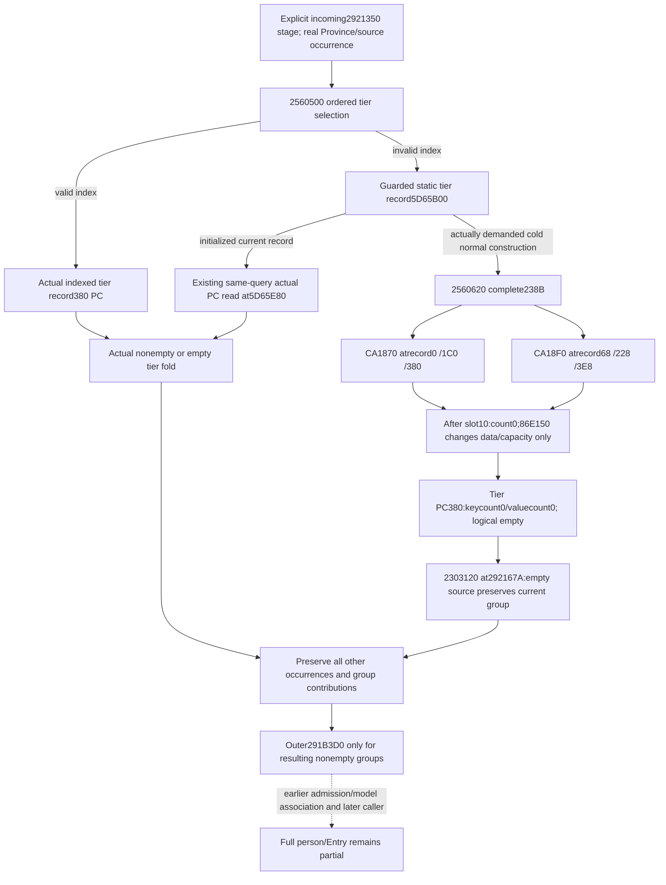

# Person tier cold fallback numerical construction — 2560620 / 1.20.0.3

2026-10-06 / 2026-W41. **Research, source-only.** Frozen Steam build25652598,
EXE SHA `94B55397ABB687A3DCD436805A5D885E6BE90FA6C693FEB44A9E3BBEEADE02A6`
is reused from existing seals. New frozen EXE reads total **250 B**: one known
12 B `.pdata` row and the complete238 B constructor. Tests, builds, provider
changes, game/SDK/pipe operations, initializer invocations and whole-image
hashes/scans are all0.

The demanded cold `2560620` **normal-return numerical postimage is empty**.
This closes the local `tier_default_2560620_result` input gap in the existing
[person stage chain](battle-person-stage-chain-12003.md), through a source-derived
numeric projection. It does not claim an initializer ran in a game or advance
the production consumer in this source-only commit.

## Actual demanded source and object layout

The sealed caller is `291CDA3 →2921350`. Its Province/source-object path calls
`2560500`, whose tier selection uses ordered signed thresholds and ordinal-minus1.
An invalid tier returns the static **tier record** at RVA5D65B00. The numeric
PropertyContainer consumed by `2921350` is at **record+380**, RVA**5D65E80**;
5D65B00 itself is not that final tier PC.

Cached `2560500` supplies the complete cold call:

| Instruction | Source role |
|---|---|
| `2560594` | Guard at RVA5D65AFC versus current thread epoch; branch to actual guarded path |
| `25605B0 →4223AA4` | Existing initialization synchronization helper |
| `25605B5` | Recheck guard against `-1` |
| `25605BE/C5` | `RCX=ADDRESS5D65B00`; call **2560620** when the cold branch actually demands it |
| `25605CA/D1` | Register actual callback address4368510 through4223F44; callback not invoked or expanded here |
| `25605D6/DD` | Guard completion helper4223A44 |
| `25605E2` | Return tier-record address5D65B00 |

The new exact `.pdata` row130395 proves the whole constructor extent
**`[2560620,256070E)`**,238 B, normal return `256070D`. Cached neighboring
rows130393/130394/130398 supplied the exact next-row entrance, without a scan
or repeated code capture.

`2560620` retains the incoming record pointer and constructs three complete PC
regions, stride1C0. Each PC gets key-header `CA1870(PC+0)` then value-header
`CA18F0(PC+68)`. The relevant third-PC calls are `25606B8` and `25606C1`.
There is no trait/property fold, tier-key insertion or script callback between
these constructors and the normal return.

| Record field | Exact constructor result or store |
|---|---|
| PC0 at `record+0` | Keys and values constructed; metadata DWORD `PC+1B8=4` |
| PC1 at `record+1C0` | Keys and values constructed; metadata DWORD `PC+1B8=8` |
| **Tier PC at `record+380`** | Keys and values constructed; metadata DWORD `PC+1B8=1` |
| Each PC `+190/+1A0/+1B0` | Direct QWORD0 stores |
| Each PC `+1A8` | Direct QWORD15 store; no numeric entries inferred from this metadata |
| Record `+540` | Immediate QWORD `FFFFFFFFFFFE7960`, signed**−100000**; inside the same captured body |

The metadata flag meanings and unrelated PC uses are not assigned business
labels. The tier record's548 B extent matches the already sealed tier-row
stride; its threshold is a separate field from the tier PC's key/value arrays.

## Reused numerical header proof

The initialization-counts source packet already seals the **same exact**
`CA1870 [CA1870,CA18EF)`127 B and `CA18F0 [CA18F0,CA1972)`130 B constructors,
fixed allocator slot10/20 targets and the final `86E150` callback. No helper body
was recaptured or invoked.

Both constructors unconditionally zero data and QWORD`[header+8]` **after**
slot10 returns. That QWORD clears both capacityDWORD+8 and countDWORD+C before
slot20. The actual15 B slot20 leaf86E150 sets data to the inline buffer and
capacity32; it does not write the count at `[R8+4]`. Thus on normal return:

| Tier PC numerical header | Physical location | Logical postimage |
|---|---|---|
| U16 keys | header atPC+0; count atPC+C | count0, keys`[]`; data points toPC+20, capacity32 |
| Signed Q64 values | header atPC+68; count atPC+74 | count0, values`[]`; data points toPC+88, capacity32 |

Nonnull inline data and positive capacity do not imply entries. The buffers'
unused contents are undemanded and were not read. This proof depends on normal
constructor return, not pre-callback zero stores, static BSS bytes, guard shape
or a fabricated empty read of a cold current object.

The generic slot10 release/delegation internals and later destruction are
outside the numerical projection: the unconditional count-zero stores occur
after that returning helper, and the final slot20 count behavior is closed.
There is **no remaining demanded initializer callee for these numerical counts**.
Physical allocation/completion is not claimed by the model.

## Minimum pure numerical continuation plan

The current exact.3 observer already publishes tier selection, selected index,
`default_guard_raw_i32` and `selection="cold_default_5d65b00"`; its local reason
is `tier_default_2560620_result`. Its bindings already point to5D65B00 and guard
5D65AFC. A new native query is unnecessary for the **modeled normal-constructor
numerical result** just closed here.

The smallest consumer follow-on is an explicit source-derived tier-PC result:
`kind="modeled_2560620_normal_return"`, keys`[]`, values`[]`, counts`(0,0)`,
record/tier-PC role and exact constructor provenance. Keep the observed cold
guard/selection and native current-read diagnostic separately. Do not overwrite
an unavailable current PC read with an assertion that native initialization
already completed. An initialized fallback still consumes its actual observed
PC, even if nonempty; the cold projection does not generalize to every default.

The inner fold at `292167A →2303120(groupPC,tierPC,100000)` has an empty source,
so its numerical effect is **no change to that group**. Preserve the underlying
Province/source/tier occurrence in the source ledger. In particular, never clear
the whole group or discard other contributors merely because this occurrence
is cold-empty. A group with another nonempty contribution still produces its
existing outer unit request. A group containing a zero-valued key remains
nonempty; only actual keycount0 suppresses the outer request.

This package implements none of that follow-on. Root/person owners can use the
closed projection to remove exactly the cold numerical frontier while preserving
the independently demanded Diac/admission, group completeness, model identity
and remaining person-caller stages. No historical current-final baseline,
whole-person completion, Entry forecast or game-day credit follows from it.

## Evidence packet and reporting

New exclusive packet:
`Z:/ck3_mod_rewrite_process_assets/g2-background-20261006/person-cold-fallback-2560620/`.
`SOURCE-PLAN.json` predates the capture. `capture-02560620/RECEIPT.json` carries
the new bounded code and metadata pins; `REUSED-INITIALIZER-COUNT-PROOF.json`
records the cached normal-return count proof. `PURE-NUMERIC-COLD-PLAN.json`,
`ROOT-DELIVERY.json` and `OCT6-W41-FIELDS.json` provide the implementable seam
and shared-report fields.

Reused tier caller source:
`person-stage-chain/following2921350-source/capture-02560500/region-02560500.asm`.
Reused normal-return helper seal:
`person-stage-chain/model-quality-814/initialization-counts/SOURCE-PINS.json`
and `SOURCE-TREE.md`, source commit97af7674.

Source closure: cold tier-PC normal-return numeric empty. Readiness remains
**research** because no new consumer/provider or validation was authorized.
Tests0/builds0/game0/SDK0/initializer calls0. New source cost250 B, no repeated
EXE read, no full hash/scan, no new static data or unwind read, no unrelated
default-constructor research. Root owns stage-topic linking and Oct6/W41 merges.
