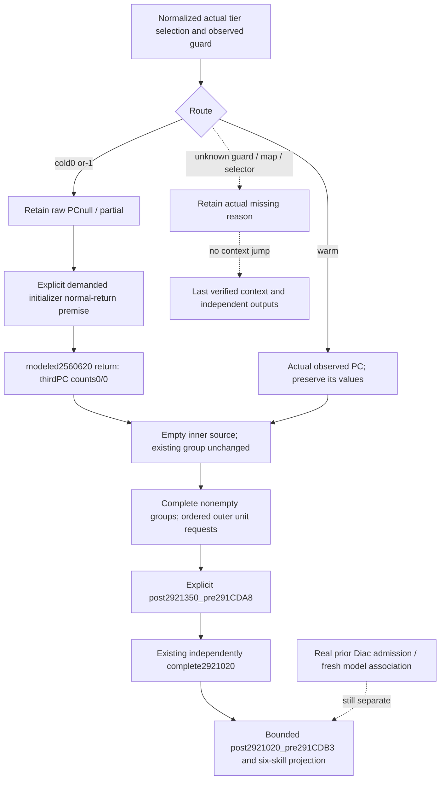

# Conditional cold tier normal-return projection — 1.20.0.3

2026-10-06 / 2026-W41. The source-only
[cold tier constructor topic](battle-person-cold-tier-fallback-2560620-12003.md)
was frozen before this consumer implementation: source f2127fb7, Root adoption
2e661b1c. Its complete `[2560620,256070E)`238B normal return256070D constructs
record5D65B00 and third numerical PC5D65E80 at+380. Reused exact CA1870/CA18F0
and final86E150 slot20 prove key/value counts0/0 on normal return. The record's
540 immediate-100000 is a separate threshold field. Constructor code SHA-256
is `4e48abb51e27db4e25421a904df62bc204e963690563076f4074bad5c99ced5f`.
EXE SHA remains
`94B55397ABB687A3DCD436805A5D885E6BE90FA6C693FEB44A9E3BBEEADE02A6`.

The native observer and strict transport normalization remain unchanged.
Observed cold selection `cold_default_5d65b00`, guard0/-1, `ready=false`,
`tier_default_2560620_result` and absent PC identity/block are retained.
Guard0/-1 alone does not prove the native call: the actual source branch also
uses current TLS epoch, synchronization and recheckedguard==-1. None of those
runtime outcomes or initializer execution is inferred by this consumer.

## Existing numerical connection

The existing group kernel and whole/group bridge emitters now accept
`project_cold_initializer_normal_return=False`. The existing
`continue_explicit_person_following_stages_12003` forwards the same keyword.
Defaultfalse preserves the qualified observed-only route. Setting it true
states the pure model's demanded-constructor normal-return premise; it is a
numerical model option, without executing an initializer or adding a native
query, DTO, callback or permission requirement.

The model derives an empty inner source only from the strictly normalized
actual cold route with known0/-1 guard, ready map/selector, actual source and
Definition identity and the exact local cold diagnostic. Complete occurrence
census and known valid group indexes still determine group readiness. Unread
map, unknown guard, missing manager/census, warm actual PC and unrelated
diagnostic branches retain their existing meanings.

Each derived inner occurrence is separately named
`modeled_2560620_normal_return`. The stage ledger retains actual guard/selection,
source/Province occurrence indexes, source identity, source constructor/normal
return/PC RVAs, counts0/0 and constructor SHA. It records raw PC unobserved and
actual TLS/sync/recheck/completion unobserved. Repeated source occurrences can
consume the same derived postimage; they do not claim repeated initializer
executions. Raw observed leaf readiness and modeled request readiness remain
separate fields.

The inner2303120 fold receives an empty source and leaves the destination group
unchanged. It preserves every earlier nonempty or zero-valued key and later
contributor. Only the resulting complete nonempty groups supply outer unit
requests in native manager order. A cold-empty occurrence never clears a whole
group, drops the occurrence ledger or treats another unknown input as empty.

The incoming context must still be an explicit same-Character
`post2920D60_pre291CD9D`, or the already verified following-helper boundary.
Current-final is not a historical prior. The optional mode discharges this
source-closed numerical cold branch in a prospective model; actual earlier
Rule43/Diac selection, coherent live model identity, rank diagnostic3F7AB90
and subsequent caller contributions remain separate.

## First new compound qualification

One new production normalizer -> conditional group/helper projection ->
explicit stage -> existing six-skill compound passed on its **first execution**
at2026-10-06 11:36:47CST,1/1 in0.208865s. Test:
`test_battle_person_cold_tier_projection_12003.py`; receipt:
`Z:/ck3_mod_rewrite_process_assets/g2-background-round4-20261005/person-stage-chain/following-stages-implementation/cold2560620-projection/attempt-01/RESULT.json`.

Both observedguard0 and-1 keep raw leafpartial and PCnull while the modeled
helper emits1 outer group request, then2921020 emits4. The explicit result
reaches `post2921020_pre291CDB3`, weightedcount5 and skills
`[3,7,8,6,5,17]`. Two cold source occurrences retain their derived postimage
provenance. An observed-only call to the same new fixture remains at the
incoming stage. A cold source routed into a previously nonempty group keeps
that group's `[-4Q,8Q,-3Q]` modifiers; a zero-valued key also remains an outer
occurrence. The warm actual fallback retains its real-2Q value per occurrence,
yielding skills `[3,7,8,6,1,17]`. Unknown guard remains at the incoming stage;
later diagnostic stops at `post2921350_pre291CDA8` with skills
`[2,6,8,6,6,14]`. Original current-final input and wider readiness are preserved.

The new case is an explicit conditional fixture stage, without historical or
coherent live pair credit. No earlier successful Python case, native target or
17-wire consumer was rerun. No native source/DTO/collector, shared normalizer,
CMake, forecast, runtime or game operation changed. New EXE reads0; the source
lane's250B remains source credit there. This mode is **static-ready conditional
normal-return numerical modeling**. Actual initializer execution, fixture-live,
production-live and full person/Entry completion remain unclaimed; the numeric
2560620 postimage itself is now source-closed and implemented.
