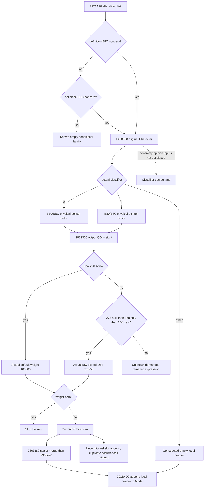

# Actual4 conditional contribution after the 2921A90 direct list

This source package follows the independently implemented [2921A90 direct
list](battle-person-following-2921a90-12004.md). It uses exact CK3 1.20.0.4,
Steam build 25734779, executable SHA
`98702F88A547CDE2EAF29A85F93B85F68EE4CF8148336A4F7AFAEB75319DD518`.
The preceding callsite and 1,467-byte helper are retained source and receive no
new byte credit. Native43 and its qualification candidate remain unchanged.

The actual caller at `2921B75` tests the selected definition's signed count
`B8C` against zero. Only when it is zero does it test `BBC`. Both zero bypass
the conditional family. Otherwise `2921B90` calls actual `2A38030` with the
original Character, creates a local header through `24FBAC0`, and selects the
physical pointer list `BB0/BBC` for classifier zero or `B80/B8C` for classifier
two. Every other classifier result reaches the empty local-header append.
No source-defined callback, classifier, constructor or evaluator is invoked by
the proposed observer.

## Source correction: evaluated operand is a scalar weight

The earlier direct-only proposal named the unknown `2872300` output as an
evaluated property container. Its actual 380-byte body proves that `RDX` is an
output signed Q64 scalar. When the physical modifier's DWORD `280` is zero,
the function writes `100000` and returns without expression evaluation. The
caller tests this scalar for zero before creating or merging the local row.
It passes a nonzero scalar in `RDX` to `2303380` after `24FD2D0`.

For nonzero `280`, the receiver is the row's inline `1C0` expression. The
bounded 724-byte `9D7060` body proves a raw fallback when, in demand order,
row QWORD `278` is null, QWORD `268` is null, and DWORD `1D4` is zero. That
path reads signed Q64 `258`, including legitimate zero. A nonnull `278`
demands its virtual `+30` evaluator; otherwise a nonnull `268` demands
`37542D0`; otherwise nonzero `1D4` demands `3755500`. These remain explicit
dynamic gaps. The receiver's flag `C0` is the same physical DWORD `280` already
tested by the outer helper, so the generic evaluator's zero-flag branch cannot
be admitted after that nonzero branch. The caller fixes `R9` to zero.

## Classifier source boundary

The three actual adjacent unwind fragments beginning `2A38030` contain 377
bytes. They validate Character magic `1C` and full ID `18`, select Character
`1C0`'s inline DWORD-ID list at `A8/B4` or the actual `16F2C80` default, and
return classifier one for an empty list. Nonempty classification resolves each
full ID through actual registry `5C67568` with fallback `5C67570`, obtains the
base value through `25A1220`, and conditionally adds `294AB90` for a different
selected Character. It clamps against actual signed globals `5C6A1EC` and
`5C6A1E8`, converts the result to float, and compares actual float thresholds
`5C68EE0` and `5C68EF4`. A strict high majority gives zero; a strict low majority
gives two; otherwise one. Its necessary opinion input bodies are being closed
in the separate classifier source lane before nonempty readiness is claimed.

## Current implementation boundary

This is the source-first ledger, written before implementation. The three
source lanes own classifier, evaluated scalar, and local header transfer
separately. The useful target is actual nonempty source contributions for
default/raw weights, preserving physical occurrence order, local grouping,
and the final outer append. A cached evaluated value or a guessed classifier
cannot substitute for demanded native operands. Dynamic missing inputs remain
local, and independently complete rows must remain available.

The whole Person/Entry chain, fresh stage baseline, future context association,
full classifier arithmetic and real paused qualification are not promoted by
this draft. New fixture and registered consumer, when authored, are Root-only
FIRST and remain `AUTHORED_NOTRUN` until their exact candidate is built and
consumed. There are no Game, SDK, process, runtime, build, test or hash operations
in this source package.

## Closed minimum before product changes: 2026-10-09

The three bounded source lanes have now sealed their actual bodies. Combined
new cost is **6,863 bytes in 30 unique EXE reads**: classifier 3,122 bytes,
weight evaluation 1,140 bytes, and header/numeric transfer 2,601 bytes. The
initial three-lane seal was 5,872 bytes; the necessary typed transfer and
constructor postimage closure added 991 distinct bytes, without rereading that
initial seal. No old
1,478-byte helper range is reread; PE/pdata metadata is reused, with no new PE,
pdata, unwind, full scan or executable hash. Per-read timestamps and exact
extents are in the three external `UNIQUE-SOURCE-COST.json` receipts.

A genuine nonempty classifier branch is closed without the opinion catalogue:
when a registry/fallback-selected pointer equals the original Character,
`25A1220` with its actual null third argument returns integer **100**. The
caller still reads selected `1B0`, but skips `294AB90` for that same pointer.
Each physical self occurrence receives an independent vote. Clamp minimum is
tested first; maximum is demanded only when the value is not below minimum.
The first float comparison is `value >= high`; only when it fails is
`low >= value` tested. High wins only when strictly greater than both other
vote counts; low has the same rule; ties return one. Thresholds are published
as raw IEEE-754 float32 bits. Other selected pointers retain the actual
`classifier_25a1220_directional_opinion_unobserved` gap; a nonnull selected
scratch additionally demands the separate `294AB90` opinion source.

For the default classifier list, `16F2C80` returns inline header
`module+5D21338`, guarded by DWORD `module+5D21350`. The observer records the
guard, treats raw zero or minus one as uninitialized/in-progress, and does not
invoke initialization. A held Character `1C0+A8` list never demands that guard.

`24FD2D0` is **unconditional append**, not keyed lookup. It creates a new
`1C0`-byte slot and calls `D879E0(slot, physical_modifier)`. Thus duplicates
remain distinct. The modifier itself supplies the ordered PC: keys QWORD `0`,
signed count `C`, values QWORD `68`, and independent signed count `74`.
Actual `CA1870` and `CA18F0` reset the two destination counts to zero. Actual
`D87880` copies the U16 key byte range and `B73DC0` forward-copies QWORD values;
both preserve source order and set the count from the supplied range. Neither
sorts nor deduplicates. The degenerate empty-destination insertion has no old
range to rotate. `2303380` scales all value-count elements, with an identity bypass
for weight 100000. Its slow arithmetic path decomposes the signed maximum
operand, uses signed division truncating toward zero, and preserves actual
low-64-bit multiplication/addition wrapping. Unbounded product division or the
historical minimum-operand helper is not substituted.

`2303490` first calls `C85860` even for empty/sentinel-only PCs. The observer
records its actual current registry slot without invoking its initializer.
Only non-sentinel numeric keys consume the returned registry's table. Numeric
input readiness therefore does not qualify that initializer's execution.
It then iterates key-count entries after scaling. Key `FFFF` selects inline
metadata at `module+5461F40`; other keys require an already initialized registry
from QWORD `module+5D1F7B0`, then its QWORD `50` table plus key times `C8`.
Byte `BA` is tested first. A nonzero value retains the weighted value without
reading byte `B8`; otherwise `B8` bit zero determines retention. When neither
flag is set, the value is truncated by division by 100000, the quotient's low
32 bits are sign-extended, and that signed integer is multiplied by 100000.
This is quantization with native narrowing, not a clamp.

Finally `291B4D0` walks local slot order, copies each slot into a new persistent
PC in Model `248`, then calls `2438830(Model+10, PC, 100000)` once per slot.
A zero scalar produces no slot or append; a nonzero scalar with an empty PC
still produces one occurrence. Classifier one creates no slots. This observer
copies the physical inputs and a pure consumer computes local numerical
results; it does not allocate a native header, mutate Model, call any getter,
or read the destination context as a historical baseline.

The minimum same-query sibling is `following_2921a90_conditional`, separate
from the now-frozen direct-only leaf. It retains the actual classifier source,
selected list, per-row scalar and PC ranges, and demanded per-key metadata.
All-self, zero-list and validity-failed classification are known; normal
other-person opinions stay partial. Default/raw scalar branches are known;
virtual-expression, scoped-expression and scripted-expression branches stay
partial. Independently complete physical rows remain exposed when another row
is partial. Whole conditional output requires the actual admission and all
selected rows. These boundaries, rather than a supplied classifier enum, are
the sole inputs for the new fixture and registered MCP consumer.

## Authored production candidate; FIRST not run

The observer is `ReadPersonConditional2921a90Inputs12004`, receiving the exact
guarded-copy binding and the already observed `following_2921a90` receiver in
the same `CurrentPersonSample`. The schema is
`xar.ck3.person-following-2921a90-conditional-12004-v1`. The reader copies current
source fields and reconstructs only the proven all-self classifier. The native
serializer sends Q64 values as decimal strings; the leaf normalizer accepts
those and the already normalized signed integers used by the second Service
pass. It retains precise per-row and classifier missing reasons.

`emit_conditional_2921a90_requests_from_current_source_inputs_12004` folds the
local scalar and metadata into each PC, then emits downstream weight 100000.
`emit_conditional_2921a90_row_requests_from_current_source_inputs_12004` releases
an independently complete physical occurrence. A zero scalar returns no
request; a nonzero empty PC returns one. The combined
`emit_complete_2921a90_requests_from_current_source_inputs_12004` joins the same
receiver, emits the preceding direct family first, then offsets conditional
source ordinals by the physical direct-row count. It does not weight the local
PC a second time.

The full production whole target is
`xar_ck3_12004_person_conditional_2921a90_mcp_test`; CTest is
`xar_ck3_12004_person_conditional_2921a90_mcp_first`. Its twelve original packets
exercise self high/low/middle votes, actual empty classification, another
person's unavailable opinion, dynamic scalar, unread values, missing metadata
registry, cold default header, negative selected count, actual no-demand
bypass, and the signed-maximum scaling branch. The fixture reuses the preceding
guarded fake-memory and exact4 factory setup source only; its old producer
entry is renamed and never executed. It preserves all existing readonly and
terminal double-sample assertions.

The only registered compound node is
`test_person_conditional_2921a90_12004_registered_mcp.py::test_person_conditional_2921a90_12004_registered_mcp_whole_packets`.
It consumes the new complete `command_result` packets through NativeDriver,
the main normalizer, Service and the existing registered
`ck3_query_battle_terminal_transition_v1`. Transport correlation is the only
whole-packet rewrite. No preceding scene, old consumer, Game, SDK or process
is run. `CK3_PERSON_CONDITIONAL_2921A90_12004_MCP_WIRE_DIR` selects the fresh
twelve-packet directory; `PYTHONPATH` selects Root's final adopted source.

The production delta is the new Runtime collector, the existing Runtime
battle sample's one call, public optional DTO sibling and private formatter,
plus strict Python normalization and pure emitters. There is no new factory,
action, SDK capability, Service branch or strategy. Root must project public
header consumers from its actual qualified Native43 lineage, preserving
Native42's three fixed mailbox/environment owners. Old basename archive
removal and old 423-owner lists cannot describe this new closure.

All new executable and registered checks are **AUTHORED_NOTRUN**. Static input
implementation is not native qualification, paused live input, full Person,
complete Entry, a fresh model baseline, future forecast, or a whole campaign
loop. The ordinary non-self opinion and actual dynamic expression leaves are
the two next concrete source inputs; they are not replaced by cached output.

## Actual partial-vote wire correction: 2026-10-09 03:26 +08

Root's first twelve original native whole packets passed in 0.2600174 seconds
at `2026-10-08T19:17:23.443479Z`. The registered consumer then exposed two
independent faults; both failed attempts are retained. The first fixture call
omitted the existing emitter's explicit outer full-Character-ID join. After
that fixture-only correction, retry02 reached the real non-self row and the
normalizer rejected its native empty `vote` string.

The original `other-person-opinion.json` has a ready self row with `vote=high`,
followed by `ready=false`, `vote=""`, and reason
`classifier_25a1220_directional_opinion_unobserved`. Its classifier is unready
and `classifier_result_i32` is null. `Vote` returns with its default empty
string before assigning a vote when an operand is unread; the serializer
publishes that string directly. The normalizer therefore preserves an empty
vote only in an unready row. Ready rows still require a nonempty vote and all
existing source-derived self/clamp/threshold checks. Empty never means middle,
zero, a supplied classification, or numerical readiness. The row's reason and
leaf's partial status remain unchanged.

Only Python normalization changes for this correction. Root will retry the
same registered consumer against the twelve retained original packets; no
native producer, compile, archive, link, or historical GREEN path is replayed.
The native compiled source and final consumer qualification source are
recorded separately. This correction has no live or whole-Person credit.
## Root Native44 qualification

The source-backed conditional sibling is now **static-ready**. Native44's
431 compiler invocations ran with jobs64 and BelowNormal priority; its fresh
Runtime432 archive, DLL and sole fixture link passed. The final mixed closure
has732 owners: Bridge299, Runtime432 and Protocol1, retaining302 actual parent
objects and replacing429 existing owners. The unchanged qualified following43
reader is retained. All twelve new original native packets passed in0.2600174s
on compiled source `31ba621f8a23bd3c72e638d06f1ef957590afafe`.

The same sole registered consumer passed in6.0008355s, pytest5.21s, on
`fcbec87c8636401da48651c8aed4a928eecb3f30`.
[Original build result](Z:/g2-native44-build01/attempt01/ROOT-NATIVE44-RESULT.json)
preserves its initial consumer RED; [consumer-only qualification](Z:/g2-native44-build01/root-consumer-retry03/ROOT-ACTUAL-RESULT.json)
records the completed retry without recompiling C++ or replaying twelve packets.
The first consumer argument omitted the outer Character ID; the fixture now
joins the preserved observed full ID explicitly, as required by the established
emitter contract. The next failure exposed a legitimate unobserved nonself
classifier vote emitted as an empty string. The minimal normalizer fix preserves
that value only with `ready=false`; its reason and null classifier result remain
unchanged. Ready rows still require a concrete vote. Both RED attempts remain.

R80 continues on Native42. This qualification adds no live observation,
complete person/Entry, action, natural birth or G2 day credit. Nonself opinion
and dynamic expression evaluation retain their source entrances.
