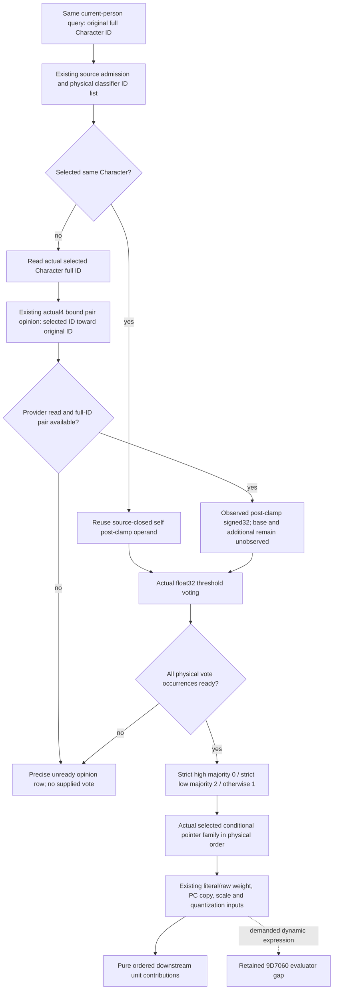

# Current pair opinion for the 2921A90 classifier

This source package extends the independently qualified
[conditional literal family](battle-person-conditional-2921a90-12004.md) for
exact CK3 1.20.0.4 / Steam25734779 / executable SHA
`98702F88A547CDE2EAF29A85F93B85F68EE4CF8148336A4F7AFAEB75319DD518`.
The source tree and contract were frozen before implementation on
2026-10-09 at 03:39 +08. All existing source bytes are reused: new EXE reads,
PE/pdata reads, hashes, Game, SDK, process, builds and tests are zero.

The classifier `2A38030` uses the selected Character as opinion owner and the
original Character as the toward receiver. Its original receiver is the
queried full Character ID, including an enemy; it is not automatically the
played Character. `25A1220(selected, original, R8=0)` returns a signed32 base.
If selected `1B0` is nonnull and selected differs from original, the caller
adds `294AB90(selected1B0, selected, original, R9=0)` with native DWORD wrap.
It then applies signed minimum `5C6A1EC` and maximum `5C6A1E8`, converts that
result to float32, and compares actual threshold bits `5C68EE0/5C68EF4`.

The already mapped 105-byte actual `28BC470` wrapper performs exactly these
same calls, argument directions, zero flags, addition and clamp. Its return is
the classifier's **post-clamp signed32 opinion**, with scale one. The existing
actual4 `ReadCharacterOpinion12004` accepts both supplied full IDs and does
not replace the toward receiver with `GetPlayer`; its parameter name is not a
player restriction. The bindable actual4 `ReadCharacterOpinion` overload uses
the same provider, resolves both full IDs, repeats the getter, and roundtrips
the IDs. Its legacy-named storage type is not a legacy EXE or hash binding.

The exact retained provider receipt is
`Z:/ck3_mod_rewrite_process_assets/g2-background-20261009/person-conditional-opinion/existing-native-provider/NATIVE-PROVIDER-REUSE.json`.
The classifier receiver and equivalence ledger is
`.../person-conditional-opinion/provider-native-tree/STAGE0-SOURCE.md`.
The 105-byte mapping is retained under
`Z:/ck3_mod_rewrite_process_assets/g2-migration-20261007/activity/guest-cost-native/gift-opinion/path-map/total_opinion_retained_cache_only-DETAIL.json`.
No fourteen-helper recursive expansion is required to consume this existing
provider. General toward-player observations are reusable values only when
their exact owner/toward IDs and frame match; they are not substitutes for an
enemy's original receiver.

## Source-backed implementation contract

The new optional same-query sibling is `following_2921a90_opinion`, schema
`xar.ck3.person-following-2921a90-opinion-12004-v1`. It retains the exact
unchanged Native44 DTO under `source_inputs`, plus independently observed
`opinion_rows`, a new classifier result, and the newly demanded selected
family's raw row inputs. The old `following_2921a90` and
`following_2921a90_conditional` contracts, reasons and partial values do not
change. This new result never edits either preceding DTO.

Each opinion occurrence records source index, availability/reason, selected
owner full ID/pointer, original toward full ID/pointer, source selection,
post-clamp integer and demanded threshold bits. Non-self base and additional
are not fabricated or split from the total. The observed total is not clamped
again. The existing float32 majority semantics and duplicate occurrences are
preserved. A failed pair read supplies no vote, classifier, or substitute zero.

The native interface is `PersonConditionalOpinion12004Bindings`,
`BindPersonConditionalOpinionImage12004`,
`ReadPersonConditionalOpinionInputs12004`, and
`SerializePersonConditionalOpinion12004`. The collector receives the existing
direct and conditional DTOs from the same sample. The new binding uses the
already actual4 `BindGiftOpinionImage` and bindable pair reader. Production
integration installs it in the existing actual4 Battle factory, reads it in
the same current-person sample, and publishes it through the existing private
serializer and battle-terminal MCP. There is no second query or action factory.

Selected PC rows reuse the existing literal observer's proven copy/scaling
contract. A small exported internal row-read/formatter seam may be added to
the old CPP without changing the old reader's control flow or output. When
the old classifier is already known, its same-sample raw rows can be reused.
When it was previously unready, the new known result demands the actual
selected array and count. The row's dynamic evaluator gap remains precise;
independently ready later rows remain available.

The new strict Python normalizer is
`normalize_person_conditional_opinion_12004` in
`battle_person_conditional_opinion_12004.py`. Its whole and row emitters are
`emit_opinion_conditional_2921a90_requests_from_current_source_inputs_12004`
and `emit_opinion_conditional_2921a90_row_requests_from_current_source_inputs_12004`.
The combined emitter
`emit_complete_opinion_2921a90_requests_from_current_source_inputs_12004`
joins the same receiver and emits preceding direct rows before new conditional
rows. No native44 self-only normalization proof is weakened.

## First qualification and scope

The new native whole fixture reuses the actual4 pair-provider binding seam
and storage/full-ID setup from
`ck3_12004_prisoner_keeper_opinion_whole_first.cpp` as source only. It must call
the production pair-reader overload, preserve getter direction and repeat
checks, and supply an original enemy ID different from the played Character.
It does not execute the old fixture or claim a raw 105-byte game function ran
inside fake memory. New minimal scenes cover high/low/tie admission, an
unavailable pair, and a demanded dynamic weight with independent later rows.
One new registered MCP compound consumes only these new original packets.
All execution is Root-only and initially **AUTHORED_NOTRUN**.

This is current evaluated pair-opinion input. It does not prove future stage
weights, fresh-model association, initializer execution, all opinions, a full
Person/Entry rebuild, live observation, or campaign completion. The already
qualified Native44 twelve bodies and both old partial leaves remain untouched.

The authored native target is
`xar_ck3_12004_person_conditional_opinion_mcp_test`; its CTest is
`xar_ck3_12004_person_conditional_opinion_mcp_first`. It writes five new original
whole packets: `opinion-high.json`, `opinion-low.json`, `opinion-mixed-tie.json`,
`opinion-provider-unavailable.json`, and
`opinion-dynamic-weight-later-ready.json`. The sole registered consumer is
`test_person_conditional_opinion_12004_registered_mcp.py::test_person_conditional_opinion_12004_registered_mcp_whole_packets`,
with `CK3_PERSON_CONDITIONAL_OPINION_12004_MCP_WIRE_DIR` pointing to that fresh
directory and `PYTHONPATH` pointing to the frozen source's
`ck3_autonomous_player/src`. Native and consumer FIRST are both NOTRUN in this
source package; Root owns their execution. Self-source rows retain the original
row's readiness, including an unready self observation, rather than manufacturing
a vote or rejecting the original partial representation.

## Native45 first qualification, 2026-10-09

Root adopted implementation `a3fe001dff2ad385a56e14fd553618a4fcaca7c3` as the
compiled full source `4606d5590213c87bb874c6304ffc01b6cb5ae69b`. Its 432 compiler
inputs passed, the five new original whole packets passed their sole native
FIRST in 0.260043 seconds, and the one registered MCP compound passed its sole
consumer FIRST in 6.6081474 seconds. The resulting DLL is 13,393,920 bytes,
SHA-256 `b7c39d0aa2f62f8a571bf750d7a56a6efd68f04ab00d6c663ae4178b22ad4190`.
These pins are reused from Root's formal qualification; this documentation
update performs no build, test, native run, or hash. The earlier authored
NOTRUN record above remains the source-delivery state before Root's FIRST.

The additive external qualification and daily/weekly fields are at
`Z:/ck3_mod_rewrite_process_assets/g2-background-20261009/person-conditional-opinion/COMPILED-REGISTERED-QUALIFICATION.json`
and `COMPILED-REGISTERED-OCT9-W41-FIELDS.json`. This subsequent documentation
commit is separate from the compiled source pin and from a future public
integration pin.

Readiness is **static-ready** for this bounded current pair-opinion production
path. The actual pair-reader overload and same-query serializer/registered-MCP
route were exercised against the five new whole fixtures; the fake-memory pair
getter is not a live execution of the game function. At qualification the game
still uses Native42 and Native45 is not deployed. Full Person, Entry, fresh-model
association, future weights and live loop remain incomplete. A demanded dynamic
`9D7060` row still retains its exact missing evaluator input while ready later
rows remain independently consumable.
