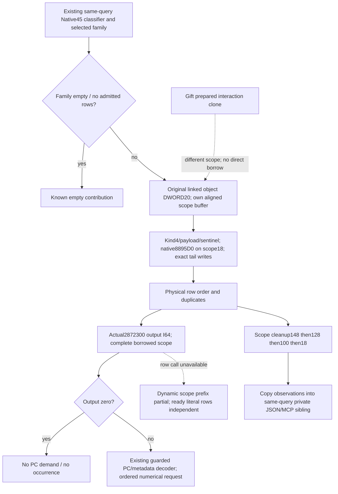

# Complete conditional caller scope and current row weights

This package closes the next input identified in
[dynamic weight reuse](battle-person-dynamic-weight-reuse-12004.md), for exact
CK3 1.20.0.4 / Steam25734779 / frozen executable SHA
`98702F88A547CDE2EAF29A85F93B85F68EE4CF8148336A4F7AFAEB75319DD518`.
Existing `2921A90`, `2872300` and `9D7060` bytes are reused. Root authorized
and performed one new frozen read `[8895D0,889652)` (130B) at
2026-10-09T04:46:37.540506Z; file-read time 0.0007890000706538558 seconds.
The worker decoded only that cache, all 130B through the RET at `889651`.
No additional EXE, PE, pdata, unwind or hash was read. Native45 GREEN was not
repeated. This source tree is recorded before implementation.

## Scope construction and ownership

The two actual caller instructions `2921BC9` and `2921DBC` call `8895D0` at
scope `+18`. The caller scope starts at final RSP `+20`; RBP is RSP `+100`.
Root initialization clears DWORD `+0`, sets WORD kind4, sets QWORD `+8` to the
zero-extended selected linked object's DWORD `+20`, and sets DWORD `+10` to
`FFFFFFFF`. That payload is not substituted with an original or played
Character ID. Classification and queried Character attribution remain separate.

The constructor receives this vector subobject in RCX and returns that same
address in RAX. It clears the vector pointer, capacity DWORD `+8` and count
DWORD `+C`, and makes subobject `+10` point to its own inline allocator at
`+18`. That allocator's vptr is actual module `448D2A0`, and its backing
allocator at `+C8` is module `54DE2E0`. The original constructor invokes its
allocator `+10` with null pointer/alignment8, then allocator `+20` with the
vector header and capacity address. Calling this exact constructor preserves
the native allocator initialization; its virtual internals are not replaced
with invented final pointer/capacity values and do not require a generic
allocator decoder for this interface.

The caller then writes the following scope tail. These writes are identical
for classifier0 and classifier2:

| Scope offsets | Actual initialization |
| --- | --- |
| `100/108` | zero QWORDs |
| `110` | module `54DE270` allocator |
| `118/120` | module `448D1F8/448D268` pointers, roles not renamed |
| `128/130` | zero QWORDs |
| `138` | module `54DE278` allocator |
| `140` | zero DWORD |
| `148/150` | zero QWORDs |
| `158` | module `54DE270` allocator |
| `160/164/166` | DWORD `FFFFFFFF`, WORD0, BYTE0 |

The highest explicit byte is `166`; the caller reserves `170` bytes before
its next independent header. The minimum explicit extent is `167` bytes.
This proves room for an aligned owned `170`-byte buffer, not a claimed C++
type sizeof `168`. No padding byte is published as a source field.

One scope survives the whole physical selected array. Each `2872300` call
borrows it and owns its separate row-name/support temporaries. Cleanup occurs
after the last row, in this exact order:

| Pointer/count/allocator offsets | Element cleanup before free |
| --- | --- |
| `148/154/158` | stride48, element vtable0 with EDX0 |
| `128/134/138` | stride20, element vtable0 with EDX0 |
| `100/10C/110` | stride48, element vtable0 with EDX0 |
| `18/24/28` | vector free; no element loop observed |

Free is allocator vtable `+10`, pointer in RDX, alignment8 in R8D. This is
owned temporary state. The new query does not execute the subsequent native
Model/header merge. Existing Gift callbacks `889700/889780/9D7340` are named
part interfaces; no whole-scope destructor signature is inferred from them.

## Concrete same-query interface

`CurrentPersonSample` and the existing conditional/opinion collectors receive
no complete native caller scope. The existing Gift named reader clones a
prepared interaction, rewrites its root, retains other interaction aliases
and destroys the clone before returning. It cannot be borrowed as this scope.
The new collector therefore owns the caller-equivalent local scope.

The planned exact4 binding contains the actual constructor `8895D0` and actual
row helper `2872300`; the latter is `int64_t*(row, out, complete_scope)`.
Its internal call instruction `2872400` targets actual `9D7060`, preserving
row `+1C0`, conditional aliases, null R9 and actual row-name provenance.
The result is signed I64 Q100000, not a PropertyContainer pointer.

The optional sibling is `following_2921a90_scope_weights`, schema
`xar.ck3.person-following-2921a90-scope-weights-12004-v1`. It joins the existing
same-query full Character ID, selected linked object, classifier, family,
physical array and raw count. Each physical row retains the unchanged
Native45 source row and publishes its separately evaluated row inputs and
numeric weight. Native44/45 source DTOs and their partial reasons do not change.
Properties for a nonzero evaluated weight use the existing guarded row/PC
decoder and metadata; zero has no property demand and no contribution.

When a demanded native row cannot execute, later dynamic rows cannot pretend
the shared scope executed that missing prefix. Independently ready literal/raw
rows remain available. A property-copy failure after a completed weight call
does not omit that call from scope history. Duplicate physical occurrences and
their numerical weights remain distinct. No cached weight or fake zero is used.

## Evidence and qualification boundary

The external packet is
`Z:/ck3_mod_rewrite_process_assets/g2-background-20261009/person-conditional-scope-8895d0/`.
It contains `held-locator/RESULT.json`, `layout-lifetime/RESULT.json`,
`query-reuse/RESULT.json`, and `constructor-8895d0/ROOT-CAPTURE-RECEIPT.json`,
`8895D0.asm` and `CACHE-DECODE.json`. The existing runtime triplet gives
`[8895D0,889652)`; the cached `.text` RVA/raw offsets are `1000/400` and the
single file offset is `8889D0`. The initial metadata lookup assumed dictionary
rows while the cached table uses triplets; that match0 attempt is preserved
and is not evidence that the function was absent.

Implementation and its new production whole/registered FIRST are initially
AUTHORED_NOTRUN. Root owns execution and any actual paused observation.
This supplies current evaluated conditional inputs; it does not reconstruct
a fresh Model, prove future weights, or complete Person/Entry or a campaign.

## Authored production and first acceptance

The new exact4 factory and collector are in
`ck3_12004_person_conditional_scope_weights.hpp/.cpp`. `BindBattleImage`
installs their binding, and `CurrentPersonSample` joins the already observed
direct and opinion leaves in the same terminal sample. The optional DTO is
serialized through the existing whole private battle command. The main Python
normalizer and registered MCP consume that same sibling; no additional query,
SDK dispatch, action or Service route is introduced.

The original conditional implementation gains only an appended
`ReadPersonConditional2921a90RowWithWeightInputs12004` function. It preserves
guarded expression operands, applies the observed native weight, and reads
properties only when nonzero. Original Native43/44/45 leaf contracts and
readers remain as their qualified sources. The new independently observed
row joins physical index and object identity; it does not demand invented
equality between every separately read expression field. Source-only rows
still retain exact original row equality.

The sole new full-Bridge target is
`xar_ck3_12004_person_conditional_scope_weights_mcp_test`; its CTest is
`xar_ck3_12004_person_conditional_scope_weights_mcp_first`. It writes five
original whole command packets into a fresh directory:

- `scope-dynamic-ready.json`
- `scope-dynamic-zero.json`
- `scope-literal-only.json`
- `scope-family-empty.json`
- `scope-prior-row-unavailable.json`

The new registered compound is
`test_person_conditional_scope_weights_12004_registered_mcp.py::test_person_conditional_scope_weights_12004_registered_mcp_whole_packets`,
using `CK3_PERSON_CONDITIONAL_SCOPE_WEIGHTS_12004_MCP_WIRE_DIR` and the frozen
source `ck3_autonomous_player/src` on `PYTHONPATH`. It passes the unmodified
whole native bodies through NativeDriver, the main normalizer, Service and
registered MCP before the emitters. An emitter wrapper explicitly joins the
preserved outer row Character ID. Root executes the unique new native run and
consumer once; the author status is AUTHORED_NOTRUN. No old qualified cases
are rerun.

R81 actual011 for Robert29829 and opponent31050 published a known bypass:
`admitted=false`, `selected_family=not_demanded`, zero selected/opinion rows,
and no classifier or scope evaluation. Its source joins are valid evidence
for that bypass only. It is not a live numerical pair or a demanded dynamic
weight failure, and this package does not change that recorded boundary.

## Native47 first qualification, 2026-10-09

Root's actual attempt03 is GREEN, with compiled and Python qualification source
`e5fd088cde640b0a1ea29ff40888af95d9300c95`. This is distinct from author
implementation `937419ecbb92a326d7372a2174a5ef79a8ebc7ea`, typed-literal fix
`f77a0d52bd002af8f9b10acbc410f4d85ad7f867`, and this later documentation commit.
The retained 501 successful production compiles and fixture object keep their
physical source/header pin `a2771c6016247e73d689c4bb8a825d334928bb44`.
Only the new scope TU was recompiled at `e5fd`; the source change is the
`std::uint16_t{4}` assignment to the optional scope kind. No header, fixture,
ABI, schema or `/WX` change was made for that retry.

The completed production closure is 734 owners: Bridge299, Runtime434,
Protocol1. Root reused the 501 successful compiles and one fixture compile,
compiled only the corrected TU in 1.314474 seconds, created a fresh Runtime
archive in 0.4558859 seconds, linked the DLL in 0.9962398 seconds and linked
the fixture in 0.8686764 seconds. The unique native FIRST wrote five original
whole packets in 0.2495983 seconds; their sole registered MCP compound was
GREEN in 5.7521767 seconds. Completion was
2026-10-09T05:55:42.972524Z / 13:55:42.972524 Asia/Shanghai. No old FIRST was
replayed and no Game/SDK call occurred in qualification.

The actual result is
`Z:/g2-native47-build01/attempt03/ROOT-NATIVE47-RESULT.json`; the canonical is
`Z:/ck3_mod_rewrite_process_assets/g2-background-20261007/upstream-build-migration/entry-live-fix47/ROOT-PARENT-RUNTIME-INCREMENTAL-DLL.json`.
It pins `Z:/g2-native47-build01/attempt03/binaries/xar_ck3_bridge.dll`,
13,416,960 bytes, SHA256
`c8b3f4a20554bbb888ec39cc49bf33e801fa36384085a51db4d1741d5c683494`.
Its manifest is 2,547 bytes, SHA256
`d4b9170f6bb4e8ec5a4d40d214c8ac289a50964a1f22082dd15dcb0499089981`.
These are the existing Root pins; the documentation author did not hash them.

Attempt01's process-start harness RED remains in
`runtime47-person-later-suffix-preparation/ROOT-ATTEMPT01-PROCESS-START-FAILURE.json`.
Attempt02's actual C4244/C2220 compile RED remains in
`runtime47-person-later-suffix-preparation/ROOT-ATTEMPT02-COMPILER-FAILURE.json`
and `Z:/g2-native47-build01/attempt02/logs/compile-502.log`. Their original
receipts and the author's AUTHORED_NOTRUN records are preserved. The new
qualified receipts are separate.

This bounded same-query current numerical capability is now static-ready.
The five scenes use explicit offline constructor/getter/allocator callbacks;
they do not prove a dynamic expression was executed in CK3. The running game
still uses Native46, Native47 is not deployed or live, and full Person/Entry,
action, campaign and G2 completion credit remain false.
