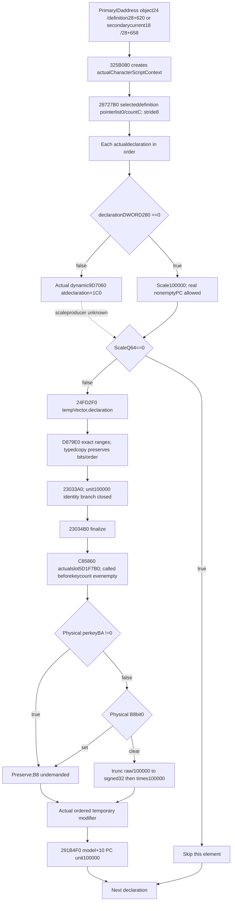

# 325B080 admitted nonempty declaration producer

Frozen CK3 1.20.0.3 /Steam25652598 /recordedEXESHA94B55397ABB687A3DCD436805A5D885E6BE90FA6C693FEB44A9E3BBEEADE02A6. Source only; prior708-B and219-B packets remain unchanged. Parent owns rule43 and predicate source; this lane does not read those.

## Actual whole-ID-address ABI

325B080 complete175-B body[325B080,325B12F) normalRET B12E saves incomingRDX definition andR8 temporary vector. It passes incomingRCX **whole CharacterDWORDID address** as RDX to9F9E20(stackScriptContext,IDAddress); returned context is R8 of **28727B0(temporaryVector,definitionBlock,ScriptContext)**. Primary caller supplies DiacDWORD24 address/DiacQWORD28+620; secondary supplies currentCharacterDWORD18 address/DiacQWORD28+658. Neither argument is a Character pointer. Cleanup affects the caller-owned context only and returns no numeric property row throughRAX.

## Exact definition header and source order

Actual28727B0 complete chained body is[28727B0,2872840),144 B (36+93+15), normalRET283F. Selected definitionblock is **QWORDpointer0/signedDWORDcountC**, a list of **QWORDdeclaration pointers with stride8**. Native end pointer is data+signedcount*8; only count0 is a proved empty list. Negative counts are not declared empty.

Each actual declaration pointer, in source order, goes through2872320(declaration,outScale,actualScriptContext). Scale0 skips the entire temporary modifier element. Nonzero scale performs24FD2F0(tempVector,declaration), then23033A0(returnedRow,scale), then23034B0(returnedRow), before advancing the pointerlist by8. Negative scales are not clipped or skipped. Nearby cached2872840 instead walks inline2B0 declarations; it is a counterpart, not the function called here, so its header is not used as an alias.

## Deterministic positive scale branch

2872320 complete380-B body[2872320,287249C) normalRET249B first tests **declarationDWORD280**. Zero immediately writes signedQWORD**100000** to the caller's output and returns. The actual CharacterScriptContext is numerically undemanded on this branch. This is a source-defined unit scale for a potentially **nonempty** declaration; it does not skip the row.

Nonzero280 constructs evaluator/profiler inputs and calls **9D7060(declaration+1C0,outScale,scope-environment,tooltip0,extra-environment)**. That is the precise dynamic scale seam. No literal getter from an unrelated ScriptValue/NamedValue ABI is substituted, no evaluated number is supplied by the caller, and no expression catalogue is expanded.

## Actual source property arrays and unit identity

Cached23033A0 entry[23033A0,23033BC) and exit[23034A3,23034A8) prove scale100000 immediately jumps to ADD RSP8/RET, leaving the copied row's numerical values unchanged. Cached continuation reads QWORDvalues atrow+**68**, signedcountDWORD**74**, end=data+count*8 and signedQWORD entries. This is the actual modifier's parallel int64 value array, **not another context'sD0 field**. Property ID array is modifierQWORD0 /countDWORDC /uint16 stride2, as the already cached291B4F0 ID copy shows.

Therefore the smallest positive raw input is a real selected declaration whose **DWORD280=0** and source property countC is positive with actual uint16 IDs and corresponding signedQWORD values from68. The ordered pointerlist and raw arrays can be observed without a stack temporary or native callback. Source-defined unit scaling does not require any dynamic evaluator, mapper callback or guessed property meaning. Existing source keys/raw values retain their physical identity; no arbitrary six-stat conversion is proposed.

## Complete copy/append shell

Parent authorized only the actual post-scale bodies.24FD2F0 complete[24FD2F0,24FD417),295 B, appends a1C0 element to the selected temporary vector and returns the address of its last element. If countC equals capacity8 it grows storage, constructs the new element at the prior count ordinal, relocates old elements and updates vector ownership. Otherwise it constructs at existing data+count*1C0 and increments count. Source declaration is the incomingRDX.

In both branches, **D879E0(destinationModifier,sourceDeclaration)** is the actual copy constructor. Its now-captured complete180-B body[ D879E0,D87A94) captures source IDspointer0/countC beforeCA1870, then passes the exact uint16 range[start,start+count*2] toD87880 with the initialized destination count. It separately captures source valuespointer68/count74, initializes destination68 viaCA18F0, then passes the exact QWORD range[start,start+count*8] toB73DC0. Remaining fields are string190/sharedobject1B0/refcount/flags1B8 metadata; there is no property mapping, arithmetic or value filter in this copy-constructor body.

Allocation callbacks/169A8E0 storage ownership and170F370 relocation are separate from the source numeric recipe and are not generically expanded. Final authorized complete typed insert bodies are **D87880[D87880,D879D7),343 B** and **B73DC0[B73DC0,B73F47),391 B**, both below0x800. Uint16 insertion transfers exact source start/bytecount through44226880. QWORD insertion has direct MOVQWORD[source]→MOVQWORD[dest] loops preserving all64 bits and source order. Growth copies old prefix/source range/old tail. The constructor passes the insertion ordinal equal to destinationcount, so the old tail is empty; typed in-place range mechanics cannot create a different property mapper or value arithmetic. No allocator/rotation/string/refcount catalogue is expanded.

## Complete finalize quantization

23034B0 complete chained[23034B0,2303574),196 B (30+160+6), normalRET3573. It first gets the property metadata provider from **C85860**, then loops signed modifier keycountC. For each uint16 key, FFFF selects actual static metadata**5451F40**; otherwise metadata is **providerQWORD50 +key*0xC8**. C85860 complete87-B body[C85860,C858B7) loads actual provider QWORDslot**5D1F7B0**. Nonnull returns directly. Null calls diagnostic3F8B660 then reloads the same slot; there is no TLS guard, initializer or synthesized empty/default metadata provider in this getter. A demanded null provider is unavailable; no callback is executed. It is not aliased to a traits/context mapper from another ABI.

Actual demand is **BA first**:351D CMP BYTE[metadata+BA],0;3524 JNE3557. **BA!=0 skips the B8 read entirely**, leaving that value unchanged. OnlyBA==0 reads BYTEB8 at3526; B8bit0 set also preserves. Thus rawmetadataB8 is genuinely null/undemanded whenBA!=0. IfBA==0 andB8bit0clear, finalizer reads signedQWORDvalues68[ordinal] and performs:

`finalRaw = sign_extend_i32(trunc_toward_zero(raw /100000)) *100000`

The source uses signed128 high multiply by29F16B11C6D1E109, SAR14 and sign correction for division; CDQE at354B intentionally retains only signed low32 quotient; IMUL100000 follows. This is genuine numeric quantization, not metadata-only finalization. Raw integer100000 multiples in signed32 range remain unchanged regardless of the two flags; other values require actual observed flags to determine whether to quantize. Negative values truncate towardzero. No float rounding, clamp or invented property meaning is applied.

Thus the minimum positive unit-scale path now has closed header/order, literal unit scale, exact source array ranges, physical mapper binding/perkey flags and final arithmetic. Actual raw ID/value pairs from a nonempty selected declaration plus its demanded perkeyBA/B8 bytes produce the independently useful finalized numeric rows. Rule43 selection remains a separate parent-owned prerequisite for a complete2920D60 stage; it is not guessed true from a condition count. Dynamic9D7060 is bypassed by actual280=0.

Cached291B4F0 then makes one unit100000 request per actual resulting1C0 vector element in order, targetingmodel+10. Empty outer vector has0 occurrences; an existing emptyPC element still has one occurrence. Its source+68 container copy is not evidence for a D0 array.

Fresh initial source prefix **951 B =699code+252pdata** remains unchanged in its receipts. Postscale addition is **611 B =491code+120pdata**; mapper/copy addition is **267 B=267code+0pdata**. That1829-B prefix is preserved in `sealed-prefix-1829/`. Final typed-transfer addition is **842 B=734code+108pdata**. Cumulative fresh cost **2671 B =2191code+480pdata**. Cached scaler/ID-copy source remain separate reuse. No parentrule43, dynamic9D7060 or generic allocator/relocation catalogue was captured.

# Minimum nonempty raw input proposal

Source-only appendix, no production schema/code. Continue the selected true family of following_diac_2920d60; do not add another zero-only stage. Parent's real rule43 producer must decide primary620/secondary658 before these inputs are selected.

Actual source groups:

1. Selected family and actualscopeID address/value: primaryselectedDiacDWORD24 orsecondarycurrentDWORD18. Preserve actual whole fullID, not a low24-only Character ID and not a Character pointer.
2. Actual selected DiacQWORD28 plus exact block620/658. Read pointerlistQWORD0, signedcountDWORDC and each ordered declaration pointer atstride8. Preserve original ordinals and duplicate pointers.
3. For each demanded declaration, observe DWORD280. Actual0 means source-defined scale100000 and makes the dynamicScriptValue+1C0 undemanded. Actualnonzero retains specific9D7060 scale-source missing until its raw producer closes; do not accept arbitrary caller-supplied effective scale.
4. For each real nonzero-scale declaration, read physical sourcePC IDspointer0/countC/uint16stride2 and actualQWORDvalues68/count74/int64stride8. Keep complete key/raw row order, actual legal signed values, and known zero values. At least one real key/raw pair supplies the required nonempty path. No fake stacktemporary row, contextD0 layout or literal numerical contribution is invented.
5. Actual24FD2F0 append shell, D879E0 exact scalar ranges and23034B0 numeric finalize are closed, including typed range copies preserving bits/order. Actual metadata provider is QWORDslot5D1F7B0; finalizer callsC85860 BEFORE reading/testing keycountC, so provider slot is observed even for a real selected literal modifier with empty keys. Indexed descriptor is providerQWORD50+key*C8; FFFF uses actualstatic5451F40 and does not dereferenceprovider50. Read physicalBYTEBA first. BA!=0 preserves and makes BYTEB8 genuinelyundemanded/null. OnlyBA==0 readsBYTEB8; bit0set preserves, clear quantizes viaexact signed trunc(raw/100000), low32 signedquotient, times100000. No arbitraryquantizer bool orinitializer/defaulttable is supplied. Pure fold produces ordered finalized numeric rows from genuine rawsources.

The unit100000 scalar branch is already source-closed and leaves the copied values exactly unchanged. It releases the dynamic scale dependency on the smallest positive subset, while retaining copy/finalizer demand. Literal/nonempty production value is the priority; no broader dynamic9D7060 catalogue is needed for this subset.

Suggested field grouping under the eventual real Diac contract: `selected_definition_declarations` with rawblock/header/ordereddeclaration witnesses, `scale_gate_280`, physical `source_property_rows`, and source-defined copied/finalized rows only after that effect is closed. Parent/native_scope own the CharacterScriptContext recipe; no constructor callback is needed for280=0 numeric evaluation. No implementation or arbitrary evaluated-row interface is provided here.

For the minimum, every selected demanded declaration uses actual280=0; there is no need to call nativeScope9F9E20, producer325B080,2872320, copy helpers or finalizer. Maintain source family/whole scopeID24/18 as raw identity. The resulting numeric rows are an independent producer value; overall2920D60 readiness still waits on parent's genuine rule43 selection. No empty-count earlytrue rule is invented.

One meaningful future fixed-frame case can contain source key5/raw150000 with actualBA0/B8bit0clear ->final100000, key6/raw-150000 with actualBA1 ->final-150000, and another source declaration retaining order with a real100000 property. These are source-derived fixture inputs and expected arithmetic, not an observed game frame or arbitrary effective-row contract. The final strict schema should retain provider/descriptor physicalsource and rawflag bytes alongside the numeric result.

## Sealed raw numeric delivery

Externalpacket `Z:/ck3_mod_rewrite_process_assets/g2-background-round4-20261005/person-tail/following2920d60-source/nonempty-numeric/producer325b080` includes SOURCE-PINS.json, READ-COST.json, RAW-LITERAL-NUMERIC-ABI-PROPOSAL.json and reportfields. This is an independent finalized numeric producer source recipe; wholeDiac rule43 readiness, implementation, fixture and live qualification remain separate. No callbacks, tests, builds, Git or game activity occurred.

## Released independent interface before implementation

Parent froze `nonempty-numeric/FINAL-NUMERIC-RAW-SCHEMA.json` before the new code. The independent API follows actual325B080 arguments: whole Character DWORD-ID **address**, plus the already selected definition block. It observes that source in `xar::ck3_12003::ReadDiacLiteralNumericInputs12003`; exact-build factory `BindDiacLiteralNumericInputs12003` binds mapper5D1F7B0 and sentinel5451F40. Dedicated header/source/fixture have no central bridge, current-person DTO, shared main-normalizer or CMake edits. Source declaration order and duplicate pointers are retained; no real temporary pointer or gate result is invented.

Raw top fields retain actual scope fullID/address identity, block identity, pointer-header presence/count and ordered declarations. Each declaration retains DWORD280, physical source property arrays, actual metadata provider presence, ordered per-key metadata identities and BA/B8 bytes. BA nonzero leaves B8 genuinely undemanded. The minimum uses an actual loaded mapper; a null provider is a precise unavailable input without a callback or default table. Nonzero280 remains `dynamic_scale_9d7060` with no arbitrary supplied effective scale.

The strict production contract `normalize_diac_literal_numeric_inputs_12003` and pure whole/independent-row emitters `emit_diac_literal_numeric_requests_12003` /`emit_diac_literal_numeric_row_requests_12003` derive finalized PC rows from the raw arrays and flags. Derived PC identities are explicitly labelled as calculations from the source declaration. Each ready literal declaration gives one existing unit100000 contribution request, including a real empty-PC declaration. Whole readiness requires all selected declaration inputs; independent row output remains available when another declaration is dynamic or unreadable. No scope constructor, predicate, builder, allocator, copy routine or finalizer is executed by the observer.

The independent numeric observer can publish useful nonempty values. Whole2920D60 selection still requires the actual rule43 predicate, and this API does not select primary/secondary by a caller-supplied Boolean. One genuinely new compound production-contract case and one isolated fake-memory producer target are planned; Root alone integrates or compiles the new target. Original708-B caller and2671-B producer source receipts remain immutable, with separate243-B rule-loader cost.
