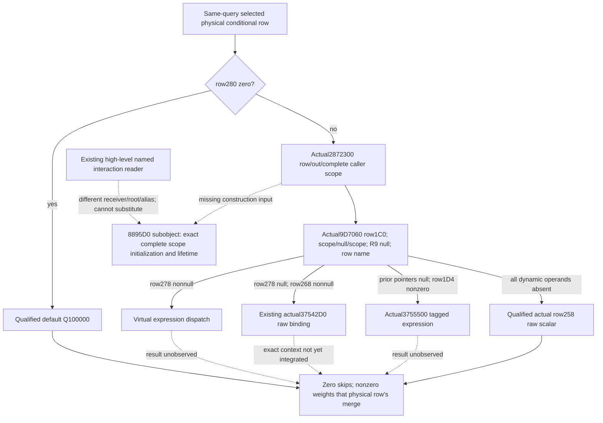

# Conditional row dynamic weight: the next concrete input

This source-only package follows the static-ready
[Native45 pair-opinion input](battle-person-conditional-opinion-12004.md).
It uses exact CK3 1.20.0.4 / Steam25734779 / the existing executable SHA
`98702F88A547CDE2EAF29A85F93B85F68EE4CF8148336A4F7AFAEB75319DD518`.
No new EXE, PE, pdata or hash was read. Native45's five whole packets and sole
registered consumer were not repeated. The complete relevant function bodies
were captured in the earlier conditional package and are reused as evidence.

## Actual entry and numerical demand

`2872300` is the actual numerical row-helper **function entry**, complete
`[2872300,287247C)` (380 bytes). The calls at `2921C82` and `2921E72` supply
the physical conditional row, an output I64 address and the caller scope.
`2872400` is an E8 **call instruction inside that function**, targeting the
distinct actual evaluator **entry** `9D7060`, complete `[9D7060,9D7334)`
(724 bytes, final RET at `9D7333`). Neither address is an inferred version shift.

The scalar output is a signed I64 Q100000 weight. Row DWORD `+280` zero writes
`100000` without evaluation. Otherwise `9D7060` receives `row+1C0`, the I64
output address, an internal context with aliases `{scope, null, scope, support}`,
null R9 and a fifth argument containing the actual row-name descriptor.
The caller scope has kind4, a zero-extended linked object's DWORD `+20` as
payload at scope `+8`, and `FFFFFFFF` at `+10`. That payload is not automatically
the played Character or the original queried Character.

Demand proceeds through row `+278` virtual expression, then `+268` scoped
expression (`37542D0`), then nonzero row `+1D4` tagged expression (`3755500`).
Only when those operands are absent is row `+258` the actual raw weight.
R9 is null, so the evaluator's generic random/range branch is unreachable in
this caller. Zero output skips the following per-row property merge; nonzero
output is the weight for that physical row's contribution. A readable raw
scalar does not substitute for a demanded evaluated weight.

## Existing binding reuse and the shortest new interface

The tracked actual4 `GiftNamedOpinionBindings12004` already holds support
constructors `3736040/3735F90`, intern helpers `3F79B00/3F79DD0`, teardown
`9D7340`, flag `5D1DADC` and the raw five-argument scalar evaluator `37542D0`.
These are useful low-level bindings. Its high-level
`ReadNamedInteractionFixed12004` performs named-definition lookup and clones
an interaction scope whose root is rewritten to a supplied Character ID.
Its internal alias `+8` is nonnull, whereas this conditional context's alias
is null. Matching callback types and descriptor layouts do not make those
receivers interchangeable.

The minimal proposed API is:

```cpp
bool ReadPersonConditionalRowWeight12004(
    const ConditionalRowWeightBindings12004& binding,
    const void* physical_row,
    const void* borrowed_complete_conditional_scope,
    int64_t& weight_q100000) noexcept;
```

The exact4 native getter would bind actual `2872300`, whose original body owns
the support objects, row-name lookup, dispatch and teardown. This avoids
reimplementing a generic expression decoder or fabricating its provenance
name. Its native ABI is `int64_t*(row, out, complete_scope)`. The remaining
construction input is the complete caller-equivalent scope's initialization
and lifetime, including the original `8895D0` subobject. The current row DTO
does not supply such a scope. The named interaction scope cannot replace it.
The scope initializer is the next unique source entrance; no repeat read of
`2872300` or `9D7060` is needed. No new scope initializer extent is asserted here.

If only the scoped `+268` branch is later implemented, the existing raw
`37542D0` binding can be used with the unchanged conditional receiver,
internal aliases and actual row-name descriptor. Calling original `2872300`
is the smaller full-dispatch interface once the complete scope is available.



## Receipts, proposed FIRST and boundary

Exact cached source locators and the ABI ledger are in
`Z:/ck3_mod_rewrite_process_assets/g2-background-20261009/person-dynamic-weight-reuse/held-entry/RESULT.json`.
The tracked provider comparison and full Mermaid input ledger are in
`.../person-dynamic-weight-reuse/provider-source/SOURCE-REUSE.md` and `RESULT.json`.
The original captures remain under
`.../person-conditional-2921a90/evaluation/source-2872300/` and
`evaluation/source-direct-evaluator/`. Existing source-entry checks cost zero
new capture bytes. A cancelled, misparsed worker `rg` command was discarded
and is recorded in the held-entry receipt; its output supplies no evidence.

No implementation or test was authored in this source-only follow-up.
After the scope input closes, a new focused whole fixture can check the native
row pointer, original complete scope, I64 output, actual zero/nonzero occurrence
and independent later rows through the existing same-query MCP. That recipe is
NOTRUN and does not reuse Native45's FIRST as dynamic-weight qualification.
Current dynamic branches remain partial. No fresh-model, complete Person/Entry,
calendar, live or campaign capability is promoted.
