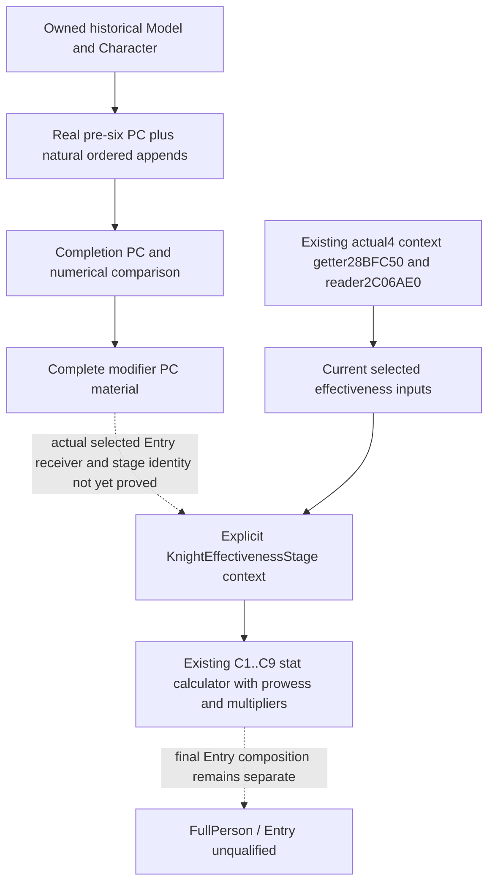

# Person preparation aggregate to Entry context handoff, actual 1.20.0.4

Oct10 / ISO2026-W41. Native64 and Native65 close one real historical numerical input: the pre-six aggregate, natural ordered weighted appends, independently copied completion aggregate, and preparation Model/Character owner. This note selects one subsequent functional seam; it does not enumerate a hypothetical complete-Person prerequisite list.

Exact build remains CK3 1.20.0.4 / Steam25734779, reused EXE SHA `98702F88A547CDE2EAF29A85F93B85F68EE4CF8148336A4F7AFAEB75319DD518`. No EXE bytes, old body, game, SDK, process or test are read or executed for this continuation. Native65 is offline-qualified at `eb0eeba0074f7a9ebccb59c2cdf51ce2cd6bf908`; current live Native60 is unchanged.

## Closed value and actual consumption boundary

`compose_captured_six_stage_postimage_12004` returns the actual ordered property keys/signed64 values after starting with the observed baseline and applying only naturally captured requests. Its completion comparison remains independent. `emit_captured_person_preparation_model_12004` associates that exact capture with Model=C−0x10, Character=QWORD[Model+8], and aggregate=C+0x68=Model+0x78 before the first original count callback. This makes the historical modifier block a usable numerical input rather than a reconstruction from a later current Model. Earlier Government/Title decomposition is not required to calculate this observed block.

The finite tracked simulation reference lookup found no production caller of the postimage composer. Thus the closed block does not yet grant an ordinary battle decision, Entry replacement or terminal forecast. Its independent value is an exact same-owner historical modifier result whose numerical composition can be compared with the real completion PC. This is stronger than a raw census, but it is still an input to the next selected-context calculation.

## One existing stat seam

The existing software path is `battle_first_contact_final_stat_refresh_12003.py`: `KnightEffectivenessStage12003.context` (line36) belongs to `KnightStatStageInputs12003` (line70). `effectiveness_from_person_stage_12003` (line237) and `knight_inputs_from_person_stages_12003` (line255) connect an explicit stage to `compute_knight_stat_cache_at_stage_12003` (line292). That calculator demands `context_value(C1..C9,mode0)`; it explicitly does not demand weighted source rows. The completed aggregate supplies sufficient PC material once the actual selected receiver/stage relationship is proved.

The normal current-knight adapter, `knight_inputs_from_current_observation_12003` (line268), instead consumes `member.effectiveness_context`, linked prowess and loaded damage/toughness multipliers. `battle_current_special_knight_value_12003.py:50` is an existing caller. No new action or planner rule is needed to name this seam.

Actual4 `ck3_12004_combat.cpp` already binds `get_knight_effectiveness_context` to **28BFC50**, `read_knight_effectiveness` to **2C06AE0**, and the loaded multipliers to **5C699A8/5C699B0**, with `knight_model_association_enabled=true`. These callbacks are not unmapped. The held factory source index is `native_bridge/research/ck3_1_20_0_4_general_combat.json`; its shared proof locators include `g2-parallel-20261007/battle-pursuit/migration-steam25734779/actual4-domain/combat-map/pass01/FAMILY-MAP.json` and `g2-parallel-20261007/adopted-lifestyle-building-faction-12004/faction/leaf01/FAMILY-MAP.json`. No source proof body is replayed here.

The old12003 Entry caller **2C06D30** uses Character+EC and an immediate-liege receiver into **2C06B00**. That remains an old-build source fact. The current actual4 getter and reader bindings do not by themselves prove that Entry selects this captured preparation Model/context, or which linked Character supplies the effectiveness stage. The actual4 Entry CALL instruction RVA is **NOT_HELD** in this finite source packet; no shifted address or final-current Model proxy is supplied.

## Smallest next construction

Recover the actual selected Entry receiver/context handoff from the existing Combat source packet or its exact cached caller, then publish that relationship through the existing same-MCP observation family. Reuse the existing Character identity, captured preparation Model/context, sequence and existing effectiveness operands. The required new fact is the native-selected relationship between those objects/stages, not another list of earlier modifiers. When that relationship is positive, a narrow adapter can supply the completed aggregate to the existing explicit stat-stage input and preserve current observation as a distinct source.

No additional native span is requested by this note: an exact actual4 caller entry/window must first be supplied by the held source index. No fresh private native call, guessed RHS context, empty baseline, new readiness restriction or speculative full-history architecture is proposed. FullPerson/Entry and ordinary battle decision readiness remain unqualified for this specific unconnected consumer seam; their completion is not conditioned on decomposing every earlier contribution again.

Compact finite evidence is `BG10/person-after-native65/consumer-frontier/RESULT.json` and `BG10/person-after-native65/native-frontier/RESULT.json`. They retain the source anchors and old/new-build distinction. Worker source research only, no old Green replay and no G2 credit.
