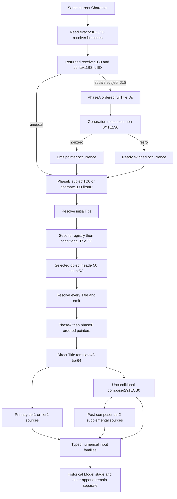

# Actual first Title-pointer vector in the current Person query

This input precedes the [local Title family](battle-person-local-title-inputs-12004.md)
inside actual `291E3A0`. It supplies an ordered, potentially duplicate set of
Title pointers whose primary, composer and supplemental property sources enter
the same Person calculation. An empty local Title list does not prove this
first vector empty. The observer reads these actual source members through
the existing character query; it does not execute the native producer.

The exact build is CK3 1.20.0.4 / Steam25734779, retained EXE SHA-256
`98702F88A547CDE2EAF29A85F93B85F68EE4CF8148336A4F7AFAEB75319DD518`.
Root alone performs executable captures and qualification. The author performs
no Game, SDK, process, executable read, hash, compilation, import or test.

## Source tree before implementation

The retained helper stages `RDX=&temporary header` at `291E46E`, the current
Character in RCX at `291E473`, and calls actual `2B986B0` at `291E476`. It
consumes QWORD header0 and signed DWORD countC, then ordered pointer8 elements.
Count0 continues to the later local Title family at `291E73A`.

Root captured `[2B986B0,2B988C0)` once:528 bytes,145 instructions, all non-call
edges internal and sole `RET2B988BF`. The exact captured runtime row was held
before the read; this is an actual target, not a shifted old RVA. Evidence:
`Z:/ck3_mod_rewrite_process_assets/g2-background-20261009/person-merged-helper-first-vector/actual-producer01/SOURCE-CAPTURE.json`.

The first call, `2B986C8 CALL28BFC50(Character)`, returns the receiver whose
QWORD1C0 selects phaseA. The complete118-byte getter is an adopted cache reuse:
`C:/codex-ck3-background/packets/religion-addons-12004-migration-20261007/context-hostility-conversion/named-leaf05/leaf_28BFC70-DETAIL.json`
and `upstream-build-migration/shared-span-cache/new-028BFC50-028BFCC6.bin`.
Its source name is immediate_liege, but the collector follows its actual
memory branches. Context and linked candidate validity can return the original
input Character. Its registry path uses CharacterDb5C67568/fallback5C67570 and
the complete Character ID18; the context branch separately validates the
candidate's magic1C and ID18. The returned receiver is not replaced by the
subject, and legal original-self fallback is retained.

PhaseA compares returnedContext DWORD1B8, or FFFFFFFF for a null context, with
the subject's complete ID18. Equality traverses returnedContext's inline
header1E0, or static inline5459C88. Each Title uses registry5D1DAF8 and
fallback5D1DAE0 with the existing generation join. This branch tests the
registry before loading each list ID: a null registry makes that ID undemanded
and selects fallback. Only selected Title BYTE130 **nonzero** emits its pointer.
There is no local-family DWORD12C exclusion.

PhaseB always follows phaseA. A non-null subject1C0 consumes its first full
Title ID only when count1EC is nonzero; zero count selects FFFFFFFF. Only a
null1C0 permits the alternate subject1D0 root and its array68/count74. The
initial ID is demanded before the Title registry test. A non-null second
registry5D1DF10 then demands the resolved initial Title's full DWORD330;
otherwise fallback5D1DF00 is selected without that read. The selected second
object's QWORD50 and signed DWORD5C form another full-Title-ID list. Every
resolved Title emits, with no130/12C filter. Its per-list registry test again
precedes the ID read. PhaseA emissions precede phaseB emissions.

Each emitted pointer directly supplies Title template48/tier64. The consumer
has no intervening local-Title full-ID, BYTE130 or DWORD12C admission wrapper.
Tier1/2 primary sources, unconditional per-occurrence `291ECB0` composer and
post-composer tier2 supplemental inputs reuse their source-closed algorithms.
Constituents fold at explicit inner100000. The actual main helper accumulates
primary and supplemental sources into one local PC, while each composer has
its own per-occurrence composite and outer append. No two-argument outer
wrapper weight or historical Model78 stage is inferred here.

The producer calls `880340(outvector,&selectedPointer)` for each emission.
The retained62-byte prefix ends before its return and has a branch to8803ED.
Finite continuation caches111+54 bytes missed; Root subsequently captured
only `[88037E,880423)`165 bytes once. Evidence is sibling
`actual-append02/SOURCE-CAPTURE.json`. Joining the retained prefix and actual
tail closes `[880340,880423)`,227 bytes, with sole `RET880422`. The prefix compares count+C with
capacity+8: inequality jumps to direct append, equality enters growth. Both
paths store the incoming QWORD at oldcount*8 and increment count; growth
first copies the existing oldcount*8 bytes. There is no uniqueness filter or
reordering. Native allocation and OOM execution are not prerequisites for a
read-only reconstruction of source members.

## Useful capability and boundaries

The new optional same-MCP sibling is
`current_person_state.following_291e3a0_first_title_vector`. It retains the
actual selected receiver, two phase roots and demand distinctions, resolution
and emission decision for each source occurrence, complete ordered emitted
pointers when available, and independent numerical primary/composer/
supplemental families per emitted occurrence. Known zero and unread inputs
remain distinct. No new tool, argument, capability flag or native action is
introduced.

`source_inputs_ready` and `producer_ready` describe complete source resolution
and emission decisions, independently of numerical PC read failures. Complete
production order publishes `emitted_element_identities`, preserving phaseA
before phaseB and every duplicate. The three numerical family readiness fields
then describe the demanded primary, composer and supplemental operands. A
partial sibling does not erase an observed emitted occurrence with complete
PCs. A known nonempty numerical input makes `family_known_zero=false`; true
requires a complete vector and every demanded family known empty.

`compose_first_title_vector_inputs_from_current_source_inputs_12004` uses the
existing source-derived fixed-point merger. It returns one main property
block for ordered primary and supplemental constituents, plus ordered separate
composer blocks with their source phase/index/pointer and observed nonempty
append demand. Selecting one phase/index explicitly limits the main block to
that independently complete occurrence and sets `complete_vector_input=false`.
It does not infer an outer append weight or execute a Model mutation.

The typed sibling belongs in a distinct domain header. It is not carried in
the local Title ID list or a mapped-PC record with a different meaning. The
public optional member changes the carrier layout honestly; Root determines
the necessary header owner projection from actual dependencies.

This closes a genuine missing numerical input family. FullHelper, FullPerson,
Entry execution and live gameplay remain false. In particular, the helper's
historical post-callback Model stage and final outer contribution are not
replaced with a current final aggregate. The user's21:07 Asia/Shanghai
2026-10-09 local-game prohibition remains in effect. The author did not
execute the new source or fixtures. Root subsequently
qualified Native59 offline as recorded below; this does not change the live
or complete-helper boundary.

The cumulative necessary source ledger was5475 bytes in15 Root reads before
this family;528 producer bytes plus165 append-continuation bytes make6168
bytes in17 reads. Getter118 and append prefix62 are retained cache reuses.

## Unique qualification

The new CMake leaf explicitly registers
`src/ck3_12004_person_first_title_vector.cpp` in the real Runtime target and
adds `xar_ck3_12004_person_first_title_vector_mcp_test <wire-directory>` with
the qualified full Bridge/Runtime closure and unchanged /W4 /WX settings.
Its six new whole-command worlds cover:

- A distinct returned receiver and phaseA's nonzero130 admission, with duplicate
  emitted pointers and duplicate numerical constituents.
- Declined phaseA followed by direct phaseB contributions that do not demand
  local130/12C exclusions.
- Null Title registry with intentionally unread per-list IDs, while the
  separate mandatory initial phaseB ID remains observed.
- Full-generation mismatch selecting fallback, with occurrence order retained.
- Partial composer values with complete produced pointer order and a ready
  independently selectable sibling.
- A negative second-list count with a useful, independently complete phaseA
  occurrence and no fabricated complete pointer vector.

The sole registered compound is
`tests/unit/test_person_first_title_vector_12004_registered_mcp.py::test_person_first_title_vector_12004_registered_mcp_whole_packets`,
using `CK3_PERSON_FIRST_TITLE_VECTOR_12004_MCP_WIRE_DIR`. It consumes all six
unchanged whole bodies through the actual registered MCP callback and ordinary
Driver normalizer, retaining all five required nullable/request arguments.
It checks the Character-ID join, exact source direction, phases, pointer
duplicates and the signed64 numerical projection, including a cancellation
that retains the zero-valued property key. FullHelper remains false.

Only synthetic World/transport scaffolding is reused from earlier fixtures;
none of their main routines, old worlds or old registered compounds executes.
The source author remained AUTHORED_NOTRUN. Root then executed the new
Native59 increment once against the actual Native58 canonical parent.

## Root actual Native59 qualification: 2026-10-09

Root's attempt01 and canonical seal are GREEN. The six new native whole
packets completed in **0.2822646 s**; the sole registered compound consumed
all six unchanged packets in **6.2826132 s**. These are static qualification
results, with no Game, SDK, deployment or live invocation. No old producer
world or registered compound was replayed.

The feature author pin is `06c054dbd20feaa3446551ccd8834f1cfd75bcd0`.
The complete frozen tree `Z:/gbs-runtime59-person-first-vector-root-source`
was compiled and qualified at
`c0359add01473d67021328392bd1542158312e56`. Later public rebases and docs
commits do not replace this compiled or qualification pin; the canonical
public-adoption field was null at sealing.

One actual dependency union selected 450 existing production replacements
(Bridge152/Runtime298), plus the new Runtime TU. Root compiled those
**451 production owners and one fixture**, with 64 workers at BelowNormal.
The final physical closure is **739 owners: Bridge299/Runtime439/Protocol1**,
with 507 actual command rows and 288 retained production owners. The retained
source/header pins remain unchanged: this is not a claim that every object
was compiled at the new head. The fresh Runtime439 archive took 0.459295 s;
DLL and fixture links took 1.1044073 s and 1.0331605 s.

The actual receipts and original wires are:

- `Z:/g2-native59-build01/attempt01/ROOT-NATIVE59-RESULT.json`
- `Z:/g2-native59-build01/attempt01/logs/native-FIRST.json`
- `Z:/g2-native59-build01/attempt01/logs/consumer-FIRST.json`
- `Z:/g2-native59-build01/attempt01/first/native-wires/`

The canonical root is
`Z:/ck3_mod_rewrite_process_assets/g2-background-20261007/upstream-build-migration/entry-live-fix59/`.
Its `ROOT-PARENT-RUNTIME-INCREMENTAL-DLL.json` records
`CANONICAL59_OFFLINE_GREEN`; `ROOT-PERSON-FIRST-TITLE-VECTOR-QUALIFICATION.json`
records the six native and six registered packets.
`ACTUAL-OBJECT-LINEAGE.json` and `ACTUAL-COMPILE-COMMANDS.json` preserve the
mixed physical build lineage and the parent failure history. Native59's
attempt01 has no failed attempt; earlier parent failures remain historical
receipts rather than being erased or replayed.

Root hashed the new DLL and the new small manifest once each. The following
values are copied from the sealed receipt, without another hash:

| Artifact | Bytes | SHA-256 |
| --- | ---: | --- |
| `attempt01/binaries/xar_ck3_bridge.dll` | 13638144 | `c782ed393363783b05652c3f9980149e9e00b92ca0661a3d1bc05ff3a60cb003` |
| canonical `manifest.json` | 2800 | `5da3c0cf878d3b07ed63bdebf8684764cea09e5effbf5585e50b0e78e0b03d3d` |

Readiness is **static-ready**. FullHelper, FullPerson and FullEntry remain
false; live, action, action-day and G2 credit remain zero. The useful increment
is the first-pointer-vector numerical input family in the existing Person
query. Historical Model processing, the final outer contribution and other
unclosed Person/Entry branches remain separate work. A future compatible SDK
must include the typed FirstVector normalizer and all prior query additions;
this qualification does not deploy one.
