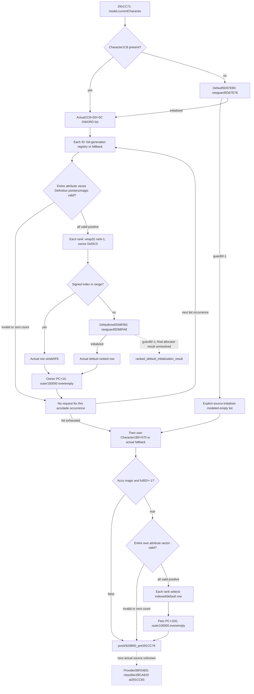

# Person preparation following2920B50 — CK3 1.20.0.3

This source-only packet closes the actual helper called at291CC71 after the weighted630 family. It produces two ordered accolade-attribute request families, preserves entire-vector preflight and native ranked-row selection, and exposes the next caller order toward normal return291CF48. The complete contribution frontier is `post2920B50_pre291CC76`; remaining helper bodies and the final uninitialized ranked-default allocator result remain specific source gaps.

Status is **research / source-ready**. No bridge leaf, final DTO, fixture/live result or game-day progress is delivered here. The preceding [provider192/2920850 source](battle-person-provider192-and2920850-12003.md) remains independently accepted; this packet does not reread it or change its implementation.

External evidence is `Z:/ck3_mod_rewrite_process_assets/g2-background-round4-20261005/person-tail/following2920b50-source/`. Its `SOURCE-PINS.json` seals exact body/receipt/reused-source hashes and this document; `READ-COST.json` records1763 fresh frozen-EXE bytes:1415 code+348 pdata, with no duplicate spans. The native tree/Mermaid/query plan are sealed before implementation.

## Exact-build source tree

Status **research / source-ready**, before implementation. Frozen CK3 1.20.0.3 / Steam25652598 / image base140000000 / recorded EXE SHA256 `94B55397ABB687A3DCD436805A5D885E6BE90FA6C693FEB44A9E3BBEEADE02A6`. No whole EXE scan/hash/header, game/SDK/pipe/UI/Steam/process/runtime activity, tests/build, native/Python implementation or Git operation.

The actual caller reloads modelR13 from `[rbp+500]` at291CC64, passes currentCharacterR14 inRDX and modelR13 inRCX, then invokes2920B50 at291CC71. The complete bounded contribution frontier is **post2920B50_pre291CC76**. Cached caller ordering continues to normal return291CF48; it does not prove the bodies of the remaining named helpers. The preceding provider192/2920850 and weighted630 sources are separate accepted packages and are not reread here.

## Complete physical body and receiver

2920B50 spans three contiguous pdata entries: `[2920B50,2920B5C)`12B prolog, `[2920B5C,2920C85)`297B main list/own-selection prefix, `[2920C85,2920D5E)`217B own family throughRET2920D5D. All526B are captured. Model is kept inR15, currentCharacter inR13; every outer request appends to model+10 through2438850 with literal weight **100000**.

There are two ordered source families: a list returned by28BF360(currentCharacter), then the current Character's selected accolade. Registry slot **5D1ECA0**, fallback slot **5D1EC40**, generation/fullID DWORD+8 and magicDWORD+C `4163636F` identify Accolade. This semantic name is independently established in cached `ck3_1_20_0_2_phase_misc.json` (`kPhaseMiscAccoladeStoreSlot`), while the newly captured1.20.0.3 body independently proves the same addresses and offsets. No holder/employer meaning is guessed for the first raw list.

## First family: Character1C8+50 list, owner-side PC+10

28BF360 first reads QWORD[Character+1C8]. Present selects vector header atcomponent+50: dataQWORD+0 and signed countDWORD+C, hence Character1C8+50/+5C. Absent selects global default header **5D67E80**, with raw signed initialization guard **5D67E78**. Native signedguard<=thread epochDWORD[TLS slot0+10] returns the current header. Greater enters4223AA4(&guard); resultingguard!=-1 returns the existing header. Equal-1 zeros dataQWORD5D67E80 and capacity/countQWORD5D67E88, sets allocator5D67E90 to54E6348, finalizes through4223A44. Those direct stores source-close a modeled empty numeric list for the existing rawguard0/-1 observation pattern. Actual initialized header and modeled initializer output must remain distinct; no callback/TLS execution is observed or performed.

The returned list contains DWORD IDs in native order, including repeats. Zero count skips the first family; negative count is not silently made empty. For each occurrence, the caller tests registry presence before reading its storedID. Registry present resolves low24 index, unsignedcapacityDWORD+2C, tableQWORD+20, stride10 pointer+8, nonnull object and whole generation/fullID DWORD+8 equality. Missing registry/out-of-capacity/null/mismatch selects the actual fallbackQWORD[5D1EC40]. **This first family does not add Acco magic or fullID!=-1 admission.** The resolved or fallback object's attribute vector is consumed directly.

Attribute rows are QWORD[Accolade+58], signed countDWORD+64, stride18. Each row's rank is DWORD+8; its Definition pointer is QWORD+10. Before any numeric request,2920BF0..2920C15 scans all stored rows: every Definition pointer must be nonnull and have magicDWORD+38 `4744624F`. A first invalid pointer or magic suppresses this entire accolade occurrence's contributions. It does not merely drop the invalid row, and valid preceding attributes do not escape this all-or-none preflight. Count0 produces no attribute requests.

After all rows pass, each stored attribute in order calls **2B8FCF0(rankDWORD,Definition+3C0)**. Its selected ranked row contributes **PC atrow+10** directly to model+10, weight100000. No selected PC-count gate is added: a legal empty PC still creates this outer request; the weighted fold may emit no weighted rows. Duplicate listIDs and repeated attributes create separate source occurrences. Registry/fallback globals are reloaded after a processed attribute vector; a same-query fixed source frame can provide the actually selected values without native writes.

## Second family: Character1B0+570, peer-side PC+1D0

After the first family completes,2920C6A reads Character1B0. Absent selects the actual fallback Accolade immediately. If present, registry presence is tested before reading raw fullID atcomponent+570. Missing registry also selects fallback without a570 demand. Registry-present resolution uses the same low24/capacity/table/stride/generation rules; only a nonnull generation-matching indexed object replaces fallback.

At2920CBB this selected object must have Acco magicDWORD+C `4163636F` and DWORD+8!=-1. Failing either suppresses this family; there is no further attribute/rank/PC demand. If admitted, the +58/+64 stride18 attribute vector undergoes the same entire-vector pointer/ObDG magic preflight before any requests. All-valid positive rows each invoke2B8FCF0(rank,Definition+3C0), then contribute **PC atselectedrow+1D0**, directly at outer100000. Empty selected PC retains the request. This family is processed after every first-family occurrence, including when that list is legally empty.

## Ranked row selector2B8FCF0

The receiver is the actual raw Definition+3C0 vector header; rank isECX. `index=wrap_i32(rank-1)` at2B8FD1C. Signed index<0 or index>=signedcountDWORD[header+C] selects default ranked row **5D68FB0**. Otherwise selectedrow=QWORD[header+0]+signedindex*5F8. Stored thresholds are not searched and rank is not clamped. Rank1 with positivecount selects row0. Native negative ranked count selects fallback for nonnegative index rather than pretending an empty attribute vector.

The native selector first checks raw signed default guard **5D68FA8** against thread epochDWORD[TLS slot0+10]. Greater calls4223AA4; resultingguard==-1 constructs5D68FB0 with30F26E0 and finalizes4223A44, then performs the same index selection. Numerical selection of an actual in-range ranked row does not depend on the default row's contents or guard. A raw observer may omit that undemanded default input without claiming equivalent native initialization activity.

For out-of-range rank, a currently initialized default guard releases the actual selected default PC+10 or+1D0. Rawguard0/-1 remains an explicit uninitialized-default state. The captured constructor30F26E0 initializes PC objects at+10,+1D0,+390 usingCA1870, plus supporting metadata at+78,+238,+3F8 usingCA18F0. CA1870 directly zeroes its data/capacity/count, including QWORD+8, but subsequently calls embedded allocator vtable slots+10 and+20. The final allocator effects are not expanded in this bounded packet. Therefore the minimum proposal **does not label final cold ranked-PC output as source-closed modeled empty**. Its precise missing producer is `ranked_default_initialization_result` at receiver5D68FB0; valid actual default PCs and all indexed rows are already useful closed inputs. CA18F0 and other rank metadata constructors are not numeric demands for an actual selected PC and are not executed.

No script expression evaluation, scope construction, arbitrary tier input or native ranked-row callback is needed for an indexed row. Pure selection uses the actual rank/vector input and the proven5F8 stride.

## Request order and demand

| Source branch | Outer request rule | Numeric demand |
|---|---|---|
| First list known empty |0 first-family requests; own family still follows|Actual selected header or explicitly modeled null1C8/default initguard branch|
| An accolade's preflight finds invalid Definition |0 requests for that entire accolade occurrence|Pointers/magic through the first invalid row; no ranks or selected PCs|
| Positive all-valid first-family attributes |One outer100000 request per attribute in stored order, PC+10 evenempty|All preflight pointers/magic; each rank and actual ranked vector/selected PC|
| Own selected Acco magic/fullID fails |0 own-family requests|Actual selected object magic/fullID only|
| Positive all-valid own attributes |One outer100000 request per attribute after first family, PC+1D0 evenempty|Same preflight/rank/vector demand, peer PC selected|
| Indexed rank in range |Selected5F8 row, family PC offset|No default guard or default PC numeric demand|
| Rank fallback, initialized default |Selected actual5D68FB0 family PC|Raw5D68FA8 and actual selected default PC|
| Rank fallback, rawguard0/-1 |Known ordinal/weight with precise missing PC result|`ranked_default_initialization_result`; no invented zero or callback execution|

## Caller continuation toward proven return

The cached caller's remaining order is sealed in SOURCE-PLAN.md: provider/classifier directPC atCC76..CCD2; flags bit29/landed-source/312A950 PC atCCD7..CD8D; calls2920D60,2921350,2921020; Character1C8 indexed340 row/fallback31937C0; calls2921AB0,29226A0; flags bit19/domain25B9100/provider16C0;291E3C0; then six ordered2BA95E0 weighted pairs and return291CF48. These caller instructions preserve exact order, but the unclosed helper bodies remain named sources. Existing cached2BA95E0 source is recorded for future reuse without rereading or recapturing its body. This packet does not claim readiness beyondCC76.

The first following direct family selects provider1690 when classifier result equals signedcount126C, provider1260[index] when0<=index<count, otherwise actual global fallback **5D1E0B0**. ObDG magic gates directPC40 atouter100000. Its actual classifier2BCA620(currentCharacter,0) is the next specific source gap. The final six-pair second count is wrap_i32(globalDWORD **5C69D1C** +actual2BA95E0 count); nonzero count and nonzero PCcount gate each weight signedcount*100000. These exact caller values are noted, not released as an implemented source stage.

## Byte ledger and limits

Fresh frozen-EXE cost **1763B =1415B code+348B pdata**. Code:2920B50 chained526B;28BF360152B;2B8FCF0156B;30F26E0454B;CA1870127B. No duplicate fresh spans, data/unwind/header/fullscan/hash reads or runtime/test/build actions. Receipts pin every exact file offset and body hash. The remaining genuine source input is final cold ranked-default initialization output if demanded; immediate following caller helper2BCA620 is outside this completed contribution frontier. No generic evaluator or TLS catalogue is planned.

## Minimum raw observer proposal

This is a source-sealed proposal only. Root assigns implementation after accepting the tree and byte ledger. Extend the same current-fullCharacter source query with optional **following_2920b50**. Proposed collector **Following2920b50**, normalizer **normalize_following_2920b50**, stable pure emitter **emit_following_2920b50_requests_from_current_source_inputs_12003(section)**. No module, schema or implementation is released here.

Proposed dedicated files:

- `include/xar_bridge/battle_person_following_2920b50_v1.inc.hpp`
- `include/xar_bridge/battle_person_following_2920b50_serializer.inc.hpp`
- `include/xar_bridge/ck3_12003_following_2920b50_sources.inc.hpp`
- `src/ck3_12003_person_following_2920b50.inc.hpp`
- `src/xar_autoplayer/bridge/battle_person_following_2920b50_contract.py`
- optional centrally qualified new fixture `tests/person_following_2920b50_fixture.cpp`.

## Actual fields and ordered families

Publish independent raw groups `list_1c8_50` and `own_1b0_570`, preserving source availability and source ordinals. List header fields are actual component presence, selected header origin, signedcount, raw initguard5D67E78 only for default selection, and ordered stored IDs. An absent1C8 plus rawguard0/-1 can be explicitly modeled as source-initializer empty numeric list; an initialized guard releases actually read global header5D67E80. No TLS/lazy initializer executes.

Registry/fallback provenance uses exact5D1ECA0/5D1EC40 and wholeDWORD generation matching. When the registry is absent, first-family per-ID values are undemanded because the source selects fallback before reading the ID. Own family raw570 is undemanded if1B0 absent or registry absent. Preserve the actually selected fallback inputs rather than assuming an absent1B0 is an empty own family. First-family selected Accolade has no added magic/fullID admission; own family explicitly does.

Each accolade occurrence provides attribute vector+58/+64, native stored ordinal and stride18 rows. Preflight row fields are definition pointer-presence and magic38; invalid pointer/magic suppresses all requests for that accolade. No rank or PC should become a schema blocker for this already suppressed source. A missing preflight field prevents declaring the occurrence all-valid; preceding good attributes cannot be emitted prematurely. Actual zero attribute count yields no requests; native negative counts remain precise missing/unusable traversal, not invented empty.

All-valid positive attributes additionally provide signed rawrankDWORD+8, actual Definition+3C0 header ptr/count and selectedrow origin. Pure selection computes wrap_i32(rank-1), applies signed range comparison and stride5F8. For indexed rows, publish the family-selected typed PC at+10 for list family or+1D0 for own family. Do not demand the opposite family PC, default guard or unrelated rank metadata. Source requests retain one outer100000 occurrence per admitted attribute even when the selected PC is legally empty; weighted rows are separate outputs.

For fallback rank, retain rawguard5D68FA8. An initialized default reads the actual family PC from5D68FB0+10 or+1D0. Rawguard0/-1 does not release potentially uninitialized actual bytes. Final cold ranked-PC outcome remains the specific missing `ranked_default_initialization_result`, sinceCA1870's final allocator-vtable effects are outside this packet. The tree proves the direct zero stores and constructor route, but not a final pure modeled-PC outcome through those calls. Keep its known source ordinal andunitweight rather than silently skipping the requested PC. This local gap does not hide independently available indexed attributes or the other family.

## Proposed DTO grouping, not a final schema

`status/ready/character_id`, `list_1c8_50{component_present,header_origin,raw_init_guard,count,rows}`, `own_1b0_570{component_present,registry_present,raw_id,selected_accolade,magic_admitted,id_admitted,attributes}`, and per-occurrence `registry_resolution,attribute_count,preflight_rows,attribute_inputs`. Each demanded attribute groups `rank_raw,ranked_header_count,ranked_selection,index_raw,default_init_guard,selected_pc,missing_reason`. Reuse existing typed paired-PC DTO/readers and source-closed local weighted fold. Exact raw grouping should be sealed jointly by implementation owners before native code; do not guess a schema from this proposal.

Request ordinals are ordered by list occurrence, then attribute occurrence, then own family attributes. Every weight is literal100000. A preflight-invalid or zero-count accolade emits0 requests; an all-valid positive vector emits its attribute count requests, including knownempty PCs. Keep request count distinct from weighted-row count. An unknown requested PC preserves an explicit missing occurrence without erasing independently readable contributions.

The bounded stage frontier **post2920B50_pre291CC76** joins an explicit prior-stage baseline. Current observed rows do not become a historical mutable Entry state. No complete Entry or readiness toward291CF48 is claimed. The current provider192 implementation needs no dependency on this future leaf.

## Specific next source inputs

1. If a demanded rank chooses an uninitialized default, source-close the final numeric outcome ofCA1870's embedded allocator callbacks for ranked default5D68FB0. This is a local constructor-result seam, not a generic allocator/TLS audit.
2. After this contribution, the actual next helper is2BCA620(currentCharacter,0), selecting provider1260/1690/fallback5D1E0B0. Remaining caller order toCF48 is already cached and charted, but named helper bodies are not folded by this packet.

No script evaluator, arbitrary tier producer or lifecycle callback execution is part of this minimum observer.

## Released minimum raw schema before implementation

`FINAL-RAW-SCHEMA.json` in this packet seals optional leaf `following_2920b50` and families `list_1c8_50` → `own_1b0_570` before code. Dedicated bridge/pure modules are `battle_person_following_2920b50_contract.py` and `battle_person_following_2920b50_12003.py`. Public whole/family/individual-attribute emitters use `emit_following_2920b50_requests_from_current_source_inputs_12003(section)`, `emit_following_2920b50_family_requests_from_current_source_inputs_12003(section, family)`, and `emit_following_2920b50_attribute_requests_from_current_source_inputs_12003(section, family, occurrence_index, attribute_index)`.

Each occurrence retains resolution/full generation, entire preflight availability/all-valid result and ordered attribute source rows. An observed first invalid Definition produces a known zero-request occurrence with no rank/PC demand; unread preflight blocks all attribute outputs. An all-valid vector permits individual indexed or actual initialized default PCs even if a different attribute needs the unknown cold-default result. Negative rank-index numerically selects default without ranked header operands; a nonnegative index needs signedcount, and only in-range selection needs array. This numeric demand does not claim equivalent native initialization activity. Every emitted paired PC remains an actual raw source reference, with one unit outer weight and empty occurrences retained.

The dedicated raw DTO is `ContextSourceFollowing2920b50InputsV1`; bindings `ContextSourceFollowing2920b50BindingsV1`, member `following_2920b50`, factory `BindFollowing2920b50Sources12003(base)`, collector `Following2920b50Inputs(b, character, character_id)`, serializer `Following2920b50Json`, fixture hook `RunFollowing2920b50Fixture(path)`. Root owns shared query/glue/build integration. One new producer compound and one independent native target are planned; previous provider/gated candidates stay unchanged. Source I/O remains1763B; this schema adds0newEXE reads. The constructor-result and following classifier gaps above remain explicit.

## First pure implementation qualification, 2026-10-06

The dedicated strict contract and pure whole/family/attribute emitters are implemented, with `following_2920b50` wired into the production current-source normalizer and actor join. The one new compound production case passed on its first execution at04:38:22 Asia/Shanghai:1passed in0.42s, wrapper0.8474169s. `FOCUSED-PRODUCTION-CASE.json/.log` and `PURE-CONTRACT-DELIVERY.json` in the external packet preserve exact file hashes, actual command and time. No previous Python case, native target or archived wire was rerun.

The reusable builder `following2920b50_source()` in `test_battle_person_following_2920b50_12003.py` produces8ordered source requests:3attributes for each of2duplicate list occurrences, then2own attributes. The compound additionally verifies whole-vector known-invalid suppression and unknown-preflight suppression, independently usable attributes across cold ranked-default0/-1, wrap_i32(INT_MIN-1), actual initialized empty PCs, modeled empty list selection, own magic/full-ID rejection, component-absent and readable-null-registry fallback demand, source counts and actor mismatch. Empty selected PCs retain their unit outer request.

This qualifies pure parsing and ordered requests against source-shaped data. The minimum readonly native collector and six-scene fake-memory fixture are submitted separately for Root's first central full-DLL/target build and CTest; their output has not been consumed. Cold ranked default remains `ranked_default_initialization_result`, and the explicit before-stage context remains an assembler dependency. No runtime, fresh-stage association, wholeperson or Entry readiness is claimed.

## Native candidate submitted for first central qualification

The optional same-query DTO, exact-build binding, collector and serializer are wired through the existing current-source query. The collector reuses actual registry and paired-PC readers, completes each accolade's whole-vector preflight before any rank/PC demand, and preserves each independent family and available attribute when another requested default is cold. Both TerminalSample frames read the same fixed fake-memory source; no initializer, evaluator or native callback executes.

Target and CTest are both `xar_ck3_12003_person_following_2920b50_test`; output directory is `ck3_12003_person_following_2920b50_wire`. `NATIVE-WIRE-EXPECTATIONS.json` in the external packet seals six new scenes: indexed duplicates8requests, known-invalid whole-vector list suppression with own2, unknown preflight with independent own2, cold-ranked default with independently available indexed attributes and own2, initialized ranked-default empty PCs5requests, and modeled empty list plus own magic rejection0requests. Counts for partial whole families are deliberately unavailable; independently known outputs remain explicit.

Central full intended DLL/target build, first new CTest and subsequent first production normalization of these actual serialized wires are pending. None of the six wires or earlier qualified cases has been executed by this lane during candidate submission. The direct query and fixture source are immutable once Root adopts them for the next batch.

## First compiled-wire qualification, 2026-10-06

The preceding pending paragraph is the original candidate snapshot. Root subsequently adopted the coherent native candidate into exact source `ffd3cf7ce076c5746869d007367aa813afa07c9f` and built the complete intended DLL plus the new target under `/WX`,4jobs. The first build was GREEN185.0414468s; the first and only new CTest was GREEN1/1, test0.10s, total0.79s, wrapper0.8241058s at20:49:41.809503UTC (04:49:41 Asia/Shanghai). No native RED or repeated CTest occurred.

The frozen archive is `Z:/ck3_mod_rewrite_process_assets/g2-background-round4-20261005/sourceffd3cf7c-following2920b50-native-artifacts/`,14files including6new serialized fake-memory wires and `HASHES-AND-NATIVE-QUALIFICATION.json`. Root's pins are reused: DLL10594816B SHA256 `66d5f59498e21c39075328560f5fa3ba87c23760f19a191dfbe657bb98e3f45f`; testexe902144B SHA256 `c8966a30d53fad6926ac18ac4ff3058129ce1060609bb5d27cde6fd9303f601a`. This lane did not rehash either binary or mutate the archived candidate.

After explicit Root authorization, all6unique new wires passed the genuine production current-source normalizer and whole/family/attribute emitters on their first consumption:209checks, zero consumer RED. `following2920b50-wire-integration-attempt01.json` in the packet is5068B, SHA256 `d642bcc08e55e73a66db1195577f3ccaf7a8d38b592eed5f7156e72b0bd367ff`; it binds exact production file bytes and archive manifest. The run verifies the8-request duplicate list/own order, whole-vector known-invalid and unknown-preflight behavior, independently available indexed attributes across cold default, actual initialized empty PCs and modeled empty-list/own rejection. No previously passed case, wire, native build or CTest was rerun, and no game or runtime operation was performed.

Readiness advances to **static-ready compiled fake-memory observer and pure ordered contribution**. This is distinct from the independently qualified source-shaped stage-chain case. Cold ranked-default initialization result remains precisely missing when demanded; current raw operands do not establish a fresh evolving-model association, a real before-stage baseline, wholeperson preparation or Entry. The next concrete caller is2BCA620 at291CC83; its bounded resource classifier source is being sealed separately, with nonnegative-balance independence and an explicit living-player evaluated-income dependency.
