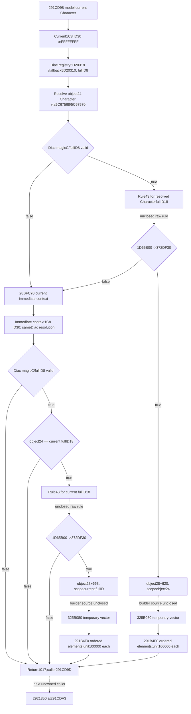

# 2920D60 mutually exclusive Diac modifier sources

Source-only packet for CK3 1.20.0.3 /Steam25652598 /base140000000 /recordedEXESHA94B55397ABB687A3DCD436805A5D885E6BE90FA6C693FEB44A9E3BBEEADE02A6. The prior219-B312A950 package stays unchanged. No mode3 income2BCA580 or other accounting expansion occurred.

Caller291CD92 sets RDX=current CharacterR14,291CD95 RCX=modelR13;291CD98 calls2920D60 unconditionally after the GovLand branch merge. RAX is ignored. Actual function extent is **[02920D60,02921018),696 B**, normal RET291017. The stage ends at **post2920D60_pre291CD9D**; next unowned helper is2921350 at291CDA3. New physical read cost is **708 B =696code+12pdata**.

## First source: current Character's selected Diac, block620

1.D81 reads current CharacterQWORD1C8. Present storage supplies DWORD30; absent suppliesFFFFFFFF. This is a full object ID, not a count/rank.
2.D99/DA0 load **registry5D20318 /fallback5D20310**. Null registry, unsigned low24 index>=registryDWORD2C, null indexed pointer or candidateDWORD8!=whole requestedDWORD select actual fallback. Registry QWORD20 holds stride16 slots, object QWORD+8. No magic check is built into this resolution.
3.**Before** validating Diac magic/fullID, DD5 reads selected object's DWORD24 and DD8..E07 resolves this full CharacterID through **registry5C67568 /fallback5C67570**, the same stride16+8/unsigned capacity/fullID18 matching rule. Keep this actual source read order; do not claim an early native magic guard.
4.E0E checks Diac DWORDC=**44696163**, E1B requires DWORD8!=-1. Failure goes to the second source atECC. No policy evaluator or numeric builder is called for an invalid first object.
5.Valid first object passes the resolved Character's actual full DWORD18 to **1D65B00(selector43,CharacterFullID,tooltip0)** atE2F. AL=false refreshes the actual Diac registry/fallback atEBE/EC5, then tries the second source. Do not name selector43 after a guessed policy.
6.AL=true constructs a temporary vector with29227F0, then passes the address of selected Diac's **DWORD24** in RCX, selected object's **QWORD28+620** in RDX, and temporary vector inR8 to **325B080** atE69. The builder's receiver scope is the selected object's CharacterID24, which can differ from the current Character.
7.E76 calls **291B4F0(model,temporaryVector)**. Cleanup destroys temporary elements and frees storage; all paths then return via1017, including a null temporary data pointer. **The second source is never considered after first-rule true**, even if the first selected temporary vector is empty. This is selection precedence, not two additive families.

## Second source: immediate-context Diac, block658

1.ECC/ECF calls cached **28BFC70(current Character)**, then ED4 reads returned CharacterQWORD1C8 and selects DWORD30 orFFFFFFFF. It repeats the same Diac registry/fullID8 resolution atEEC..F17. The source receiver is the actual returned immediate-context Character; it is not assumed to be current or top liege.
2.F1A/F27 checks selected Diac magicC/fullID8. Invalid returns immediately with zero occurrences.
3.F31 loads **current Character fullID18**, F34 compares selected Diac DWORD24 to that exact current fullID. Mismatch returns zero and does not demand the rule or builder.
4.F44 calls **1D65B00(43,currentFullID,tooltip0)**. False returns zero. True creates temporary vector and invokes325B080 with currentFullID by address, selected DiacQWORD28+**658**, and the second temporary vector.
5.F94 unit-composes the result through291B4F0, then cleanup and normal return. This is the only possible second-source contribution, and can be reached only if the first Diac is invalid or its rule was false.

## Reused28BFC70 immediate context

Reuse `person-tail/tail-prefix-helper-source/capture-028BFC70-frameless-gap/region-028BFC70.asm`. The demanded function is[28BFC70,28BFCE6),118 B; the prior gap capture also contains unrelated bytes not used here.

- Entry loads currentQWORD1C0 and1B8. Present1C0 reads its QWORD1C0, then that object's QWORD28 Character pointer. Valid Character magic1C/fullID18!=-1 is returned. Invalid selected candidate returns **current self**, not a global fallback.
- Absent1C0 uses related1B8+C8 fullID and Characterregistry5C67568. Related absent, registry absent, unsigned index out-of-cap, indexed pointer null or fullID18 mismatch returns actual Characterfallback5C67570.
- There is no recursive top-liege walk, no death1D0 test, and no extra current-Character admission in this getter. Its raw1B8 entry load is before the living1C0 branch, although the relatedC8 resolution is demanded only for absent living storage.

## Reused1D65B00 exact.3 rule wrapper

The cached complete229-B[1D65B00,1D65BE5) body is embedded in `religion_reform12002_eligibility_abi.json`; `ck3_1_20_0_3_abi_reuse.json` has the exact same full-body SHA256**fdc7b0dd04b47906655da1d0ec62b82ea605d20be484a4d1735103070930a439**. It was extracted into this packet without EXE reads; receipt records both sources.

It saves the passed full CharacterID, calls **1D65660** for the rules provider, creates a Character ScriptContext via9F9E20, then addresses **providerQWORD EF0 +signed selector*D0**. With selector43 this offset is22F0 from the selected array base. Tooltip is exactly0 here, so the real predicate is **372DF30(compiledCondition,CharacterContext)**; tooltip372E4F0 is undemanded. Cleanup calls do not contribute numeric properties.

This proves actual gate receiver/slot and evaluator boundary; it does not provide a raw rules-global binding, initializer state, compiled-condition fields or a pure evaluation recipe. These are one precise **scripted_rule43_for_character** source seam, not an arbitrary supplied bool. Existing literal getters37542F0 or ScriptValue modeC0 are different ABIs and are not substituted.

## Reused291B4F0 ordered unit handoff

Cached full414-B[291B4F0,291B68E) body is reused from `battle-context-preparation-291c-v84/branch-291ded0/shared-source/FULL-0291B4F0.asm`. The source vector is QWORDdata0/signedDWORDcountC, stride**1C0**. A known empty vector causes **zero** outer occurrences. Each selected vector element creates/retains an owned1C0 modifier and makes **2438850(model+10,thatModifier,100000)** atB64F in exact source order.

For each element, uint16 property IDs are copied from sourceQWORD0/countDWORDC; the numeric value **container atsource+68** is copied byB73F50 into clone+68. This tree does not guess a D0 value offset from another context layout. Metadata move/allocator/destructor functions are not additional numeric producers and are not executed by a raw observer. If an actual element has a valid empty property container, its unit100000 occurrence is retained; this differs from an empty outer vector's zero occurrences. Incoming negative vector counts are not modeled as empty because the native end pointer is data+signedcount*1C0 and only count0 is a proved empty case.

The selected **325B080(CharacterIDAddress,definitionBlock,temporaryVector)** is the exact still-unclosed numeric producer. Primary block620 and secondary658 are distinct sources, with different Character scopes described above.29227F0 temporary initialization is also not used to fabricate a live temporary snapshot. No bridge field may pretend these stack temporary rows already exist outside the actual caller.

## Smallest closed independent value

Actual current Diac invalid allows the second source without a rule call. If the immediate-context Diac is also invalid, or is valid but ownerDWORD24!=current fullID18, the entire2920D60 stage has **zero occurrences** with no rule43, builder, allocator or income demand. These raw conditions and receiver selection are source-closed and can release a minimal query independently. Any valid primary source still needs its actual rule43 producer to decide precedence; do not skip it to reach a convenient second source. No positive raw rows or generic evaluator interface are claimed.

# Smallest genuine raw2920D60 observer proposal

This is a source-only plan, not a released contract or code. Proposed optional leaf `following_diac_2920d60`, module `battle_person_following_2920d60_contract.py`, normalizer `normalize_following_diac_2920d60`, emitter `emit_following_2920d60_requests_from_current_source_inputs_12003`; dedicated native filenames follow `battle_person_following_2920d60_v1.inc.hpp`, `battle_person_following_2920d60_serializer.inc.hpp`, `ck3_12003_following_2920d60_sources.inc.hpp`, `ck3_12003_person_following_2920d60.inc.hpp`. Parent decides ownership and seals an actual schema before implementation.

The stage is called with model/current Character. Requests target model+10. It represents **one selected family** of ordered temporary modifier occurrences, not independent primary and secondary contributions. The first rule true owns the selected family even when its outer vector is empty.

Demand groups:

1. `primary_diac_source`: currentQWORD1C8 presence and actual DWORD30 fullID (absent ->FFFFFFFF); actual registry5D20318/fallback5D20310, unsigned capacity2C/data20/stride16 slot8; candidate fullID8 retained with generation. Selected Diac fullID8/magicC.
2. `primary_character_source`: selected Diac DWORD24; Characterregistry5C67568/fallback5C67570; actual whole ID and unsigned slot-resolution witnesses; selected CharacterfullID18. Actual native order resolves this before primary Diac validity. No native rule callback executes.
3. If primary invalid, `immediate_context_source`: source-specific28BFC70 raw current1C0/1B8 entry inputs, living candidate1C0+1C0+28 andmagic1C/fullID18, or relatedC8 wholeIDregistry/fallback. Invalid living candidate selects current self. Related/C8 path only for absent living storage. Observe actual returned CharacterfullID and1C8+30.
4. `secondary_diac_source`: same actual Diac registry resolution. Invalid secondary yields ready zero. Valid secondary demands ownerDWORD24/currentfullID18 equality. Mismatch yields ready zero. No rule or numeric source is demanded for either ready-zero branch.
5. Valid primary demands actual `scripted_rule43_for_character` from table getter1D65660, arrayproviderEF0+43*D0 and no-tooltip372DF30 with its resolved Character scope. This source is unclosed. Do not supply a caller-provided true/false value. Until it closes, valid primary remains unavailable and no secondary branch may be presumed.
6. If primary rule false after genuine closure, secondary selection proceeds. Valid matching secondary demands the same rule43 with current Character scope. False yields zero. True selects definition block658; primary true selects block620 with selectedobject24 scope.
7. Selected true branch demands genuine raw/source-closed numeric producer **325B080** for the exact selected block and scope. Need its ordered declaration inputs and value-fold recipe to construct temporary modifier rows without native callback or initializer. This source is unclosed; no raw stack temporary rows are invented.
8. Known selected outer vector count0 yields zero occurrences. Positive vector elements cause one ordered unit100000 PC request each through already closed291B4F0. Known empty PC in a real element remains a request. Raw container schema is uint16 IDs atmodifier0/countC and numeric value container+68; nested numeric layout must come from that actual producer/accepted property-container source, not an unrelatedD0 context.

Minimum independently implementable release now: primary invalid plus secondary invalid or owner mismatch. Source-owned raw observer reads the actual selector witnesses, and the pure kernel returns ready=true/requests=[] at **post2920D60_pre291CD9D**. Rule43 and selected modifier sources are genuinely undemanded on these branches. Unknown primary rule or positive selected producer preserves the exact earlier person-stage contributions and names its missing source; it does not fabricate an empty stage.

Highest actual unowned dependencies after this package: `scripted_rule43_for_character` (loader1D65660 /predicate372DF30) to decide which family, then selected325B080 numeric producer to create ordered rows. Next caller helper2921350 at291CDA3 is separate. No mode3 income2BCA580 or broad evaluator catalogue is included.

## Sealed source delivery

Packet `Z:/ck3_mod_rewrite_process_assets/g2-background-round4-20261005/person-tail/following2920d60-source` contains exact source receipts, bytecost ledger, pure raw input proposal, Mermaid tree and daily/weekly report fields. No implementation, actual schema, callback, test, build or live artifact was produced. Parent owns Git and canonical report merge.
