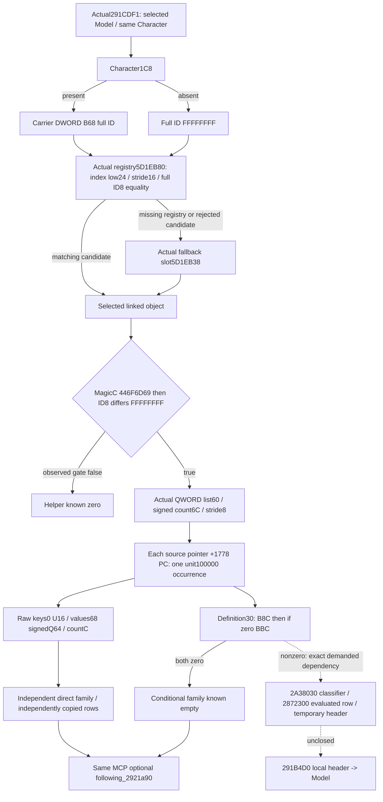

# Actual4 next linked collection after the direct carrier

Source-first seal: 2026-10-09 Asia/Shanghai / W41. Independent source base
`0d13fd93f6c23741dfefc37f9e64cbdbe057351f`. Exact game
**1.20.0.4 / Steam25734779**, existing EXE pin
`98702F88A547CDE2EAF29A85F93B85F68EE4CF8148336A4F7AFAEB75319DD518`.
Root alone owns Game/SDK/runtime and qualification. This package invokes none.

## Entry and exact source cost

The [preceding actual4 carrier](battle-person-next-direct-carrier-12004.md)
ends or skips to actual `291CDEB`. The old `2921AB0` name was only a locator.
A first new **11B** read `[291CDEB,291CDF6)` decodes `RDX=R14` Character,
`RCX=R13` selected Model, then `291CDF1 CALL2921A90`. Cached runtime-function
ordinal141270 gives `[2921A90,292204B)`; only this **1467B** callee was read.
Both captures decode completely. Cumulative new EXE I/O is **1478B / 2 reads**,
old EXE I/O 0, new pdata/unwind 0, scans/hashes/tests/builds/Game 0. The earlier
328B and Native41 fixtures are not reread or rerun.

Receipts are under
`Z:/ck3_mod_rewrite_process_assets/g2-background-20261009/person-after-carrier41/`:
`actual-callsite01/SOURCE-CAPTURE.json`, `ACTUAL-HELPER-EXTENT.json`, and
`actual-helper02/SOURCE-CAPTURE.json`; the last directory holds complete
`2921A90.asm`. This is a new actual4 body, not a guessed old-RVA offset.

## Native receiver, demand and contribution tree

At `2921AB7`, Character QWORD1C8 is read. Present selects its DWORD B68 full ID;
absent supplies `FFFFFFFF`. Absence does **not** skip the helper. At `2921AD2`,
the actual registry QWORD slot is `module+5D1EB80`. A null registry selects the
actual fallback object QWORD slot `module+5D1EB38`. Otherwise the requested ID's
low24 bits index the registry: unsigned count+2C, table QWORD+20, stride16 and
pointer+8. A nonnull candidate's complete DWORD+8 must equal the full requested
ID; range, null and mismatch choose the same fallback.

Selected object's DWORD+C must be `446F6D69`, then DWORD+8 must differ from
`FFFFFFFF`; either observed failed gate returns zero source occurrences. An
unread required operand is partial, never a fabricated failed gate. This
concrete role is called `linked_object_b68`; a different typed legitimacy
getter or a guessed semantic name is not its source proof.

The first numerical family reads selected object's QWORD+60 and signed DWORD
count+6C, traversing pointers at stride8 in raw order. At `2921B50..2921B63`,
each pointer's inline PC+1778 is passed to the already proved actual4 `2438830`,
destination selected Model+10, weight100000. Duplicate pointers remain duplicate
occurrences. There is no pre-call PC-empty test: an observed count0 PC still
contributes one source occurrence with empty arrays. Zero list count contributes
zero occurrences. Negative list counts are not source-known empty; this observer
retains the raw signed count and marks its traversal partial.

PC field decoding reuses the preceding actual4 source-use closure: signed
count+C, keys QWORD pointer0/U16 stride2, values QWORD pointer68/I64 stride8.
Copies preserve ordering, repeated keys, key0/FFFF and signed Q64 extrema. No
source PC+74, destination baseline, merger callback or initializer is read.

Only after the direct list does the native helper read selected object's
definition QWORD+30. It tests definition signed DWORD B8C first; when it is0,
it tests signed DWORD BBC. Both0 returns immediately. A nonzero tested count
demands Character classifier `2A38030`, initializes a local temporary container
through `24FBAC0`, chooses B80/B8C for classifier2 or BB0/BBC for classifier0,
and calls `2872300` for each selected row before `24FD2D0`, `2303380` and
`2303490`. The completed local header is passed to `291B4D0`. Classifier,
evaluated row output and temporary-header semantics are unclosed in this packet.
Their exact local reason is `conditional_modifier_2a38030_2872300_unobserved`.
No classifier result, stale temporary vector or zero substitute is published.
Observed B8C/BBC both0 may release this unused family as known empty.

## Minimal same-query contract and qualification boundary

New optional leaf `following_2921a90` uses schema
`xar.ck3.person-following-2921a90-12004-v1`. Root's existing actual4 battle query
resolves the requested full Character ID. Reuse the source-closed owned-model
association Character1B0→scratch258→Model, requiring Model8==that same Character;
the getter identity is retained but not called. Selected Model+10 is opaque
destination provenance, not a fresh or historical stage baseline.

The direct family retains actual registry resolution, selected object, list
count/address and each ordered row's object/PC identity, physical count, arrays,
readiness and precise copy reason. A partial row does not erase independently
read later rows. Family emission requires its complete row set; a row emitter
releases an independently complete row. The whole helper requires both direct
and conditional families ready. Empty PCs emit one ordered unit request; empty
lists emit none. The request type is an existing operand-only dataclass, giving
no actual4 merger, six-skill, full-person or complete Entry credit.

Implementation must reach the existing `ck3_query_battle_terminal_transition_v1`
requested-Character route, genuine private serializer, main normalizer,
NativeDriver, Service and registered MCP. Native whole fixture and its sole
registered consumer are authored but NOTRUN here; Root owns FIRST. Controls
will exercise mapped signed/repeated/empty PCs, duplicate pointer rows, actual
fallback, full-generation-ID mismatch, failed selected magic/ID, independently
ready rows after partial copies and a demanded conditional family. No new action
or counter-policy is introduced. Following29226A0 is outside this package.
