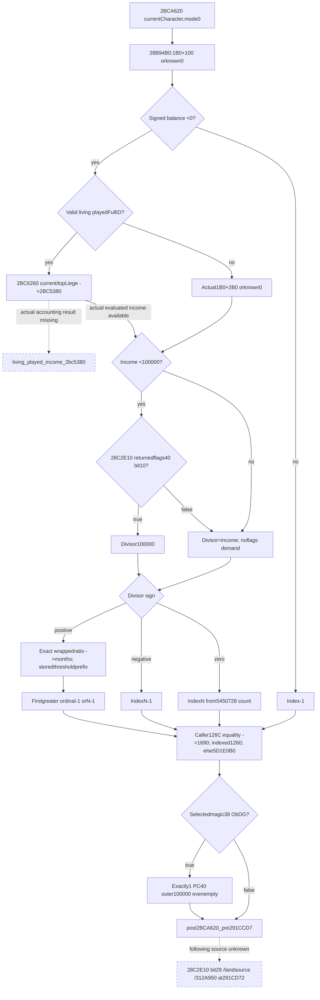

# Person preparation following2BCA620 — CK3 1.20.0.3

This source-only packet closes the actual mode0 debt classifier and following provider append at291CC76..291CCD2. Nonnegative actual balance independently returns index-1, without income, government or threshold demands; the caller then selects the actual provider/default PC. Negative balance retains exact income, government minimum-divisor and ordered threshold semantics. Living played income is actual evaluated accounting, not the cached nonplayer field.

Status is **research / source-ready**. No DTO/module implementation, fixture qualification, live artifact or game progress is delivered. Complete bounded frontier is `post2BCA620_pre291CCD7`. Remaining real played-accounting input is explicit; Root decides the minimum next raw observer construction.

External evidence packet: `Z:/ck3_mod_rewrite_process_assets/g2-background-round4-20261005/person-tail/following2bca620-source/`. SOURCE-PINS.json seals the native tree/Mermaid, minimum query proposal, exact bodies and this document; READ-COST.json records4956 fresh frozen-EXE bytes=4752 captured code-span bytes+204 pdata, with already cached government/top-liege binary reuse reported separately. No repeated old EXE reads, full scan/hash/header, generic accounting catalogue or runtime action.

## Exact-build source tree

Status **research / source-ready**, source-only before implementation. Frozen CK31.20.0.3 / Steam25652598 / image base140000000 / recorded EXE SHA256 `94B55397ABB687A3DCD436805A5D885E6BE90FA6C693FEB44A9E3BBEEADE02A6`. No whole EXE hash/scan/header, game/SDK/pipe/UI/Steam/process/profile/save/runtime, tests/build, code or Git action. Previous accepted caller/source packets are reused, not recaptured.

## Actual caller, receiver and contribution

The caller291CC76 obtains the existing08FD4E0 provider and retains it inRBX;291CC7E setsEDX=0 and291CC80 passes currentCharacterR14 inRCX.291CC83 invokes **2BCA620(currentCharacter,0)**. This packet closes only mode0; mode3 and2BCA580 are not demanded and not captured.

Returned signed32 index first compares to actual provider signedcount126C. **Equality selects QWORDprovider1690**, even for a negative equal value. Otherwise0<=index<count selects QWORD[QWORDprovider1260+index*8]; negative or out-of-range selects actual QWORD[global **5D1E0B0**]. SelectedobjectDWORD38 `4744624F` magic admits one PC+40 request at291CCD2 to inline model+10, outerweight **100000**, including legal empty PC. Failed magic yields0 requests and no PC demand. No null/default object is silently turned into an empty PC.

The bounded contribution frontier is **post2BCA620_pre291CCD7**. Next291CCD7 starts a separate government bit29/landed-source/312A950 family, whose body is not claimed here.

## Complete classifier and balance mode0

2BCA620 is three contiguous pdata spans `[2BCA620,2BCA65C)`60B, `[2BCA65C,2BCA7FB)`415B and `[2BCA7FB,2BCA7FF)`4B. Last fragment decrements the threshold loop'sEAX index and jumps back to its shared epilogue; no clamp is added. Total479B closes all mode0 returns. Cache-only metadata lookup at7FF required no EXE read and found no extent; no guessed gap capture was used.

The classifier calls28B94B0(character,outQ64,0). That getter first reads Character1B0. Absent writes actual numeric0. Present dispatches through six DWORD RVA jump-table entries embedded in its already captured256B body. The actual mode0 entry is28B94EB and copies signedQWORD **Character1B0+100** unchanged. Other resource modes are undemanded; no title resolver or treasury field is needed for the caller's actual mode0. `BALANCE-JUMP-TABLE.json` pins the decoded cached bytes, with no fresh EXE data read.

If this signed balance is **>=0**,2BCA620 returns signedindex **-1** immediately at2BCA64E. No income, played-membership, government flags or threshold header/rows are demanded. This is a completely closed independent observation branch, including Character1B0-absent known0. Caller provider selection and selectedobject magic/PC still determine the actual outer request; classifier-1 alone is not an assertion of no contribution.

## Negative balance: source-correct income branch

Negative balance invokes2BCA4E0(out,currentCharacter). That exact145B getter tests Character magic1C `43686172`, actual fullID18!=-1, death component1D0 absent, then2BAA710 actual played-FullID membership. Invalid/dead/nonplayed uses actual signedQWORD **Character1B0+2B0**, or writes0 if1B0 absent. These fallbacks are source-closed, but **must not be substituted for a living played Character**.

A valid living played Character resolves top liege through existing28BFDA0, then invokes **2BC6260(out,currentCharacter,topLiege)**. Its new complete515B body has an important land-state gate: Character1C0 present skips supplemental terms and directly calls **2BC5380(out,currentCharacter,topLiege,0)**. Absent1C0 first demands actual2642320 and2642710 results multiplied by2BCB900 factors, then adds the2BC5380 result. The absence branch's supplemental producers are precise unclosed inputs, not invented0.

2BC5380's new complete3357B body returns0 when Character1C0 is absent. Present1C0 performs actual accounting, with ordered producer calls28C3AE0,2BCB900, conditional2BAFDA0/2BD1200, selected24C6000 share,2BC4D80,2BC5060,2BC4B20,2BC6570,2BCA800 and later2A3A490/2A234F0/24C1910/2C6A5B0 branches. It finally writes its evaluated signedQ64 at2BC6086. The landed-player result is **not a direct alias of Character1B0+2B0**. The packet captures that exact accounting receiver/body and identifies its current evaluated-income input, but does not expand every accounting producer or claim a final pure net-income fold. The genuine missing input is **living_played_income_2bc5380**; future source/observer work can publish those actual evaluated accounting results in the same query. No income callback is executed here.

Existing top-liege source28BFDA0 is reused, separately from2922070's descendant self-walk. It starts from currentCharacter, holds actual fallback Character5C67570 and registry5C67568. A present1C0 selects Character pointer through1C0+1C0 thenobject+28; invalid Character magic/fullID ends with the prior currentCharacter. Absent1C0 uses related1B8+C8 fullID and actual registry/fallback resolution; absent1B8 ends at priorcurrentCharacter. Changed selected pointer repeats the walk; unchanged pointer returns it. No semantic ancestor state or fabricated termination is appended.

## Government bit10 precedes zero/negative-income checks

For negative balance, let actual evaluated income be signedQ64 `I`. If **I<100000**,2BCA620 invokes cached exact28C2E10 and reads returnedobjectDWORD40 bit10. True forces divisorD=100000. False retainsD=I. If I>=100000, government flags are undemanded andD=I.

This ordering matters: **income0 or negative income still demands government bit10**. If bit10 is true, it uses positive divisor100000 and enters the ratio path. Only bit10-false income0 returns actual thresholdcountN; only bit10-false negative income returns wrap_i32(N-1). The early unsealed shorthand about an unconditional zero-income return is corrected before implementation.

The bit number is **decimal10**, mask **0x00000400**: cached instructions2BCA698 `mov ecx,[rax+40]`,2BCA69B `shr rcx,0xa`, then2BCA69F `test cl,1`. This numerical clarification reuses the already sealed body and adds0EXE bytes; the original source-only seal is preserved.

Cached28C2E10 has a distinct actual selection chain. Valid Character magic/fullID first checks death1D0 and selects its+88 government pointer; otherwise present1C0 selects+3F8; with neither, it follows related1B8+C8 through Character registry5C67568/fallback5C67570 and repeats. Invalid Character or selected null government selects actual QWORD[global **5D1E2A8**]. The diagnostic callback on a null selected government does not produce flags; a raw observer can use that explicit fallback without executing it. Actual returned flagsDWORD40 are required, rather than assuming they equal another current raw flags field. Both body and exact-build capture receipt are reused from v82; no fresh government EXE read.

## Gold threshold header and exact return rules

Actual mode0 uses global inline vector header **5450728**: dataQWORD+0 and signedcountDWORD+C. Mode3's5450898 vector is undemanded. HeaderN is read before zero/negative-divisor return; stored threshold rows are needed only for a positive divisor and N>0. D==0 returnsN; D<0 returns wrap_i32(N-1), with no ratio or threshold-row demand. These apply after the bit10 divisor selection.

For D>0 the native function negates balance with signed64 wrap, quantizes debt/divisor through the exact arithmetic below, then wraps the result to signed32 months. It scans stored signedDWORD thresholds in order. At the **first threshold strictly greater than months**, it returns wrap_i32(ordinal-1), including-1 atordinal0. No greater threshold or N<=0 returns wrap_i32(N-1). Thresholds are not sorted and no lower-bound clamp is added. D==0'sN sentinel is distinct from N-1 and from the caller's independent providercount126C.

### Arithmetic recipe from captured instructions

Use signed/unsigned64 wrap and signed IDIV truncation toward0, with signed128 high product for `HiS` and unsigned128 high product for `HiU`. Define source-exact `Q100000(x)` by `h=HiS(0x29F16B11C6D1E109,x); y=h arithmetic_shift_right14; return wrap_i64(y + (unsigned64(y) logical_shift_right63))`. This is the captured signed division-by100000 primitive; retain wrap/signed semantics in any future pure fold.

Set `B=wrap_i64(-balance)`, `A=0x53E2D6238DA3`. The function selects:

1. If unsigned64(B+A)<=0xA7C5AC471B46: `ratio=IDIV(wrap_i64(B*100000),D)`.
2. Otherwise, if unsignedD>=0x2540BE400: `h=HiU(0x4F8B588E368F0847,D)`; `denom=((unsigned64(D-h)>>1)+h)>>16`; `ratio=IDIV(B,denom)`.
3. Otherwise: `q0=Q100000(B)`; `E=wrap_i64(q0*100000)`; `R=wrap_i64(B-E)`; `(q1,r1)=signed_IDIV_quotient_remainder(E,D)`; `q2=IDIV(wrap_i64(R*100000),D)`; `q3=IDIV(wrap_i64(r1*100000),D)`; `ratio=wrap_i64(q2+q3+wrap_i64(q1*100000))`.

Then `months=wrap_i32(Q100000(ratio))`. The first branch is the source's normal product-safe path. Do not replace the other branches with a floating division or an unproven simplified debt/income formula. All opcode paths are captured; this is pure numeric implementation work after the raw income input is available, not a generic evaluator source gap. Source-only work performs no numeric execution test.

## Independent demand and outer request rules

| Branch | Demanded raw inputs | Result/outer behavior |
|---|---|---|
|1B0 absent|Actual component absence|Balance0 ->index-1; caller still selects provider/fallback|
|Balance>=0|Actual1B0+100 only|Index-1; no income/government/threshold demand|
|Balance<0; invalid/dead/nonplayed|Exact branch identity, actual1B0+2B0|Use real cached fallback income, never player substitute|
|Balance<0; valid living played|Actual played identity and current evaluated2BC5380 result, plus nonland extras if needed|Missing actual income stays precise; do not invent index|
|I>=100000|Income and actual5450728 header|No flags; positive divisor ratio/threshold return|
|I<100000|Actual returned government flags40 bit10|Bittrue forces100000 even for zero/negativeI|
|D==0|Actual thresholdcountN|IndexN; no stored thresholds|
|D<0|Actual thresholdcountN|Indexwrap32(N-1); no stored thresholds|
|D>0,N<=0|Actual numeric branch andN|Indexwrap32(N-1); no stored thresholds|
|D>0,N>0|Actual stored threshold prefix through first greater value, or allN|Firstgreater ordinal-1; no sorted/clamped approximation|
|Caller selectedobject magicfalse|Actual selected magic38|0 requests; noPC40 demand|
|Caller selectedobject magictrue|Actual typedPC40|Exactly1 outer100000 request, evenempty|

## Cost and bounded unknown

Fresh frozen-EXE cost **4956B=4752B captured code-span bytes+204B pdata**. The256B balance span already includes its24B inline jump table; decoding that cached table is not a fresh data read. No duplicate fresh spans, directdata/unwind/header/wholehash/scan or runtime/test/build activity. Existing government237B and top-liege160B bodies and played-FullID membership/caller evidence are separately recorded as reuse, not added to new EXE cost.

The source-closed independent query is balance/sign classifier plus actual selected providerPC, with fully demanded nonplayer fallback-income paths and source-exact threshold arithmetic. Living played negative balance keeps **living_played_income_2bc5380** and its actual accounting receiver/producer seam explicit. Nonland supplemental2642320/2642710/2BCB900 are separately specific. The packet stops before291CCD7; no broad accounting or callback catalogue is opened.

## Minimum independent observer proposal

Source-sealed proposal only; no released schema/module or implementation. Extend the same current-fullCharacter source query with optional **following_2bca620**. Proposed collector **Following2bca620**, normalizer **normalize_following_2bca620**, stable pure emitter **emit_following_2bca620_requests_from_current_source_inputs_12003(section)**. Actual caller mode is constant0, not an arbitrary caller-controlled resource mode.

Dedicated proposed files:

- `include/xar_bridge/battle_person_following_2bca620_v1.inc.hpp`
- `include/xar_bridge/battle_person_following_2bca620_serializer.inc.hpp`
- `include/xar_bridge/ck3_12003_following_2bca620_sources.inc.hpp`
- `src/ck3_12003_person_following_2bca620.inc.hpp`
- `src/xar_autoplayer/bridge/battle_person_following_2bca620_contract.py`
- optional centrally qualified new fixture `tests/person_following_2bca620_fixture.cpp`.

## Smallest useful positive branch

Collect actual Character1B0 presence and signedQ64+100 balance. Absence is known balance0. Nonnegative balance gives classifier-1 without reading income, played membership, government, thresholds or top-liege. Collect actual provider signedcount126C and then only the selected source: equality sentinel1690, valid indexed1260 entry, else fallbackQWORDglobal5D1E0B0. Preserve equality precedence even for negative counts. Read selected magic38; false gives known0 requests. True reads typed PC40 and emits exactlyone outer100000 request, including legalempty. This is a genuine independent current raw observation, with no hypothetical income value or callback.

## Negative balance and demand

Publish only actual demanded income branch inputs: Character magic/fullID, death1D0 presence, actual2BAA710 played-FullID membership. Nonplayed/dead/invalid selects raw1B0+2B0 or known0; valid living played must use **living_played_income_2bc5380** from actual2BC6260/current/topLiege accounting, never alias cached2B0. No evaluated callback executes. Until a same-query actual income producer is published, retain that specific missing result and do not invent classification. A nonland played branch also needs actual supplemental2642320/2642710/2BCB900 outputs;2BC5380's nonland0 alone is insufficient.

For available incomeI>=100000, omit government fields. For **every I<100000**, collect actual28C2E10 selection/walk/fallback provenance and returned flags40 bit10 before applying any zero/negative-income shortcut. Bittrue selects divisor100000; bitfalse divisorI. Government fallback is actual5D1E2A8; current flags from unrelated source plans are not interchangeable. A null selected government admits this source's explicit fallback without executing its diagnostic callback.

Bind only actual mode0 threshold header5450728 count/data. Zero divisor returns actualN, negative divisor returns wrap32(N-1), with no stored threshold rows. Positive divisor uses the captured source-exact arithmetic recipe; N<=0 needs no threshold values. PositiveN reads native signedDWORD thresholds in order only through first threshold greater than wrapped months; return ordinal-1, including-1. Preserve originalN separately from observed prefix length. No sorting, arbitrary bound, clamp, floating debt approximation or factor-vs-resource substitution.

## Proposed grouping, not a released DTO

`status/ready/character_id`, `balance_source{extension_present,balance_raw_q64}`, `income_source{identity_valid,death_present,played_membership,origin,cached_raw_q64,evaluated_2bc5380_q64,missing_reason}`, `government_source{walk_rows,selected_origin,flags40}`, `gold_thresholds{native_count,ordered_prefix}`, `classifier{index,divisor_raw_q64,ratio_branch,months_raw_i32}`, `provider_selection{native_count,equality_sentinel,indexed_or_fallback,selected_magic,selected_pc}`.

Omit or keep nullable genuinely undemanded fields: positive balance needs no income object atall; high income needs no flags; magicfalse needs no PC; zero/negative divisor needs no threshold values; early cutoff needs no later threshold rows. Missing demanded reads stay specific, and no value0 is used as a substitute. Reuse existing typed paired-PC reader and localnumericfold. Default-init/helper copy/scope/writer callbacks are not run.

The pure result has0 requests for failed selectedobject magic, exactly1 request for admitted PC40 includingknownempty, and an explicit missing occurrence when its required classifier/sourcePC is unavailable. Outerweight is literal100000. Bounded frontier **post2BCA620_pre291CCD7** joins a separately explicit prior-stage baseline; currentfinal snapshot is not a historical mutable Entry state.

## Next concrete source input

When an actual living played negative balance is needed, expose the true current evaluated accounting result at2BC5380's exact receiver. Its full body is captured, and real sum/share/expense producers are named; future work should close a demanded income route rather than expand an arbitrary accounting catalogue. This input gap does not block the independently closed nonnegative balance provider family or truthful nonplayer cached-income branches. Next caller family begins291CCD7 and is separate work.
