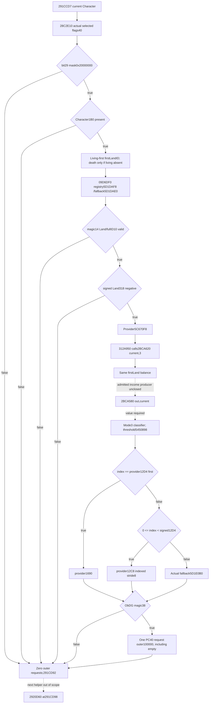

# 291CCD7 government / first Land / 312A950

This source-only stage follows **post2BCA620_pre291CCD7** and ends at **postGovernmentLand312A950_pre291CD92**. Next2920D60 at291CD98 is outside scope. CK3 1.20.0.3 /Steam25652598 /base140000000; recorded frozen SHA25694B55397ABB687A3DCD436805A5D885E6BE90FA6C693FEB44A9E3BBEEADE02A6 is reused. No runtime or implementation occurred.

## Exact caller order and admission

The cached fullcaller is `g2-resume-20261005/battle-trait-native-input-primitive-v79/context-source/region-0291C0D0.asm`. Current Character is R14; model is R13; receiver RSI is **model+10**.

1.291CCD7 passes current Character to28C2E10. Return+40 is loaded as a DWORD at291CCDF.291CCE2 `shr rcx,0x1d`,291CCE6 `test cl,1`,291CCE9 `je291CD92` prove **decimal bit29, mask0x20000000**. This is independent of the earlier negative-gold bit10/mask0x400.
2.Bit29 true demands current Character QWORD1B0 presence.291CCEF/CCF7 skips if null. It does not yet demand provider rows or mode3 income.
3.Present living1C0 is preferred for the **first Land ID**. Count DWORD1EC!=0 reads QWORD1E0 and its first DWORD. Count0 selectsFFFFFFFF and never reads death1D0. Only absent living1C0 demands death1D0; present death and count74!=0 reads QWORD68 and its first DWORD. Missing death/count0 selectsFFFFFFFF. Neither array is iterated, sorted, or rewritten.
4.291CD49 calls09D6DF0 with address of that full DWORD ID. Returned pointer must have DWORD14=4C616E64 and DWORD10!=-1. Only a valid Land demands signed QWORD318.291CD65 `jge291CD92` skips all nonnegative balances.
5.Only a valid negative Land balance demands08FD4E0, then **312A950(provider,current Character)** at291CD72. This provider is the existing exact.3 raw provider slot5C670F8, not the model receiver.
6.Returned descriptor magic DWORD38 must equal4744624F. Otherwise skip. A valid descriptor causes exactly one **2438850(model+10,descriptor+40,100000)** call at291CD8D. This outer occurrence is retained when PC40 is valid and empty; it is not silently deleted.

## Government selection is source specific

Reuse the pinned28C2E10 cache `battle-trait-future-context-branch-v82/source-lane/region-028C2E10.asm` (237 B). It validates current Character magic1C/fullID18, examines **death1D0 first** and government death+88, otherwise living1C0 government+3F8. If neither storage exists it follows related1B8+C8 full IDs through Character registry5C67568/fallback5C67570. Invalid Character or selected null government uses actual fallback global5D1E2A8. The returned government's flags40 are required; a differently selected raw Character flag cannot substitute. Government death-first ordering differs from the caller's living-first Land list ordering.

## Complete 312A950 body

New exact function extent **[0312A950,0312A9AB),91 B**, normal returns atA97D/A99D/A9AA, is captured once. Its .pdata row was reused, so no new metadata bytes.

- RDX=current Character, RCX=provider. Saved provider is RBX.
- A95F sets EDX=3; A964 calls already cached **2BCA620(current Character,3)**.
- A969 compares returned signed EAX with provider DWORD12D4 **before** any negative-index test. Equality returns QWORDprovider1690. Preserve this even if the provider count is negative.
- Otherwise A97E tests EAX, negative selects fallback. Nonnegative EAX must be signed-less-than provider12D4; then provider QWORD12C8 is a pointer array indexed by signed EAX with stride8.
- Remaining cases return global QWORD**5D1E0B0**. The instruction A99E uses RIP displacement2BF370B, nextRIP312A9A5, yielding exactly5D1E0B0.

This shell is complete and creates no callbacks or initializers. Actual provider slots/return descriptor validity remain raw observations.

## Mode3 classifier dependency

Existing28B94B0 source already covers the first-Land getter and actual signed Land318. Mode3 calls exactly that same living-first/death-fallback first-ID path; therefore a stable admitted frame has a negative classifier balance. Do not substitute Character1B0+100 gold.

Cached2BCA620 negative branch selects **2BCA580(out,current Character)** at2BCA67E because mode3!=0. Gold mode0's2BCA4E0 and its played-accounting source are different sources.2BCA580 is currently uncaptured and is the precise admitted negative-mode3 income seam. No living-played gold accounting expansion is required or claimed by this packet.

If that mode3 income later closes, cached2BCA620 preserves its already proved arithmetic and demand:

- Every income<100000 demands the actual selected government bit10/mask0x400 **before** the zero/negative-income test. True uses divisor100000; otherwise divisor=income.
- Mode3 uses threshold header **5450898**, data QWORD+0/count DWORD+C. Mode0 header5450728 does not alias it. LEAs at2BCA6AD/6C7 prove the selected address.
- Divisor0 returns count; negative divisor returns wrap_i32(count-1). Positive divisor uses the pinned physical wrapped debt/month arithmetic and ordered signed thresholds: first threshold strictly greater than computed months yields ordinal-1; no hit or nonpositive count yields count-1.
- Thus count0 is not sufficient to guess the return index while income is missing. Income0 and income<0 can return different indices. No arbitrary effective income DTO or callback execution is proposed.

## Exact raw09D6DF0 resolver

No body existed in the filename/doc cache. The parent authorized this sole necessary extra leaf to unlock invalid/nonnegative first-Land skips, without expanding2BCA580. Target09D6DF0 has no .pdata entry. Reused adjacent .pdata row32093 has extent[9D6D70,9D6DEF), row32094 proves the next cached function starts9D6E70. One narrow **[009D6DF0,009D6E70),128-B** gap capture excludes that next function. The demanded resolver itself is **[009D6DF0,009D6E29),57 B**, ending RET6E28. The remaining71 captured bytes are not consumed as source leaves. No new .pdata bytes were needed.

-6DF0 loads actual registry QWORDslot**5D1DAF8** (nextRIP9D6DF7+displacement5346D01). Readable-null registry directly selects actual fallback; there is no initializer.
-Nonnull registry reads the requested full DWORD, extracts low24 bits for the index and compares **unsigned** against registry DWORD2C. Out-of-cap selects fallback. Full generation bits are retained for the later equality check.
-Indexed storage is registry QWORD20 with stride16 and slot QWORD+8. Null indexed pointer selects fallback. Nonnull object DWORD10 must equal the entire requested DWORD, else fallback.
-Fallback is actual QWORDslot**5D1DAE0** (nextRIP9D6E28+displacement5346CB8). The returned object has no magic check inside this resolver. Caller291CD4E validates magic DWORD14 and291CD55 fullID10!=-1 before reading signed QWORD318.

The source-defined fallback is an observed object, not a synthesized empty Land. An unreadable demanded registry/header/slot/object is a missing read; readable-null registry and out-of-cap are proven fallback branches. Unknown or unreadable fallback cannot be replaced with magic0/ID-1. The accepted registry recipe now enables actual invalid/nonnegative resolved-Land zero-request branches independently of2BCA580.

New physical source read cost is **219 B =91-B312A950 +128-B resolver gap**, .pdata0. Reused government237 B,28B94B0 mode3/table256 B,2BCA620 fragments479 B and full caller are separate cached source reuse.

# Smallest useful raw observer proposal

Source only. No schema or implementation has been released. Existing packets' source and receipts stay unchanged.

Proposed same-query optional leaf `following_government_land_312a950`, dedicated module `battle_person_following_312a950_contract.py`, normalizer `normalize_following_government_land_312a950`, stable emitter `emit_following_312a950_requests_from_current_source_inputs_12003`. Proposed dedicated native files `battle_person_following_312a950_v1.inc.hpp`, `battle_person_following_312a950_serializer.inc.hpp`, `ck3_12003_following_312a950_sources.inc.hpp`, `ck3_12003_person_following_312a950.inc.hpp`. These names reserve no shared edits and are subject to the parent's actual implementation assignment.

The source receiver is inline model+10. This leaf would contribute one ordered outer family after2BCA620 and before2920D60. A stage emitter would pass raw PC rows to the existing pure PC fold, retain valid empty occurrences, and preserve earlier stage contributions when a demanded dependency is missing.

## Demanded raw groups

1. `government_source`: source-specific28C2E10 selector inputs and actual selected flags DWORD40; exact bit29 mask0x20000000. Reuse the accepted government source recipe. If bit29 is false, ready=true with zero requests; every later group is undemanded.
2. `character_state_present`: actual readable QWORD current Character1B0. If absent, ready=true with zero requests; later groups undemanded.
3. `first_land_source`: actual living1C0 presence/count1EC/firstDWORD1E0. Only absent living demands death1D0/count74/firstDWORD68. Record full ID, the chosen family, and the raw absent/count0-derivedFFFFFFFF. Read only one ID. A zero living count does not demand death.
4. `land_resolution`: actual QWORDregistry slot5D1DAF8; readable-null directly uses actual fallbackslot5D1DAE0. Nonnull demands unsigned capacityDWORD2C; low24 fullID out-of-cap uses fallback. In-cap demands dataQWORD20, stride16 slot+8; null pointer or storedfullDWORD10 mismatch uses fallback. Retain complete generation bits. Record selected actual object magic14/fullID10. Invalid returned Land yields zero requests; valid Land demands signed QWORD318. A nonnegative value yields zero requests and demands neither mode3 income, thresholds nor provider selection. No initialization or callback is needed.
5. `mode3_income_source`: **2BCA580(out,current Character)** production raw/source-closed value, currently an explicit missing dependency. Do not copy gold2BCA4E0/currentraw2B0 or inject arbitrary evaluator results. Negative Land branch remains unavailable until its genuine producer closes.
6. `mode3_classifier`: same firstLand negative balance; actual income; government bit10/mask0x400 only when income<100000; ordered signed thresholds from5450898/countC only when demanded by cached classifier flow. Existing exact physical arithmetic can be reused as a pure fold after the source input closes.
7. `provider_selection`: actual provider QWORDslot5C670F8; signed count12D4; equality-first descriptor1690; else only valid indexed element from12C8; else actual fallbackslot5D1E0B0. Retain selected full descriptor magic38. A valid descriptor demands PC40 raw rows for exactly one unit100000 occurrence, including known empty.

## Minimum release and precise missing inputs

Immediately source-closed release: actual selected flags bit29=false, or bit29=true with actual1B0 absent, or actual resolved firstLand invalid/nonnegative. All are independent ready zero-request branches and have no initializer, callback, accounting or income demands. The new raw09D6DF0 source recipe closes the last two branches; they should not wait on2BCA580.

Admitted negative Land remains `mode3_income_2bca580` unavailable. Source-owned kernel needs its actual raw producer, not a supplied effective number. Once this exact leaf is closed, the91-B312A950 shell already supplies provider selection and the outer contribution order.

Exact consumer frontier on a ready selected branch: `postGovernmentLand312A950_pre291CD92`; next2920D60 is a separate unknown. No request may be guessed for the negative branch and no complete-person frontier is claimed.

## Sealed source packet

External packet: `Z:/ck3_mod_rewrite_process_assets/g2-background-round4-20261005/person-tail/following312a950-source`. `SOURCE-PINS.json`, `READ-COST.json`, and `MINIMAL-RAW-SCHEMA-PROPOSAL.json` seal exact source receipts, byte cost, and the proposed input grouping. No production contract, callback execution, code, test, build or live artifact was produced. Prior4956-B and767-B packets remain unchanged.
