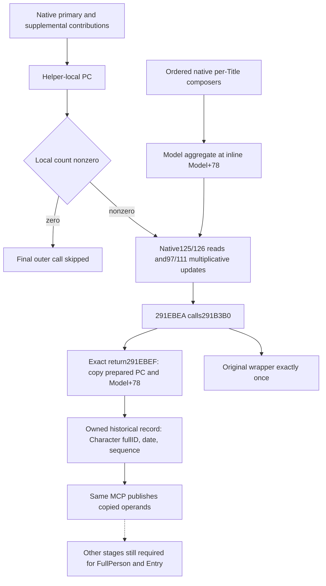

# Native final Title-tail capture at the merged Person helper

This work adds a historical, stage-correct input to the existing Person query.
It copies the PC already prepared by actual291E3A0 at its final natural outer
append. It does not reconstruct a baseline from a current Model. The new family
is source-ready only; Root owns the unique Native60 build and FIRST. No local
Game, SDK, process, executable read, hash, compiler, import or test is executed
by this author. The local CK3 prohibition remains in effect on2026-10-10.

Exact build: CK3 1.20.0.4 / Steam25734779, retained executable SHA
98702F88A547CDE2EAF29A85F93B85F68EE4CF8148336A4F7AFAEB75319DD518.
The qualified parent is Native59. Its six input wholes and the separately
qualified three-body Python outer projection are retained without replay.

## Actual native tree before implementation

The complete actual291E3A0 helper is2310B. Its held171B tail
`[291EAB3,291EB5E)` reads the inline Model+78 container, not a pointer loaded
from Model+78. Raw U16 property keys125/126 select paired signed Q64 values.
Model and helper-local values are added with64-bit wrap. A zero sum skips the
setter; a nonzero sum adds100000, then2303280 multiplicatively updates local
keys97/111. It does not assign those factors as final property values.

Ordered per-Title composers precede this tail and call291B3B0 independently.
The selected final caller is distinct:

- 291EBE3 prepares RDX as the helper-local PC address.
- 291EBE7 copies the actual Model into RCX.
- 291EBEA calls291B3B0 and returns at291EBEF.

At that natural call the prepared PC already includes the actual primary,
supplemental and local tail transformations. Copying it directly removes the
missing historical Model operand from this final-request family's readiness.
It does not prove that the complete Person or Entry algorithm is implemented.

## Hook and copied input contract

The reused actual15-byte entry anchor at `[291B3B0,291B3BF)` is
`48895c241048896c24184889742420`: three complete stack MOV instructions,
without RIP-relative addressing or control transfer. The trampoline replays
these instructions and resumes291B3BF. The existing actual-loss journal patch
lifecycle supplies the installation pattern. The original wrapper receives its
original arguments exactly once; its RAX bits are preserved.

Only the exact physical return address `image_base+291EBEF` is observed.
The per-Title caller return291EF47 is ignored. The callback copies Model+8's
Character pointer and full DWORD ID18, an owned monotonic sequence and native
GameState date08. Records are joined by both the Character pointer and its full
ID, including generation. Query time reads only owned copies. It neither
rereads a captured pointer nor labels historical capture_date_raw as the
current query date. A new observation replaces only that exact owner's record.

`prepared_pc` is the actual RDX PC. `model_aggregate_pc` is a diagnostic copy
of inline Model+78. Both use signed count+C, ordered U16 keys through QWORD+0,
and paired signed64 values through QWORD+68. Full bits, zeros, repeated keys
and their physical order are retained. `inline_destination_identity` is the
address Model+10; it is distinct from QWORD[Model+10]. The actual outer weight
is100000. The observer itself performs no Model write, and this pre-call record
does not claim that the ensuing native append committed successfully.

A fully copied prepared PC is independently ready even if the diagnostic
aggregate/date copy is partial. An absent natural call is explicitly
`native_title_tail_unobserved`; a captured prepared-PC failure is
`prepared_pc_partial`. No baseline, replay equivalence, inferred history,
persistent WAL, policy, tool, flag or command is added.

## Same-query publication and consumer

The optional typed field is `following_291e3a0_captured_tail` under the existing
current-person state of `ck3_query_battle_terminal_transition_v1`. Its schema
is `xar.ck3.person-native-title-tail-capture-12004-v1`; source_stage is
`post_composer_pre_final_outer_append`, and historical_capture is true.
FullHelper, FullPerson and Entry remain false outside this independent family.

`emit_captured_person_title_tail_request_12004` publishes one actual prepared
request with its original owner, sequence/date, ordered property block, actual
caller and destination. It can operate across a partial diagnostic aggregate;
it refuses an unobserved or partial prepared record. Normal Driver/Service
normalization retains the typed field and full CharacterID join.

The owned CMake leaf explicitly registers the new12004 runtime TU; the existing
12002 source GLOB cannot discover it. The unique whole target is
`xar_ck3_12004_person_native_title_tail_capture_mcp_test <wire-dir>`. Its sole
registered consumer uses six new synthetic graphs through the genuine query,
serializer, MCP and Service. Cases cover unobserved input, ordered full Q64
capture, ignored per-Title caller/original-once behavior, owner generation,
partial PC copying and immutable history after native-source mutation. Both
FIRST stages are AUTHORED_NOTRUN until Root reports their actual results.

## Evidence and deferred computation

Held actual helper/wrapper/copy evidence:

- `Z:/ck3_mod_rewrite_process_assets/g2-background-20261009/person-entry-after-government53/actual-helper-body02/SOURCE-CAPTURE.json`
- `Z:/ck3_mod_rewrite_process_assets/g2-background-20261009/person-title-outer-append/native-tree/ACTUAL-WRAPPER-CONTRACT.json`
- `Z:/ck3_mod_rewrite_process_assets/g2-background-20261009/person-title-outer-append/native-tree/ACTUAL-COPY-CONTRACT.json`
- `Z:/ck3_mod_rewrite_process_assets/g2-background-20261009/person-historical-model-stage/native-tree/ENTRY-PATCH-ANCHOR.json`
- `Z:/ck3_mod_rewrite_process_assets/g2-background-20261009/person-historical-model-stage/actual-typed-operands01/SOURCE-CAPTURE.json`

The last entry is Root's391-byte actual getter/setter capture onOctober10.
The getter's absent continuation2303774 and setter's ensure/index helper2303900
are deferred source-computation work. Their pending382-byte recipe is not
needed or executed for direct capture. No new executable bytes are requested
by this implementation. Cumulative retained Person source is7081B/24reads;
this source package adds zero reads and no new live or gameplay credit.
