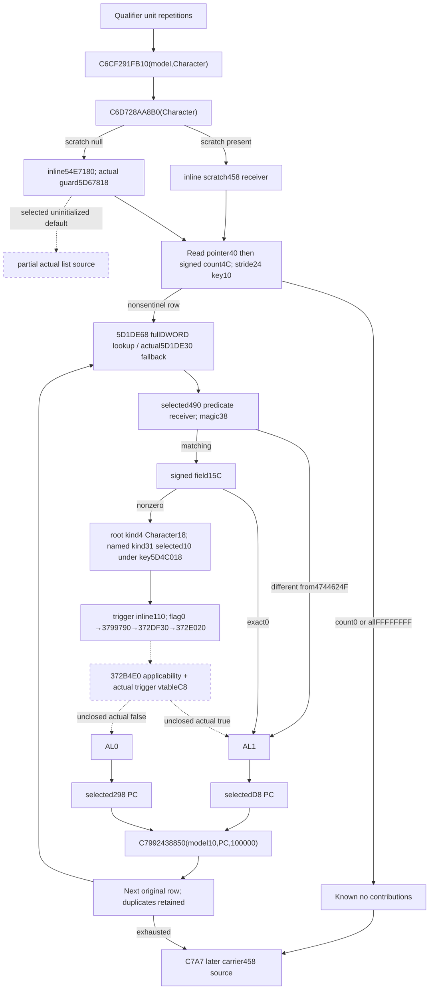

# Current person ordered list and 2530DD0 predicate, exact 1.20.0.3

2026-10-06 / ISO2026-W41. Exact CK3 1.20.0.3, Steam25652598, frozen EXE SHA-256 `94B55397ABB687A3DCD436805A5D885E6BE90FA6C693FEB44A9E3BBEEADE02A6`, image base `0x140000000`. Source-first packet: `Z:/ck3_mod_rewrite_process_assets/g2-background-round4-20261005/person-tail/list-predicate-2530dd0-source/`. The complete caller is reused from the previous `region-0291C0D0.asm`; bounded captures close the getter, wrapper and physical generic-evaluator interface. No game, initializer, evaluator or allocator is executed.

## Native position and actual list

The caller first completes the qualifier contribution at `291C68D`, then calls `291FB10(model, Character)` at `291C6CF`. `291C6D4` passes that same Character to `28AA8B0`. The getter returns an **inline receiver**: `Character+1B0` nonnull selects `scratch+458`; null scratch selects static inline `54E7180`. The getter's actual static initialization guard is signed32 `5D67818`. It may initialize the default before returning; readonly collection records actual bytes/guard and never performs that initialization. A selected uninitialized default stays partial. A valid selected held-scratch list does not become unavailable because an unused default is uninitialized.

The guard path occurs before either receiver is selected; it passes the static callback address to the registration path, not the Character or held scratch. The observer performs no such call and samples the actual selected held bytes directly. Guard0/-1 is not evidence that those independently observed held bytes are missing, and no initialized-default flag is invented for them. This is a current-source distinction; a hypothetical future native constructor still requires its own stage inputs.

The caller reads QWORD array pointer `receiver+40` before signed32 count `receiver+4C`, including at count0. Rows have stride **24 B**, with a full DWORD key at row `+10`. Count0 is known empty; a negative count is not native-established empty because the loop compares end pointers. `291C6F8` first searches for any key other than `FFFFFFFF`; an all-sentinel list skips the entire contribution step. When one exists, `291C730` starts again at the original first row and visits every row in order, skipping only sentinel keys. This guard neither compacts nor deduplicates the list. Repeated IDs produce repeated contribution calls.

Each nonsentinel key resolves through actual storage slot **`5D1DE68`** (`291C73F + 3401729`) and fallback pointer slot **`5D1DE30`** (`291C770 + 34016C0`). The storage's unsigned capacity is `+2C`, table pointer `+20`, indexed row stride16/pointer `+8`; low24 bits index the table, then the selected object's full DWORD `+10` must equal the requested key. Readable native null/out-of-range/null-slot/generation-mismatch paths select the actual fallback. Read failure is unknown, not a native miss.

`291C779` calls `2530DD0(selected, Character, 0)`. AL1 selects **selected+ D8**, AL0 selects **selected+298**. Both outcomes call `2438850(model+10, selectedPC, 100000)` at `291C799`. This preserves every nonsentinel occurrence and the actual PC; there is no observed per-row variable weight. A known zero-key-count PC remains a real empty contribution request.

## Exact predicate and scoped evaluation interface

`2530DD0` reads the actual pointer at `selected+490`, then that receiver's unsigned DWORD `+38`:

1. Magic different from `4744624F` returns AL1 without reading `+15C` or creating a scope.
2. Matching magic demands signed32 `+15C`. Exactly0 returns AL1 without creating a scope.
3. Any nonzero `+15C` creates a scoped evaluation and evaluates the inline trigger object at **predicateReceiver+110**. This field is a source guard; negative values are also nonzero and cannot be called an empty condition.

The Character argument is consumed by the called `B17C70` constructor even though `2530DD0` has no explicit `RDX` read before that call. The constructor establishes **root scope kind4** and the zeroextended DWORD `Character+18`. The wrapper separately binds **named scope kind31**, with zeroextended DWORD `selected+10`, under the actual signed32 key at **`5D4C018`**. `373A110` appends/replaces an ordinary 24 B named-scope record; the newly constructed context starts empty. The Character root and selected object's named scope must not be conflated. An initial relay that Character was unused was corrected by closing these callees before implementation.

The wrapper passes flag0 to `3799790`; that branch tail-jumps to `372DF30`. Its local evaluator state calls `372E020(triggerObject, evaluationState, 0)`. The observed interface checks root-scope type metadata and `372B4E0` scope applicability, then invokes the actual trigger object's **vtable+ C8** evaluation function. This is the exact next functional input seam. The trigger's vtable, function pointer, root/named scope identities and named-binding key can be observed; a boolean cannot be invented from its address, count or available PC.

The generic predicate internals behind `372B4E0` and the concrete vtable+C8 implementations are **not closed by this packet**. No broad trigger catalogue scan is authorized or needed for the known early branches. A nonempty predicate row remains independently partial with its actual physical script/scope observations and a concrete next dynamic-function RVA. It does not remove other known admitted rows.

## Smallest independently useful readonly query

Add optional **`list_predicate_2530dd0`** to the existing same-Character source query. No new command or native evaluator invocation is required. Bind only the actual static inline header `54E7180`, its guard `5D67818`, storage/fallback slots `5D1DE68/5D1DE30` and named scope key `5D4C018`; reuse the existing readonly memory/property helpers.

The leaf publishes status/ready/character_id/reason, actual scratch selection, actual default guard, array-present provenance, signed list count and original-order rows. Each row retains physical index/full unsigned32 key, sentinel skip, independently qualified ready/reason, selected object/full ID, requested/resolved generation association and actual fallback selection. Nonsentinel rows retain actual `selected+490`, magic and lazily demanded `+15C`.

Known early predicates are independently available AL1; only their actual selectedD8 property blocks are needed. No `+15C`, scope IDs, named key, script vtable or false PC may be read as a substitute for a skipped predicate. A missing earlier row does not remove a fully closed later row or change row order. Sentinel rows retain their original positions and never demand registry/predicate/PC inputs. Readable all-sentinel and count0 lists produce no contribution requests.

Nonzero `+15C` rows expose an explicit evaluation seam: inline trigger identity, actual vtable/evaluator+C8 pointer, actual root Character+18 full ID, selected+10 full ID, named binding key `5D4C018`, and source-established kinds4/31. Their nullable predicate result remains unknown until the concrete trigger input is closed; both PCs can be retained only as diagnostic physical observations and cannot stand in for the missing boolean. The next useful research should use the actual emitted function RVA and loaded definition/node identity, rather than scanning all triggers. This packet does not provide an arbitrary scripted-evaluator bridge or fake acceptance.

The pure emitter supplies each independently complete nonsentinel early-admitted row's actual PC at unit100000 in original order. A whole-stage emitter requires every demanded row. A separate per-row emitter exposes independent value while a nonempty scripted row is partial. Fresh-stage use still requires the list/scope data for that exact post291FB10 stage and an explicit baseline. The held current snapshot cannot be reused as a pre291FB10 list or current-final baseline.

## Source boundary, cost and ownership

Bounded functions: `28AA8B0`121B, `2530DD0`282B, `3799790`349B, `372DF30`232B, `372E020`1070B, `B17C70`214B, and joined `373A110/373A176/373A234`313B. **2581 new code bytes +660 `.pdata` bytes =3241 B** new frozen EXE reads. No unwind bodies, strings, generic trigger classes, allocator internals or alternate flag branches were separately read. Capturing complete exact function extents includes ordinary cleanup and undemanded branches but does not claim their execution or dependencies are needed.

Source and dedicated pure/contract/native includes/fixture remain the gbs3 worker's task; shared DTO/collector/serializer/normalizer/CMake wiring belongs to `/root/person_later_suffix`. Root owns central native validation, canonical/progress reports and push. Implementation starts only after this source/tree/query plan is sealed. Current readiness is **research/source-closed for the list/early predicate**, with explicit unknown nonempty scripted evaluation. No new test, native build, wire consumption, game/SDK/pipe/UI/Steam/process/profile/save/cache/runtime preparation/stage/deploy or game-day advance occurred during this source closure. Earlier qualifier's 18 new-wire qualification remains a separate pending task and is not repeated here.

## Dedicated current-input candidate, 2026-10-06

Source-only commit `4b12dbc6fd124165a91498c774923987080f2aa4` and its original 3241B receipt are retained. Pure commit `dd6a6200` adds `battle_person_list_predicate_2530dd0_12003.py` and strict `battle_person_list_predicate_2530dd0_contract.py`, normalizer `normalize_list_predicate_2530dd0`. Whole-stage emitter `emit_list_predicate_2530dd0_requests_from_current_source_inputs_12003` requires all demanded rows; `emit_list_predicate_2530dd0_row_requests_from_current_source_inputs_12003` exposes an independent physical row for exact-prefix/later-output assembly.

One necessary new compound production Python case ran once at **2026-10-06 02:05:53–02:05:54 Asia/Shanghai**, **1 passed /0.62s**, outer1.1465959s, exit0 GREEN. It retains repeated fullDWORD IDs and sentinel positions, emits real empty PCs, uses actual native fallback without demanding an unused scope ID, keeps a nonzero/negative scripted field unknown with root/named scope provenance, and exposes earlier/later ready rows independently. It also exercises selected static default0 versus initialized guard-2, actual unread generation comparison, known-true partial PC and rejects a fabricated falsePC298. Receipt `list-python-01/RESULT.json`; log SHA `6026075a436271c31e53dee8c005e0837d9270ff69635f13ed14032ee5e24276`. No old qualifier/list/provider tests were rerun.

Dedicated native APIs are `ContextSourceListPredicate2530dd0InputsV1`, `ContextSourceListPredicate2530dd0BindingsV1`, member `b.list_predicate_2530dd0`, `BindListPredicate2530dd0Sources12003(base)`, `ListPredicate2530dd0Inputs(b, Character, id)`, `ListPredicate2530dd0Json(out, dto)`, new fixture hook `RunListPredicate2530dd0Fixture(path)`. The collector implements the exact known early AL1 branches locally and publishes explicit nonempty scoped-trigger metadata without invoking any native evaluator or fabricating falsePC298. Fourteen distinct new fake-memory wires are prepared. Root central build/CTest and first consumption are pending; there is no compiled-wire or live claim from this candidate.
