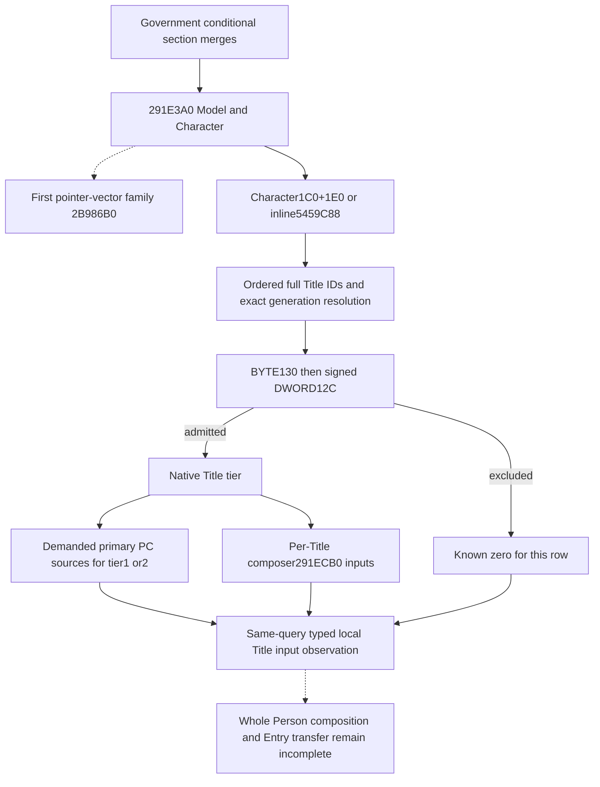

# Person preparation: local Title contributions after the Government gate

This input belongs to the mandatory merged Person preparation call, `291CE7B CALL291E3A0`. It identifies the held-title rows that the native decision model actually considers, preserves their order and generation, and reads their demanded contribution inputs. It reuses `ck3_query_battle_terminal_transition_v1`; it does not claim a complete Person model, Entry transfer, or battle outcome.

The exact build is CK3 1.20.0.4 / Steam25734779, retained EXE SHA-256 `98702F88A547CDE2EAF29A85F93B85F68EE4CF8148336A4F7AFAEB75319DD518`. Root alone captured the actual helper and demanded row composer. This source package performs no executable read, process access, Game, SDK, compilation, import, or test.

## Actual source tree before the observer

Root's `actual-helper-body02/SOURCE-CAPTURE.json` in `Z:/ck3_mod_rewrite_process_assets/g2-background-20261009/person-entry-after-government53` contains the complete 2,310-byte decode of `[291E3A0,291ECA6)`: 515 instructions, sole `RET291EC36`, with live cold blocks after the return rejoining the body. All non-call control edges remain within the captured extent; the final byte is `INT3` padding. The helper takes Model in RCX and Character in RDX and composes local properties plus per-source callbacks. Its return is not a scalar contribution contract.

The helper first calls `2B986B0(Character, temporary pointer vector)`. That family remains separate. The local Title family then uses Character QWORD+1C0: non-null selects its inline header+1E0, null selects actual inline header `5459C88`. The header is QWORD array+0 and signed DWORD count+C. IDs are DWORDs in native order, including duplicates. The ID is demanded before the registry-null branch.

Actual registry slot `5D1DAF8` and fallback slot `5D1DAE0` resolve each Title. Resolution uses capacity+2C, slots+20, stride16/object+8 and equality with the selected Title's full DWORD ID+10. No unrelated magic or sentinel test is inserted. The existing [Title holder source](title-holder-12004.md) independently identifies this registry and Title+48/template tier+64.

At `291E7C5`, a nonzero selected Title BYTE+130 skips the entire row. Only a zero byte demands DWORD+12C; a value other than signed -1 skips the row at `291E7D3`. These raw property names are retained because their exact stock semantic names are not held. A row passing both checks demands its template tier and later `291E85F CALL291ECB0(Model, selectedTitle)`. Tier1/2 additionally demands primary property sources; other tiers skip those sources but still demand the row composer. An empty list or a list whose every row is excluded is a known zero contribution for this local family, independently of the first pointer-vector family.

Root captured the demanded composer once at 2026-10-09 13:33:56 UTC: `actual-local-title-composer03/SOURCE-CAPTURE.json`, actual `[291ECB0,291F076)`, 966 bytes, 206 decoded instructions and `RET291F02B`. Its input/branch details are recorded below with the implemented collector; no deeper callee is selected merely because it appears in the body.

The composer receives Model in RCX and Title in RDX. It reads Title QWORD+228 and signed DWORD+234 as an ordered pointer array. Each physical pointer supplies the PC at pointer+D8, folded into one local composite with explicit inner weight100000 at `291ED55 CALL2303100`. Duplicate pointers remain duplicate contributions. A zero composite key count at `291ED6A` skips annotation and the outer Model append. A nonzero count reaches `291EF42 CALL291B3B0(Model, composite)`, independently of the parent helper's tier1/2 primary-source condition. The middle Title counter/annotation does not introduce a numerical coefficient. Cold code after `RET291F02B` re-enters the live annotation path; the source tree includes it rather than treating the first return as the runtime extent's end.

## Value and remaining boundaries

The decision input is the contribution eligibility and numerical property sources of the actual held-title occurrences, rather than the general held-title list alone. Raw exclusion fields do not substitute for complete contribution readiness. Each demanded source must be observed or retain its precise unavailable reason. Current Model ownership is attribution only: the helper's later lookup reads Model+78 after callbacks, so a current final aggregate cannot substitute for that historical evolving stage.

The same-query leaf is `current_person_state.following_291e3a0_local_titles`. Its ordered rows retain the actual Title generation join, eligibility, native tier and copied PC constituents. `composer_ready` describes the useful per-Title numerical composer independently of other source families. The complete local leaf can be ready for admitted tiers that bypass the distinct primary/supplemental sources; a partial primary input does not erase an independently ready composer or ready sibling occurrence.

`compose_local_title_composer_blocks_from_current_source_inputs_12004` folds each selected Title occurrence once with the existing source-derived fixed-point merger. The output is one ordered property block and an `outer_append_demanded` flag per eligible occurrence. It preserves signed64 values, duplicate source occurrences, zero-valued keys and the existing first-copy/FFFF behavior. It does not emit one outer request for every constituent, infer the outer wrapper's weight from a two-argument call, or mutate a Model. A caller can select one ready occurrence when a different occurrence has an unread operand.

There is no existing semantically suitable typed extension container for a new mandatory helper's input in the current Person DTO. The new domain header and optional typed leaf therefore change the public carrier layout honestly. Root's dependency projection determines the necessary production owners; source-count reduction is not achieved by disguising Title observations as the earlier helper's append records.

## Unique authored qualification

The sole new native target is `xar_ck3_12004_person_following_291e3a0_local_titles_mcp_test <wire-directory>`. Ten original whole-command worlds cover a zero context header, zero static header, positive duplicate Title/PC occurrences, both raw exclusion branches, generation fallback, null registry with still-demanded IDs, partial unread PC values with an independent ready sibling, a negative signed header count, a positive tier1 primary source, and a tier2 primary source with source-proven empty supplemental demand. The single registered MCP compound consumes those unchanged bodies through the ordinary Service/Driver normalizer and checks the same full Character-ID join and per-Title numerical projection.

Source and fixture readiness are authored and not run. Root owns all compilation, linking, native FIRST and registered FIRST. Native53's historical seven native/registered cases are not replayed. New exact-image work for this continuation is 11+2310+966=3287 bytes in three Root reads; the cumulative Person continuation ledger is 5219 bytes in14 reads. Reusing the already captured Title Province getter118B adds zero new executable reads.

The first pointer-vector family, positive Government segment, later six-attribute stage and final Entry transfer remain separate source gaps. No complete Person readiness follows from a ready local Title family. The R83 empty `following_2922680` list is historical evidence for that other helper, not an empty Title family observation.

At 21:07 Asia/Shanghai on 2026-10-09, the user prohibited local CK3 use. This package is source-only and its unique native/registered compound remains authored and not run until Root executes it. Historical Native53 seven-case static qualification is retained without replay.
