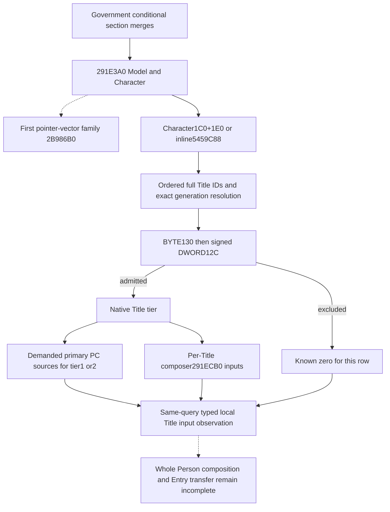
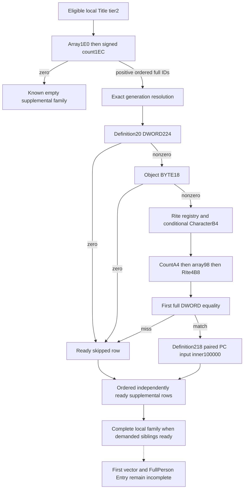

# Person preparation: local Title contributions after the Government gate

This input belongs to the mandatory merged Person preparation call, `291CE7B CALL291E3A0`. It identifies the held-title rows that the native decision model actually considers, preserves their order and generation, and reads their demanded contribution inputs. It reuses `ck3_query_battle_terminal_transition_v1`; it does not claim a complete Person model, Entry transfer, or battle outcome.

The exact build is CK3 1.20.0.4 / Steam25734779, retained EXE SHA-256 `98702F88A547CDE2EAF29A85F93B85F68EE4CF8148336A4F7AFAEB75319DD518`. Root alone captured the actual helper and demanded row composer. This source package performs no executable read, process access, Game, SDK, compilation, import, or test.

## Actual source tree before the observer

Root's `actual-helper-body02/SOURCE-CAPTURE.json` in `Z:/ck3_mod_rewrite_process_assets/g2-background-20261009/person-entry-after-government53` contains the complete 2,310-byte decode of `[291E3A0,291ECA6)`: 515 instructions, sole `RET291EC36`, with live cold blocks after the return rejoining the body. All non-call control edges remain within the captured extent; the final byte is `INT3` padding. The helper takes Model in RCX and Character in RDX and composes local properties plus per-source callbacks. Its return is not a scalar contribution contract.

The helper first calls `2B986B0(Character, temporary pointer vector)`. That family remains separate. The local Title family then uses Character QWORD+1C0: non-null selects its inline header+1E0, null selects actual inline header `5459C88`. The header is QWORD array+0 and signed DWORD count+C. IDs are DWORDs in native order, including duplicates. The ID is demanded before the registry-null branch.

Actual registry slot `5D1DAF8` and fallback slot `5D1DAE0` resolve each Title. Resolution uses capacity+2C, slots+20, stride16/object+8 and equality with the selected Title's full DWORD ID+10. No unrelated magic or sentinel test is inserted. The existing [Title holder source](title-holder-12004.md) independently identifies this registry and Title+48/template tier+64.

At `291E7C5`, a nonzero selected Title BYTE+130 skips the entire row. Only a zero byte demands DWORD+12C; a value other than signed -1 skips the row at `291E7D3`. These raw property names are retained because their exact stock semantic names are not held. A row passing both checks demands its template tier and later `291E85F CALL291ECB0(Model, selectedTitle)`. Tier1/2 additionally demands primary property sources; other tiers skip those sources but still demand the row composer. An empty list or a list whose every row is excluded is a known zero contribution for this local family, independently of the first pointer-vector family.

Root captured the demanded composer once at 2026-10-09 13:33:56 UTC: `actual-local-title-composer03/SOURCE-CAPTURE.json`, actual `[291ECB0,291F076)`, 966 bytes, 206 decoded instructions and `RET291F02B`. Its input/branch details are recorded below with the implemented collector; no deeper callee is selected merely because it appears in the body.

The composer receives Model in RCX and Title in RDX. It reads Title QWORD+228 and signed DWORD+234 as an ordered pointer array. Each physical pointer supplies the PC at pointer+D8, folded into one local composite with explicit inner weight100000 at `291ED55 CALL2303100`. Duplicate pointers remain duplicate contributions. A zero composite key count at `291ED6A` skips annotation and the outer Model append. A nonzero count reaches `291EF42 CALL291B3B0(Model, composite)`, independently of the parent helper's tier1/2 primary-source condition. The middle Title counter/annotation does not introduce a numerical coefficient. Cold code after `RET291F02B` re-enters the live annotation path; the source tree includes it rather than treating the first return as the runtime extent's end.

## Value and remaining boundaries

The decision input is the contribution eligibility and numerical property sources of the actual held-title occurrences, rather than the general held-title list alone. Raw exclusion fields do not substitute for complete contribution readiness. Each demanded source must be observed or retain its precise unavailable reason. Current Model ownership is attribution only: the helper's later lookup reads Model+78 after callbacks, so a current final aggregate cannot substitute for that historical evolving stage.

The same-query leaf is `current_person_state.following_291e3a0_local_titles`. Its ordered rows retain the actual Title generation join, eligibility, native tier and copied PC constituents. `composer_ready` describes the useful per-Title numerical composer independently of other source families. The complete local leaf can be ready for admitted tiers that bypass the distinct primary/supplemental sources; a partial primary input does not erase an independently ready composer or ready sibling occurrence.

`compose_local_title_composer_blocks_from_current_source_inputs_12004` folds each selected Title occurrence once with the existing source-derived fixed-point merger. The output is one ordered property block and an `outer_append_demanded` flag per eligible occurrence. It preserves signed64 values, duplicate source occurrences, zero-valued keys and the existing first-copy/FFFF behavior. It does not emit one outer request for every constituent, infer the outer wrapper's weight from a two-argument call, or mutate a Model. A caller can select one ready occurrence when a different occurrence has an unread operand.

There is no existing semantically suitable typed extension container for a new mandatory helper's input in the current Person DTO. The new domain header and optional typed leaf therefore change the public carrier layout honestly. Root's dependency projection determines the necessary production owners; source-count reduction is not achieved by disguising Title observations as the earlier helper's append records.

## Unique authored qualification

The sole new native target is `xar_ck3_12004_person_following_291e3a0_local_titles_mcp_test <wire-directory>`. Ten original whole-command worlds cover a zero context header, zero static header, positive duplicate Title/PC occurrences, both raw exclusion branches, generation fallback, null registry with still-demanded IDs, partial unread PC values with an independent ready sibling, a negative signed header count, a positive tier1 primary source, and a tier2 primary source with source-proven empty supplemental demand. The single registered MCP compound consumes those unchanged bodies through the ordinary Service/Driver normalizer and checks the same full Character-ID join and per-Title numerical projection.

The original ten worlds and compound were authored without execution by this source author. Root subsequently qualified that Native55 package once with10/10 native worlds and10/10 registered packets GREEN, as recorded below. Root owns compilation, linking and both FIRST runs. Native53's historical seven native/registered cases are not replayed. Exact-image work for the original local Title package was 11+2310+966=3287 bytes in three Root reads; its cumulative Person continuation ledger was5219 bytes in14 reads. Reusing the already captured Title Province getter118B added zero new executable reads.

The first pointer-vector family, positive Government segment, later six-attribute stage and final Entry transfer remain separate source gaps. No complete Person readiness follows from a ready local Title family. The R83 empty `following_2922680` list is historical evidence for that other helper, not an empty Title family observation.

At21:07 Asia/Shanghai on2026-10-09, the user prohibited local CK3 use. No CK3 was launched for this source package. Root's later Native55 static qualification is recorded below; it is not live qualification. Historical Native53 seven-case static qualification is retained without replay.

## Next positive supplemental input

Positive tier2 supplemental rows are the next concrete local-family gap. The retained helper body stages membership-array begin in R8, end in R9 (`begin + signextended count *4`), and the complete selected Rite DWORD+4B8 key at caller stack+20 before `291E9A2 CALL3F90870` (the first-vector counterpart is `291E667`). RAX is a returned candidate pointer, not an observed Boolean: the caller converts equal-end to null and admits Definition+218 PC only for a non-null, non-end result. It never dereferences that result. RCX/RDX are not restaged as semantic arguments, so a conventional two-argument prototype is not invented.

At Native55 authoring, the alternate inline path already proved full-DWORD first equality, SSE/BSF selection and a scalar stride4 tail, with miss returning end; the called path's return contract was still unclosed. The finite held-cache lookup found no complete `3F90870` body or exact contract and no runtime-function row for that target. Cached neighbors bounded `[3F90870,3F90970)` to256 bytes, a capture cap rather than a function extent. `person-entry-after-government53/local-title-next-supplemental/ROOT-CAPTURE-ARGV.json` prepared one Root-only read, subsequently completed as described below. This did not delay or reclassify the delivered ten-case source package.

## Actual supplemental closure and source construction

Root subsequently captured that256-byte cap once. Parent consumed `local-title-next-supplemental/actual-contains01/SOURCE-CAPTURE.json` once: the actual DWORD routine is only `[3F90870,3F908E3)`,115 bytes, returns at3F908D4/3F908E2, all branch targets internal and no calls. It loads the complete DWORD key from callee stack28, searches eight-DWORD AVX blocks with BSF selecting the first equal lane, then a scalar stride4 tail, and returns the first equal pointer or end. The adjacent QWORD routine3F908F0 is excluded. The observer uses the equivalent ordered DWORD equality without invoking either native search path or its CPU initialization.

For an eligible tier2 local Title, `291E872/291E879` demand QWORD1E0 before signed DWORD1EC. Each supplemental ID is a full DWORD, loaded before the registry-null test at291E8A2. Registry5D1DE80/fallback5D1DE20 uses capacity2C/table20/stride16/pointer8 and full-ID equality at selected object10. QWORD selectedObject20 supplies the Definition. Definition DWORD224 must be nonzero before selectedObject BYTE18 is demanded; a zero value in either guard is a ready skipped contribution.

Only rows passing both guards demand Rite registry5D1E2F8. A null registry selects fallback5C67670 without reading CharacterB4. A non-null registry demands that complete ID and validates a mapped Rite using fullID8, with the same low24 index, capacity2C/table20/stride16/pointer8 resolution. Membership then demands signed selectedObjectA4, QWORD selectedObject98 and selectedRite DWORD4B8 in that order, including count0. The first full-DWORD match admits Definition+218 PC at explicit inner weight100000 (`291EA6C CALL2303100`). A zero count or miss is known empty. Negative counts are partial, and no unread skipped field becomes an artificial requirement.

The same optional `following_291e3a0_local_titles` leaf gains a typed `supplemental` family per Title. It retains both resolutions, raw guard values, demanded Rite-ID distinction, membership inputs and observed search prefix, first match and admitted paired PC. Existing supplemental pointer/count/readiness fields mirror the family for compatibility. Composer, primary and each supplemental occurrence remain independently usable. `family_known_zero` includes admitted supplemental PC counts: a positive PC makes it false even if another row is partial; only complete known-empty supplemental inputs can contribute to a true result. Definition224 is physically the same field as sourcePC218+C, so a zero source count already takes the early skip. Complete readiness here describes demanded local Title source inputs; it does not close historical post-callback Model97/111 preparation, the final291B3B0 append, the first vector, FullHelper, FullPerson or Entry.

`compose_local_title_supplemental_blocks_from_current_source_inputs_12004` folds admitted supplemental PC constituents once per eligible Title occurrence at the proved inner weight100000. It preserves source duplicates, signed64 values and zero-valued keys. An explicit outer Title index allows an independently complete sibling to remain useful across partial values elsewhere. It returns input property blocks without inventing an outer Model weight or a historical stage. Frozen Native55 packets that lack the new typed family retain their original normalization; the new composition requires an observed family and never fabricates an empty result for an absent field.

The separate target `xar_ck3_12004_person_local_titles_supplemental_mcp_test <wire-directory>` authors six new whole-command worlds: first full-DWORD matches within an eight-element group and its tail with duplicate source occurrences; miss and zero membership count; both native short circuits with later fields unread; supplemental generation fallback; null Rite registry with the Character Rite ID undemanded; and partial PC values with an independently ready Title sibling. The sole registered six-packet MCP compound uses the original production bodies and the ordinary Driver/normalizer, then checks the numerical input projection. Root subsequently qualified these six new worlds and the sole six-packet compound as Native57; the earlier Native55 ten cases were not replayed.

Root reported Native55 GREEN once in `upstream-build-migration/entry-live-fix55/ROOT-PARENT-RUNTIME-INCREMENTAL-DLL.json`, with attempt `Z:/g2-native55-build01/attempt01/ROOT-NATIVE55-RESULT.json`: its ten native worlds and sole registered ten-packet compound passed. This author did not rerun or reread that qualification. It is static qualification, with no CK3 live, FullPerson or Entry claim. The new Root source read adds256 captured bytes (115 bytes of the selected DWORD function), making the retained continuation ledger5475 bytes in15 reads. This source construction uses only the new isolated author tree based atd18a15b11e6077761b59788ac5ef2145cdfc9032; previous frozen55 files remain untouched.

Root then reported Native57 GREEN, canonical `Z:/ck3_mod_rewrite_process_assets/g2-background-20261007/upstream-build-migration/entry-live-fix57/ROOT-PARENT-RUNTIME-INCREMENTAL-DLL.json`. Its six new native whole packets and sole six-packet registered compound passed once, from frozen source `53ac4eb7b12aa9be7e9abdca5a21d2ec73cdc08c`, adopted from author `6e07383256a2f81d50cd1b35a4c1ef3d96e8856d`. The actual dependency projection selected450 production replacements and one fixture, with maximum64 BelowNormal compiler workers; the canonical retains738 production owners and506 command rows. Native55 and Native56 GREEN cases were not replayed. The actual115-byte contains dependency remains the same retained proof. This is static-ready only: no supplemental live observation, FullPerson, Entry or gameplay outcome is claimed.
