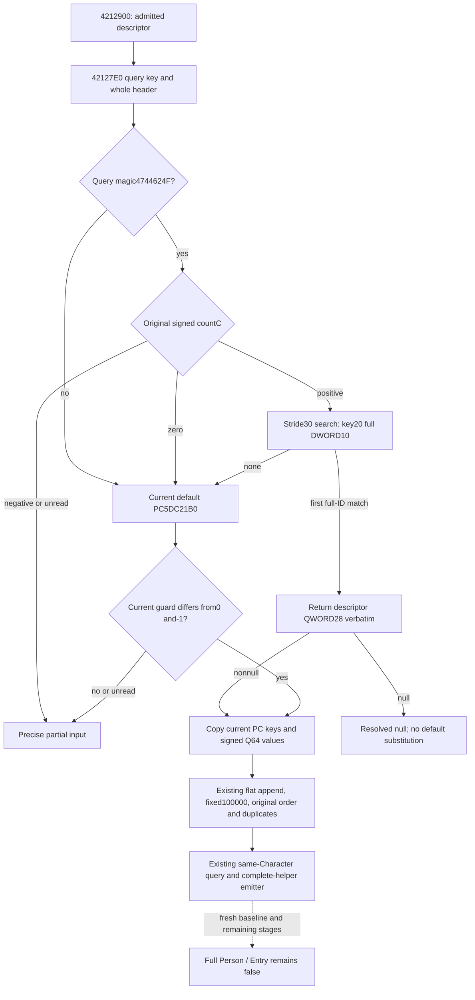

# Person mapped PC input on CK3 1.20.0.4

This follows the qualified ordered input observer in
[battle-person-next-ordered-helper-12004.md](battle-person-next-ordered-helper-12004.md).
The frozen executable is CK3 1.20.0.4 / Steam25734779, SHA256
`98702F88A547CDE2EAF29A85F93B85F68EE4CF8148336A4F7AFAEB75319DD518`.
The hash is inherited evidence, not a new read. Root captured the exact current
274-byte extent42127E0..42128F2 once; the receipt is
`Z:/ck3_mod_rewrite_process_assets/g2-background-20261009/person-entry-mapped-pc-input/actual-mapper01/SOURCE-CAPTURE.json`.
The source capture was decoded completely, including RET4212868/421287F and
the cold initialization tail. This adds274 bytes / one read to the previous
1638 bytes / nine reads. No additional callee body is needed for this observer.

The actual4212900 membership caller passes the admitted key pointer and the
**whole original header** to42127E0. The mapper checks query DWORD38 against
4744624F. With matching magic it reads the original header's pointer0 and signed
countC, then compares query full DWORD10 with each physical descriptor key20's
full DWORD10 in stride30 order. It does not filter the search by membership,
compare only low24 bits, demand candidate magic, or deduplicate repeated IDs.
The first matching descriptor returns its QWORD28 verbatim. A matching null PC
is a resolved null return and must retain that identity; it does not select the
default or search a later duplicate.

Wrong query magic, an empty header or no match returns the actual default PC
address imageBase+5DC21B0, proved by LEA421286E. The guard at5DC21A4 is proved by
421280C/421288C. The native TLS epoch path can execute initialization before
rejoining4212814. The observer never calls or simulates that initialization and
never writes the default or a Model. A matched descriptor demands neither the
default nor the guard. A default PC is released as a current initialized operand
only when the copied process guard is neither0 (uninitialized) nor-1
(initialization in progress); an unread guard or either state retains a precise
partial observation. Negative completed epochs remain valid. This follows the
native signed TLS comparison and the installed Microsoft runtime source at
`C:/Program Files/Microsoft Visual Studio/18/Community/VC/Tools/MSVC/14.51.36231/crt/src/vcruntime/thread_safe_statics.cpp`:
constants16-18 define0/-1/INT_MIN, and footer235-240 publishes the incremented
epoch. This compiler source is supporting runtime-protocol evidence, not a new
capture or a claim that CK3 was compiled with this exact toolchain version.
This is an observation of current memory,
not a claim about hypothetical initializer effects or a prepared Entry baseline.

The implementation reuses the existing `following_2922680` DTO and append
containers. The existing identity, properties, descriptor index and reason
fields retain selected PC, numerical values, caller occurrence and first-match
versus default/null selection. The four successful mapper selection labels are
explicit provenance reasons on mapped PC/descriptor rows; other ready records
keep their existing reason=null contract. There is no public header layout
change, new tool, capability, flag, native AI callback, policy or game action.

The PC decoder is the already qualified actual4 copier: signed countC, U16 keys
from pointer0, I64 values from pointer68, retaining duplicate/sentinel keys and
signed limits. The mapped append stays at its original flat ordinal with
weight100000. A demanded mapped read failure affects that occurrence and the
complete helper, while independently copied primary inputs remain usable.
The mapped-occurrence emitter can also release one actually copied mapped PC at
that original ordinal while a different source occurrence remains partial.
The isolated mapped fixture and registered compound are authored for Root's
unique FIRST. Their status is AUTHORED_NOTRUN until actual Root receipts exist;
no old Native50 case or qualification is rerun for this source package.
