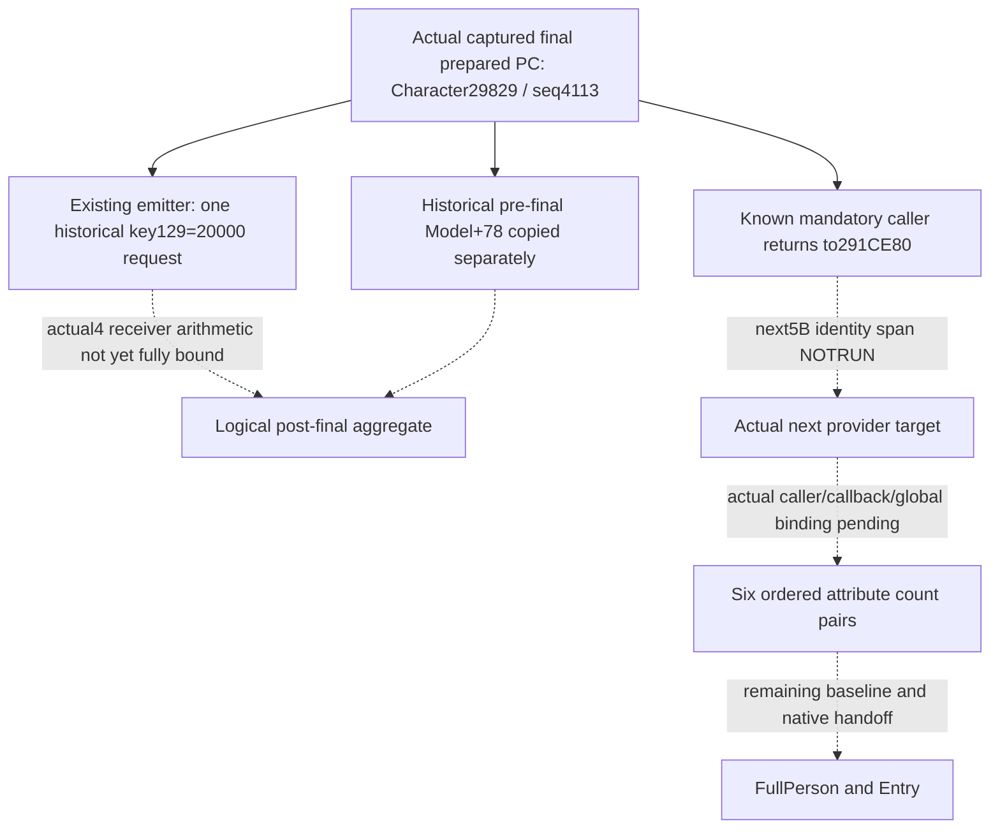

# Native60 final Person request: real capture and next caller suffix

The actual paused Native60 response now contains the final native-prepared
request from `291E3A0`. It independently unlocks the existing
`emit_captured_person_title_tail_request_12004`; no new observation field or
duplicate emitter is needed. This is a **production-live primitive**, not a
complete Person preparation, Entry refresh or new G2 result.

The exact build remains CK3 **1.20.0.4 / Steam25734779**, with retained EXE SHA
`98702F88A547CDE2EAF29A85F93B85F68EE4CF8148336A4F7AFAEB75319DD518`.
Root supplied compiled Native60 source `30605664d00c845b4fa7a736d157903169a1e70b`,
Python source085 including adopted outer projection `17b8f411`, and immutable
public source `e4db4db9`. This author reads owned source and retained JSON only;
there are no Game, SDK, process, window, EXE, disassembly, hash, build, import
or test operations.

## Actual owned observation

The real registered-MCP response is
`D:/codex-ck3-background-spill/g2-live-20261010-r85-retry02/managed-full-r85-native60restore01/operator/gameplay-responses/002-native60-person-baseline.json`.
Its Root extraction is
`D:/codex-ck3-background-spill/r85-source-freeze01/PERSON-NATIVE60-CAPTURE-BASELINE.json`.
The saved request ran at **2026-10-10 02:47:16.793647–02:48:44.458587
Asia/Shanghai**. The response declares paused=true, public revision3, native
revision2 and observed raw date53288784. These timestamps belong to the saved
response; this source-only continuation performed no query.

| Captured field | Actual value |
| --- | --- |
| Character full ID / identity | 29829 / `0x1d0ae6556c8` |
| Native capture sequence / raw date | 4113 / 53288784 |
| Historical Model / inline destination | `0x1d0ca86c418` / `0x1d0ca86c428` |
| Actual final caller return | `0x291ebef` |
| Prepared PC count / keys / signed Q64 values | 1 / `[129]` / `[20000]` |
| Outer weight | 100000 |
| Diagnostic Model+78 PC | ready, 152 physical rows |
| Historical capture / observer Model write | true / false |
| FullHelper / FullPerson / Entry / new G2 credit | false / false / false / 0 |

The [Native60 capture contract](battle-person-historical-model-stage-12004.md)
joins the original Character pointer and full ID, retains the historical
sequence/date, and observes only the final natural return291EBEF. Therefore
the prepared block is the actual native post-composer, post-tail input; it
does not require recomputing the historical125/126 reads or97/111 transforms.
The captured diagnostic aggregate remains a separate copied input. The
observer's false write flag describes the observer; it does not establish
whether the ensuing original native append committed.

The existing emitter can now release one request for historical capture4113:
the original owner and Model+10 destination, property block `[129]:[20000]`,
weight100000, and its historical source stage. That request is useful on its
own even when a current-query sibling is partial or refers to a different
Model. It must retain its captured provenance.

## Numerical fold boundary

The actual4 append `2438830` and receiver `2303100` have a proved
[raw member/argument-use contract](battle-person-next-direct-carrier-12004.md).
That topic explicitly distinguishes its six source-use windows from a complete
arithmetic qualification. The
[outer-wrapper projection](battle-person-title-outer-append-12004.md) likewise
publishes entry requests while retaining delegate arithmetic as a separate
proof boundary. The exact3 `_fold_property_request` helper is available, but
its name and former qualification alone cannot establish actual4 arithmetic.

Consequently this package neither adds key129 to the diagnostic aggregate nor
labels such a result a native post-append Model. In particular it does not
claim a 153-row postimage, final six skills, FullHelper or Entry readiness.
If an actual4 aggregate fold becomes the selected value, the concrete source
methods to bind are `2438830`'s append/receiver transfer and `2303100`'s actual
merge arithmetic; the existing source-use windows and exact3 method are reuse
inputs, not grounds to recapture the already qualified291E3A0 body.

## Smallest next mandatory Person caller entrance

The known actual call `[291CE75,291CE80)` ends with
`291CE7B CALL291E3A0`. Thus **291CE80 is a proved actual instruction
boundary** after the helper. The held old-source summary at
`Z:/ck3_mod_rewrite_process_assets/g2-background-20261009/person-entry-after-government53/native-tree/RESULT.json`
records the old immediate successor `291CEA0 CALL8FD4E0`.

The next candidate identity span is therefore **`[291CE80,291CE85)`, 5B**,
using the old five-byte direct-CALL shape only as an extent locator. Its
actual instruction and target must be decoded before naming an actual4
provider. No global RVA shift or actual4 target is inferred. This is a next
source recipe, **NOTRUN**; the author reads no executable bytes.

The held source ledger
`Z:/ck3_mod_rewrite_process_assets/g2-background-round4-20261005/person-tail/following2920b50-source/SOURCE-PLAN.md`
already records the following old mandatory family:

- ProviderF08 then providerF58 for each of six indices, in stored/native order.
- The first signed count comes from `2BA95E0(Character,index)`; nonzero count
  and nonzero selected PC count admit weight `count*100000`.
- The second signed count is `wrap_i32(global5C69D1C + first_count)`;
  the same gates admit its own signed count weight.
- The caller then clears Model pending byte2F4 and returns; the ledger does
  not describe another numerical append in that cleanup.

This source ledger records a cached exact3 `2BA95E0` callback in the v77
numeric-chain. Reuse its existing method before selecting any new body. The
actual4 provider target, callback binding, loaded-global identity and exact
caller ordering remain unclosed. Close these demanded operands on the existing
same-Character terminal MCP before adding an independent six-pair request
family. No placeholder fields are warranted yet.

The deferred getter2303774 and ensure/index2303900 recipe totals382B. Those
methods remain source-computation gaps, but direct native-prepared capture
removes them from this final-request family's prerequisites. They should not
replace the now-concrete mandatory caller continuation merely to recompute
already owned inputs.

External delivery `D:/p60next01/` contains the source frontier, October10/W41
fields and one **AUTHORED_NOTRUN** consumer recipe for the saved real response.
The recipe calls the existing emitter only; it performs no replay of a native
fixture, registered MCP or Game query. Root owns report integration and any
later unique execution. This continuation adds zero action, day, save,
FullPerson, Entry or G2 outcome credit.
