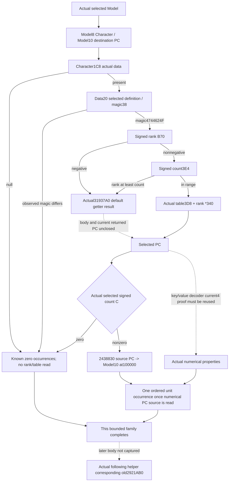
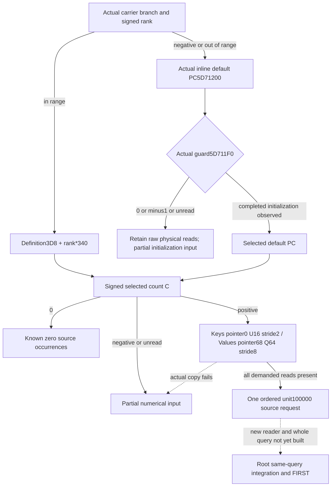

# Actual4 next direct carrier input after the following helpers

Source capture: 2026-10-08 23:52:32–23:52:33 Asia/Shanghai / W41.
Private source baseline `9d69a02546edf45331720f7b7632d9387d4dc8ba`.
Exact game: **1.20.0.4 / Steam25734779**, reused frozen EXE SHA
`98702F88A547CDE2EAF29A85F93B85F68EE4CF8148336A4F7AFAEB75319DD518`.
All new artifacts and source are on Z. Game/SDK/process/pipe/UI/Steam,
production imports, builds, tests and EXE hashes are 0.

## The one actual next dependency

The [qualified declared-stage chain](battle-person-stage-chain-12003.md)
ends at historical exact3 `post2921020_pre291CDB3`. Its two following helpers'
17-wire/204-check qualification remains reused, not executed again. The next
direct family was listed in the older caller ledger but had neither an actual4
source-use receipt nor a declared query contract. Later2921AB0/29226A0 are
separate dependencies and are not expanded here.

The actual4 [typed GetLegitimacy](campaign-root-legitimacy-12004.md) proves
Character1C8 and data28. It does not prove this selected20/magic38/B70/table3D8
family. The old exact3 source is reused solely as the locator and decoded
comparison input, never as current4 ABI admission.

## Finite source proof and native receiver tree

Cached `.pdata` ordinal141229 proposed `[291C0B0,291CF2F)` from old
`[291C0D0,291CF4F)`. Ordinal alone is only a candidate. Two declared windows
were then decoded and compared against the already held old caller binary:

| Role | Old span | Actual4 span | New bytes |
| --- | --- | --- | ---: |
| Model/Character/PC receiver | `[291C0D0,291C100)` | `[291C0B0,291C0E0)` |48|
| Carrier admission and selected PC append | `[291CDB3,291CE0B)` | `[291CD93,291CDEB)` |88|

Both have complete instruction decoding, equal normalized code, equal ordered
edge shape and equal local branch topology. Concrete non-RIP member offsets,
widths, magic, stride and weight remain unmasked. The total new EXE I/O is
**136B / two exact reads**; old EXE I/O 0, new pdata/unwind 0, no whole function,
section scan or hash. Cached old/new metadata and existing SHA are reused.
The source proof is
`Z:/ck3_mod_rewrite_process_assets/g2-background-20261008/person-next-direct-entry12004/source-map01/FAMILY-MAP.json`;
its two DETAIL files retain instruction bytes and operands. The manifest and
source plan were persisted before capture.

Actual4 prefix291C0D3 loads Character from selected Model+8, and291C0DC selects
destination PC at Model+10. At291CD93, the Character1C8 QWORD is read. Null
skips this family to291CDEB. Otherwise data+20 is the selected definition;
its DWORD38 must be `0x4744624F`. A different observed magic also skips.
The signed DWORD at data+B70 is the rank. Negative rank jumps to the default
getter without reading count. Nonnegative rank compares against the signed
definition DWORD3E4; rank>=count also chooses the default getter. An in-range
rank selects `QWORD[definition+3D8] + rank*0x340`.

The selected PC's signed DWORD+C is tested against0. Zero skips; every nonzero
count reaches291CDE6 calling2438830 with source PC, destination Model+10 and
weight100000. Negative counts are not source-known empty. A copied raw count
does not certify that its numerical key/value arrays are readable or valid.
The original fallback call at291CDCF actually targets31937A0; its body is not
captured or called here. It remains the precise local missing input for rank
negative/out-of-range, rather than a fabricated zero/default PC. The append
callee's observed address is a source edge, not a new callback binding.

## Minimal same-query contract

The machine-readable contract is
`battle-person-next-direct-carrier-12004-contract.json`. Proposed leaf name is
`carrier_1c8_b70_direct`; it is additive to the existing selected-person source
query, never a new engine action. The owning current query supplies the actual
selected Model and full Character join; it must not substitute a held final
aggregate as an earlier logical baseline. The prefix proof defines the Model
receiver but does not establish installed/future rebuild timing.

Publish actual data/definition identities, observed magic, signed rank/count,
actual table/selected-PC identities and selected-PC signed count with explicit
read readiness. Read operands only when demanded by this native branch.
Known null carrier or different observed magic releases zero occurrences.
In-range row/count0 releases zero occurrences. An in-range nonempty selected PC
can release one unit request when the owning query's actual4 numerical PC reader
has copied its source values. Do not copy a historical key/value layout solely
because this window proves count+C. This packet requests reuse of a qualified
actual4 numerical-reader proof, without expanding a generic merger catalogue.

Default selection is partial with the exact reason
`fallback_31937a0_actual_pc_unobserved`. Definition pointer/magic read failure,
table/PC read failure and unavailable numeric payload remain explicit partial
inputs. A null definition under a present carrier is not another native skip:
the captured source would read its magic. No initializer, default getter,
native append, expression evaluator or callback is invoked by the proposed
observer. Independent mapped-row or known-zero branches do not wait for the
fallback body.

## Unique unexecuted qualification recipe and remaining work

Source-use for the receiver, field demand, signed selection, stride and unit
append is now **closed actual4 research**. Implementation/build/fixture/live
readiness is not promoted. Root can implement the additive collector from the
contract and reuse the actual4 numerical PC decoder. A single new whole-source
compound should cover: absent carrier, wrong observed magic, in-range empty PC,
in-range nonempty PC with a signed property affecting prowess, negative rank,
rank==count fallback and a demanded unavailable PC. Every in-range mapped
positive case emits exactly one unit occurrence; empty produces zero. Future
collector/serializer must use the genuine query, not a leaf-only fabricated
native packet. No test or fixture has executed in this package.

The next exact offline fallback entrance is31937A0, whose cached metadata gives
`[31937A0,3193815)`117B, reached by the actual call in this captured window.
Capture only if resolving a demanded fallback is selected as the next value
task. It is not part of this136B package. The later helper candidate2921A90 is
boundary-only; it has no semantic mapping or qualified body here. Fresh model
association, previous actual4 stage migration, later helpers and full Entry
remain separate. No new paused read is required to finish this offline source
family, and saved6010/G2 5/8/Native39/R79 remain unchanged.

The capture belongs to October 8; packaging and the source commit completed
after midnight on October 9 Asia/Shanghai. Both dates fall in ISO week W41.

## October 9: the two local numeric dependencies are source-closed

The preceding sections preserve the first `42b11b3d` source boundary. The next
bounded pass closes the actual fallback identity and numerical field accesses.
The fallback body `[31937A0,3193815)` was first read once: **117B**. Its direct
entrance is the already captured actual caller's `291CDCF` call, not an ordinal
guess. It returns inline PC `module+5D71200`; DWORD guard `module+5D711F0`
controls the thread-safe constructor path. The body reaches `C80030` only on
initialization, with the same inline PC receiver. This observer never calls the
getter, constructor or runtime initialization helpers. Raw guard `0` or `-1`
does not qualify initialized default contents; their actual readable fields
may be retained while this family stays partial. A completed nonzero/non-minus1
guard permits the same numerical copy as a mapped PC. No constructor postimage
or hypothetical empty default is substituted.

The already captured actual aggregate getter `28C3AC0..28C3B9C` (220B) was reused
without EXE I/O. It proves the owned Model association and context selection,
but has no key/value load. The source-use ledger therefore captures only these
six necessary instruction windows, with all old bytes reused from v79:

| Old window | New bytes | Purpose |
| --- | ---: | --- |
| `2438858..243886B` | 19 | Source PC count and source/weight/destination registers |
| `2438984..2438993` | 15 | Same append source/weight to actual numerical merge call |
| `2303129..2303136` | 13 | Numerical source is incoming RDX, retained in R14 |
| `2303162..230316F` | 13 | Signed source DWORD count+C |
| `23031B0..23031B8` | 8 | Source QWORD pointer+68; QWORD elements stride8 |
| `2303238..230323F` | 7 | Source QWORD pointer+0; U16 elements stride2 |

All six actual4 windows decode completely and match concrete member/literal
operands and local topology. Their actual targets and addresses are retained in
`pc-decoder-source03/FAMILY-MAP.json` and the six DETAIL files. The current
append is `2438830`, and the numerical receiver is `2303100`. This is a raw
numerical input layout and argument-use closure, not a new complete numerical
merger arithmetic qualification: intervening allocation/locking/arithmetic
instructions have not been recaptured or executed. Copies preserve the raw
physical key/value order and full signed Q64 values; they do not merge, sort,
deduplicate or evaluate a native callback.

Additional new I/O is **117+75=192B / seven exact reads**, for a cumulative
**328B / nine reads**. Old EXE, new pdata/unwind, hashes, scans, Game/SDK,
builds and tests remain 0. Two mapper manifest schema harness errors occurred
before any span capture and remain external receipts; correcting `rows`/`id`
produced the sole six-span capture. This is source decoding, not a test GREEN.

The machine contract now includes actual default selection/guard and the
current4 key/value copy. A minimal standalone reader and serializer can be
integrated into the owning same-selected-person query. Its new source-shaped
fixture remains NOTRUN and must not claim a historical-stage/fresh-baseline or
full Entry qualification. Earlier actual4 person-stage migration and owning
query association remain distinct integration dependencies.

## Authored isolated producer and Root integration

The isolated candidate adds `ck3_12004_person_carrier_direct.hpp/.cpp`, the
strict Python module `battle_person_carrier_direct_12004.py`, and one new native
compound fixture plus one actual-produced-wire consumer compound. No existing
adapter, Snapshot, main normalizer, mailbox, CMake or Service file is changed.

`BindPersonCarrierDirect12004` accepts the existing exact4 version/SHA and Root's
guarded-copy callback. `ReadPersonCarrierDirect12004(bindings, actual_model)`
copies Model+8, actual Character full-ID+18 through the already adopted Core
layout, and only the carrier branch's demanded raw inputs. Model+10 is an
opaque destination identity; its contents are not copied or supplied as a
baseline. The selected-PC physical arrays preserve full signed Q64 values,
physical order, duplicate keys, key0 and keyFFFF. Empty-count arrays require no
pointer/element/+74 reads. An unread values array retains successfully copied
keys. Raw initialization-pending default arrays are retained without releasing
an evaluated occurrence. Ancillary full-ID copy failure does not erase an
independently read numerical primitive; attributing a request requires the
owning query's matching full-ID.

`SerializePersonCarrierDirect12004` emits the bounded leaf schema
`xar.ck3.person-carrier-direct-12004-v1`. It is not a complete command_result or
MCP packet. `normalize_carrier_direct_12004` retains partial fields;
`emit_carrier_1c8_b70_direct_requests_from_current_source_inputs_12004` returns
zero or one source request after the same-query Character join. The reused
`NativeWeightedContributionRequest12003` dataclass is an operand-only type;
its historical name supplies no current4 arithmetic or full-chain credit.

The native fixture uses the genuine new reader and serializer, with eight
controls: carrier absent, magic mismatch, mapped empty, mapped signed Q64,
initialized fallback, guard0 raw fallback, unread values with keys retained,
and negative rank without a count read. It checks skipped reads directly.
Its provenance-only full-ID is `0xAB007485`; no Robert/live state is used.
The mapped raw key list `[554,65535,554,0]` and I64 extrema are preserved;
the prowess-key label is source-shaped metadata, not a qualified current4
six-skill calculation. No test executed. Proposed target
`person_carrier_direct12004_first_fixture` and CTest
`person_carrier_direct12004_first` remain **NOTREGISTERED / NOTRUN**.

Root must integrate this leaf into the actual4 same-selected-person query,
using its actual model receiver and existing guarded copy. The already held
`28C3AC0` source defines a current owned model association through
Character1B0→scratch258→Model, with Model8==Character. That is a source recipe,
not a new observed frame; it must not become a modeled fresh baseline.
The current full-query factory/dispatch and serializer/normalizer hook are
**not enabled by this standalone package**. First native production-reader
qualification and the sole eight-wire Python consumer establish only this
bounded primitive; whole-query or full Entry promotion requires its own actual
integration and source scope. No additional source capture is required for
this bounded numerical reader. Later2921AB0 remains outside this package.
