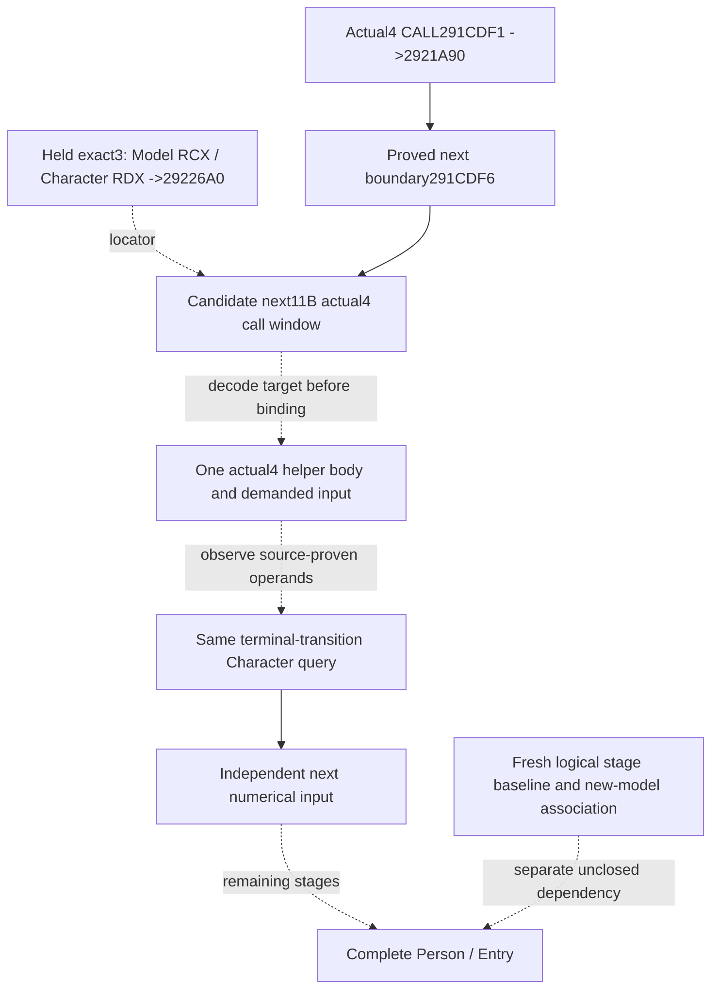

# Next actual4 Person preparation input after the linked collection

Source-only seal: 2026-10-09 / W41. Requested source baseline is
`97321e7bf2ffa20f646c1db63036eed38de647b1`. Game build is the already frozen
**1.20.0.4 / Steam25734779**, with retained EXE SHA-256
`98702F88A547CDE2EAF29A85F93B85F68EE4CF8148336A4F7AFAEB75319DD518`.
No game, SDK, process, EXE, compiler, hash or test operation ran in this work.

## One required next native input

The selected work is the immediately following preparation helper in the same
Character/Model caller. The retained exact3 complete caller has, at lines812–814,
`291CE16 mov rdx,r14`, `291CE19 mov rcx,r13`, and `291CE1C call29226A0`.
R14 is the same Character; R13 is its selected Model. This is an ordered caller
dependency, rather than a proposed new policy input. The callee's internal
admission, properties, weight and write behavior are not proved for actual4.

The preceding actual4 capture is complete over `[291CDEB,291CDF6)`:
`291CDEB mov rdx,r14`, `291CDEE mov rcx,r13`, and
`291CDF1 call2921A90`. Its exclusive end **291CDF6** is therefore a positive
next instruction boundary. The smallest next candidate is **11B** from that
boundary. Its extent comes from the retained next three-instruction pattern;
the actual4 shape and target must be decoded before accepting any callee RVA.
No global RVA delta or actual4 `2922680` binding is inferred.

The exact3 helper's cached runtime-function row has extent
`[29226A0,29226D4)`, **52B**. The named Person-tail cache inventory did not supply
that helper's body. This is a limited cache MISS, not a whole-cache absence
claim. After the next actual CALL is decoded, only its target's existing
runtime-function row is needed to declare the next body capture. No old helper
capture, unrelated callee expansion or new pdata extraction is required now.

## Existing transport and minimum construction contract

Native47's scope weights already traverse `CurrentPersonSample`, the genuine
terminal frame serializer, Python normalizer, NativeDriver, Service and
registered `ck3_query_battle_terminal_transition_v1`. There is no missing
publication hook for that candidate. Its build/FIRST and live qualification
belong to Root and its source owner; this work grants no qualification.

Reuse that same tool's requested `character_ids` path. Its character-only
request supplies `prior_combat_id=null`, `subject_public_cunit_id=null`,
`after_terminal_sequence=null`, a fresh public `expected_revision`, and the
requested full Character IDs. No new MCP endpoint or policy branch is needed.

After the decoded helper's demanded fields are closed, its independent sibling
under `current_person_state` should retain the same queried full Character,
selected Model identity, actual branch/selector, ordered source occurrences and
source-proven numerical operands. Existing guarded-copy and property decoder
contracts can be reused only where that actual body consumes them. Observed
empty contributions and unread fields remain distinct; row readiness preserves
independently copied rows. Leaf names and offsets are determined by the actual
body, rather than publishing an unimplemented null schema now.

Character1B0 -> scratch258 -> Model, with Model8 equal to the requested
Character, is already observed receiver attribution. Model10 is current
destination provenance; it supplies no fresh post-reset stage baseline.
The current actual4 independent leaves are published before the historical
whole-person observer's disabled return. They do not enable that old observer
or establish a production numerical fold into complete Person/Entry.

## Result and next executable source entrance

Status is **research / finite next capture ready**. The next deliverable is the
actual call window, then its demanded helper input and one source-bound
same-query observer. Fresh stage construction, earlier actual4 logical stages,
later caller tail and full Entry association remain separate. FullPerson,
fullEntry, forecast, battle terminal and OODA/action/day/save credit are false
or zero. Native47 and the actual R81 opinion known-bypass result are reused
boundaries, not rerun in this work.

The external source tree, bridge contract and Root-only finite request are in
`Z:/ck3_mod_rewrite_process_assets/g2-background-20261009/person-entry-next-input/`.
The positive preceding capture is
`person-after-carrier41/actual-callsite01/SOURCE-CAPTURE.json` under the same
20261009 assets root. The held exact3 caller is
`Z:/ck3_mod_rewrite_process_assets/g2-resume-20261005/battle-trait-native-input-primitive-v79/context-source/region-0291C0D0.asm`.
The source rows and absence scope are preserved in the external packet.

Related boundaries: [actual4 linked collection](battle-person-following-2921a90-12004.md),
[conditional scope weights](battle-person-conditional-scope-12004.md), and
[explicit historical stage baseline](battle-person-stage-baseline-12003.md).
