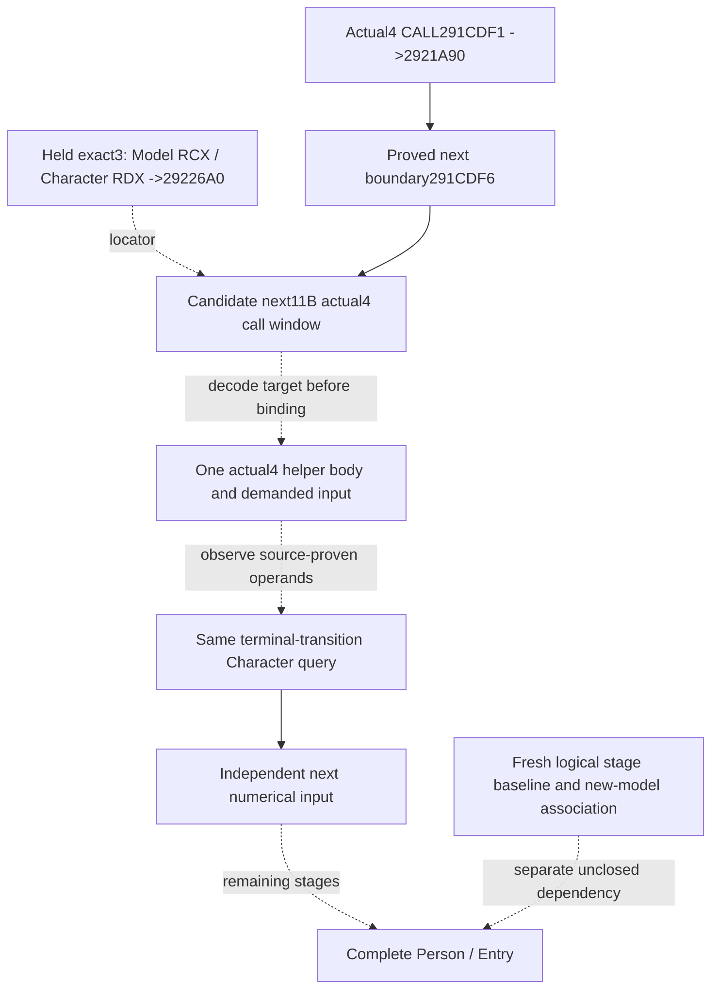
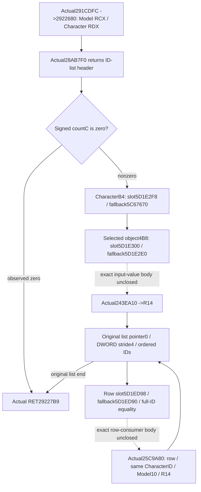
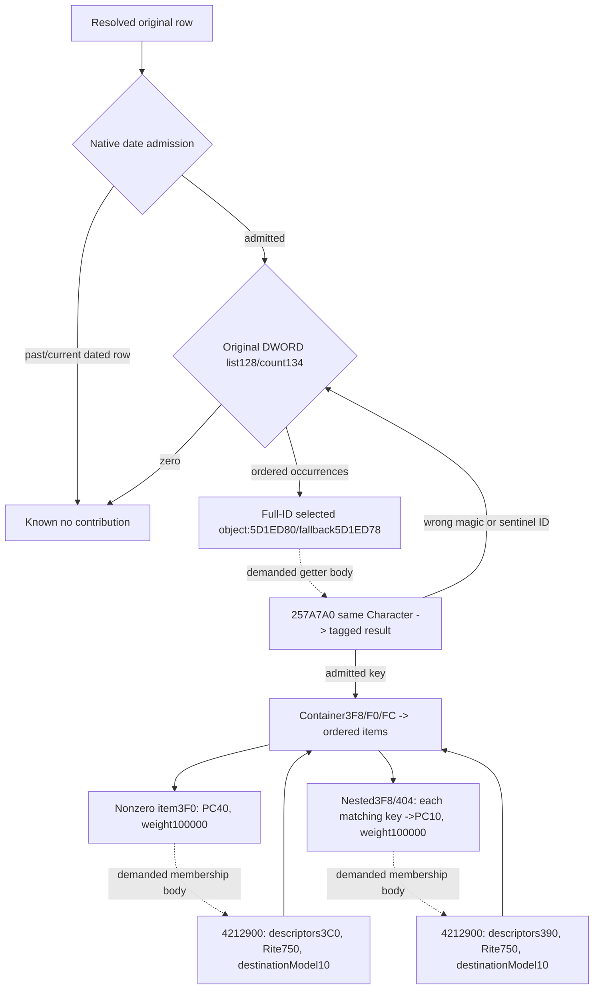
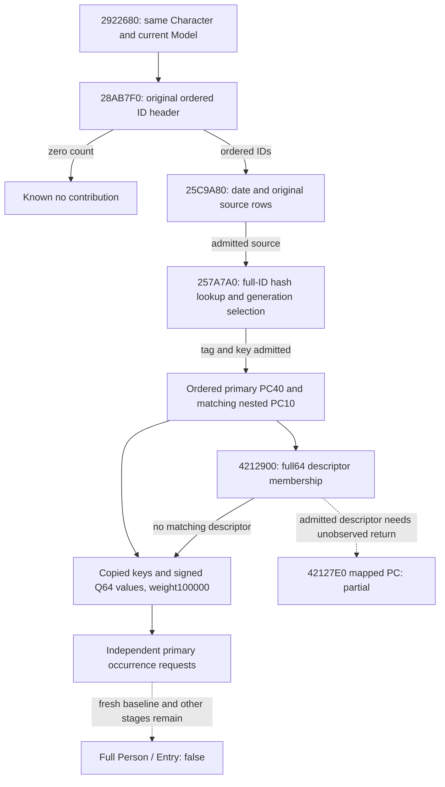

# Next actual4 Person preparation input after the linked collection

Source-only seal: 2026-10-09 / W41. Requested source baseline is
`97321e7bf2ffa20f646c1db63036eed38de647b1`. Game build is the already frozen
**1.20.0.4 / Steam25734779**, with retained EXE SHA-256
`98702F88A547CDE2EAF29A85F93B85F68EE4CF8148336A4F7AFAEB75319DD518`.
No game, SDK, process, EXE, compiler, hash or test operation ran in this work.

## One required next native input

The selected work is the immediately following preparation helper in the same
Character/Model caller. The retained exact3 complete caller has, at lines812–814,
`291CE16 mov rdx,r14`, `291CE19 mov rcx,r13`, and `291CE1C call29226A0`.
R14 is the same Character; R13 is its selected Model. This is an ordered caller
dependency, rather than a proposed new policy input. The callee's internal
admission, properties, weight and write behavior are not proved for actual4.

The preceding actual4 capture is complete over `[291CDEB,291CDF6)`:
`291CDEB mov rdx,r14`, `291CDEE mov rcx,r13`, and
`291CDF1 call2921A90`. Its exclusive end **291CDF6** is therefore a positive
next instruction boundary. The smallest next candidate is **11B** from that
boundary. Its extent comes from the retained next three-instruction pattern;
the actual4 shape and target must be decoded before accepting any callee RVA.
No global RVA delta or actual4 `2922680` binding is inferred.

The exact3 helper's cached runtime-function row has extent
`[29226A0,29226D4)`, **52B**. The named Person-tail cache inventory did not supply
that helper's body. This is a limited cache MISS, not a whole-cache absence
claim. After the next actual CALL is decoded, only its target's existing
runtime-function row is needed to declare the next body capture. No old helper
capture, unrelated callee expansion or new pdata extraction is required now.

## Existing transport and minimum construction contract

Native47's scope weights already traverse `CurrentPersonSample`, the genuine
terminal frame serializer, Python normalizer, NativeDriver, Service and
registered `ck3_query_battle_terminal_transition_v1`. There is no missing
publication hook for that candidate. Its build/FIRST and live qualification
belong to Root and its source owner; this work grants no qualification.

Reuse that same tool's requested `character_ids` path. Its character-only
request supplies `prior_combat_id=null`, `subject_public_cunit_id=null`,
`after_terminal_sequence=null`, a fresh public `expected_revision`, and the
requested full Character IDs. No new MCP endpoint or policy branch is needed.

After the decoded helper's demanded fields are closed, its independent sibling
under `current_person_state` should retain the same queried full Character,
selected Model identity, actual branch/selector, ordered source occurrences and
source-proven numerical operands. Existing guarded-copy and property decoder
contracts can be reused only where that actual body consumes them. Observed
empty contributions and unread fields remain distinct; row readiness preserves
independently copied rows. Leaf names and offsets are determined by the actual
body, rather than publishing an unimplemented null schema now.

Character1B0 -> scratch258 -> Model, with Model8 equal to the requested
Character, is already observed receiver attribution. Model10 is current
destination provenance; it supplies no fresh post-reset stage baseline.
The current actual4 independent leaves are published before the historical
whole-person observer's disabled return. They do not enable that old observer
or establish a production numerical fold into complete Person/Entry.

## Result and next executable source entrance

Status is **research / finite next capture ready**. The next deliverable is the
actual call window, then its demanded helper input and one source-bound
same-query observer. Fresh stage construction, earlier actual4 logical stages,
later caller tail and full Entry association remain separate. FullPerson,
fullEntry, forecast, battle terminal and OODA/action/day/save credit are false
or zero. Native47 and the actual R81 opinion known-bypass result are reused
boundaries, not rerun in this work.

The external source tree, bridge contract and Root-only finite request are in
`Z:/ck3_mod_rewrite_process_assets/g2-background-20261009/person-entry-next-input/`.
The positive preceding capture is
`person-after-carrier41/actual-callsite01/SOURCE-CAPTURE.json` under the same
20261009 assets root. The held exact3 caller is
`Z:/ck3_mod_rewrite_process_assets/g2-resume-20261005/battle-trait-native-input-primitive-v79/context-source/region-0291C0D0.asm`.
The source rows and absence scope are preserved in the external packet.

Related boundaries: [actual4 linked collection](battle-person-following-2921a90-12004.md),
[conditional scope weights](battle-person-conditional-scope-12004.md), and
[explicit historical stage baseline](battle-person-stage-baseline-12003.md).

## Actual next caller and whole-helper control flow

Root subsequently captured the exact next11B once at05:55:06UTC. It contains
`291CDF6 mov rdx,r14`, `291CDF9 mov rcx,r13`, and
**`291CDFC call2922680`**. The actual target now has direct evidence, independently
of its historical name. `actual-callsite01/SOURCE-CAPTURE.json` retains all11B.

The retained runtime row `[2922680,29226B4)` is only52B of prefix: its
`29226A7 je29227AA` leaves that row. Root captured that row once, then only the
two adjacent continuation rows `[29226B4,29227AA)`246B and
`[29227AA,29227BA)`16B. Their262B decode ends in actual **29227B9 RET**; no
prefix was reread. The combined314B includes every local conditional target.
External calls below remain distinct dependencies. Root's actual capture cost
is **325B / 3 new reads** including the caller11B, with PE/pdata/hash0. Author
EXE/game/SDK/process/build/test operations remain0.

The literal next input tree is:

1. `2922698 CALL28AB7F0(Character)` returns a list header. The caller sign-extends
   its DWORD+C count. Observed count0 immediately returns. The nonzero path
   later loads the header's QWORD0 and traverses DWORD IDs at stride4. A negative
   count is not source-known empty and does not authorize an invented traversal.
2. Character DWORD+B4 selects an object through actual slot5D1E2F8, using
   low24 index, unsigned registry count2C, slots20, stride16, pointer8 and full
   objectID8 equality. Failure uses fallback QWORD slot5C67670. The slot itself
   reuses the already adopted `religion::profile::kRiteStorageSlotRva`; the
   getter's list is not assigned a semantic name from that storage pin.
3. Selected object's DWORD+4B8 selects a second object through5D1E300 with the
   same index/generation rules; failure uses fallback5D1E2E0. At2922735,
   `CALL243EA10(RCX=second object,RDX=first object)` returns RAX, retained in R14.
   The return's numerical type/unit/role is not inferred from the register.
4. Each original DWORD list ID resolves through5D1ED98, with fallback5D1ED90.
   At2922792, `CALL25C9A80(RCX=resolved row,EDX=Character fullID18,
   R8=selected Model+10,R9=R14)` consumes it. Physical order and duplicate IDs
   remain significant. The loop advances4bytes and ends at the original count.

The immediate construction dependency is now concrete: source-bound list
acquisition plus the actual243EA10 return and25C9A80 row-input semantics.
Limited searches of the declared existing Person/religion/culture source and
receipt indices did not supply their exact bodies. Only these three literal
targets may be looked up/captured next; no unrelated native catalogue is needed.
The fixed-unit direct-family decoder from2921A90 is reused only if a newly
closed body proves that same property and weight contract. This stage publishes
neither a guessed unit weight nor a substituted current aggregate.

Actual receipts are `actual-helper02/SOURCE-CAPTURE.json` and
`actual-continuation03/SOURCE-CAPTURE.json` in the external packet. The whole
control flow is source-closed; demanded callback semantics and its independently
useful same-MCP observer remain in construction. Native47's new static FIRST
GREEN is owned by its separate author and Root and grants no fullPerson/Entry
or new-stage live credit here.

## Captured list, pointer and row inputs

Root's next four captures are retained as `actual-list-getter04`,
`actual-value05`, `actual-row06` and `actual-row-continuation07`, each with its
original `SOURCE-CAPTURE.json`. The cost through these seven reads is
**1169 B**, with no repeated prefix. The source author consumed each decoded
receipt once and performed no EXE read.

The complete164 B getter28AB7F0 returns Character1C0+198 when Character1C0 is
nonnull and Character1D0 is zero. Otherwise it returns the existing static
header5D67DE0. The observer copies that header and never invokes its lazy
initializer. Character1C0 and1D0 retain raw names; the body does not establish
an ownership or death interpretation.

Actual243EA10 returns a **pointer**, not a weight: context DWORD98 resolves
another Rite through5D1E2F8/fallback5C67670, and the return is selected Rite+750.
The capture includes its actual85 B function through RET243EA64; later bytes
belong to padding and a separate neighboring leaf. No property layout is
inferred solely from this return.

The complete row25C9A80 is568 B through RET25C9CB7, including every local
control target. Its ordered source tree is:

1. Read signed cached year WORD+C7CE. A negative cache uses the native signed32
   wrapped raw DWORD+C7C8 minus43800000, divided by8760 toward zero. This exact
   instruction sequence matches the retained3836460 date decoder and the
   existing `AfterCalendar` / `decode_after_gated_date_12003` primitives.
   A year greater than1 demands current GameData5C68C50+8; raw date less than
   or equal to that current date returns without an append. Other branches do
   not demand current date. No day/month cache or calendar units are invented.
2. Original row DWORD134 is the signed count of DWORD IDs at QWORD128. Zero
   returns without consulting the later operands. The helper's negative-count
   pointer loop is not an observed empty branch.
3. Each ID resolves through5D1ED80/fallback5D1ED78 with the same full-generation
   rules. CALL257A7A0 receives that selected object and the same Character
   fullID. The returned object must have DWORD+C equal to53695047 and DWORD8
   different fromFFFFFFFF; other observed values skip this occurrence. The
   accepted object's QWORD30 points to an object whose DWORD8 supplies the
   nested comparison key. The getter body is a separate demanded dependency.
4. Selected object's QWORD3F8 supplies a container with QWORDF0 / signed
   DWORDFC, traversed as QWORD pointers at stride8. Each item's nonzero BYTE3F0
   appends its PC at40 with fixed weight100000, then calls4212900 with that
   item's descriptor header3C0 and the Rite750 operand.
5. Each item also has QWORD3F8 / signed DWORD404, again a QWORD-pointer list.
   Every nested object whose DWORD8 equals the accepted key appends its PC10
   with weight100000, then calls4212900 on descriptor header390. Order and
   duplicates remain native occurrences; they are not deduplicated by ID.

The two append sites call actual2438830. No live Model mutation is needed to
observe their source properties. Actual4212900 is the distinct membership
append dependency. The old3 software contract is held, but its offsets are
not transferred into actual4 without the called body's evidence.

The implementation uses the existing exact4 guarded memory binding. It
publishes independently copied source rows on the same Character MCP path,
including known empty bypasses, without enabling the old whole-person reader.
FullPerson/Entry and a fresh logical stage baseline remain separate unclosed
requirements. Author build, native FIRST, registered compound and live
qualification remain **AUTHORED_NOTRUN** until Root executes the new candidate.

## Independent numerical candidate and retained mapper boundary

Root then captured `actual-participant-getter08`288 B and
`actual-membership-append09`181 B once. Cumulative capture cost is
**1638 B / 9 reads**. The getter has a RET at257A8AF, but the actual branch
257A823 ->257A8B0 and jump257A8B8 ->257A84C make the following10 B a reachable
cold tail of the same function. Its complete source span is282 B through
257A8BA; only the final6 INT3 padding bytes are excluded.

The same-Character getter validates source magic53695352 and a nonsentinel
source ID, hashes all four little-endian bytes of the Character fullID with
FNV32, and probes the source's F0 table using signed maskFC and12 B slots.
Each slot retains its control byte, full DWORD key4 and DWORD value8. The
selected value resolves through5D1FF70/fallback5D1FF78 with full-generation
equality. The returned tagged object and its actual caller admission remain
independently observed. No native getter is invoked by the observer.

Actual4212900 is complete181 B through RET42129B4. Its descriptor header has
pointer0 / signed countC and inline stride30; descriptor QWORD20 is compared
against the Rite750 operand's QWORD membership list50 / signed count5C.
Each admitted descriptor calls42127E0 on the key and entire descriptor header,
then appends the returned PC with fixed100000 weight. The actual mapper's
return is **not observed in this candidate**. Such admitted occurrences retain
`actual42127e0_input_unobserved`; they do not manufacture an empty PC or borrow
the old3 mapper's defaults.

The useful independent result is the ordered primary PC40 and matching nested
PC10 source inputs, plus exact known-empty paths and membership operands.
`primary_ready` is separate from complete helper readiness. A per-occurrence
emitter can use an independently copied primary PC while another primary copy
or an admitted mapped occurrence remains partial. Flat append indices retain
the native interleaving and duplicate occurrences. The full-helper emitter
requires every demanded occurrence; it cannot silently omit the mapper gap.

The same optional `following_2922680` leaf is attached to the existing
`ck3_query_battle_terminal_transition_v1` Character query. It introduces no new
tool, capability, flag, action, native Model write or strategy. The new whole
producer and one registered compound are authored against the real production
reader/serializer/Driver/Service path. Their execution belongs to Root; no old
GREEN fixture is repeated. A future runtime increment number is assigned by
Root and is not part of this source contract.

The current source tree is now:

The one fresh compound contains fourteen complete production packets. Its
memory scenes cover the source's empty/date bypasses, generation fallback,
ordered duplicate primary and nested PCs, signed Q64 limits, full64 membership
match/nonmatch, and independent usable siblings beside an unread primary PC.
The mapped-PC case must retain its partial reason while primary inputs remain
usable. Synthetic input scenes use the real production query, formatter,
registered callback, Service and normalizer; they provide no live game credit.
