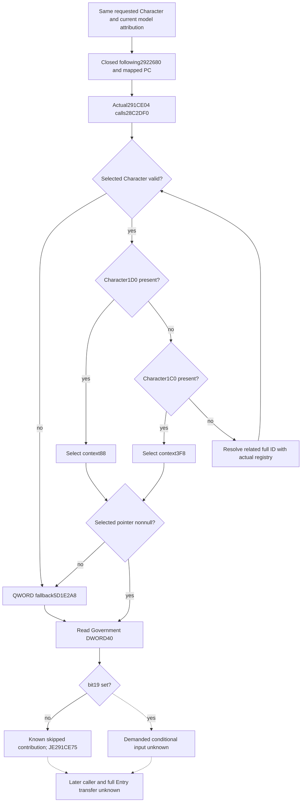

# Person caller: selected Government bit19 after following2922680

This package observes one literal input after the ordered contribution helper and mapped-PC lookup. It does not reconstruct a complete Person, reset a model, or establish an Entry handoff. This native tree precedes the same-query observer implementation.

## Exact source and value direction

The retained exact build is CK3 1.20.0.4 / Steam25734779, EXE SHA-256 `98702F88A547CDE2EAF29A85F93B85F68EE4CF8148336A4F7AFAEB75319DD518`. Root captured only `[291CE01,291CE15)`, 20 bytes, at 2026-10-09 12:20:09 UTC. Receipt: `Z:/ck3_mod_rewrite_process_assets/g2-background-20261009/person-entry-after-mapped52/actual-next-gate01/SOURCE-CAPTURE.json`.

The actual caller moves the same Character in R14 to RCX, calls `28C2DF0` at `291CE04`, loads DWORD `[RAX+40]`, shifts by 19, and tests bit zero. `JE291CE75` skips the intervening conditional contribution when that bit is clear. A clear bit proves no contribution from that branch; a set bit proves only that its inputs are demanded.

The Government getter is already mapped: reuse `Z:/ck3_mod_rewrite_process_assets/g2-migration-20261007/council-government/native-government/government-map/GovernmentResolver-DETAIL.json` and the exact 237-byte cache `Z:/ck3_mod_rewrite_process_assets/g2-background-20261007/upstream-build-migration/shared-span-cache/new-028C2DF0-028C2EDD.bin`. The earlier 256-byte mapping contains 19 neighboring bytes; the getter ends at `RET28C2EDC`. No new getter read is needed.

Its actual selection is:

1. Validate Character magic DWORD+1C and full ID DWORD+18.
2. If QWORD+1D0 is present, select its QWORD+88. Otherwise, if QWORD+1C0 is present, select its QWORD+3F8.
3. With neither context, obtain the related full ID from QWORD+1B8 then DWORD+C8, or `FFFFFFFF` if the pointer is null. Resolve through Character registry `5C67568`, count+2C, slots+20, stride16/pointer+8, and the full generation-bearing ID. Use Character fallback `5C67570` on a missing or mismatched slot and repeat native selection.
4. An invalid Character or null selected Government returns QWORD `5D1E2A8`. A memory reader can reproduce this return without invoking the native null-selection diagnostic logger.
5. Read selected Government DWORD+40 and extract `(raw >> 19) & 1`.

## Minimum observation contract

Reuse `ck3_query_battle_terminal_transition_v1` with nullable `prior_combat_id`, nullable `subject_public_cunit_id`, fresh public `expected_revision`, nullable `after_terminal_sequence`, and requested `character_ids`. Reuse current Character/model attribution and guarded memory-copy binding. Preserve requested full ID, model identity, ordered Government-resolution steps, return identity/selection, raw DWORD+40, bit19, branch admission, and precise unread fields.

A successful clear bit differs from a failed copy and from a demanded positive branch. Report the clear-bit branch as known skipped; do not label the positive branch's numerical contribution complete or fill it with a default PC. Existing ordered helper and mapped-PC occurrences keep their original semantics and order.

The public Person structure has typed optional leaves and no generic extension container. A typed new leaf changes its embedded layout and requires actual dependent production owners to rebuild. PC append rows and reason strings cannot carry an unrelated Government gate. Domain header/TU isolation does not remove that ABI dependency.

## Readiness and next boundary

The 20-byte caller gate and reused Government getter are source closed. No new observer compiler, FIRST, or production-live result is claimed. Full Person and Entry remain false. Fresh baseline/stage association and later Entry transfer are separate gaps.

The later positive interval `[291CE15,291CE75)` has not been requested or read. A future package may select it when that demanded contribution is the next useful dependency; it is not needed to publish this gate.

Author operations: zero Game, SDK, process, EXE, PE, PDATA, hash, compiler, build, test, or import. Root performed one new 20-byte read. Cumulative Person capture: 1,932 bytes / 11 reads. Existing GREEN qualification is reused without replay.
