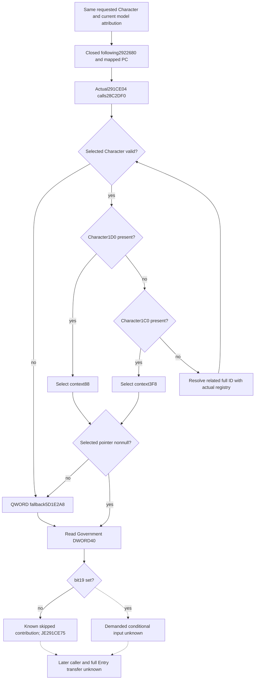

# Person caller: selected Government bit19 after following2922680

This package observes one literal input after the ordered contribution helper and mapped-PC lookup. It does not reconstruct a complete Person, reset a model, or establish an Entry handoff. This native tree precedes the same-query observer implementation.

## Exact source and value direction

The retained exact build is CK3 1.20.0.4 / Steam25734779, EXE SHA-256 `98702F88A547CDE2EAF29A85F93B85F68EE4CF8148336A4F7AFAEB75319DD518`. Root captured only `[291CE01,291CE15)`, 20 bytes, at 2026-10-09 12:20:09 UTC. Receipt: `Z:/ck3_mod_rewrite_process_assets/g2-background-20261009/person-entry-after-mapped52/actual-next-gate01/SOURCE-CAPTURE.json`.

The actual caller moves the same Character in R14 to RCX, calls `28C2DF0` at `291CE04`, loads DWORD `[RAX+40]`, shifts by 19, and tests bit zero. `JE291CE75` skips the intervening conditional contribution when that bit is clear. A clear bit proves no contribution from that branch; a set bit proves only that its inputs are demanded.

The Government getter is already mapped: reuse `Z:/ck3_mod_rewrite_process_assets/g2-migration-20261007/council-government/native-government/government-map/GovernmentResolver-DETAIL.json` and the exact 237-byte cache `Z:/ck3_mod_rewrite_process_assets/g2-background-20261007/upstream-build-migration/shared-span-cache/new-028C2DF0-028C2EDD.bin`. The earlier 256-byte mapping contains 19 neighboring bytes; the getter ends at `RET28C2EDC`. No new getter read is needed.

Its actual selection is:

1. Validate Character magic DWORD+1C and full ID DWORD+18.
2. If QWORD+1D0 is present, select its QWORD+88. Otherwise, if QWORD+1C0 is present, select its QWORD+3F8.
3. With neither context, obtain the related full ID from QWORD+1B8 then DWORD+C8, or `FFFFFFFF` if the pointer is null. Resolve through Character registry `5C67568`, count+2C, slots+20, stride16/pointer+8, and the full generation-bearing ID. Use Character fallback `5C67570` on a missing or mismatched slot and repeat native selection.
4. An invalid Character or null selected Government returns QWORD `5D1E2A8`. A memory reader can reproduce this return without invoking the native null-selection diagnostic logger.
5. Read selected Government DWORD+40 and extract `(raw >> 19) & 1`.

## Minimum observation contract

Reuse `ck3_query_battle_terminal_transition_v1` with nullable `prior_combat_id`, nullable `subject_public_cunit_id`, fresh public `expected_revision`, nullable `after_terminal_sequence`, and requested `character_ids`. Reuse current Character/model attribution and guarded memory-copy binding. Preserve requested full ID, model identity, ordered Government-resolution steps, return identity/selection, raw DWORD+40, bit19, branch admission, and precise unread fields.

A successful clear bit differs from a failed copy and from a demanded positive branch. Report the clear-bit branch as known skipped; do not label the positive branch's numerical contribution complete or fill it with a default PC. Existing ordered helper and mapped-PC occurrences keep their original semantics and order.

The public Person structure has typed optional leaves and no generic extension container. A typed new leaf changes its embedded layout and requires actual dependent production owners to rebuild. PC append rows and reason strings cannot carry an unrelated Government gate. Domain header/TU isolation does not remove that ABI dependency.

## Authored observer and unique FIRST

The new domain header/TU is `ck3_12004_person_government_gate.hpp/.cpp`. `CurrentPersonSample` collects it with the existing exact4 guarded-copy binding and serializes `following_291ce01_government_gate` in the same query. Its typed public DTO records every related-Character resolution step. The Python normalizer preserves the complete leaf and full Character-ID join. `ready=true` means the raw gate is observed, including a set bit; only `known_no_contribution=true` closes the skipped numerical branch.

The single new target is `xar_ck3_12004_person_following_291ce01_government_gate_mcp_test <fresh-wire-directory>`. It authors seven fresh whole packets: living clear/set, null-selected/default, invalid-Character/default, related full-ID match, related generation mismatch/fallback, and unread flags. A separate assertion in the same native invocation exercises the real death-context+88 getter directly; it does not manufacture an alive whole-query packet. All worlds use the actual production reader, current-person collector, and whole result formatter. The earlier synthetic World setup is reused without invoking its producer or test.

The sole new registered MCP compound is `test_person_following_291ce01_government_gate_12004_registered_mcp.py::test_person_following_291ce01_government_gate_12004_registered_mcp_whole_packets`, with `CK3_PERSON_FOLLOWING_291CE01_GOVERNMENT_GATE_12004_MCP_WIRE_DIR` pointing at those seven untouched packets and the final source `src` on `PYTHONPATH`. It uses the real registered callback, Service, Driver, normalizer, all required nullable arguments, and preserves the original whole bodies. It leaves full Person/Entry and battle-terminal readiness false.

The shared header dependency projection belongs to the Root builder. It found 449 existing owners (Bridge152/Runtime297), plus one new Runtime TU and one fixture compile. These are source-planned dependencies; no new compilation or FIRST has run in this author lane.

## Readiness and next boundary

The 20-byte caller gate and reused Government getter are source closed. Root subsequently qualified the observer as static-ready in the run below. No production-live result is claimed. Full Person and Entry remain false. Fresh baseline/stage association and later Entry transfer are separate gaps.

The later positive interval `[291CE15,291CE75)` has not been requested or read. A future package may select it when that demanded contribution is the next useful dependency; it is not needed to publish this gate.

Author operations: zero Game, SDK, process, EXE, PE, PDATA, hash, compiler, build, test, or import. Root performed one new 20-byte read. Cumulative Person capture: 1,932 bytes / 11 reads. Existing GREEN qualification is reused without replay.

## Actual Native53 qualification: static-ready

Root's actual attempt02 result is GREEN: `Z:/g2-native53-build01/attempt02/ROOT-NATIVE53-RESULT.json`. It records seven original native whole packets and seven registered MCP consumptions, one invocation of each. The native FIRST passed in 0.2511784 seconds; the sole consumer passed in 6.4773879 seconds. Inputs are explicitly synthetic, while the reader, current-person collector, formatter, registered callback, Service, Driver, and normalizer are production code.

The production source is `269858189bcac173a255a79748d4862be2087d54`, authored feature `921ae7e0ae52728925f05f7cc49a591a13c1a0b0`. All 450 production compiles passed in attempt01 with 64 workers and were reused unchanged in attempt02. The actual composition is 736 owners: Bridge299, Runtime436, Protocol1; 449 existing replacements, one new Runtime TU, and 286 retained parent owners.

Attempt01 remains RED at fixture compile451: `/W4 /WX` exposed `std::optional<uint32_t> == int` at fixture line163. No native or registered FIRST ran in that attempt. The one-line authored fix `fbb325f242cafc60594a028bb59b7113d737897d` changes only `2` to `2U`; it retains the assertion, warning policy, production, and consumer. Its actual fixture/consumer/qualification source is `4819bb4b8eed1b6ca70ee06c5e2ea200dc590e1d`.

Attempt02 compiled only the fixed fixture (5.7320 seconds), then performed the first Runtime436 archive (0.4284068), DLL link (0.9513349), fixture link (1.0330), native FIRST, and registered FIRST. It did not recompile any production owner or replay an old GREEN case. Across both attempts there are 450 production compiler invocations and two fixture compiler invocations, including the retained failed fixture compile.

At this record, canonical sealing is pending: a sealer basename typo caused a separate harness RED before hashing. That packaging result does not change the GREEN build/native/consumer result, and no canonical or live success is inferred. R84's future same-MCP read will establish the actual current bit19 value. Only an observed demanded branch should select the next positive-path source work; this qualification requests no blind read of `[291CE15,291CE75)`.
