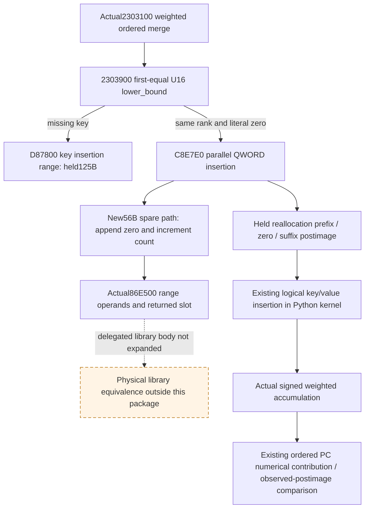

# Actual4 PC value insertion: bounded source closure

2026-10-10 / ISO week41. Source reference
`91bf64589d78df866fdf6908841fc9b64e875ec7`, with qualified Native68 source
`3ff84302db238fe7eaba108d39c5a3928449ca83`. This package is **source research
complete, NO_NEW_BRIDGE**. It does not change the numerical kernel, native
observer, MCP, strategy, readiness rules or qualified Native68 test inputs.

Exact build: CK3 **1.20.0.4**, Steam **25734779**, reused EXE SHA-256
`98702F88A547CDE2EAF29A85F93B85F68EE4CF8148336A4F7AFAEB75319DD518`.
Root alone read the new56bytes at03:00:47.296397–03:00:47.299280 UTC. Existing
image identity and `.text` mapping were reused, without PE, pdata or hash reads.

## Actual numerical role

The [qualified six-stage composition tree](battle-person-six-stage-composition-12004.md)
already closes actual merger2303100 and GetOrInsert2303900. When a destination
property key is absent, the latter selects the U16 lower_bound rank, inserts
that key, then at2303A59 calls C8E7E0 with `RCX=PC+0x68`, `EDX=rank`, and
`R8=&zeroQWORD`. C8E7E0 mutates the parallel QWORD value array; it is not an
unpublished damage/toughness scalar getter.

That alignment matters to actual weighted property accumulation and the
consumed property-key193..201 context inputs used by the existing Knight
stat comparison. An address or an array count alone cannot supply those
values. Existing captured ordered keys and complete QWORD values already
provide the needed input representation; no capacity field is required by
the local logical composition.

D87800 is also a container operation. The existing actual-insertion03 packet
closes its125bytes `[D87800,D8787D)` through returns D8782F/D87847/D8787C. Its
caller2303A40 moves the appended U16 key into the insertion rank through the
observed three-range-reversal interface. This work reuses that established
source fact without rereading its body or its library target.

## New actual continuation

The earlier C8E7E0 capture covered276bytes `[C8E7E0,C8E8F4)`, including the
reallocation branch's prefix/zero/suffix copies and RET C8E8F3. The positive
spare-capacity edge C8E7FB JNE C8E8F4 remained outside that window.

Cached NEW runtime row42932 (zero-based42931) supplied exactly
`[C8E8F4,C8E92C)`,56bytes. Root's single new read decoded all18instructions,
with RET C8E92B. The adjacent next row starts atC8E930; the four-byte gap and
the next row were not read. The actual operands are:

| Actual instruction | Source-established operation |
|---|---|
| C8E8F4 `MOV RCX,[RDI]`; C8E8F7 `MOV RDX,RAX` | Load the value-array data and the preceding path's old end index. |
| C8E8FA `MOV RAX,[R8]`; C8E8FD `MOV [RCX+RDX*8],RAX` | Append the supplied QWORD; the known merger caller supplies zero. |
| C8E904 `INC DWORD [RDI+C]`; C8E907 `MOVSXD RAX,[RDI+C]` | Increment and load the value count. |
| C8E90B / C8E90F / C8E913 | Set `R8=data+8*new_count`, `RDX=R8-8`, `RCX=data+8*rank`. |
| C8E917 `CALL86E500` | Invoke the delegated range operation with the actual insertion range operands. |
| C8E91C / C8E91F | Return `data+8*rank`; this is a slot address, not a forecast value. |
| C8E92B `RET` | Close the captured spare-capacity caller tail. |

The capture closes the tail and its actual argument/return semantics. It does
not decode86E500 or prove physical allocator/library execution. Root explicitly
stopped that library expansion: the existing logical projection has no observed
defect, and extra storage-equivalence proof would not publish a missing combat
decision value. The existing `values.insert(rank,0)` in
`simulation/battle_person_pc_merger_12004.py:92` is retained without a behavior
change or new qualification claim. No storage-path gate, new observer, extra
fixture or old GREEN replay is warranted.

## Evidence and remaining functional frontier

New actual receipt and ASM:
`Z:/ck3_mod_rewrite_process_assets/g2-background-20261010/person-pc-value-spare-capacity/actual-spare01/SOURCE-CAPTURE.json`
and `C8E8F4.asm` in the same directory. Root execution receipt:
`D:/pPcValueSpare-packet/ROOT-ACTUAL-CAPTURE01.json`. The preceding401bytes remain
at `person-native-six-stage-composition/actual-insertion03/SOURCE-CAPTURE.json`
under the same Oct10 asset root; none were reread. This increment costs56fresh
bytes in1Root read, zero new callees or data reads, and zero worker EXE/game/SDK,
imports, tests, native producers, builds or hashes.

The next necessary input is not this slot address: the parallel FullPerson
owner is implementing the source-observed Character+C0 six base DWORDs before
stage0, in the same historical six-stage capture. That is an independent owned
input package, not credited complete here. Actual-loss/debit association and
current Entry material remain separate qualified or active owners. FullPerson,
full Entry, complete forecast and new G2/live credit remain false. The current
active SDK/public source and integrated future tree were not edited.
