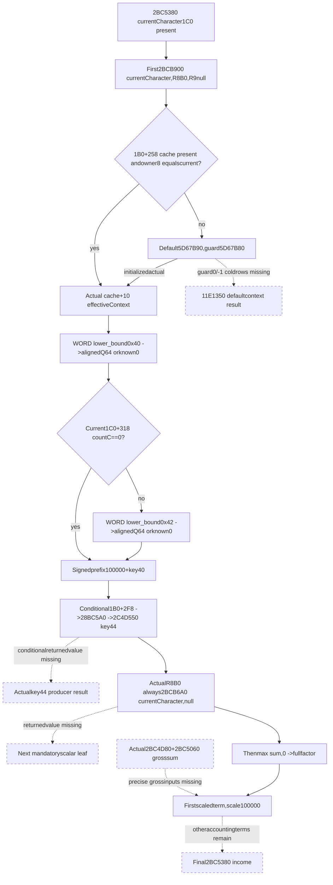

# Played-character income first scalar leaf — CK3 1.20.0.3

This bounded one-leaf source packet captures2BCB900, the first scalar used by the current-character accounting2BC5380. Existing physical getter28C3AE0 closes the raw current-owned effective-context cache and keys0x40/conditional0x42 prefix. The prefix is a genuine intermediate observation/kernel input; mandatory2BCB6A0 and separate gross/accounting producers still prevent a full factor or income readiness claim.

Status is **research**. No implementation, fixture/live result, finalfactor/income or game progress is delivered. The [parent debt-classifier source](battle-person-following-2bca620-12003.md) remains independent and its4956B receipts unchanged. New external packet: `Z:/ck3_mod_rewrite_process_assets/g2-background-round4-20261005/person-tail/following2bca620-source/played-income-first-leaf/`. SOURCE-PINS.json pins this document and exact new/reused sources; READ-COST.json records767 new EXE bytes=755 code+12 pdata.

## Sealed native source tree

Status **research**, with source-closed independent raw prefix inputs. No full factor/income readiness is claimed. Frozen CK31.20.0.3 / Steam25652598 / image base140000000 / recorded EXE SHA256 `94B55397ABB687A3DCD436805A5D885E6BE90FA6C693FEB44A9E3BBEEADE02A6`. This bounded packet captures only one new callee2BCB900 and reuses existing source for the actual effective-context getter. No implementation, Git, tests/build, runtime or generic producer catalogue. Original4956B parent receipts remain unchanged; new cost is separate.

## Actual current receiver and first use

The existing2BC5380 body requires currentCharacter1C0 present before this first leaf. At2BC53D5..53E2 it setsR9D=0,R8D=0,RDX=currentCharacterR13,RCX=&localoutQ64[rbp-19], and calls **2BCB900**. This receiver is **currentCharacter**, not the separately supplied topLiege. R8B=0 admits the tail addition; R9=null suppresses diagnosticwriter calls. No native diagnostic or accounting callback executes in the proposed observer.

2BCB900's full exact body is `[2BCB900,2BCBBF3)`755B, with normalRET2BCBBF2. It obtains an effectiveContext from28C3AE0(currentCharacter), folds actual numeric keys0x40/0x42 and a conditional key0x44 result, then always invokes2BCB6A0 for this actualR8B0 call. Finally it writes signedQ64 `max(wrapped_sum,0)` throughoutRCX. Capturing its body identifies those actual inputs; it does not source-close the mandatory tail value.

## Source-closed effective context selection, from existing cache

Exact cached28C3AE0 first reads currentCharacter1B0. It reads QWORDcomponent+258 only when that component is present. A nonnull cache whose QWORD+8 **equals the actual currentCharacter pointer** selects effectiveContext=cache+10. No Character magic, topLiege alias or unrelated current-context getter is substituted.

Absent1B0, null cache or owner-pointer mismatch selects global effectiveContext **5D67B90**, governed by signed raw DWORD **5D67B80**. Actual native signedguard<=threadepochDWORD[TLS slot0+10] uses the existing default context; greater calls4223AA4, then guard==-1 constructs it through11E1350 plus supporting PC constructors before finalizing4223A44. The cold default's numeric rows are not closed by this packet. The minimum observer can read a currently initialized actual default context, but rawguard0/-1 retains the specific missing `effective_context_default_initialization_11e1350`. It does not fabricate an empty default or execute initialization.

For a selected actual context, numeric keys are **WORD arrayQWORD+68 / signedcountDWORD+74**, and aligned evaluated values are **signedQ64 arrayQWORD+D0**. The source performs unsignedWORD lower_bound for0x40 and0x42, takes the first matching key and uses its ordinal for values[index]. Absence after the actual lower-bound search is known numeric0. It does not mask, sort or sum duplicate keys. Actual count0 admits an empty key set; negative count is not declared knownempty.

Thus the actual current-owned cache gives concrete same-query raw/evaluated modifier rows, independent of the missing accounting totals. Physical cache offsets are owner+8, effectivecontext+10, keys cache+78/countcache+84, and aligned values cache+E0. These source-proven offsets may later bind a readonly field; no query is implemented here.

## Prefix keys and conditional demand

2BCB900 initializes baseline **100000**. The first0x40 lookup adds its evaluated signedQ64 modifier value, or known0 when absent. The native fixed multiply is by100000 at the same100000 scale, so its numeric term preserves that value, including negative/zero. It handles the large product range through its captured split arithmetic; no floating conversion is needed.

Then it checks currentCharacter1C0+318 vector signedcount+C. The actual first-call parent already has1C0 present. If the count equals0, key0x42 is entirely undemanded. If nonzero, it adds the similarly selected evaluated key0x42 term, or known0 when absent. The helper's general absent1C0 branch uses actual inline vectorheader5459D38/count5459D44; that general branch is not reached by this first2BC5380 call and need not block this prefix observation.

The independently closed subtotal is therefore **wrap_i64(100000+value_0x40+conditional_value_0x42)**, before optional key0x44, tail addition and final nonnegative clamp. Do not clamp this prefix; it is a signed intermediate input and may be negative. A valid actual context with count0 and activitycount0 gives actual prefix100000, not a claim that the final factor or income equals100000.

## Precise remaining scalar inputs inside2BCB900

After the prefix, a present currentCharacter1B0 reads signedDWORD+2F8 and multiplies it by100000. It calls **28BC5A0** on that fixed value; positive returnedEAX admits **2C4D550(out,context,key0x44,writer=null,scaledreturnedvalue,0)**. Its actual returned signedQ64 is added to the subtotal. Absent1B0 skips the entire branch. This packet does not reinterpret raw2F8 as a final integer return or replace2C4D550 with an invented linear key multiplication; these conditional producer results remain explicit.

Actual first-callR8B=0 then **always** calls **2BCB6A0(out,currentCharacter,writer=null)** and adds its signedQ64. This is the next mandatory precise unclosed callee; no second new callee is captured. Only after those additions does2BCB900 apply `sum>0 ? sum :0` and writeout. Missing the tail cannot be labeled a ready full factor, even when both prefix keys are absent or prefix is known100000.

## First gross sum and scale in existing caller

The first gross source is the existing2BC5380's two actual returned values: **2BC4D80 +2BC5060**, summed at2BC54FA/54FE. At2BC5501 the already returned2BCB900 factor becomesR14. A nonzero gross sum invokes2BC4B20(outlocal,currentCharacter,gross,0) at2BC5529; the following first product does not consume that returnedRAX or itsoutslot. The factor remains held inR14 and gross inRBX. The early unsealed wording that grouped2BC4B20 with numeric gross inputs is corrected: retain its native call order, but do not demand a separate2BC4B20 numeric contribution to this first scaled term.

At2BC5540..55C5 the first term scales that gross sum by the full2BCB900 factor at **100000 fixed-point scale**, using captured signed product/division and large-product split arithmetic. This is a numeric kernel dependency, not an additional outer PropertyContainer request. Gross producers2BC4D80/2BC5060 and full scalar tail2BCB6A0 are separate missing inputs. The first raw prefix alone cannot release that scaled term or the final living-player income. Remaining shares/expenses/other terms in2BC5380 are already named in the parent packet and are not chased here.

## Minimal observer and demand

| Source branch | Useful closed raw input | What remains |
|---|---|---|
|Current-owned nonnull cache|Actual cache owner equality, context keys68/count74/valuesD0|No default guard or cold constructor demand|
|Actual initialized default context|Rawguard5D67B80 and actually selected5D67B90 rows|No native initialization claim|
|Default rawguard0/-1|Exact selected origin/guard|Cold context rows through11E1350 missing|
|Key0x40 absent|Actual lower-bound absence ->value0|No value-array read for missing key|
|Activitycount318+C==0|Actual count0 ->key0x42 undemanded|No invented fullfactor|
|Activitycount!=0|Actual0x42 lookup/evaluated value or knownabsence0|Preserve signed intermediate subtotal|
|ActualR8B0|Known call site/receiver/writernull|Mandatory2BCB6A0 returnedvalue still missing|
|First gross scaled term|Exact current receiver, fixedscale100000|Actual2BC4D80/2BC5060 +fullfactor, separately|

## Cost and stop point

Exactly one new callee:2BCB900755B plus one12B pdata row, **767B fresh frozen-EXE cost**. Cached28C3AE0 physical getter and existing2BC5380 caller are separately reused. Original4956B receipts and all current implementation/query files remain unchanged. No second newcallee, directdata/unwind/header reads, duplicate spans, fullhash/scan, code/Git/tests/build or runtime. Stop after this bounded input tree and minimum raw-prefix plan; Root decides the next construction or source closure.

## Minimum intermediate observer proposal

This packet proposes a genuine intermediate query/kernel input, **not a ready2BCB900 factor or2BC5380 income**. No native/Python implementation or final schema is delivered. Root can later extend the same current-fullCharacter source leaf with `played_income_first_leaf_2bcb900` or group these inputs under its precise living-player accounting source.

## Closed independent prefix inputs

Publish actual current Character1B0/cache+258 presence, cache-ownerQWORD+8 equality and selected context origin. Current-owned cache selectscontext=cache+10. A fallback selection retains rawguard5D67B80; initialized state reads actual5D67B90 context, while0/-1 keeps precise11E1350 default-row result missing. Do not manufacture a default empty context or execute initialization.

From actual selected context publish signed native numeric-key count74, stored unsignedWORD keys from68 and demanded aligned signedQ64 values fromD0. Existing sorted-key lower-bound semantics finds first exact0x40 and, only if current1C0+318 countC!=0,0x42. A known missing key supplies actual term0, not a failed-read replacement. Zero keycount needs no array pointers/values. Preserve original ordered keys and nativecount; do not sort or sum duplicate entries. Negative counts are not invented empty. The actual first-call parent already proves current1C0 present; do not add topLiege or absent-land general header demand to that path.

The pure prefix output is wrap_i64(100000+value40+conditionalvalue42), with source provenance for each demanded term. Signedprefix0/negative is legal before the later clamp. This field can become available independently while finalfactor remains unavailable. It is a concrete raw/evaluated cache observation, not a nativecallback result.

## Proposed raw grouping, before final schema

`status/character_id`, `call_source{receiver_current_character,tail_flag:false,writer_present:false}`, `context_source{extension_present,cache_present,owner_matches,origin,default_guard,native_key_count,ordered_keys,selected_rows}`, `activity_source{land_present,vector_318_count}`, `modifier_prefix{key40_found,key40_raw_q64,key42_demanded,key42_found,key42_raw_q64,prefix_fixed_q64}`.

Keep undemanded keys/values/defaultguards nullable without blocking this intermediate. Owner matching cache requires no default input. Activitycount0 requires no0x42 input. Absent key requires no aligned value. For a missing actual context/key read, preserve precise unavailable term rather than fabricate0. No caller provider/PC request is added by this raw scalar prefix.

For future full scalar, add separately named actual returned inputs `conditional_key44_result_2c4d550` and mandatory `tail_result_2bcb6a0`; the actual first call'sR8B0 always needs the latter. Preserve first gross inputs as `gross_2bc4d80` and `gross_2bc5060`.2BC4B20 is an ordered call whose return is not consumed by the immediatefirstproduct; it is not an extra numeric firstsumfield. The first scaled term multiplies actualgross by fullfactor at100000 scale. Do not useprefix asfullfactor or asnetincome.

Suggested future dedicated contract/module name, only if Root assigns implementation: `battle_person_played_income_first_leaf_contract.py`, normalizer `normalize_played_income_first_leaf_2bcb900`, pure prefix function `fold_played_income_modifier_prefix_2bcb900_from_source_inputs_12003`. No files or callable APIs with those names exist here.

## Precise next boundary

Next mandatory source leaf is **2BCB6A0(out,currentCharacter,writer=null)** for the actualR8B0 factor call. Conditional1B0+2F8 ->28BC5A0/2C4D550, gross2BC4D80/2BC5060 and remaining2BC5380 terms remain independent exact producer inputs. Before any additional newcallee capture or implementation, Root/parent decides that bounded next package. Original>=0balance observer requires none of this prefix or accounting and stays independent.
