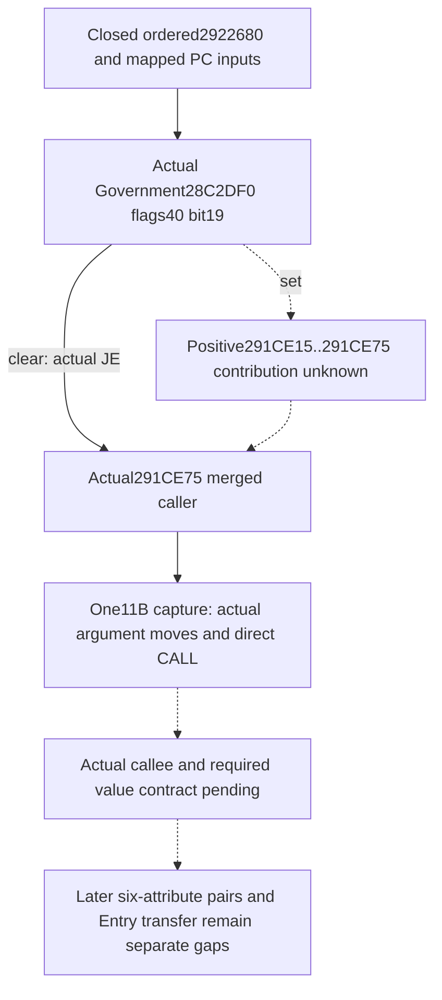

# Person preparation: mandatory caller after the Government gate

This is the next bounded source entrance after the static-ready Government bit19 observer. It follows the actual merged caller instead of expanding the unobserved positive branch. There is no new Person/Entry readiness claim or invented numerical contribution.

## Actual boundary before unknown callee

Build: CK3 1.20.0.4 / Steam25734779, retained EXE SHA-256 `98702F88A547CDE2EAF29A85F93B85F68EE4CF8148336A4F7AFAEB75319DD518`. The actual 20-byte caller receipt in `Z:/ck3_mod_rewrite_process_assets/g2-background-20261009/person-entry-after-mapped52/actual-next-gate01/SOURCE-CAPTURE.json` proves `JE291CE75` after the selected Government DWORD+40 bit19 test. That jump target is the next exact source entrance. It does not depend on obtaining a live Native53 bit.

The corresponding held exact3 caller has the following instructions at `291CE95`: `MOV RDX,R14`, `MOV RCX,R13`, `CALL291E3C0`. The old caller continues with a separate provider call and six-attribute contribution pairs. This only locates a same-model/Character preparation call after the conditional segment; it does not identify the helper's internal role, fields, weights, or return type. No actual4 callee address is inferred from a version delta.

The old callee is named as unclosed in [battle-first-contact-person-preparation-frontier-12003.md](battle-first-contact-person-preparation-frontier-12003.md) at line838 and [battle-person-following-2920b50-12003.md](battle-person-following-2920b50-12003.md) at line96. The bounded remaining-two-helper tree contains no body or software contract for it. Those other helpers must not be repurposed as this call.

The held old runtime metadata gives ordinal141239, `[291E3C0,291ECC6)`, 2,310 bytes, unwind RVA86526100. Its neighbors are `[291E210,291E3B1)` and `[291ECD0,291F096)`. This bounds an old capture only; it proves neither a complete decoded body nor the actual4 target. It is a future extent locator after the new literal CALL is decoded, not a reason to request an old body or assume a uniform RVA shift.

## One Root-only file capture

The prepared argv is `Z:/ck3_mod_rewrite_process_assets/g2-background-20261009/person-entry-after-government53/ROOT-CAPTURE-ARGV.json`. It requests only `[291CE75,291CE80)`, 11 bytes, using held `.text RVA4096/raw1024` and file offset `RVA-3072`. It does not read PE/PDATA/unwind metadata, rehash the EXE, inspect process memory, or launch anything. Root alone executes it with the already available Capstone interpreter.

The resulting literal CALL determines the next helper. Only after that decode may the exact known runtime row or existing complete cache supply the necessary callee extent. The manifest requests no positive-path bytes, no guessed callee body, and no other target. A decode-complete caller window is not a whole-function or helper-semantics claim.

## Minimum future integration

Reuse `ck3_query_battle_terminal_transition_v1`, the exact4 guarded memory binding, full Character-ID join, and current model ownership attribution. The new helper's value contract must come from its actual source. Until then there is no published placeholder leaf, artificial PC record, policy restriction, or full AST reconstruction. The existing six-skill/final-stat projection still requires an explicit correct stage; current model identity does not substitute for a fresh baseline.

The R83 Native51 empty `following_2922680` list is an actual historical observation, not proof of this helper's inputs or outcome. Native53 has seven static native/registered cases and a GREEN canonical result; it has no live bit19 observation.

## Current operational boundary

At 21:07 Asia/Shanghai on 2026-10-09, the user prohibited local CK3 use. Root reports R83 closed with 6,019 saved normal days; R84 was not allocated or launched. This work authors source, evidence metadata, and a file-only Root recipe. It performs zero Game, SDK, process, UI, launch, build, test, EXE capture, or hash operations. Shared progress reports remain coordinator-owned.
