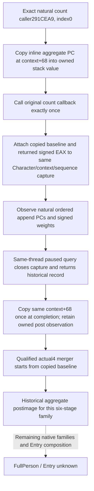

# Person pre-six aggregate baseline on actual 1.20.0.4

This increment observes the real aggregate PC before the first natural six-attribute callback. It supplies the missing initial value for the already qualified ordered merger; an empty contribution alone is not the historical postimage. Native64 is static-ready after Root's unique build and connected FIRST. It has not been deployed in the current Native60 game. FullPerson and Entry remain false.

Exact source profile: CK3 **1.20.0.4**, Steam build **25734779**, EXE SHA-256 `98702F88A547CDE2EAF29A85F93B85F68EE4CF8148336A4F7AFAEB75319DD518` (reused `ck3_12004.hpp`; no hash performed).

## Native tree and timing

The held caller uses `MOV RDX,RSI` at291CE9E before count CALL2BA95C0 at291CEA4. Both append sites use the same RSI as RCX at291CEC1/291CEF3. In the held append body,2438842 preserves RCX in RDI and2438964 uses `LEA RCX,[RDI+68]` before CALL2303100 at243896E. Therefore the aggregate PC is the inline address **count context+0x68**, not a QWORD loaded from that address. This proof does not label the context as Model+10.

Proof locators: `BG10/person-native-pre-six-aggregate-baseline/native-tree/RESULT.json`; held caller `D:/p60next01/actual-six-attribute-branch02/caller-tail-0291CE85.asm`; `BG8/person-next-direct-entry12004/pc-decoder-source03/{append_source_pc_count_receiver,append_source_pc_to_numeric_merge}-DETAIL.json`. No new EXE reads are needed.

The copy is before the original stage0 callback, not after its result and not from current final Model memory. It reuses the existing PC reader: signed count atPC+C, orderedU16 keys fromPC+0, signedQ64 values fromPC+68. Count0 is a real empty state. Unread values retain readable keys and make only baseline/total inputs unavailable. No multiplier is attached to a baseline; its wire weight is null. Natural append weights retain their actual native values.

## Source contract

The existing hook delegates to `InvokePersonSixStageCapture12004`, which copies the stack-owned pre-state, forwards original arguments and full RAX unchanged exactly once, and then publishes the same owned capture record. Existing five-argument `ObservePersonSixStageCapture12004` remains available to its original callers and does not invent a baseline. No second journal or game write is introduced.

The same MCP query sibling publishes optional `pre_six_aggregate` with `observed`, source stage `before_first_count_callback`, PC offset104, and the existing full PC value shape. `aggregate_postimage_inputs_ready` requires the existing six-stage capture ready plus the actual baseline ready. Existing `ready` retains its original meaning independently. `post_six_aggregate` copies the same PC once at the first valid same-thread completion, after the natural append calls have returned; repeated queries retain that owned observation. Its source stage is `same_thread_capture_completion`, not an assertion of an immediate last-append snapshot. `aggregate_postimage_comparison_ready` additionally requires this observed PC ready. The local composition publishes exact physical key/value equality or inequality against that completion observation without turning a mismatch into a new policy gate. Older Native62 packets remain readable but cannot gain historical postimage readiness. A late stage capture or missing baseline is not replaced with an empty PC.

The local `compose_captured_six_stage_postimage_12004` uses the qualified actual4 ordered merger with the copied baseline as initial state and only the existing naturally captured append requests. A private unit-copy seed initializes the logical container; it is not published as a native append or source ordinal. This preserves duplicates, FFFF baseline keys, signed64 values and the actual sequential feedback already captured in append weights/counts. It does not recompute any intermediate skill.

## Qualification boundary

Root executed the unique Native64 attempt01 and sealed its canonical at **2026-10-09 21:09:56 UTC (Oct10 05:09:56 Asia/Shanghai)**. Five production and two fixture compilations, the fresh Runtime441 archive, the independent construction two-scene producer, this Person six-whole producer and its sole six-call registered MCP/real NativeDriver consumer all passed. The Person consumer took **5.605s**. The actual receipt is `D:/codex-ck3-background-spill/g2-native64-build01/attempt01/ROOT-NATIVE64-RESULT.json`; canonical is `MIG/entry-live-fix64`.

The compiled/qualified coherent source is **f28f7266e64d048f99b43a7a5f099a7f589bb037**; this package's author source is **a409c31b708f70dad03d1b12aeead03c85753b90**. The qualified Python merger dependency remains its separately recorded54a FIRST; it and the previous Native62 producer were not replayed. Source workers ran no compiler, FIRST, test, import, hash, Game or SDK action. No current live capture or FullPerson/Entry/G2 credit follows from this static qualification. The separate ordered merger kernel already passed Root FIRST02 (1passed0.19s); its empty-baseline contribution remains a distinct operation. No native replay, current game observation, FullPerson/Entry or G2 credit is granted here.

The new compound includes six unchanged native whole packets and six registered calls. Nonempty and genuinely empty baselines each receive ten naturally observed empty PCs: the local postimage must retain the exact nonempty baseline rows or remain empty respectively. Independently supplied completion state exposes a real comparison mismatch in the former and equality in the latter. Partial values and a bypassed stage0 keep existing six-stage inputs ready independently, without fabricating a baseline. A new same-owner sequence gets its own baseline; post-completion source changes cannot overwrite the owned copy. The previous seven native cases are not replayed.
