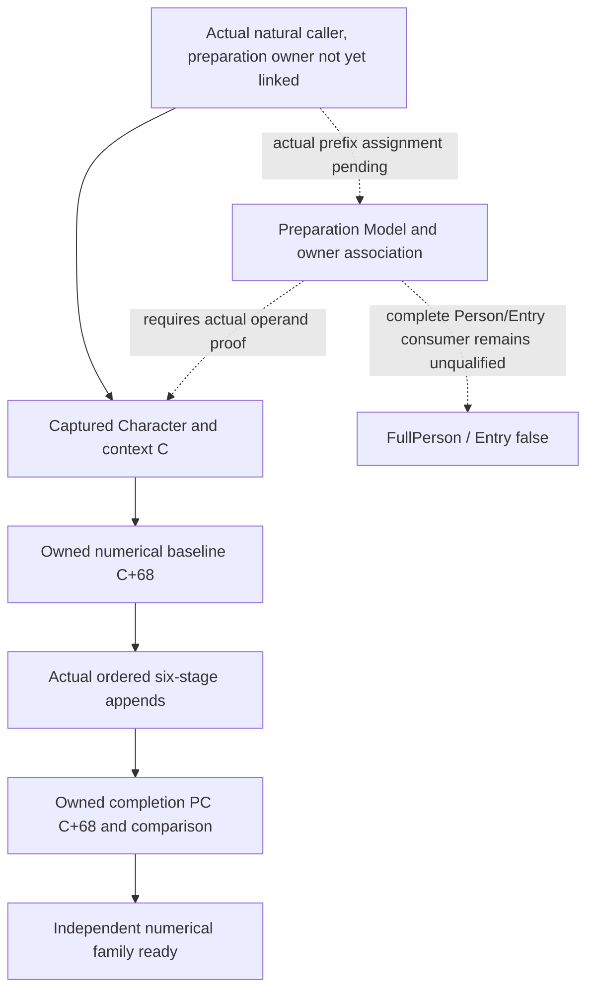

# Person preparation Model association on actual 1.20.0.4

## Functional boundary after Native64

Native64 already observes the actual inline numerical PC at captured context **C+0x68** before the six-stage callbacks, all natural ordered append operands/weights, and the same PC at the existing completion boundary. The qualified actual4 merger can calculate this family's historical numerical result and compare its completion observation. Earlier Government or Title contributions are present in that real initial aggregate. Reading another earlier branch merely to explain its contribution is not a missing operand for this result.

The concrete remaining source input is the preparation-stage association between **C**, its owning **Model**, and **Character**. The current same-MCP record owns Character pointer/fullID, C, sequence and thread, but current proof does not identify C as the historical preparation Model's subobject. A later installed-current getterModel cannot establish that history. This is a source role/input gap, not a new safety gate.

Exact build is CK3 **1.20.0.4**, Steam **25734779**, reused EXE SHA-256 `98702F88A547CDE2EAF29A85F93B85F68EE4CF8148336A4F7AFAEB75319DD518`. No new hash or game observation is performed.

## Existing native tree

The retained actual caller at291CE9E uses RSI as count RDX; both actual append sites pass the same RSI as RCX. Held2438842/2438964/243896E establish the inline aggregate PC C+68. The retained caller epilogue loads a saved Model pointer from `[RBP+500]` at291CF06, exchanges byte[Model+2F4] at291CF0F, and returns291CF28. The following CALL852460 at291CF29 is cold. There is no held normal modifier call after the six stages.

The old12003 frontier states R13=Model, R14=QWORD[Model+8], RSI=Model+10. That is an old-build role statement, not an actual4 assignment proof. The current source still needs the actual defining operand. No Model+10 alias or subtract10 query is published before that proof.

## One bounded next producer

A single cached NEW runtime-row lookup places both actual count CALL291CEA4 and RET291CF28 in row141230 (one-based): `[0x291C0B0,0x291CF2F)`,3711B, unwind052847AC. Therefore **291C0B0 is the actual metadata-selected entry**, not a shifted old address. The lookup read no native bytes or PE/pdata sections.

The next Root-only producer reads exactly the first **128B at291C0B0**, using the already held `.text` RVA4096/raw1024 mapping. Its purpose is the actual Model/Character/RSI assignments. A prefix is not a whole-function proof; an incomplete final instruction or an assignment outside the window stays explicit. No additional callee or branch is selected automatically.

Recipe and source helper: `BG10/person-preparation-model-association/ROOT-READ-PLAN.json` and `ROOT-CAPTURE-PREPARATION-PREFIX.py`. The EXE path is an explicit Root binding to its existing frozen actual4 file. This worker has not run the producer, decoder or imports.

After actual operands prove the relation, the smallest implementation can reuse Native64's existing pre-callback copy and same owned sequence to publish the preparation Model identity and its actual owner association in the same MCP. It needs no second journal or current-Model proxy. Exact field offsets and any Model memory read are deferred until those actual instructions are available.

## Remaining scope

The known actionable missing input is this Model/context/owner association. The full Person/Entry composed consumer has not been qualified; no single complete actual4 readiness contract is held here, so this note does not invent a global list of additional gates or require every native branch to be decomposed. Government-positive96B and raw count callback arithmetic are separate attribution/counterfactual quality work; their current numerical effects/counts are already observed. FullPerson/Entry remain false. Current live Native60 is unchanged; deployment or authorization waiting does not justify repeating old reverse engineering or FIRST.
