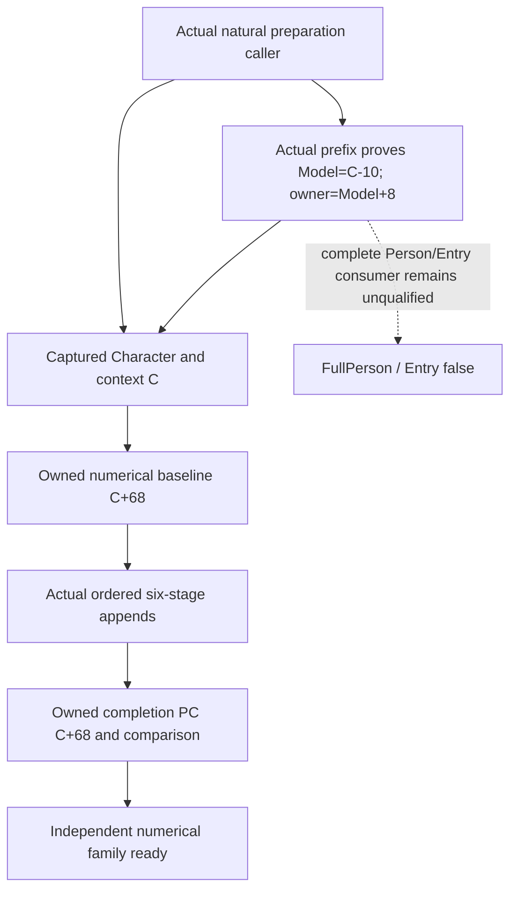

# Person preparation Model association on actual 1.20.0.4

## Functional boundary after Native64

Native64 already observes the actual inline numerical PC at captured context **C+0x68** before the six-stage callbacks, all natural ordered append operands/weights, and the same PC at the existing completion boundary. The qualified actual4 merger can calculate this family's historical numerical result and compare its completion observation. Earlier Government or Title contributions are present in that real initial aggregate. Reading another earlier branch merely to explain its contribution is not a missing operand for this result.

The concrete source input is the preparation-stage association between **C**, its owning **Model**, and **Character**. Root's one actual prefix now proves that relation; the minimal observer implementation is authored below. The current same-MCP record owns Character pointer/fullID, C, sequence and thread, and the new actual proof identifies C as the historical preparation Model's subobject. A later installed-current getterModel cannot establish that history. This is a source role/input gap, not a new safety gate.

Exact build is CK3 **1.20.0.4**, Steam **25734779**, reused EXE SHA-256 `98702F88A547CDE2EAF29A85F93B85F68EE4CF8148336A4F7AFAEB75319DD518`. No new hash or game observation is performed.

## Existing native tree

The retained actual caller at291CE9E uses RSI as count RDX; both actual append sites pass the same RSI as RCX. Held2438842/2438964/243896E establish the inline aggregate PC C+68. The retained caller epilogue loads a saved Model pointer from `[RBP+500]` at291CF06, exchanges byte[Model+2F4] at291CF0F, and returns291CF28. The following CALL852460 at291CF29 is cold. There is no held normal modifier call after the six stages.

The old12003 frontier states R13=Model, R14=QWORD[Model+8], RSI=Model+10. That was only an old-build role statement when the read was planned. Root captured the sole128B actual prefix at **2026-10-09 21:29:35.890110 UTC**, receipt `BG10/person-preparation-model-association/actual-prefix01/SOURCE-CAPTURE.json`, full decode33instructions. Actual291C0B0 saves incoming RCX at[RSP+8];291C0D0 preserves it inR13;291C0D3 loadsR14 from[RCX+8];291C0DC uses `LEA RSI,[R13+10]`. Eight pushes and291C0C1 `LEA RBP,[RSP-4B8]` giveRBP=entryRSP-4F8, so the saved[RSPentry+8] is exactly[RBP+500] observed in the epilogue. Thus **Model=C-0x10**, **Character=QWORD[Model+8]**, and the already observed aggregate **C+0x68=Model+0x78** are now actual4 operands, not a global RVA shift or a current getter assumption. The reset CALL291BFF0 is present but its body is not needed or selected for this read-only association.

## Completed bounded prefix producer

A single cached NEW runtime-row lookup places both actual count CALL291CEA4 and RET291CF28 in row141230 (one-based): `[0x291C0B0,0x291CF2F)`,3711B, unwind052847AC. Therefore **291C0B0 is the actual metadata-selected entry**, not a shifted old address. The lookup read no native bytes or PE/pdata sections.

The completed Root-only producer read exactly the first **128B at291C0B0**, using the already held `.text` RVA4096/raw1024 mapping. Its purpose is the actual Model/Character/RSI assignments. A prefix is not a whole-function proof; an incomplete final instruction or an assignment outside the window stays explicit. No additional callee or branch is selected automatically.

Recipe and source helper: `BG10/person-preparation-model-association/ROOT-READ-PLAN.json` and `ROOT-CAPTURE-PREPARATION-PREFIX.py`. The EXE path is an explicit Root binding to its existing frozen actual4 file. Root performed128B/one read, no rehash or PE/pdata read. This worker consumed the receipt/decoded text once and ran no producer, decoder or imports.

The source implementation reuses Native64's existing pre-callback copy and same owned sequence. Its optional `preparation_model` publishes the actual Model identity, owner Character pointer/fullID, before-first-count source stage and actual offsets10/8. The owner is copied before the original callback and survives subsequent source or installed-current Model changes. Read failure stays partial and does not change existing six-stage or aggregate readiness. `owner_matches_capture` is an observed pointer/fullID relation, not a new gate. No second journal, hook, native Model call or current-Model proxy is introduced.

The new three-world producer and sole three-call registered MCP/real NativeDriver compound are AUTHORED_NOTRUN, on qualified Native64 f28. They cover an immutable preparation owner despite original/current-getter mutation, unread owner with independently ready numerical inputs, and a fresh same-owner sequence with a new Model/context. The existing64 producer and merger FIRST are not replayed.

## Remaining scope

The Model/context/owner association is now source-closed and authored; Root compilation/FIRST and future actual natural observation remain. The full Person/Entry composed consumer has not been qualified; no single complete actual4 readiness contract is held here, so this note does not invent a global list of additional gates or require every native branch to be decomposed. Government-positive96B and raw count callback arithmetic are separate attribution/counterfactual quality work; their current numerical effects/counts are already observed. FullPerson/Entry remain false. Current live Native60 is unchanged; deployment or authorization waiting does not justify repeating old reverse engineering or FIRST.
