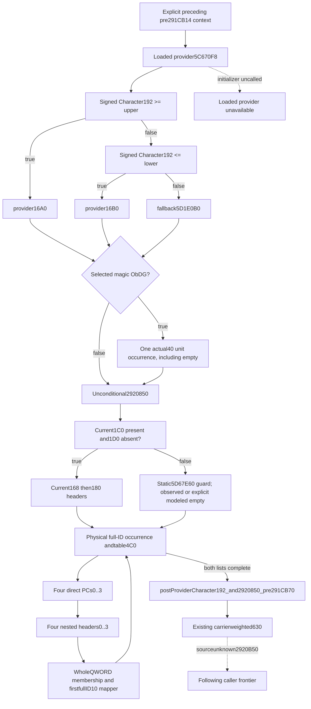

# Character192 provider and2920850 same-query inputs, exact1.20.0.3

This source-first plan adopts the stage owner's sealed bounded source packet, without another EXE read. Frozen build is CK3 **1.20.0.3**, Steam **25652598**, EXE SHA256 **94B55397ABB687A3DCD436805A5D885E6BE90FA6C693FEB44A9E3BBEEADE02A6**. Existing caller cache291C0D0 and mapper4212920/4212800 were reused by that source lane. Its fresh cost is **1032B=888code+144pdata**, not duplicated here. Source-only child `f7aebfff` and `person-stage-chain/after-gated-provider-2920850-source/SOURCE-TREE.md`, `QUERY-PLAN.md`, `READ-COST.json`, and `DELIVERY.json` preserve capture history. Source-tree SHA256 `6594218b2de3fb88b1450ed02fae107a0815783e8e8cbb06675fb2462de5e125`; query-plan SHA256 `f9901155b6469f6916a01dfa478d6946f9b1cb840b7cf6cc78af61a370199093`.

Bounded caller interval is **291CB14..291CB70**: following the prior four-family326/2920310 interval, append provider192, invoke2920850 unconditionally, then reach the already closed carrier-weighted630 loop. Source of2920B50 at291CC71 remains outside this package. Current raw snapshot values are not relabeled a historical preceding context or fresh evolving model baseline.

## Actual native tree

1. AtCB14, provider getter08FD4E0 loads QWORD5C670F8. Actual null enters initializer3F8B660 in native code; our read-only query retains unavailable loaded-provider state and never calls it.
2. Sign-extend Character WORD192. Compare signed upper5C69FE4 first: value>=upper selects QWORDprovider16A0. Otherwise compare signed lower5C69FE0: value<=lower selects QWORDprovider16B0; the remaining branch selects QWORD5D1E0B0. No threshold sorting or swapping. Selected magic38!=4744624F skips the request. Matching magic appends actual inlinePC40 atunit100000, including empty. No fullID gate.
3.2920850 runs after every provider branch. Its selected current1C0+168 and+180 headers are used only when Character1C0 is nonnull and1D0 null. Otherwise each list selects28D7480's static inline header5D67E60, guarded by signed DWORD5D67E58. Native cold initialization zeros header5D67E60/68 and sets allocator5D67E70; it is not executed here. Raw guard0/-1 supports explicitly modeled empty numeric header with unread/null physical operands, separate from observed initialized header. Other guard states use actual header bytes; unread demanded guard stays partial.
4. Each actual header is data0/signedcountC/DWORD IDs. Exact0 is known empty; negative is partial. Every physical duplicate occurrence resolves fullDWORD via5D1EB60 registry (low24/cap2C/table20/stride16/pointer8/fullID8) or5D1EB90 fallback. Readable null registry skips ID demand. No selected-object magic/sentinel gate. Selected object QWORD4C0 supplies an unclassified table pointer; no business type is guessed.
5. For each first-list occurrence append **all four direct PCs** at table80+iB30, i0..3, then process **all four nested4212920 headers** at table400+iB30, i0..3, before the next physical occurrence. Second-list offsets are direct240+iB30 and nested418+iB30. Every direct request hasunit100000 and keeps an empty occurrence. There is no outer table count gate. This is not the earlier291F940 direct/nested-per-row interleaving.
6. Nested membership receiver is selected thirdRite750. CharacterB4 resolves through Rite5D1E2F8/fullID8/fallback5C67670; firstRite4B8 resolves through Faith5D1E300/fullID8/fallback5D1E2E0; Faith98 resolves again through the original Rite registry/fallback. Nested descriptors stride30 have QWORDkey20 and actual PCpointer28. FullQWORD key membership uses thirdRite750+50/count5C. Admitted rows map to the first full keyID10 match in the same descriptor list; wrong keymagic38 or no match uses inline5DC21B0. Mapping guard5DC21A4 is physically prefetched even for a successful actual map. A successfully mapped PC remains independently numerically valid with an unused default guard0/-1, matching the already qualified remaining-helper contract; a consumed default with guard0/-1 stays partial. This does not invoke initialization. Exact nestedcount0 skips membership/key demand. Every admitted physical descriptor keeps its unit request.

## Released implementation schema plan before code

The new optional leaf is `provider192_and2920850`, with native-order independently available families `provider_192`, `list_168`, `list_180`. Its dedicated bridge module is `battle_person_provider192_and2920850_contract.py`; pure module is `battle_person_provider192_and2920850_12003.py`. Shared glue remains with the current-person owner. New native DTO/bindings/collector/serializer include files are dedicated to this package. No existing qualified helper/gated fixture changes.

Leaf fields are `status`, `ready`, `character_id`, `current_land_present`, `current_death_present`, `rite`, `mapped_default_guard_raw`, three family objects, and `reason`. `rite` and nested mapped families reuse the already qualified `ContextSourceRemainingRiteV1` and `ContextSourceRemainingFamilyV1` physical schema, not a replay of291F940's stage ordering.

Provider fields are `status`, `ready`, `provider_loaded`, `provider_identity`, `character_192_i16`, `upper_i32`, `lower_i32`, `selection`, `selected_identity`, `magic_u32`, `admitted`, `pc`, `reason`. PC uses the existing paired-property block plus identity/reason. Provider magic rejection is known zero requests; missing provider is a specific missing input and does not hide the lists. Upper success leaves lower unread/null.

Each list has `status`, `ready`, `direct_ready`, `mapped_ready`, `header_selection`, `default_init_guard_raw`, `count_raw`, `numeric_count`, `array_present`, `rows`, `reason`. Selections are `current_1c0_168`, `current_1c0_180`, `inline_default_5d67e60`, `modeled_empty_default_5d67e60`. Modeled-empty numeric_count0/rows[] has physicalcount_raw/array_present null. Each row has `native_index`, `requested_full_id_raw`, `resolution_selection`, `selected_full_id_raw`, `object_identity`, `table_identity`, `direct_rows`, `nested_rows`, `direct_ready`, `mapped_ready`, `ready`, `reason`. Direct rows contain indexed actual `pc`; nested rows contain indexed actual mapped family. A successfully resolved table has exactly four slots of each; a partial resolution may leave them null. No artificial maximum list gate.

Public APIs are `normalize_provider192_and2920850`, `emit_provider192_and2920850_requests_from_current_source_inputs_12003(section)`, `emit_provider192_and2920850_family_requests_from_current_source_inputs_12003(section, family)`, and `emit_provider192_and2920850_slot_requests_from_current_source_inputs_12003(section, family, occurrence_index, slot_index)`. Slots0..3 are individual direct PCs; slots4..7 are individual mapped headers. A nested-descriptor API `emit_provider192_and2920850_descriptor_requests_from_current_source_inputs_12003(section, family, occurrence_index, nested_index, descriptor_index)` exposes an independently complete admitted descriptor or known-false empty result, preserving a coherent prefix inside a partial nested header. Whole/family emitters require their own complete inputs; partial families leave independently available slots/descriptors intact. Every request hasunit100000 and actual source index/tag; raw direct/mapped paired PCs keep their actual input references.

The one new producer compound test will exercise upper/lower/fallback order, signedWORD limits, magic skip/empty PC, duplicate physical IDs, four-direct-then-four-nested order, fullQWORD membership and first mapping, actual null mapped PC partial, unknown demanded default without masking independent direct slots, modeled-empty guard, zero/negative count, and actor join. A new dedicated fixed-memory native target awaits Root's sole central build/first CTest. No old tests/wires, own native compilation, EXE reads, runtime, initializer, native callback or push are authorized in this child lane. Readiness remains source-closed/query-plan before implementation.

## Released pure contract and first production qualification, 2026-10-06

The preceding future-tense plan is retained as its pre-code source snapshot. Dedicated pure kernel/strict normalizer and genuine main optional-leaf actor join are now implemented. `FINAL-RAW-SCHEMA.json` in external `person-tail/provider192-and2920850/` sealed exact labels before code: provider selections `provider_16a0`, `provider_16b0`, `native_fallback_5d1e0b0`; direct rows `{native_index, pc}`; nested rows `{native_index, mapped_family}`. Reused RemainingRite/RemainingFamily physical fields remain unchanged; only native2920850 occurrence ordering is newly implemented.

The single new genuine production-normalizer compound case first-only passed **1/1 in0.45s**, at **2026-10-06 04:04:32 Asia/Shanghai** (wrapper0.872s). Its reusable `provider192_and2920850_source()` builder is in `tests/unit/test_battle_person_provider192_and2920850_12003.py`. It produces25 unit requests: provider1, two duplicate first-list occurrences20, and second-list4 including an empty direct PC. Assertions cover signedWORD upper-first selection, upper/lower/fallback thresholds, magic rejection, actual direct paired-PC references, wholeQWORD membership, duplicate firstfullID10 mapping, stored four-direct-before-four-nested order, precise missing mapped PC/default inputs, independent later direct slots and admitted descriptors, modeled-default guard, exact zero and partial negative counts, null-registry undemanded IDs, and same-query actor join.

`FOCUSED-PRODUCTION-CASE.json`/`.log` and `PURE-CONTRACT-DELIVERY.json`4963B SHA256 `2a74ec645e90761620c36fbb7533f7575f98e4ac0cee87c4bcef169a6fe8668e` record actual test/source pins. Implementation EXE I/O0, native builds0, old cases0, game operations0. Existing source cost1032B belongs to the stage owner's sealed source-only package and is reused. Current readiness is static-ready pure numeric behavior; the new native producer, first central CTest and actual new-wire consumer remain pending. Neither this test nor existing current getter bytes establishes a historical/future context baseline or full person/Entry/live readiness.

The new same-query DTO/bindings/collector/serializer and target are now committed as a native candidate. Target/CTest are both `xar_ck3_12003_person_provider192_and2920850_test`; independent output directory is `ck3_12003_person_provider192_and2920850_wire`, hook `RunProvider192And2920850Fixture(path)`. Six fixed-frame new wire scenes are `provider192-full-upper-duplicates`, `provider192-signed-lower-empty`, `provider192-fallback-magic-skip`, `provider192-partial-slots-independent`, `provider192-modeled-default-list`, and `provider192-initialized-default-null-registry`. Expected whole request counts are25,1,4,unavailable,1,15; partial slot/descriptor independent expectations are sealed in `NATIVE-WIRE-EXPECTATIONS.json`. No own native build or execution occurred; Root's first central build/CTest and only-six actual wire consumer remain pending.

Cached exact instruction clarification, no new EXE I/O:2920922 loads1C0;2920930 tests it;2920933 jumps to default2920947 when null; only nonnull land reaches2920935's1D0 comparison. The second list repeats at2920A2E/A35/A38(defaultA4C)/A3A. Thus land-null publishes `current_land_present=false` and leaves `current_death_present=null` without a new availability gate. `RemainingMapped`/`RemainingRite` are reused through locally rebound raw registry pointers. Each first and second list preserves four direct reads followed by four nested reads; mapper/PC failures leave complete direct slots and admitted descriptors independently consumable.
