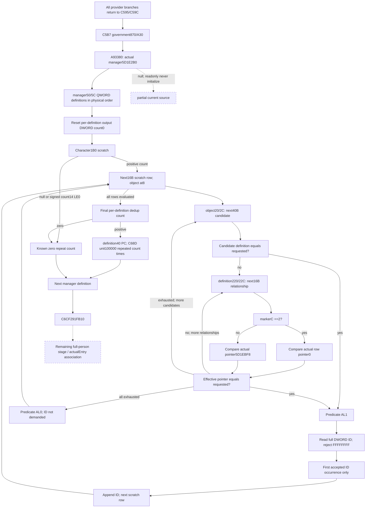

# Current person qualifier and repeated contribution, exact 1.20.0.3

Source closed at 2026-10-06 01:25:57 Asia/Shanghai (2026-10-05T17:25:57Z), ISO 2026-W41. CK3 1.20.0.3 / Steam25652598 / frozen EXE SHA-256 `94B55397ABB687A3DCD436805A5D885E6BE90FA6C693FEB44A9E3BBEEADE02A6`, image base `0x140000000`. This source package precedes implementation. It releases one missing current contribution after the provider and government steps, before `291FB10`; it does not create a fresh stage baseline.

Packet: `Z:/ck3_mod_rewrite_process_assets/g2-background-round4-20261005/person-tail/qualifier-28bc0d0-source/`. `SOURCE-ONLY-RECEIPT.json` records 553 new code bytes and 360 new `.pdata` bytes: **913 B** total. Caller and ordinary DWORD find/append helpers were reused from cached source. There was no whole EXE scan/hash, native callback, initializer, compilation, test, CK3/SDK/pipe/UI/Steam/process/profile/save/cache/runtime preparation/stage/deploy operation.

## Native position and receivers

The complete cached `291C0D0` establishes `R13=model`, `R14=QWORD[model+8]` as Character, and `RSI=model+10` as recipient PropertyContainer. The provider's nonnegative/null `+2F8` path at `291C70C` returns to `291C595/291C59C`, then continues through `291C5B7`. **All provider branches reach the government and qualifier steps.** A previously relayed negative-only interpretation was corrected before implementation; it is not a source condition.

Government `870/A30` contributions end at `291C620`. The caller creates an empty local DWORD vector, retaining its buffer across definitions but resetting its count to zero at `291C655` before each definition. At `291C639`, `A93380()` returns `QWORD[5D1E2B0]`. The getter would initialize a null manager via `3F8B660`; the readonly observer must instead publish this actual uninitialized/null selection as partial.

The manager supplies QWORD definition pointers at `+50` and a signed32 count at `+5C`. The caller visits every occurrence in physical order, including duplicate definition pointers. For each definition it calls `28BC0D0(Character, &localDWORDVector, definition, 0)` at `291C668`.

Afterward it reads the vector's signed32 count. A positive count causes exactly that many calls to `2438850(model+10, definition+40, 100000)` at `291C68D`. Zero/nonpositive output count adds no contribution. Definition order, repeated calls and unit weight are source behavior; they must not be collapsed into one scaled weight because the native fold can round each call separately. `291C6CF -> 291FB10(model, Character)` follows this step.

## Exact qualifier tree

`28BC0D0` consists of five cached/new `.pdata` fragments from `28BC0D0` through `28BC1A3`, joined by fallthrough. It reads `QWORD[Character+1B0]`. A null scratch returns the caller's actual reset count0. Otherwise signed32 `scratch+14 <= 0` also returns count0. A positive count demands the QWORD data at `scratch+8`, with **16 B** records:

| Physical source | Consumed meaning |
| --- | --- |
| scratch record `+8` QWORD | Actual object receiver of `2596950` |
| scratch record `+0` DWORD | ID, demanded only after predicate AL1 |
| record object `+20` QWORD / `+2C` signed32 | Array of 40 B candidate records |
| candidate record `+0` QWORD | Actual definition pointer tested against requested definition |
| candidate definition `+220` QWORD / `+22C` signed32 | Array of 16 B relationship records, demanded only after direct pointer inequality |
| relationship record `+C` byte | Marker; value2 selects this relationship's QWORD pointer at `+0` |
| global `QWORD[5D1EBF8]` | Effective comparison pointer for every relationship whose marker is not2 |
| requested definition `+40` | Contribution PropertyContainer, demanded only for positive final repeat count |

`2596950(object, requestedDefinition, flag0)` scans the 40 B candidates in physical order using `25942D0`; it stops at the first AL1. The alternate flag-nonzero predicate `25942C0` is not demanded by this caller and was not read. The predicate first compares candidate-definition pointer equality. Equality returns AL1 without demanding that definition's relationship header. Otherwise it scans the definition's relationship records in physical order, stopping at the first effective pointer equal to the requested definition. The source preloads the actual global `5D1EBF8` pointer before a nonempty relationship scan; only a marker other than2 makes its value an effective comparison operand. For marker2, the actual row pointer is selected; for every other marker, that actual global pointer is selected. Exhaustion returns AL0. This predicate has **no numeric threshold**, no value read from the other 32 bytes of each candidate record, and no initializer/guard read.

Only after AL1 does `28BC0D0` reject ID `FFFFFFFF`. Other DWORD bit patterns, including zero and values above `7FFFFFFF`, are valid comparison operands. It looks for the full DWORD ID in the output vector with cached `880430`, then appends only the first accepted occurrence using cached `B02D10`. Deduplication is per definition, and preserves first accepted scratch-record order. It does not deduplicate record objects, candidate definitions, manager definitions or contribution calls. The predicate is evaluated even for a later sentinel or duplicate ID.

## Smallest readonly query plan

Add optional `qualifier_28bc0d0` to the existing same-Character `current_context_source_inputs` query. Use only `Read`, actual bound global slots `5D1E2B0/5D1EBF8` and existing paired-property reader. Do not call `A93380`, `28BC0D0`, `2596950`, `25942D0`, `880430`, allocator callbacks or `2438850`; their semantics are implemented as local comparison/count and pure contribution requests.

The leaf carries `status/ready/character_id/reason`, actual `manager_object`, `definition_count_raw_i32`, `scratch_present`, `scratch_count_raw_i32`, lazily demanded `fallback_definition_object`, and original-order `definitions`. A raw readable null is different from an unread pointer. Manager count0 is a legal empty observed source. A negative manager/candidate/relationship count is not source-established empty: those source loops use end-pointer equality, not JLE, and cannot be represented as a finite observed vector. Only scratch count has the explicit JLE empty rule.

Each definition has its physical `native_index`, actual `definition_object`, independently qualified `ready/reason`, `scratch_evaluations`, complete `accepted_ids_u32` and `repeat_count` only when all demanded evaluations close, plus optional actual `properties` only when repeat_count>0. Duplicated manager definitions remain separate rows. One unread definition cannot make a different fully observed definition unavailable.

Each scratch evaluation records its physical index, actual object pointer, signed32 candidate count and demanded candidate prefix. Candidate rows carry physical index, actual definition pointer, and a relationship header/prefix only after direct inequality. Relationships carry physical index, actual marker, and actual pointer only when marker2; other markers use the leaf's actual fallback pointer. The observer retains the preload when a nonempty relationship family is encountered; an unused fallback value does not reduce readiness for valid marker2 comparisons. Prefixes stop at the first matching relationship/candidate, matching native short-circuit order. ID is captured only when the predicate is known true; sentinels and duplicates still retain their actual earlier predicate trace. No fabricated initialized empties or precomputed boolean alone can replace these operands. A readable requested definition pointer0 is retained: null/LE0 scratch yields known count0 before that pointer is used; a positive result still demands its actual PC and cannot fabricate readable bytes at null+40.

The pure kernel derives each predicate, ordered unique fullDWORD ID list and final repeat count. It emits one source request per actual repeated call with the actual PC and weight100000, in manager-definition then repetition order. A partially read definition has unknown final count and emits no invented final contribution; other ready definitions remain independently useful. Cached helpers establish ordinary DWORD equality/append order; the existing property kernel supplies exact per-call arithmetic.

Actual recipient association reuses the query's independently observed held model (`Character1B0 -> scratch258 -> model8 == Character`, same full Character ID). This current held association is not proof of a model created for another stage. The native caller's recipient remains the actual `model+10`; no model is constructed, and no current final context is replayed as an earlier state.

## Implementation ownership and qualification

Source/query plan is owned by `/root/person_scratch_census` on `Z:/gbs3`. `/root/person_later_suffix` owns shared DTO/collector/serializer/normalizer/CMake wiring on `Z:/gbs1`; the provider `291C5B2` child owns its disjoint provider source. The unified owner confirmed dedicated implementation after this source seal. Root owns central native build/CTest and report/canonical adoption; no child native build is allowed.

Stable integration API: dedicated pure module `battle_person_qualifier_28bc0d0_12003.py`, contract `battle_person_qualifier_28bc0d0_contract.py`, normalizer `normalize_qualifier_28bc0d0`, emitter `emit_qualifier_28bc0d0_requests_from_current_source_inputs_12003`; native `ContextSourceQualifier28bc0d0InputsV1`, binding member `b.qualifier_28bc0d0`, `BindQualifier28bc0d0Sources12003(base)`, `Qualifier28bc0d0Inputs(b, character, id)`, `Qualifier28bc0d0Json(out, dto)`, fixture hook `RunQualifier28bc0d0Fixture(path)`. Shared parent wiring is a separate commit.

One necessary new compound Python case should cover direct match, relationship marker2, actual non2 fallback, first-match laziness, predicate-before-sentinel/dedup, fullDWORD equality, duplicate manager definitions, legal empty and independent partial families. One new native fake-memory target should serialize the actual production reader output for these changed operands. Only its new wires may be consumed once after Root's explicit nativeGREEN. No old uncached/cached/aux/nine/census tests or wires are to be repeated.

Current readiness is **research/source-closed**. No implementation, static qualification or live evidence is claimed by this source packet. The eventual current snapshot input can release this particular held-frame source stage. Fresh-stage replay still requires fresh scratch/object/relationship/provider data and an explicit stage-start baseline; actualEntry and remaining full-person input construction remain separate dependencies. These are actionable backend dependencies, not a declaration that background work is exhausted.

## Dedicated implementation candidate, 2026-10-06

The source-only receipt above is retained unchanged. Pure implementation commit `45c691842798d83b211e494a801f07af5c004eb8` adds the strict physical leaf normalizer, exact predicate/count kernel and repeated-unit emitter. The complete stage emitter requires all definitions; a second per-definition emitter exposes an independently complete definition while another is partial. Known dedup count/IDs survive a later PropertyContainer read failure, with separate `count_ready` and contribution readiness. Manager/candidate/relationship array-pointer provenance remains explicit even at count0; scratch's actual JLE0 path remains known empty.

Exactly one necessary new compound Python case ran once at **2026-10-06 01:39:19–01:39:20 Asia/Shanghai**, **1 passed /0.42s**, outer0.9330038s, exit0 GREEN. It exercises actual fullDWORD ID order, duplicate definitions, direct/relationship/fallback matches, first-match prefixes, predicate-before-sentinel/dedup, independently usable later definitions, legal null/zero/signed-negative scratch, actual null fallback, retained count with partial PC and rejection of a mismatched published count. Receipt: `qualifier-python-01/RESULT.json`; pytest log SHA `18d7ed42ae2657f5e655109e8219c4de53db53651e2cb8b297569b3b68056dcb`. No previous tests or source reads were repeated.

Dedicated native DTO/bindings/collector/serializer and new fake-memory hook are the next candidate on the same branch. Shared parent integration creates a new provider/qualifier combined target. Root centrally builds it and runs only its new CTest; the qualifier owner consumes only its new qualifier wires after explicit nativeGREEN, while the provider owner consumes that family. No native compiled-wire qualification is implied by this pure result. Actual query, complete person, fresh stage baseline, actualEntry and live remain unclaimed until their own required evidence exists.
