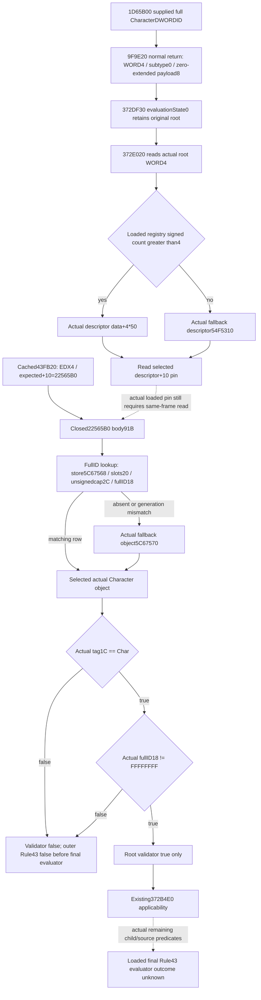

# Rule43 Character root-kind producer and validator on CK3 1.20.0.3

October 6 / ISO 2026-W41. This source-only continuation closes the actual CharacterScriptContext kind and the expected kind-4 root validator used before [Rule43 applicability and evaluation](battle-person-rule43-real-admission-12003.md). Frozen CK3 1.20.0.3 Crozier / Steam 25652598 / recorded EXE SHA-256 `94B55397ABB687A3DCD436805A5D885E6BE90FA6C693FEB44A9E3BBEEADE02A6` is reused. No game, SDK, pipe, process inspection, callback, initializer, provider, test or build was run. The external packet is `Z:/ck3_mod_rewrite_process_assets/g2-background-20261006/rule43-kind4-root-validation/`.

## Actual producer and original root association

The complete cached **`9F9E20 [9F9E20,9F9EF5)`**, 213 B, is embedded in `artifacts/g2-maintainer-2026-10-02/resume-12003/m4-council/role-coverage/religious-relations-contribution-12003/native-evaluator/PE-functions-2872570-9f9e20.json`, body SHA-256 `398501150827c18b8ef33c941d407e9cfa7de929bbcbdad9b48453b792e9a35d`. These bytes are reused without reading the EXE.

The source takes RCX as its output context and RDX as an **address of a full DWORD CharacterID**. At `9F9E38` it clears output DWORD0. After its existing context-header constructor returns, `9F9E8C/9F9E91` explicitly writes **WORD0=4**. At `9F9EE1` it reads DWORD from the original supplied address; the EAX write zero-extends that value, and `9F9EE8` stores it as QWORD at output`+8`. `9F9EEC` returns the output pointer. Thus a normal return supplies kind4, subtype WORD2=0 and a zero-extended full-DWORD payload. Token bytes `+4..+7` are not assigned a fabricated value. No context helper needs execution or further expansion to reproduce those direct root fields.

Cached complete **`1D65B00 [1D65B00,1D65BE5)`**, 229 B, stores incoming EDX as its CharacterID, passes that address to `9F9E20` at `1D65B31`, then passes the returned context pointer to `372DF30` at `1D65B57` when tooltip is null. Rule43 addresses the inline condition receiver `QWORD[provider+EF0]+43*D0`, rather than reading a pointer-list element. Its reused full-body SHA is `fdc7b0dd04b47906655da1d0ec62b82ea605d20be484a4d1735103070930a439`.

Cached complete **`372DF30 [372DF30,372E018)`**, 232 B, retains the supplied context and stores that same pointer in evaluation-state QWORD0 at `372DF67`. It calls `372E020(receiver,&state,false)` at `372DF98`. The complete cached **`372E020 [372E020,372E44E)`**, 1,070 B, reads state QWORD0 at `372E085`, then root WORD0 at `372E088`. Therefore Rule43's ordinary Character wrapper reaches the actual **kind4** selection; type4 is not inferred from a constructor label or descriptor address.

The [2920D60 caller](battle-person-following-2920d60-12003.md) keeps two distinct rule identities. Primary admission supplies the **resolved Character's actual DWORD18**, after resolving Diac DWORD24 through the full-generation Character store. It does not simply use Diac DWORD24 as the rule's input. The secondary admission supplies current Character DWORD18 after its owner equality check. The later numeric producer has its own separately documented scope source. Preserve these identities and primary-before-secondary demand order.

## Loaded descriptor selection and static expected registration

The already closed [scope registry](phase-script-scope-registration-12003.md) returns inline span `module+54F2AF0`: data QWORD0, capacity DWORD8 and signed count DWORDC. For nonzero root kind4, `372E0A5` selects `data+4*50` only when signed count is greater than4; otherwise it selects the actual fallback descriptor `module+54F5310`. It loads descriptor QWORD`+10` at `372E0C7`, passes the original root token as RCX and calls that pointer at `372E0CE`.

Reused current **`43FB20 [43FB20,43FBDD)`**, 189 B, supplies EDX4 to `3796120` at `43FBD0`. Its incoming descriptor has identifiers `6EC/2EA6`, flags byte7 and **`+10=22565B0`**. The source at `43FB4C`, the descriptor copy at `43FBA3/43FBB2` and the existing registration writer establish the static expected callback. The type-name strings are undemanded by this validator.

This static expected registration and the actual currently loaded descriptor are separate facts. A read-only capsule must retain the selected loaded `+10` pin, including a null/default or different callback. A short span selects the fallback descriptor in the native shell; it is not rewritten as a registered kind4 row. No current registration identity or callback outcome was observed by this package.

## Complete expected validator and exact lookup operands

Only after the producer kind4 proof, one bounded read recovers **`22565B0 [22565B0,225660B)`**, **91 B**, matching the previously sealed exact.3 hash `5f6633186b58d997ce5dc71d55026be7e5474f69363856ca9aab1edce4bdb497`. The old optional-equality/event-context contracts retained its extent, hash and summary, but the physical validator body was not recovered from the targeted caches. The receipt records this 91-B actual I/O separately from **zero new unique source-byte credit**. There are no PE-header, `.pdata`, constant, helper or decoder reads.

The body is a complete leaf. It contains the previously closed full-generation lookup inline and calls no decoder:

1. Root WORD0==4 selects DWORD token`+8`; another kind selects raw full ID `FFFFFFFF`. For this actual wrapper the source-produced kind is4.
2. Load Character store QWORD slot **`module+5C67568`**. A null store selects the fallback.
3. Compute unsigned index=`fullID & 00FFFFFF`. Compare it unsigned with DWORD store`+2C`. Out of capacity selects the fallback.
4. Read slots QWORD store`+20`, then object QWORD at `slots+index*10+8`. A null object or full DWORD object`+18` unequal to the requested full ID selects the fallback.
5. The fallback is the actual object pointer loaded from QWORD slot **`module+5C67570`** at `22565EF`. Its current tag and full ID are demanded operands, rather than a supplied false.
6. At `22565F6`, compare selected object's DWORD`+1C` with **`43686172` (`Char`)**. A mismatch returns AL=false. Only matching tag demands the subsequent DWORD`+18 !=FFFFFFFF` check at `22565FF`. Both conditions true return AL=true at `2256605`; either false returns AL=false at `2256608`.

Retain the low24 index and the **whole generation ID equality** independently. There is no native `ID>0` test here; ID0 is not changed into missing. There is no newly invented high-payload condition, because this producer already zero-extends its source DWORD and this validator reads its low DWORD. The saved-variable callback **`225E000`** has additional dead-flag/scratch/context behavior; none is demanded by this root validator. Its known full-generation lookup is reused, without recapturing or following its saved-context tail.

The selected fallback's tag/ID have not been read. If an actual selected pointer or demanded field cannot be read, the prospective capsule remains unavailable/partial. That read failure is not a native false result. When an actual loaded expected callback and complete same-frame operands establish validator false, `372E0D0..372E1DF` proves the outer condition returns false before applicability or final predicate. Validator true merely reaches `372B4E0` and then the loaded evaluator; it does not establish Rule43 true.

## Minimum same-query read-only operand plan

`READONLY-ROOT-OPERAND-PLAN.json` describes a candidate optional **root-validation source capsule** alongside the existing Rule43 condition/source census. This package implements no DTO, collector or normalizer.

Bind each capsule to its source family, current enclosing Character, actual rule-input full DWORDID and the query's native revision/date. Reuse the observed primary resolved Character18 or secondary current Character18. The source-derived ordinary token fields must carry a declared `9F9E20_normal_return` construction provenance; do not call the native constructor or pretend its transient stack token was observed.

Read only loaded registry data QWORD and signed count DWORD, the selected descriptor's QWORD`+10`, then the Character lookup witnesses and demanded selected-object tag/ID. The descriptor selection requires **12 B of root fields plus8 B of callback**, at most20 B before current Character witnesses; the actual fallback descriptor branch is explicit. If an existing descriptor capsule already copies these bytes, reuse it rather than adding another read. The current scope type identifiers and other callback slots are optional provenance, not validator prerequisites.

Reuse the existing Character store and full-ID algebra. Keep stored-row selection, generation mismatch and actual fallback choice separate. Reuse the selected tag/full-ID predicate; do not route this through the event-window identity helper's independent positive-ID/high-payload rules. A known tag mismatch does not demand selected ID for the final tag predicate, though an indexed row's ID may already have been read for generation matching. Missing fields retain nullable unknowns and a concrete read reason.

Publish source statuses, actual selected callback pin, lookup route, raw IDs/tag and independent nullable `root_validation_result`. An actual callback different from the closed expected22565B0 supplies the exact next function pin for source work; it is not invoked or assigned a fabricated result. Known root-valid true remains distinct from applicability, nested conjunction, child predicates and final Rule43. The first demanded unresolved nested operand from the existing real-admission topic is the next predicate source seam, rather than a repeated root decoder read.

## Delivery and readiness

The packet contains the source plan sealed before the named capture, reused producer/caller/registry pins, complete91-B validator capture, exact read-cost ledger, Mermaid source tree, candidate read-only operand plan and Oct6/W41 fields. Source-plan structural validation was corrected once after the draft used byte-identity evidence for a semantic edge; the preserved harness RED concerns plan metadata, not native capability. Manual instruction review supplies the declared source semantics. `git diff --check` is the sole document check; tests and native builds remain0.

Readiness is **research / source-closed ordinary Rule43 kind4 root producer and expected validator**, with current loaded descriptor and current selected-object operands still explicit. This does not qualify an actual new observer, final Rule43, complete2920D60, person preparation, Entry, forecast or live loop. The kind11 bodies, old numeric cases and old compiled wires were not reread or rerun. Root owns shared topics/reports, adoption and publication.
