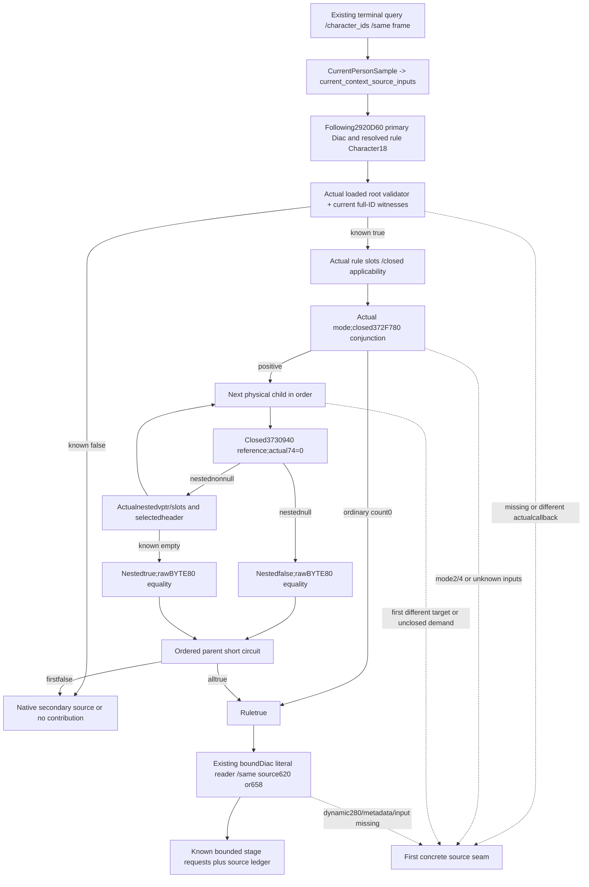

# Rule43 admission and Diac values in the existing current-person query

October 6 / ISO 2026-W41. This source-first plan follows the [kind4 root validator](battle-person-rule43-character-root-validator-12003.md), [loaded Rule43 admission tree](battle-person-rule43-real-admission-12003.md), [2920D60 selection](battle-person-following-2920d60-12003.md) and [qualified literal numeric producer](battle-person-diac-literal-numeric-12003.md). Exact CK3 1.20.0.3 / Steam25652598 / recorded EXE SHA `94B55397ABB687A3DCD436805A5D885E6BE90FA6C693FEB44A9E3BBEEADE02A6` is reused. This plan reads repository code and cached source only: no new EXE bytes, callback, game, SDK, pipe, build or test. Packet: `Z:/ck3_mod_rewrite_process_assets/g2-background-20261006/rule43-integrated-current-person-plan/`.

## Existing end-to-end query and concrete integration gap

The callable entry is **`ck3_query_battle_terminal_transition_v1`**, with `character_ids` and null battle IDs for a character-only observation. The service `GameplayBridgeService.query_battle_terminal_transition_v1` already routes the request, binds public/native revisions and date, normalizes character observations and returns the nested current-person fields. Native `CurrentPersonSample` in `ck3_12002_battle.cpp` calls `ReadCurrentContextSourceInputs12003` in the same owning-thread query. The DTO is `BattleCurrentPersonContextSourceInputsSnapshotV1`, serialized inside `current_person_state.current_context_source_inputs`. Its strict Python contract is reached through `battle_terminal_transition_contract._normalize_current_person_state` and verifies the enclosing whole CharacterID. No additional MCP, service capability or metadata-only command is needed.

Current `battle_context_source_inputs_v1.hpp` contains neither a following2920D60 source member nor a Rule43 result. The separately qualified `DiacLiteralNumericInputs12003` DTO/reader/serializer and Python contract exist, but the current-person collector does not call them. Its binder supplies metadata-provider and sentinel addresses while leaving `read_memory` null; the reader requires a real callback. Connecting those existing numeric inputs, the actual branch identity and a source-bounded rule result is the useful missing join.

Reuse the existing [qualified production copy repair](battle-current-person-source-read-production-fault-12003.md): current `Copy` honors an injected reader, otherwise calls `current_stored_context_12003::CopyBytes`. The integration must actually bind the Diac reader's `read_memory` to that same guarded path and callback context. It must not reintroduce the failed raw `memcpy` path, call a script evaluator, or alter the already qualified exception machinery.

## Ordered source and result ledger

The new candidate source member is **`following_diac_2920d60`**, inside the existing current-context source DTO. One same-query collector follows these demands:

1. Resolve the actual current Character's first Diac through current1C8/30, store5D20318/fallback5D20310, whole-ID8 match and tagC. Preserve the native early Character resolution from its raw DWORD24, before Diac validity. Primary rule input is that resolved Character's **actual DWORD18**; primary numeric input is the **address of Diac DWORD24**, with its actual definition QWORD28+620. These are separate identity sources.
2. An invalid primary Diac proceeds to secondary. A valid primary calls the source-bounded Rule43 mirror for the just established whole CharacterID. Rule unknown retains the first exact source seam and does not choose secondary. Rule true selects620, including a known-empty selected declaration vector; secondary is then undemanded. Rule false proceeds to secondary.
3. Secondary uses the already closed28BFC70 source selection, then its returned Character1C8/30 Diac. A valid secondary additionally requires Diac DWORD24 equal to the current Character18. Invalid or owner mismatch yields no contribution. Otherwise Rule43 uses current Character18. True selects actual definition QWORD28+658 with the current Character18 address; false yields no contribution.
4. Each demanded Rule43 mirror uses source-produced normal-return kind4, the actual loaded kind4 descriptor selection/+10 pin and same-query full-generation Character lookup. Matching expected22565B0 plus complete demanded fields yields its actual tag/ID predicate. Known root false returns rule false before other nodes. Missing or different callback preserves that exact first source entry. A true root proceeds to actual rule receiver/providerEF0+22F0 and its loaded58/60/C8 pins.
5. For the closed actual slots58=855AB0 and60=9CFEC0 or9CFEE0, expected scope and mask are source-zero. Applicability is true. This is not a supplied applicability flag. Other first-demanded slot targets remain concrete source gaps and are not called.
6. Loaded evaluator372F780 uses the original evaluation-state mode copied from actual module5D1DADC. Mode1/3 selects receiver88/count94; ordinary other modes except2/4 select40/count4C. Exact count0 returns true without a child. Positive count follows children in native order, retaining duplicate occurrences; first false returns false and all known true returns true. First unknown stops the coherent result, and no later false supplies a shortcut through it. Negative count is not empty. Modes2/4 retain exact372F880/37354A0 gaps; this package expands neither body.
7. Loaded evaluator3730940 is the already closed reference branch. Actual DWORD74 nonzero retains37B6C50 as its demanded source gap. Zero selects referent40's QWORD110. Null gives nestedfalse; nonnull evaluates that actual node with the **same original root/mode**. The wrapper compares raw BYTE80 exactly to the resulting AL. Its unused zero-argument environment construction is not invoked, and byte80 is not coerced to bool. The first actual unknown nested child carries its physical occurrence path, loaded pins and demanded raw fields.
8. Only a known selected620/658 branch feeds `ReadDiacLiteralNumericInputs12003` and the qualified `normalize_diac_literal_numeric_inputs_12003` / `emit_diac_literal_numeric_requests_12003` path. Literal gate280=0, ordered properties and actual finalizer metadata use existing code and math. A demanded dynamic gate retains9D7060, rather than a fabricated numeric value. A known no-selected-source branch returns a bounded ready empty request vector.

Native source pins and copied lookup/null values remain source inputs. Computed nullable rule results and numerical requests carry exact source/frame/family provenance. Read-unavailable stays unknown; it does not become native false, an empty list or a successful generation lookup. The query's independent preexisting leaves remain usable when this new stage is partial.

## Branches that can provide an actual bounded result

| Same-query facts required | Source-defined output |
| --- | --- |
| Invalid first Diac, then invalid secondary or owner mismatch | 2920D60 ready with zero occurrences; no Rule43 or numeric producer demanded |
| Expected loaded root validator, readable current selected object and failing tag/ID predicate | That demanded Rule43 is false; follow the native primary/secondary caller order |
| Valid root, closed applicability, ordinary conjunction with count0 | Rule43 true; collect only the selected source's numeric inputs |
| Zero-argument reference with actual nested pointer null | Exact rawBYTE80 ==0 result, after the reference's root/applicability prerequisites |
| Zero-argument reference with known nested result | Exact rawBYTE80 == nestedAL; propagate ordered parent conjunction result |
| All demanded ordered nodes recursively belong to closed conjunction/reference branches | Actual supplied-current Rule43 result, plus selected literal numeric requests if complete |
| Different loaded root/58/60/C8 target, first unknown child, nonzero reference74, mode2/4 or unread input | Partial result with first concrete source/read seam; no invented final result |

The retained real path showed an outer mode0/count1, a zero-argument reference with raw comparison1 and a nonnull nested372F780. It **did not establish a fresh nested selected header or first child**. Earlier outer and reference receipts are separately dated, so they do not supply a current whole Rule43 result. No old846 address or memory is read. Before claiming that this actual path is released, an independently authorized fresh existing query must supply the nested header and first demanded child/source operands; their actual loaded targets decide the next bounded source task.

## Minimal implementation footprint and delivery boundary

Dedicated owned files can hold the new Rule43/Diac DTO, bindings/collector, serializer, Python strict contract and pure stage selector. Small integration edits belong in `battle_context_source_inputs_v1.hpp`, its serializer, `ck3_12003_context_sources.hpp/.cpp`, and `battle_context_source_inputs_contract.py`. The current-person/terminal normalizer already carries this nested field and outer CharacterID/frame checks. Service/MCP/native_driver routes need no new step or capability. CMake and central compilation remain Root-owned. Do not duplicate the qualified Diac numeric formula or person-stage chain.

The collector will use actual pointers reached from the current query's Character and module bindings, and walk only source-closed ordered paths until the first unknown demand. A trace records occurrence paths and intermediate known results; a partial first child does not lead to another metadata-only command. No callback dispatch is performed. Actual read status and exact missing source entry are retained beside available earlier results.

Root authorized this integrated functional candidate after the code/source ledger was mapped. Plan/source must be adopted before implementation delivery. One new compound production-path case will cover known false, known empty/reference true and an actual unknown nested target, preserving source identity and selected numeric/no-contribution behavior. Root owns the first central native build/CTest and compiled-wire consumption; old cases/wires are not repeated. The actual retained nonempty nested path remains research until its fresh operands and next target close. No full-person/Entry/live readiness is granted by this plan or by an offline candidate.
