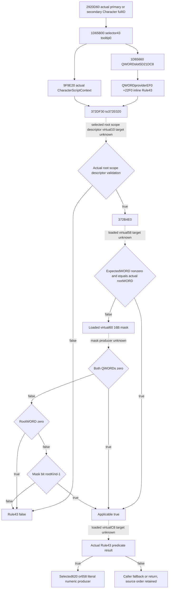

# CK3 1.20.0.3 real Rule43 applicability and Diac admission

October6 /ISO2026-W41. This exact source package closes the actual applicability shell for the already-qualified independent Diac literal numeric producer. CK3 1.20.0.3 /Steam25652598 /recordedEXESHA94B55397ABB687A3DCD436805A5D885E6BE90FA6C693FEB44A9E3BBEEADE02A6. No game, SDK, real pipe, callback, evaluator, initializer, build or old test was run. The source-only packet is `Z:/ck3_mod_rewrite_process_assets/g2-background-round4-20261005/person-tail/rule43-real-admission-source/`.

## Actual receiver and scope demand

Reuse complete exact.3 `1D65B00[1D65B00,1D65BE5)` and prior `1D65660[1D65660,1D656B7)`; do not reread their EXE bytes. The loader reads actual QWORD singleton slot5D21DC8; its null path calls diagnostic3F8B660 then reloads the same slot. No constructor, rule registration or initialized vtable is reachable through that named loader branch. The Character rule wrapper saves the actual passed fullDWORDID, constructs its CharacterScriptContext through9F9E20, and addresses the **inline receiver** at `QWORD[provider+EF0] +43*D0` =array+22F0. Array+22F0 is the rule object, not a pointer-list entry.

Tooltip0 selects the cached372DF30 wrapper, which constructs evaluationState with its original CharacterScriptContext in stateQWORD0 and then calls372E020(receiver,state,false). The cached372E020 first validates the actual root scope type via the existing scope descriptor registry. If that validation rejects, the rule returnsfalse. The actual registry getter3795A80 and selected scope-descriptor virtual+10 validation target remain unclosed by this package; their dispatch shell is reused, and validation is not presumed true. It then calls **372B4E0(receiver, actualRootScopeData)**. Applicablefalse returnsfalse; applicabletrue is the only path to **receiver.vtable+C8(receiver,evaluationState)**. No condition count supplies a true shortcut.

For2920D60 primary selection, the passed scope belongs to Character fullDWORD18 resolved from selectedDiacDWORD24. Primary rulefalse permits the caller's actual secondary source. Primary ruletrue selects the already-qualified definition block atDiacQWORD28+620 and suppresses secondary, even when the produced vector is empty. Secondary requires its source-defined ownership comparison and evaluates Rule43 for the current Character fullID before selecting block658. An independently computed literal property vector does not determine any of these admission results.

## Complete applicability source

The sole new body is **372B4E0[372B4E0,372B570),144B**, normalRET atB56F; pdata resolution added24B. Total new I/O is **168B =144 code+24 pdata**. Previous708-B caller,2671-B numeric producer and243-B singleton loader remain separate immutable source costs.

Actual ABI is `bool372B4E0(ruleReceiver RCX,rootScopeData RDX)`. It first invokes **ruleReceiver.vtable+58(ruleReceiver)** and retains the returnedWORD expectedScope. It reads the actual root'sWORD0. If expectedScope is nonzero and equals rootKind, AL=true immediately. Otherwise it invokes **ruleReceiver.vtable+60(ruleReceiver,out16Bytes)**. The 16-byte result consists of two QWORDs. If both arezero, AL=true. If the mask is nonempty and actual rootKind iszero, AL=false. Otherwise it selects QWORD `(rootKind-1)>>6` and bit `(rootKind-1)&63`, returning that bit. This is an applicability test, not the final Rule43 predicate.

The actual+58/+60/C8 function pointers and rule payload are runtime-loaded from the current script rule object. The named loader provides no static address for those target functions. Resolving them by guessing a trigger class, by copying stock rule order or by scanning all EXE xrefs would not close the loaded Rule43 input. This package therefore requests only the concrete pointer chain from Root's existing paused runtime.

## Exact Root-only paused pointer request

`ROOT-PAUSED-READ-REQUEST.json` specifies **48 bytes total**, six ordered QWORD reads. Root is the sole runtime owner; this agent does not launch, attach, query or create a reader. LetM be Root's actual CK3 module base. Read `[M+5D21DC8]` provider, then `[provider+EF0]` array, then `[array+22F0]` vptr, then `[vptr+58]`, `[vptr+60]` and `[vptr+C8]`. Retain exact bytes, frame/date/revision and actual pointer addresses, plus actual functionRVAs relative toM. A null or unread source remains a recorded input gap; no diagnostic, initializer or predicate is called. Do not read a synthetic array count or substitute a Boolean.

These pointers identify the shortest next unique frozen-source extents: required scope producer, scope mask producer and Rule43 evaluator. Distinct targets are captured once. Only additional operands proven necessary by those exact bodies become subsequent paused-read fields. No generic trigger catalogue or fullperson directory is requested.

Readiness is **research / source-closed applicability shell**. Actual Rule43 admission remains unevaluated; the previously compiled literal numeric producer remains independently static-ready. This source does not advance a complete2920D60 stage, full person, Entry, future baseline or live forecast. All tests and builds are zero in this package; parent owns report integration and any later source adoption.
