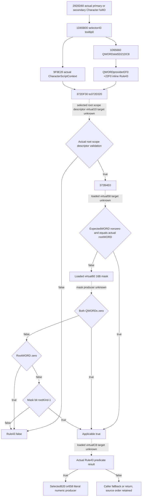
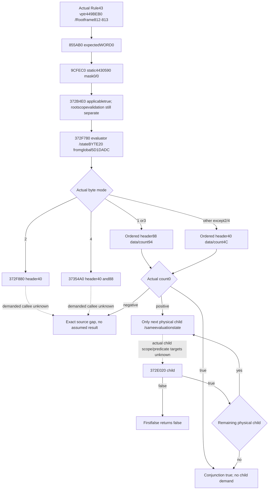
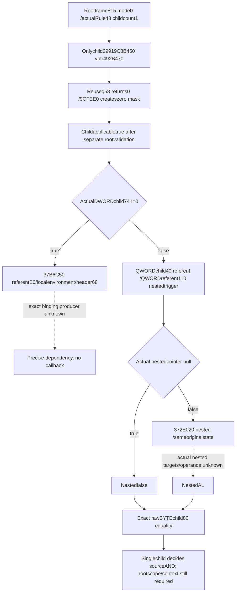

# CK3 1.20.0.3 real Rule43 applicability and Diac admission

October6 /ISO2026-W41. This exact source package closes the actual applicability shell for the already-qualified independent Diac literal numeric producer. CK3 1.20.0.3 /Steam25652598 /recordedEXESHA94B55397ABB687A3DCD436805A5D885E6BE90FA6C693FEB44A9E3BBEEADE02A6. No game, SDK, real pipe, callback, evaluator, initializer, build or old test was run. The source-only packet is `Z:/ck3_mod_rewrite_process_assets/g2-background-round4-20261005/person-tail/rule43-real-admission-source/`.

## Actual receiver and scope demand

Reuse complete exact.3 `1D65B00[1D65B00,1D65BE5)` and prior `1D65660[1D65660,1D656B7)`; do not reread their EXE bytes. The loader reads actual QWORD singleton slot5D21DC8; its null path calls diagnostic3F8B660 then reloads the same slot. No constructor, rule registration or initialized vtable is reachable through that named loader branch. The Character rule wrapper saves the actual passed fullDWORDID, constructs its CharacterScriptContext through9F9E20, and addresses the **inline receiver** at `QWORD[provider+EF0] +43*D0` =array+22F0. Array+22F0 is the rule object, not a pointer-list entry.

Tooltip0 selects the cached372DF30 wrapper, which constructs evaluationState with its original CharacterScriptContext in stateQWORD0 and then calls372E020(receiver,state,false). The cached372E020 first validates the actual root scope type via the existing scope descriptor registry. If that validation rejects, the rule returnsfalse. The actual registry getter3795A80 and selected scope-descriptor virtual+10 validation target remain unclosed by this package; their dispatch shell is reused, and validation is not presumed true. It then calls **372B4E0(receiver, actualRootScopeData)**. Applicablefalse returnsfalse; applicabletrue is the only path to **receiver.vtable+C8(receiver,evaluationState)**. No condition count supplies a true shortcut.

For2920D60 primary selection, the passed scope belongs to Character fullDWORD18 resolved from selectedDiacDWORD24. Primary rulefalse permits the caller's actual secondary source. Primary ruletrue selects the already-qualified definition block atDiacQWORD28+620 and suppresses secondary, even when the produced vector is empty. Secondary requires its source-defined ownership comparison and evaluates Rule43 for the current Character fullID before selecting block658. An independently computed literal property vector does not determine any of these admission results.

## Complete applicability source

The sole new body is **372B4E0[372B4E0,372B570),144B**, normalRET atB56F; pdata resolution added24B. Total new I/O is **168B =144 code+24 pdata**. Previous708-B caller,2671-B numeric producer and243-B singleton loader remain separate immutable source costs.

Actual ABI is `bool372B4E0(ruleReceiver RCX,rootScopeData RDX)`. It first invokes **ruleReceiver.vtable+58(ruleReceiver)** and retains the returnedWORD expectedScope. It reads the actual root'sWORD0. If expectedScope is nonzero and equals rootKind, AL=true immediately. Otherwise it invokes **ruleReceiver.vtable+60(ruleReceiver,out16Bytes)**. The 16-byte result consists of two QWORDs. If both arezero, AL=true. If the mask is nonempty and actual rootKind iszero, AL=false. Otherwise it selects QWORD `(rootKind-1)>>6` and bit `(rootKind-1)&63`, returning that bit. This is an applicability test, not the final Rule43 predicate.

The actual+58/+60/C8 function pointers and rule payload are runtime-loaded from the current script rule object. The named loader provides no static address for those target functions. Resolving them by guessing a trigger class, by copying stock rule order or by scanning all EXE xrefs would not close the loaded Rule43 input. This package therefore requests only the concrete pointer chain from Root's existing paused runtime.

## Exact Root-only paused pointer request

`ROOT-PAUSED-READ-REQUEST.json` specifies **48 bytes total**, six ordered QWORD reads. Root is the sole runtime owner; this agent does not launch, attach, query or create a reader. LetM be Root's actual CK3 module base. Read `[M+5D21DC8]` provider, then `[provider+EF0]` array, then `[array+22F0]` vptr, then `[vptr+58]`, `[vptr+60]` and `[vptr+C8]`. Retain exact bytes, frame/date/revision and actual pointer addresses, plus actual functionRVAs relative toM. A null or unread source remains a recorded input gap; no diagnostic, initializer or predicate is called. Do not read a synthetic array count or substitute a Boolean.

These pointers identify the shortest next unique frozen-source extents: required scope producer, scope mask producer and Rule43 evaluator. Distinct targets are captured once. Only additional operands proven necessary by those exact bodies become subsequent paused-read fields. No generic trigger catalogue or fullperson directory is requested.

Readiness is **research / source-closed applicability shell**. Actual Rule43 admission remains unevaluated; the previously compiled literal numeric producer remains independently static-ready. This source does not advance a complete2920D60 stage, full person, Entry, future baseline or live forecast. All tests and builds are zero in this package; parent owns report integration and any later source adoption.

## Actual paused target closure — October6 08:07 onward

Root's actual48-byte read at2026-10-06 00:07:24.697567 UTC inR0048/PID4692 is preserved at `g2-resume-20261006/rule43-loaded-targets-r0048-once.json`. Before frame812 and independent after813 both show pausedtrue, publicrevision32/native31/rawdate53288232/originalRobert29829. Root performed no callbacks, writes or game actions for the six reads. Modulebase7FF7312C0000, provider29919C22F20, array2991A414190 and inlineRule43 receiver2991A416480 give actualvptr **RVA449BEB0**. Its actual slots are +58→**855AB0**, +60→**9CFEC0**, +C8→**372F780**. This is actual loaded identity evidence, not a predicate result.

855AB0 is a complete **3-byte** leaf `XOR EAX,EAX;RET`, so expected scopeWORD iszero. 9CFEC0 is a complete **14-byte** leaf copying16 bytes from staticRVA**4430590** to the caller's mask output. A necessary16-byte narrow read, using an existing exact.3 cached.rdata section map, proves bothQWORDs arezero. No PE header or old code was reread. Therefore the actual observed Rule43 vptr's372B4E0 applicability result is source-defined **true**; this does not bypass the preceding root-scope validation or evaluate the final rule.

The actual evaluator372F780 is one chained native function, complete **255 bytes** across `[372F780,372F7DC)`, `[372F7DC,372F82D)`, `[372F82D,372F86D)` and `[372F86D,372F87F)`. The latter fragments are the same function's continuations and shared false epilogue. Its source reads evaluationStateBYTE20. Cached372DF30 obtains that byte from actual moduleRVA**5D1DADC**. Actual mode2 calls372F880 with the receiver+40 header; actualmode4 calls37354A0 with receiver+40/+88 iterator wrappers. Those two callees are not captured or guessed by this bounded package.

For modes1 or3 the selected ordered QWORD child list is **receiver+88** (dataQWORD88/signedcountDWORD94). All other byte modes except2/4 select **receiver+40** (dataQWORD40/signedcountDWORD4C). In either captured ordinary loop the native end is data+signedcount*8; count0 gives AL=true. A negative count is not a legal empty shortcut. Each physical child pointer is passed to the already captured **372E020(child,originalEvaluationState,false)** in source order. The first childAL=false returnsfalse immediately; alltrue or an actualempty list returns true. Duplicate child pointers are retained. No resolved child target or arbitrary supplied Boolean is invented.

Fresh loaded-target work adds **408 bytes =272 code+120 pdata+16 static data**. Together with the preceding168-byte applicability capture, this exact Rule43 lane totals **576 bytes =416 code+144 pdata+16 static data**. The three loaded target bodies themselves comprise272 unique code bytes (3+14+255). No old overlap was found in the bounded cached region inventory; prior caller/numeric/loader source costs remain separate. One Python preparation syntax failure and one metadata-command path typo both occurred before source reads for those failed attempts; receipts preserve them as harness failures, not capability failures. The successfully captured source was read once.

`ROOT-MODE-AND-FIRST-CHILD-READ-REQUEST.json` is the next bounded Root-only plan: one byte atM+5D1DADC, then only the selected ordinary header's data8/count4. Modes2/4 stop at their exact named source entry instead. A realempty list requires13 bytes total and no child. A positive list additionally requests only firstchild pointer, vptr and its58/60/C8 targets (40 bytes), maximum53 bytes total. It does not dump all rule children or create another predicate caller. The actual source-selected next input, not a fake zero fixture or a general trigger catalogue, decides further work.

Readiness remains **source-only loaded Rule43 applicability and conjunction shell closure**, with actual mode/list/child admission and prior root-scope validation/CharacterScriptContext association still explicit. No accessor implementation, build, test or policy promotion is delivered by this source continuation. Root's g79 runtime/source remains frozen and untouched.

## Actual single child reference prefix — October6 08:20 onward

Root's next53-byte read at2026-10-06 00:20:41.794694 UTC is `g2-resume-20261006/rule43-mode-first-child-r0048-once.json`. It is bound to pausedframe815/public32/native31/rawdate53288232/PID4692. Actualmode is **0**; the selected Rule43+40 array is2991A4164E0 and its signedcount is **1**. The sole physical child is29919C8B450 with actualvptr **RVA492B470**. Actualslots58→855AB0 (reused without source reread),60→**9CFEE0**,C8→**3730940**. No future restored-session frame is inferred from this receipt.

9CFEE0 complete67B first calls its actual virtual58, zeroes the twoQWORD outputmask, and sets bit(expectedWORD-1) only if expectedWORD is nonzero. Here the observed58 target is the already captured literalzero855AB0, so the actual child's mask isalso0/0 and its372B4E0 applicability is source-definedtrue. This still does not bypass preceding root-scope validation.

3730940 complete171B is a **reference wrapper**. It reads the actualreferentQWORD atchild+40 and checks physicalDWORD**child+74 !=0** (headerat+68). Any nonzero value, including negative, takes the exact unclosed37B6C50 path with referent+E0, a local outputenvironment andchild+68 argument header. A returned environment markedBYTE+4=FF or without QWORD+20 defaults nestedfalse. No parameter binding, variant value or predicate outcome is manufactured.

When actualDWORD74 iszero, the wrapper directly selects **QWORD[referent+110]**. Null means nestedfalse. Nonnull goes through the same cached **372E020(nestedTrigger,originalEvaluationState,false)**. The wrapper returns the exact equality comparison of **rawBYTEchild+80** with nestedAL; when nestedfalse isdefaulted it compares that byte withzero. Preserve the byte0..255 rather than coercing it toBoolean; no expectedtrue default is supplied. The always-present370F2C0 frame-construction call consumes copied child10/20 records; its output does not supply a scalar to the direct-reference branch. The370F200 result's countC is decremented only if nonzero during cleanup. Neither helper is called or expanded by this source-only observer plan.

This actual-child addition is **274B =238 code+36 pdata**. The complete current Rule43 source lane now totals **850B =654 code+180 pdata+16 static data**. Reused855AB0 and earlier bodies are not reread or charged again. No broader children, callee cascade or trigger catalogue was captured.

`ROOT-FIRST-CHILD-REFERENCE-READ-REQUEST.json` asks Root for a **new paused receipt**: childDWORD74(4B), referentQWORD40(8B), rawcomparisonBYTE80(1B), total13B. Any nonzero74 stops at the exact37B6C50 source dependency. Actual74zero then demands only referentQWORD110(8B); null requires21B total. A nonnull nestedtrigger adds itsvptr and58/60/C8 targets32B, maximum53B. After Root's session restoration, neither the old frame nor source-specific operands are silently treated as current. No wholeRule43 Boolean, fullperson/Entry/live promotion, source implementation, build or test is claimed.
